# RFC-0002: The model generator (internal/gen)

## Summary

`internal/gen` turns the `symbol/schema` package of RFC-0001 into the
committed `node/` and `emit/` models plus `symbol/kind.gen.go`. It is
a standard-library Go program: `go/parser` and `go/types` read the
schema, a small intermediate representation carries it,
`text/template` renders it, `go/format` formats it. A mirror-guard
test regenerates in-process and diffs against the tree, so
`make check` fails on any drift between schema and models. Consumers
never run it; contributors run it through `make generate`.

## Motivation

Two models must never diverge from one schema or from each other;
that promise needs an enforcer.
The enforcer has constraints the architecture fixes: the module map
requires the tool to have no eidos dependencies and to be plain
`go/ast` plus `text/template`, because a kernel that needed a
language satellite to build itself could never bootstrap; and the
kernel takes no third-party dependencies, which extends to its
`go.mod`, because a `tool` directive is visible to every consumer's
supply-chain audit. Within those walls, this RFC decides what the
architecture left open: how the tool reads the schema without
importing it, what its intermediate form is, which files it writes,
and how the guard runs.

## Detailed design

### Pipeline

```mermaid
flowchart LR
    S[symbol/schema sources] -->|go/parser| A[ast.Files]
    A -->|go/types + source importer| T[type-checked package]
    T -->|lower + validate| I[IR: KindSpec list]
    I -->|text/template, embedded| G[generated sources]
    G -->|go/format.Source| F[formatted bytes]
    F -->|write, or diff in the guard| O[symbol/ node/ emit/]
```



The tool never imports `symbol`, `schema` or any eidos package. It
locates the module root by walking up from the working directory to
`go.mod`, then reads the schema directory as source. Everything it
knows about the schema it learns from parsing.

### Reading the schema: the source importer

`go/types` needs an `Importer` to resolve the schema's imports:
`symbol` for the auxiliary enums and `Identity`, `position` for
`Pos`. The standard importers resolve from build caches, which would
make generation depend on prior compilation. Instead the tool carries
a source importer of about 50 lines:

```go
// sourceImporter type-checks module-local packages from source.
// It accepts exactly two import classes and refuses the rest:
//   - standard library packages, resolved as source from GOROOT
//   - packages inside this module, resolved from disk
// It skips *.gen.go files when loading module-local packages, so
// generated output can never feed the generator's own input, and a
// first-ever run works in a tree where no generated file exists yet.
type sourceImporter struct {
    fset    *token.FileSet
    modRoot string
    cache   map[string]*types.Package
}

func (im *sourceImporter) Import(path string) (*types.Package, error)
```

Verified against go1.27.0: `types.Importer` is the single-method
interface above, and `(*types.Config).Check(path, fset, files, info)`
type-checks a parsed package with it.

The `*.gen.go` exclusion is what makes the bootstrap sound:
type-checking `symbol` for the schema's sake uses only its
hand-written files, so the generator's input is closed over
hand-written source.

### The intermediate representation

```go
// Side says which model a field lands in.
type Side uint8 // Node | Emit | Both

// KindSpec is one declaration kind, lowered from its schema struct.
type KindSpec struct {
    Name   string // "Struct"; schema declaration order is preserved
    Fields []FieldSpec
}

type FieldSpec struct {
    Name     string
    Type     string // the spelling to emit: "[]*Field", "position.Pos"
    Elem     string // element kind name for walk and slot fields; "" otherwise
    Side     Side
    Walk     bool
    Slot     string // slot name; "" when the field is not a slot
    Owner    bool
    IsSymbol bool // schema.Symbol-typed: maps to symbol.Symbol per side
}
```

Lowering validates as it goes, and every violation is an error
carrying the schema file position:

- a tag token outside the closed vocabulary
  (`side`, `walk`, `slot=`, `owner`);
- `slot=` or `owner` on a field that is not a slice of kind structs;
- `walk` on a field whose type is not a kind struct, a slice of kind
  structs, or `schema.Symbol`;
- an `owner`-tagged slice whose element kind declares no
  `Host Symbol` field;
- a `Host` field that is `walk`-tagged. This is the rule that keeps
  the traversal acyclic, compiled into the tool rather than hoped
  for;
- duplicate slot names within one kind;
- a schema declaration that is not an exported struct, the `Symbol`
  marker, or package documentation.

### Output files

| File | Content |
|---|---|
| `symbol/kind.gen.go` | the `Kind` constants and `String`, in schema order (ADR-0004) |
| `node/kinds.gen.go` | node structs, interface satisfaction |
| `node/walk.gen.go` | `Walk`, `All` |
| `node/rewire.gen.go` | `RewireOwners` |
| `node/json.gen.go` | `EncodeJSON`, `DecodeJSON`, per-kind marshalling |
| `emit/kinds.gen.go` | emit structs, interface satisfaction |
| `emit/slots.gen.go` | slot storage and typed accessors |
| `emit/walk.gen.go` | `Walk`, `All` over slot items |
| `emit/rewire.gen.go` | `RewireOwners` |
| `emit/json.gen.go` | round-trip codec |

Files group by concern rather than by kind (ADR-0005): ten files
instead of forty-two, diffs review as one concern at a time, and the
`.gen.go` suffix rides the license-header exclusion already in
`.ergon.yaml`. Every file opens with
`// Code generated by internal/gen. DO NOT EDIT.`, the standard
marker tools recognize.

Templates are one `text/template` file per output file, embedded with
`embed.FS`, so the binary is self-contained and the mirror test needs
no working-directory guessing.

### Determinism

The same schema bytes produce the same output bytes anywhere:

- kinds render in schema declaration order, schema files read in name
  order;
- fields render in struct declaration order;
- `go/format.Source` canonicalizes layout;
- the tool reads nothing but the schema directory and writes no
  clock, path or environment into its output.

### The guard and the wiring

```go
// internal/gen exposes one function; main is a thin wrapper.
// Generate renders every output file into memory.
func Generate(modRoot string) (map[string][]byte, error)

// internal/gen/mirror_test.go — the mirror guard.
// For every generated path: bytes on disk equal Generate's bytes.
// For every *.gen.go on disk under symbol/, node/ and emit/: it is
// one of Generate's paths, so a stray or hand-added generated file
// fails too. Plain `go test ./...` runs it, which is what puts the
// guard inside `make check`.
```

Regeneration goes through the tooling that exists:
`symbol/schema/doc.go` carries

```go
//go:generate go run go.dokimi.dev/eidos/core/internal/gen
```

and `make generate` (`ergon generate`, which runs `go generate` per
module) picks it up. The directive is ergonomics only; the test is
the guard.

### Failure behaviour

The tool writes nothing unless every file rendered and formatted. A
schema error reports position, message and nothing else, and exits 1.
A formatting error on generated output is a bug in a template, and
the message names the output file and includes the unformatted source
so the template is debuggable.

## Alternatives considered

### A. stringer for the Kind constants

`golang.org/x/tools/cmd/stringer` generates `String()` for
hand-maintained const blocks. Our const block is itself generated, so
its `String()` is one stanza in a template we already run. Wiring
stringer in costs either a `tool` directive, which puts `x/tools`
into the kernel's `go.mod` that consumers audit, or an unpinned
`go run ...@version` fetch at generate time. Recorded as ADR-0004.

### B. golang.org/x/tools/go/packages for loading the schema

The standard way to load and type-check packages, and it would
replace the source importer. It is a third-party dependency in a
module whose defining property is having none, and it shells out to
the go command, which makes generation depend on the machine's build
cache state. The 50-line importer costs less than the exception.

### C. Runtime reflection instead of generation

Walk, JSON and rewire could reflect over struct tags at runtime: no
generator, no mirror guard. It moves the cost to every traversal of
every run. The graph is the hot path at 10,000-package scale, and the
engine's performance budget removes constant factors rather than
adding them. Reflection also checks nothing at compile time: a
typo in a tag becomes a silent traversal gap instead of a generation
error.

### D. go/ast only, without go/types

Parsing alone yields field names and type spellings, which is most of
what the templates need. It cannot resolve whether `[]*Field` names a
schema kind or a stray type, so the validations above become string
matching, and a typo like `[]*Feild` generates plausible garbage
instead of failing with a position. Type-checking one small package
costs milliseconds and the importer stanza.

### E. Hand-written models

The symbol model specification already refuses this; the argument
lives there.

## Drawbacks

- Three representations of one model exist: the schema, the
  intermediate representation and the templates. A change to the
  model touches the schema always, and the tool only when the
  annotation vocabulary grows. Someone still maintains about ten
  templates and about 50 lines of importer.
- Template errors report at execute time. The mirror test catches
  every such error in CI, but the debugging loop is
  edit-template-run-test, not a compile error.
- In-process generation means the guard shares the process with the
  test runner: a generator panic fails the test with a stack rather
  than a diff. Acceptable; panics in a tool this size are bugs to
  fix, not conditions to report.
- The source importer re-type-checks `symbol` and `position` on every
  run. Both are small leaf packages; if generation ever gets slow,
  the cache field already exists.

## Open questions

- Should `Generate` also emit a machine-readable schema summary
  (JSON)? Release tooling that generates documentation is a plausible
  consumer. Or is that premature until something asks for it?

## Unresolved and future work

- The metadata and directive seams and the emit body model are
  follow-up schema edits; the annotation vocabulary grows by kernel
  decision, one token at a time.
- The shape catalog's spec-driven generation reuses the mirror-guard
  discipline but not this tool; it runs a real eidos workspace, where
  the dependency direction allows it.

## References

- [01-repos-and-kernel.md](../architecture/01-repos-and-kernel.md),
  the module map: zero dependencies, the bootstrap constraint
- [02-symbol-model.md](../architecture/02-symbol-model.md), the
  symbol model specification
- [12-shape-catalog.md](../architecture/12-shape-catalog.md), the
  shape catalog's own spec-driven generation
- [21-decisions.md](../architecture/21-decisions.md), the decision
  log (D4, D56)
- [RFC-0001](0001-symbol-model-contract.md), the schema and contract
  this tool generates from
- [ADR-0004](../adr/0004-generate-kind-enum-from-schema.md), generate
  the Kind enum from the schema
- [ADR-0005](../adr/0005-concern-grouped-generated-files.md), group
  generated files by concern
- [.ergon.yaml](../../.ergon.yaml), the `*.gen.go` license-header
  exclusion
