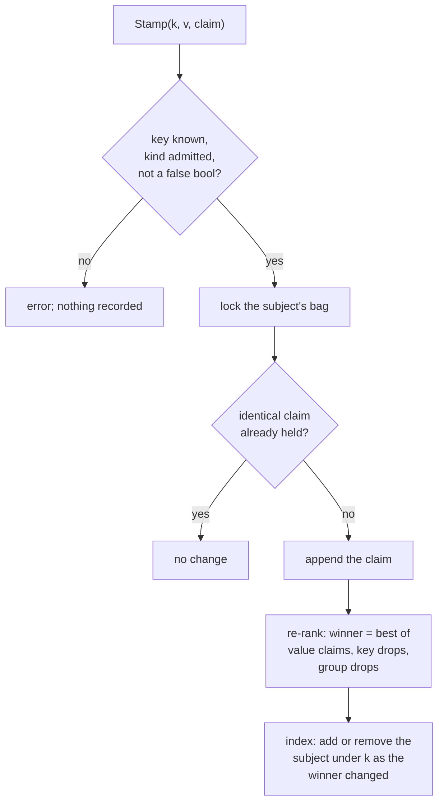
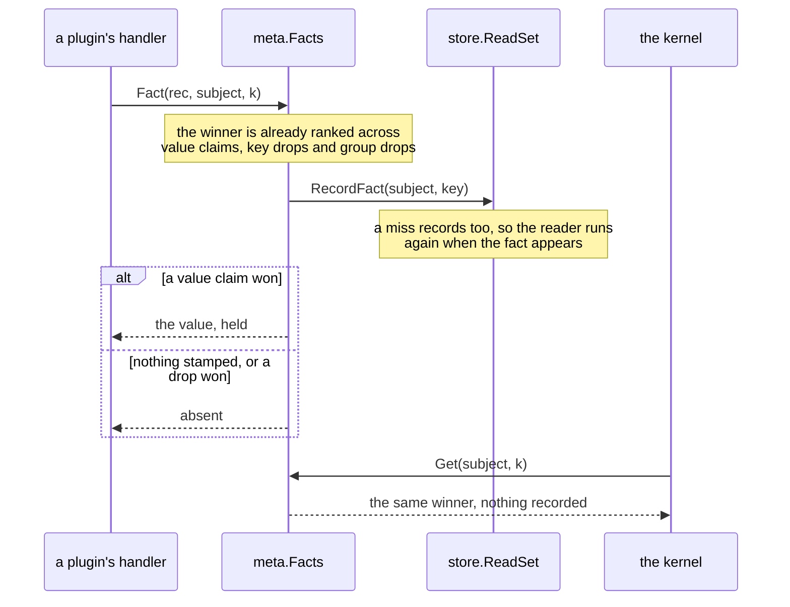

# RFC-0004: Metadata keys and the fact store

## Summary

This RFC pins `meta`: typed fact keys over a closed value
vocabulary, the registry that refuses a key or a namespace claimed
twice, and the fact store that arbitrates every write by rank,
keeps every claim for attribution, and records what a stamp was
derived from. It also extends the store's read set with the
per-key grain a fact read records at.

## Motivation

Metadata is the only channel between plugins. A shape detector
concludes that a struct is a writer; a generator in another module
needs that conclusion; neither imports the other. The channel has
to exist before either side does, because its rules are what both
sides compile against.

Three of those rules cannot be retrofitted.

Writes arbitrate by rank rather than by arrival order. Annotators
run in parallel under an opt-in, and two plugins stamping one key
must produce the same winner as a serial run. If the first
implementation lets arrival order decide, every test written
against it encodes a schedule.

Every claim is kept, not just the winner. Attribution returns why a
fact holds and who lost, and a losing write that vanishes leaves
nobody able to explain why their own stamp did not take. Nothing
here walks the record for a human; the record itself starts with
the first write.

A fact read records at (subject, key). A bag holds a lot, since
annotation lifting alone puts dozens of keys on one class, and many
readers read it. Recording per subject would re-run every reader of
the bag on any stamp. Recording per key leaves the unrelated readers
alone. The grain is part of the read set's shape, and the read set is
already being recorded.

## Detailed design

### Keys

```go
// Package meta carries typed facts between plugins.
package meta

// KeyName is a key's boundary spelling: dotted segments with the
// owning namespace first, as in "shape.role". It appears wherever a
// human names a key, such as a directive parameter or an explain
// argument, and resolves against the registry. Code holds the typed
// [Key].
type KeyName string

// Namespace returns the segment before the first dot, which names
// the module that owns the key.
func (n KeyName) Namespace() string

// KeyID is the dense form gate tuples and indexes hold. It is
// assigned at registration and belongs to one composition: nothing
// durable stores it, because codecs and the sealed state carry
// names. The zero KeyID names no key.
type KeyID uint32

// FactValue is the closed value vocabulary; nothing else
// registers. A fact that needs structure becomes flat keys under a
// fact group, and a fact that names a declaration carries an
// identity rather than a string.
type FactValue interface {
    string | int64 | bool | []string | symbol.Identity
}

// Key is the typed handle registration returns. Reads, writes and
// gate predicates all go through it, so the value type is checked
// where the code compiles rather than where the run fails.
type Key[T FactValue] struct{ ... }

func (k Key[T]) Name() KeyName
func (k Key[T]) ID() KeyID
func (k Key[T]) IsZero() bool

// GroupName names a fact group: a bundle a writer declares, such
// as every key its classification stamps. The name is public API
// and the membership is the writer's to grow.
type GroupName string
```

The vocabulary is closed because the fact store's values are what
gets persisted, rendered and tabulated. Any further type would put
a codec into public API, versioned with the sealed state and
breakable by any plugin.

### Registration

```go
// Registry holds every registered namespace, key and group.
//
// A Registry is not safe for concurrent use. Registration happens
// while the workspace composes, which is single-threaded, and
// completes before the first fact is written.
type Registry struct{ ... }

func NewRegistry() *Registry

// ClaimNamespace records who owns a namespace. A namespace claimed
// twice is an error naming both owners. Every key registers into a
// claimed namespace, so a typo in a key's namespace fails at
// registration rather than reading as a new namespace.
func (r *Registry) ClaimNamespace(ns, owner string) error

// Register records a key and returns its typed handle.
//
// It refuses, with an error naming both claimants where two exist:
// a name without a claimed namespace, a name registered twice, and
// a spec without documentation. It returns an error rather than
// panicking because composition collects every fault in one pass.
func Register[T FactValue](r *Registry, s KeySpec) (Key[T], error)

type KeySpec struct {
    // Name is the boundary spelling. Its namespace must be claimed.
    Name KeyName
    // Kinds are the declaration kinds the key may be stamped on.
    // Empty admits every kind.
    Kinds []symbol.Kind
    // Group optionally registers the key into a fact group.
    Group GroupName
    // Contract optionally promises coverage; the audit that checks
    // it is out of scope here, the declaration is not.
    Contract *Completeness
    // Doc states the key's semantics. Registration refuses an
    // empty one.
    Doc string
}

// Completeness is a coverage promise: the key is stamped on every
// declaration of these kinds by the end of the named phase.
type Completeness struct {
    On []symbol.Kind
    By diag.PluginID
    // Severity is what a violation reports as: Error when output
    // depends on the promise, Warning when it is advisory.
    Severity diag.Severity
}

// Resolve returns the id a boundary spelling names, and false for
// a spelling nothing registered.
func (r *Registry) Resolve(name KeyName) (KeyID, bool)

// Spec returns a registered key's spec.
func (r *Registry) Spec(id KeyID) (KeySpec, bool)

// Group returns a group's member keys, in registration order.
func (r *Registry) Group(g GroupName) iter.Seq[KeyID]
```

A key is declared where it is registered: the `Key[T]` handle is
the declared value, held by the code that registered it, so
nothing drifts from the registry and no generator is needed. The
same argument settled diagnostic codes; the difference is when.
Codes register at package initialization and panic on a duplicate.
Keys register while the workspace composes, where faults are
collected, so `Register` returns an error and no `Must` variant
exists.

### Claims

```go
// Authority orders who a write speaks for. A human override at
// the source declaration beats any inference, whatever order the
// plugins ran in. Manual is reserved for consumer tooling; nothing
// in a normal run writes at it.
type Authority uint8

const (
    AuthorityPlugin Authority = iota
    AuthorityDirective
    AuthorityManual
)

// Claim is one write's envelope: the rank that arbitrates it and
// the provenance that explains it.
type Claim struct {
    // Subject is the declaration the fact is about. Its Kind field
    // is what the key's kind restriction checks.
    Subject symbol.Identity

    // The rank, highest first: authority, then the earlier
    // capability bucket, then the plugin name, then the first
    // claim in canonical match order.
    Authority Authority
    Bucket    int
    Plugin    diag.PluginID
    Seq       int

    // Pos locates the authoring carrier: a directive's position,
    // or zero for a plugin's inference.
    Pos position.Pos
    // Derived is what produced the value: the reads the writer
    // made. It is the same edge attribution walks and invalidation
    // follows, so neither can drift from the other.
    Derived []Read
}

// Read is one recorded read: a declaration read when Key is
// empty, a fact read at (subject, key) otherwise.
type Read struct {
    Subject symbol.Identity
    Key     KeyName
}
```

The rank fields arrive filled in by whoever writes. The authoring
surface binds them from the dispatch: the plugin's name, its bucket
and the match's canonical order. A fixture fills them by hand. The
fact store arbitrates what it is given; it does not know what a
plugin is.

### The fact store

```go
// Facts is the run's stamped facts: one bag per subject.
//
// Facts is safe for concurrent use and serializes writes per bag,
// so two annotators stamping two subjects do not contend. Rank
// decides every winner, so a parallel run returns what a serial
// one does, whatever order the writes arrived.
type Facts struct{ ... }

// NewFacts returns an empty fact store reading specs from r.
// Registration completes before the first write; the store does
// not lock the registry.
func NewFacts(r *Registry) *Facts

// Stamp records one claim of v under k.
//
// It refuses a zero key, a subject kind the key does not admit,
// and a false boolean. Absence is the negative, so nothing stamps
// false and deletion stays load-bearing. A claim identical to one
// already held, same rank source and equal value, changes nothing.
// Values compare per vocabulary term; slices compare element-wise.
func Stamp[T FactValue](f *Facts, k Key[T], v T, c Claim) error

// DropKey claims the fact's absence. A drop is a claim like any
// other: it wins and loses by rank, so a directive-authority drop
// beats a plugin stamp whenever the stamp arrives, and loses to a
// manual write.
func (f *Facts) DropKey(k KeyID, c Claim) error

// DropGroup claims absence for every member of g, including
// members whose stamps arrive after the drop: the tombstone covers
// the group, so arbitration finds it whichever member is read.
func (f *Facts) DropGroup(g GroupName, c Claim) error

// Get returns the winning value, untracked, and false where the
// winner is a drop or nothing was stamped. Slice values are
// copied out, so a caller cannot reach into a bag.
func Get[T FactValue](f *Facts, id symbol.Identity, k Key[T]) (T, bool)

// Fact returns what Get does and records the read at
// (subject, key) into rec. A miss records too: the reader asked,
// so it runs again when the fact appears. It is the read every
// plugin makes; Get is the kernel's own untracked path.
func Fact[T FactValue](f *Facts, rec Recorder, id symbol.Identity, k Key[T]) (T, bool)

// Recorder records fact reads. The store's read set implements
// it, so one artifact's declaration reads and fact reads arrive in
// one set.
type Recorder interface {
    RecordFact(subject symbol.Identity, key KeyName)
}

// ByKey enumerates the subjects on which k presently reads
// present, in identity order. The index is maintained at stamp
// time, which is what lets a fact-gated rule visit its matches
// rather than the graph.
func (f *Facts) ByKey(k KeyID) iter.Seq[symbol.Identity]

// Claims returns every claim on (subject, key) in rank order,
// winner first, drops included. This is the record attribution
// walks: a losing write stays visible instead of mysterious.
func (f *Facts) Claims(id symbol.Identity, k KeyID) iter.Seq[ClaimView]

// ClaimView is one claim as the record shows it.
type ClaimView struct {
    Claim Claim
    // Value is the claimed value, nil for a drop.
    Value any
    // Won marks the claim rank selected.
    Won bool
}
```

### Arbitration

One write, start to finish:



The rank, in order, higher first:

1. **Authority**: `plugin < directive < manual`.
2. **Bucket**: the earlier capability bucket wins.
3. **Plugin**: alphabetical.
4. **Seq**: the first claim wins, in canonical match order. The
   writer encodes that order into the number: subject identity,
   then directive-instance source order, then insertion.

A later claim carrying a different value does nothing. That is
precedence rather than conflict: detector ordering is this rule
doing its job, and the record shows the losing claim to anyone
who asks.

A drop competes in the same ranking. Reading a key considers its
value claims, the drops on the key, and the drops on the key's
group; the best rank wins, and a winning drop reads as absent.
Arrival order appears nowhere. That is what "covers stamps that
arrive later" means mechanically: a tombstone outranks a stamp
whenever the stamp arrives, so the two never race.

### The read grain

The store's read set gains the third grain. A fact read records
at (subject, key), never as a bare identity edge: per-subject
recording would re-run every reader of a bag on any stamp.

```go
// In package store, which imports meta.

// RecordFact records a fact read at (subject, key). ReadSet
// satisfies meta.Recorder.
func (s *ReadSet) RecordFact(subject symbol.Identity, key meta.KeyName)

// Facts returns every recorded fact read, in subject then key
// order.
func (s *ReadSet) Facts() iter.Seq2[symbol.Identity, meta.KeyName]
```

`Len` counts all three grains. Edges deduplicate as before.



The dependency points one way: `meta` imports `symbol`,
`position` and `diag`; `store` imports `meta`. The fact store never
reads the graph, because a claim carries its subject's kind in the
identity, and the graph knows nothing of facts. The two meet in the
read set, on the store side, so one artifact records declaration
reads and fact reads into one set.

### What this is not

This proposal carries no directive machinery: `DropKey` and
`DropGroup` are the mechanism, and the carrier that authors a
drop from source is directive work. It carries no audit: a
`Completeness` contract is declared and stored, and nothing
checks it here. It carries no namespace-ownership enforcement at
write time. The registry holds who claimed a namespace, but only
the dispatch knows which plugin is writing, so only the dispatch
can refuse a write outside that plugin's own namespace. A handler
is an opaque function, and no layer below it can tell. It carries
no scope: the fact store returns any subject it holds, because a
handler only receives subjects its plan's dispatch admitted, and
reading another plan's facts on a shared subject is the channel
working as intended. It persists nothing: values are held in
memory, and the sealed form belongs to the engine.

## Alternatives considered

### Computing the winner at read time

Keep claims unordered and scan by rank on every `Get`. It lost
because reads outnumber writes, since every gate predicate and every
generator read is a `Get`, and the scan sets the hot path's cost for the
cold one. Re-ranking at write is O(claims on that key), and claims
per key are few.

### One claims log per bag

A single append log per subject, filtered by key at read. It lost
because the read grain and the value diff both work per key;
every read would scan the whole bag to return one key.

### Provenance as a reference to the artifact's read set

Store a pointer to the read set instead of copying reads into the
claim. It lost because a claim outlives the run that made it, since
the record is what gets persisted, and a handler run reads little, so
the flat copy is small. The reference would also make every claim
mutable after the fact as the set grows.

### The grain as a bare string in the store

Let `store` define its own fact-key string type so `meta` could
sit above it. It lost because one concept would have two spelled
types and every boundary crossing would convert. With `meta`
below `store` the grain is typed by the package that owns key
names.

### An open value vocabulary

Accept any Go value behind a codec. It lost because the codec
becomes public API versioned with the sealed state: any plugin
could break the store's format. Structure flattens into keys
under a group; a declaration reference is an identity.

### Presence-only boolean keys

Model booleans as a presence type so false cannot be written. It
lost because the boundary writes `key=true` and reads want a
typed `bool`; refusing `false` at `Stamp` enforces the same rule
without a sixth vocabulary term.

## Drawbacks

- Every claim is kept. A claim costs roughly 500 bytes: the
  envelope, the subject, and the derived reads at about 100 bytes
  per read. Stamping two million facts, which is dozens of lifted
  keys on two hundred thousand declarations, holds about a gigabyte
  where a winner-only store holds a fifth of that. Two things bound
  it: claims from one handler run share one backing slice of reads,
  and identities are string headers over the graph's existing bytes.
  The rest is the price of attribution and of deterministic
  re-arbitration when a drop arrives, and the interned form is the
  engine's.
- The claim envelope is ceremony for a fixture: four rank fields
  and a position, filled by hand wherever no dispatch fills them.
  Every fact-store test carries it.
- A lower-rank write after a drop does nothing, silently. That is
  the design: rank decides, and the loser stays in the record.
  `Claims` is the only way to reach it, and nothing renders it for
  a human.
- Slice values copy on write and on read: one allocation per
  `[]string` read. The alternative is aliasing a bag's storage.
- `KeyID` is composition-scoped, so anything durable must carry
  names and translate. That discipline is stated here and
  enforced nowhere in this proposal.

## Open questions

None. The two this RFC opened are settled in the design above:
`Claim.Plugin` is `diag.PluginID`, because attribution and
diagnostics name the same actors and the import exists through
`Completeness` either way; and `Bucket` is a plain `int`, because
a defined type that validates nothing is ceremony, and composition
owns how the ordinal is computed.

## Unresolved and future work

- The authoring surface binds the claim envelope from dispatch:
  `Stamp(st, key, v)` with authority and origin pre-filled, and
  the tracked `Fact` read on the match. Its shape is stated
  elsewhere and consumes this API unchanged.
- The directive that authors a drop from source resolves its
  key-or-group argument through `Registry.Resolve` and
  `Registry.Group`; a typo names the candidates.
- The audit that checks a `Completeness` contract walks the
  registry's specs and the fact store's indexes after the phase
  the contract names.
- The parity matrix tabulates `Registry` specs per kind and
  language.
- No read enumerates a subject's bag or the whole store: every
  read names its key. Persisting facts and attributing a whole
  subject both need an enumeration, and the chunk that consumes
  one adds it.
- Interning identities and key ids for persistence is the
  engine's commitment; the flat forms here are the boundary.

## References

- [04-metadata.md](../architecture/04-metadata.md), the channel,
  the rank, groups, contracts and namespaces
- [06b-authoring.md](../architecture/06b-authoring.md), the
  `Stamp` and `Fact` effects and the gate tuples that hold a
  `KeyID`
- [09-incrementality.md](../architecture/09-incrementality.md),
  the (subject, key) grain and the per-key value diff
- [05-directives.md](../architecture/05-directives.md), the
  carrier that authors a drop
- [RFC-0003](0003-diagnostics-and-store.md), the read set the
  grain extends and the registry pattern the key registry echoes
