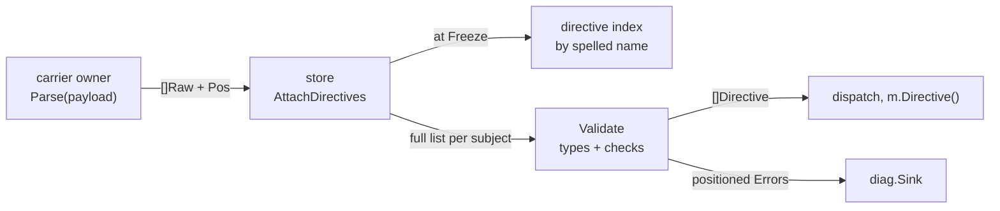

# RFC-0005: The directive grammar, schemas and validation

## Summary

This RFC pins `directive`: the parser for the one grammar every
carrier lowers to, the schema registry that types and closes every
directive an author can write, and the freeze-time validation that
reports every violation as a positioned Error before any handler
runs. It also lands the store's directive side: instances attach to
subjects before the seal, the directive index builds in the same
pass as the kind index, and the read set gains the membership grain
an enumeration by directive records.

## Motivation

Directives sit in consumers' source files, which makes them the
public surface least able to absorb change. The grammar is already
pinned; what this proposal adds is the machinery that makes the pin
hold: one parser, one schema vocabulary, one validator.

A first implementation of this package exists and teaches by
counterexample. Its parsed form held values as strings in three
parallel containers — positionals in one, key-values in another,
lists in a third — so reading a param meant knowing which container
its type hid it in, and every consumer re-typed every value at every
call site. Its validator took one directive at a time, so the two
checks that need a subject's full list — a duplicate of a
single-instance directive, and the constraints between directives —
could not be written against its signature at all. Its schema could
not declare positional params, so positionals went unvalidated. And
its instances carried no ordinal, so repeatable handlers had no
source order to run in. Each of those is a shape error, not a
missing feature: the fix is a different signature, which is why the
form is worth an argument before the code.

Role scoping failed the same way one layer up: roles existed as
prose, so every plugin interpreted `role=` in its handler. A gate
hidden in a handler is selectivity the kernel cannot see; the same
law that bans it for dispatch bans it here.

## Detailed design

### The raw form

A carrier hands over parsed grammar with untyped values. Typing
needs the registry, and a frontend does not hold one.

```go
// Package directive holds the one grammar every carrier lowers to,
// the schemas that close it, and the validation that types it.
package directive

// Name is a directive's spelling: bare, or plugin-prefixed as
// "plugin:name" once two plugins claim one bare name.
type Name string

// Raw is one instance as a carrier hands it over: the grammar
// parsed, the values untyped. Typing happens at validation, against
// the schema, so a carrier needs no registry.
type Raw struct {
    // Name is the spelling as written, bare or prefixed.
    Name Name
    // Args holds every argument in source order, positional and
    // keyed alike, so a diagnostic about one argument can point at
    // it.
    Args []RawArg
    // Pos is the carrier line.
    Pos position.Pos
}

// RawArg is one argument as written.
type RawArg struct {
    // Key is empty for a positional argument.
    Key string
    // Value is the spelling, quoting resolved.
    Value RawValue
    // Col is the argument's column within the payload, which the
    // carrier's owner adds to the carrier position for a
    // diagnostic.
    Col int
}

// RawValue is one value as written: a scalar spelling, or a list.
type RawValue struct {
    // Text is the scalar spelling with escapes resolved; empty for
    // a list.
    Text string
    // Quoted says the spelling was quoted, which is what lets an
    // empty string be a value.
    Quoted bool
    // List holds the elements of a list value, nil for a scalar.
    List []RawValue
}

// Parse reads one payload against the pinned grammar. The payload
// is the text after the carrier marker, one logical line with
// continuations already joined.
//
// A payload outside the grammar answers an error carrying the
// byte offset where reading stopped; the caller owns the file
// position and converts. Parse never panics, whatever the bytes.
func Parse(payload string) (Raw, error)

// Join folds continued carrier lines into one payload: a line
// ending in a backslash joins the next, marker already stripped,
// with a single space. The rule is grammar, so it lives here once
// rather than in every frontend.
func Join(lines []string) string
```

Parsing and typing are two steps because they have two callers with
two failure audiences. A parse error is the author's typo, found
where the carrier is read; a type error is a violation of a schema
the author may not have seen, found at validation with the registry
in hand. One step would push the registry into every frontend and
mix the two reports.

The grammar rules the EBNF leaves open, decided here:

- A key spelled twice in one instance is a validation Error naming
  both columns. Within one carrier line there is no authority to
  rank two claims, and last-wins is how a typo becomes a silent
  override.
- A list nests grammatically but not semantically: the schema types
  say "list", validation refuses an element that is itself a list.
  A directive that needs structure splits into two directives.
- Booleans spell exactly `true` and `false`. Ints parse in base 10
  with an optional leading minus. Anything else quotes. The wider
  boolean vocabularies are how YAML turned a country code into a
  boolean, and one spelling stays greppable.
- Quoting affects lexing alone: a quoted `"5"` still types as an
  int where the schema says int. Quotes exist for spaces and
  escapes, not as a type annotation.

### Schemas

```go
// ParamType types a schema param.
type ParamType uint8

const (
    TypeString ParamType = iota + 1
    TypeInt
    TypeBool
    TypeList
    TypeReference
)

// ResolutionKind says what a reference param's value resolves
// against. The source kinds are declared and carried; nothing in
// this proposal binds them, because the projection machinery that
// resolves a source name does not exist here. The metadata kind is
// bound at validation, against the metadata key registry.
type ResolutionKind uint8

const (
    // ResolveNone marks a non-reference param.
    ResolveNone ResolutionKind = iota
    // The source kinds: a name in the subject's scope.
    ResolveCallableInScope
    ResolvePackageVar
    ResolveValueField
    ResolveHostParam
    ResolveMemberOnHandle
    // ResolveMetadataKey resolves against the metadata registry: a
    // key's boundary spelling or a fact group's name. A typo is a
    // validation Error naming the candidates.
    ResolveMetadataKey
)

// ParamKey is a param's spelling. A schema's owner declares its
// keys as constants, so a misspelled key is a compile error in a
// plugin and a validation Error only for what a human typed.
type ParamKey string

// ParamSpec declares one param a schema accepts.
type ParamSpec struct {
    Key  ParamKey
    Type ParamType
    // Required refuses an instance that omits the param. With
    // Roles set, the requirement applies under those roles alone.
    Required bool
    // Roles admits the param only when the instance's role is one
    // of these. Empty admits it under every role.
    Roles []string
    // Resolution is what a TypeReference value resolves against.
    Resolution ResolutionKind
    // Counterexample marks a param whose value names an input no
    // derivation could invent. It is carried, not consumed.
    Counterexample bool
    // Doc states the param's meaning. Registration refuses an
    // empty one.
    Doc string
}

// Schema declares one directive.
type Schema struct {
    // Plugin names the owner. The kernel's own schemas leave it
    // empty, and only they may.
    Plugin string
    // Name is the bare spelling. The prefixed spelling is
    // Plugin + ":" + Name, and both address the schema.
    Name Name
    // Positional declares the positional params in order, so
    // validation maps each bare argument to a name. An argument
    // past the last declared positional is an Error.
    Positional []ParamSpec
    // Params declares the keyed params. Unknown keys are refused:
    // closure is the only mode.
    Params []ParamSpec
    // Roles is the closed set of values the role key accepts. A
    // schema listing none refuses the role key. Declaring roles is
    // what reserves the key: no entry in Params spells "role".
    Roles []string
    // Repeatable admits more than one instance per subject.
    // Single-instance is the default: a second instance is a
    // contradiction, reported naming both positions.
    Repeatable bool
    // Requires and ConflictsWith constrain the subject's full
    // directive list, by name, resolved against the registry at
    // its seal.
    Requires      []Name
    ConflictsWith []Name
    // Doc states the directive's meaning.
    Doc string
}
```

Roles are the part the first implementation got wrong, so the shape
is argued rather than inherited. A role is a gate: "this param
matters when the directive is scoped to the client half". Gates are
declarative everywhere else in the system, because a gate inside a
handler is selectivity the kernel cannot validate or route. So the
schema declares the closed role set, each param declares the roles
that admit it, and the kernel validates a written role against the
set — an unknown role is an Error naming the candidates, a schema
that demands a role refuses a bare instance naming the same set,
and no handler ever inspects `role=` to decide what applies. The reserved
keys `out` and `tag` stay schema-unclaimable and are admitted on
every directive as strings, landing in the instance's params like
any declared key; they lower to a routing override, and a plugin
schema that claims either is refused at registration.

### The registry

```go
// Registry holds every schema a workspace recognises.
//
// A Registry is not safe for concurrent use. Registration happens
// while the workspace composes, and sealing ends it: validation
// refuses an unsealed registry, and registration after the seal is
// an error.
type Registry struct{ ... }

func NewRegistry() *Registry

// Register records one schema. It refuses, collecting rather than
// stopping: a kernel name claimed by a plugin, an empty Plugin on
// any name outside the kernel's four, a reserved key among the
// params, a param key or role declared twice, a positional param
// carrying Roles, an undeclared role on a param, RolesRequired on
// a schema declaring no roles, a list of lists, and an empty doc
// anywhere. The composition registers the kernel
// schemas before any plugin's, so an impersonation is a plain
// duplicate by the time it arrives.
//
// Two plugins may claim one bare name: both register, and the bare
// spelling becomes ambiguous. One plugin claiming one name twice
// is refused naming both docs.
func (r *Registry) Register(s Schema) error

// Seal resolves every Requires and ConflictsWith against what
// registered and closes the registry. Each unknown name is one
// error, a self-reference is another; composition collects them
// all.
func (r *Registry) Seal() []error

// ResolveName answers the schema a spelling addresses.
//
// A prefixed spelling addresses its owner's schema. A bare
// spelling addresses the schema iff exactly one plugin claims it;
// with two claimants it answers false, and Candidates names them
// for the diagnostic.
func (r *Registry) ResolveName(n Name) (Schema, bool)

// Candidates answers every prefixed spelling that claims a bare
// name, for the ambiguity Error.
func (r *Registry) Candidates(n Name) []Name
```

### The typed instance

```go
// Value is one validated param value. Kind says which field
// carries it; the closed vocabulary needs no codec and no
// assertion at the call site.
type Value struct {
    Kind ParamType
    Str  string
    Int  int64
    Bool bool
    List []Value
    // Ref is a reference's spelling, carried unresolved for the
    // source kinds and validated for the metadata kind.
    Ref string
}

// Directive is one validated instance: what a handler receives.
type Directive struct {
    // Name is the schema's canonical prefixed spelling, whatever
    // the author wrote.
    Name Name
    // Args holds the positional values, typed per the schema's
    // positional specs, in source order.
    Args []Value
    // Params holds the keyed values, typed per the schema.
    Params map[ParamKey]Value
    // Role is the validated role, empty where none was written.
    Role string
    // Pos is the carrier line.
    Pos position.Pos
    // Instance is the source order among a repeatable directive's
    // instances on one subject, starting at zero.
    Instance int
}

// Param answers a keyed value and whether the instance carries it.
func (d *Directive) Param(k ParamKey) (Value, bool)
```

### Validation

Validation runs over one subject's full directive list, which is
the signature the single-directive shape could not check
repeatability or constraints from.

```go
// Validate types and checks every instance on one subject,
// reporting each violation as a positioned Error on sink and
// answering the instances that passed, in source order, with
// repeatable instances numbered.
//
// The checks, each under its own registered code: an unclaimed
// name, an ambiguous bare name naming its candidates, an unknown
// key, a key written twice naming both columns, a type mismatch, a
// value outside its spelling rules, an argument past the declared
// positionals, an unknown role naming the declared set, an
// omitted role a schema demands naming that set, a second
// instance of a single-instance directive naming both positions, a
// requirement no directive on the subject meets naming the
// requiring position, a conflict naming both positions, and a
// metadata reference no key or group answers naming the
// candidates.
//
// keys resolves ResolveMetadataKey params. Validation of one
// subject is independent of every other, so a caller validates
// subjects in parallel; the sink is safe for that.
func Validate(
    subject symbol.Identity, ds []Raw,
    r *Registry, keys *meta.Registry, sink *diag.Sink,
) []Directive
```

The flow, one subject at a time:



### The store side

The instances are structural: they arrive with loading and freeze
with the graph.

```go
// In package store, which imports directive.

// AttachDirectives records raw instances on a subject. It is safe
// to call concurrently, is refused after Freeze under the frozen
// write code, and refuses a zero subject.
func (g *Graph) AttachDirectives(subject symbol.Identity, ds []directive.Raw) error

// ByDirective enumerates the declarations carrying a spelling,
// untracked, in identity order — the same yield ByKind answers,
// because every indexed subject is a held declaration: one that
// is not fails validation as dangling. The index builds at Freeze
// in the same pass as the kind index and is keyed by the name as
// written: the store holds no registry, so the dispatcher, which
// does, queries each spelling a schema answers to.
func (g *Graph) ByDirective(n directive.Name) iter.Seq[symbol.Symbol]

// DirectivesOf answers a subject's raw instances, untracked, in
// position order, so two concurrent attachments answer one order.
// It is the validator's read. No tracked equivalent exists: a
// plugin never reads a stranger's annotations, so the reader
// deliberately cannot answer them.
func (g *Graph) DirectivesOf(id symbol.Identity) []directive.Raw

// Directives enumerates every subject holding instances, with its
// instances, in identity order: the validator's walk.
func (g *Graph) Directives() iter.Seq2[symbol.Identity, []directive.Raw]
```

The tracked reader gains the membership grain and nothing else:

```go
// ByDirective enumerates the declarations carrying a spelling,
// under the reader's scope: a subject outside it is neither
// answered nor recorded. It records a directive-membership edge,
// so the reader runs again when a subject gains or loses the
// directive, plus a per-identity edge for each declaration the
// caller reached.
func (r *Reader) ByDirective(n directive.Name) iter.Seq[symbol.Symbol]

// On ReadSet:

// Directives answers every recorded membership edge, in name
// order. Len counts all four grains.
func (s *ReadSet) Directives() iter.Seq[directive.Name]
```

A dangling attachment — a subject the graph never got — is a
validation Error positioned at the directive, because silence there
eats a typo in an identity.

One amendment lands outside the package: the metadata registry
gains the enumeration its own proposal reserved for the first
consumer, because naming a drop typo's candidates needs it.

```go
// In package meta.

// Keys answers every registered key's spelling, in registration
// order: what the candidate-naming refusals enumerate.
func (r *Registry) Keys() iter.Seq[KeyName]
```

### The kernel schemas

Four names belong to the kernel, registered by one call the
composition makes, with their names and param keys declared as
constants beside their schemas:

```go
// Kernel answers the kernel-owned schemas: meta, out, diag and
// skip. The registry refuses these names from any plugin.
func Kernel() []Schema

const (
    // KernelMeta overrides metadata at directive authority. Its
    // drop param resolves against the metadata registry and
    // removes a fact or a group.
    KernelMeta Name = "meta"
    // KernelOut redirects a declaration's output; its path param
    // is the override.
    KernelOut Name = "out"
    // KernelDiag suppresses a diagnostic code at a declaration.
    KernelDiag Name = "diag"
    // KernelSkip excludes a declaration from bare and fact-gated
    // rules, or from one plugin.
    KernelSkip Name = "skip"
)

const (
    MetaDrop   ParamKey = "drop"   // ResolveMetadataKey
    OutPath    ParamKey = "path"
    OutTag     ParamKey = "tag"
    DiagOff    ParamKey = "off"
    SkipPlugin ParamKey = "plugin"
)
```

Their semantics stay with their owners: this proposal validates the
spellings, and nothing here drops a fact, reroutes an output,
filters a report or excludes a subject. The `sample` and `witness`
schemas are excluded entirely: their params validate against the
subject's own declaration, which puts the graph inside the
validator, and their spellings stay unpinned here.

Constants are declared where their schemas are, the same argument
that settled diagnostic codes and metadata keys: a schema is
written in Go, so its name and keys are typed values its owner
exports, nothing drifts, and no generator exists.

## Alternatives considered

### One parse step, typed against the registry

Parse could take the registry and answer typed instances directly.
It lost because every frontend would hold the registry, a parse
error and a schema violation would report as one kind of failure
from two audiences' mistakes, and fixtures could not attach an
instance without composing a registry first.

### Values in per-type containers

The first implementation held positionals, key-values and lists in
three parallel fields. It lost the moment a param's type decided
which field to read: a consumer needs the schema to find the value,
not only to type it. One `Value` with a kind is what the schema
already promises.

### Validating one directive at a time

The first implementation's validator took a single instance. It
lost because repeatability and cross-directive constraints are
properties of a subject's list, and a signature that never sees the
list cannot check them. The two-position Errors those checks report
are the reason the kernel validates at all: no plugin can see a
stranger's directive, so a contradiction is caught here or nowhere.

### Roles as an uninterpreted key

Typing `role=` as a plain string and leaving interpretation to
plugins is the least machinery. It lost because it is the first
implementation's failure restated: every plugin re-derives the role
vocabulary in its handler, two plugins drift, and the kernel can
validate nothing. A closed declared set costs one slice per schema
and buys the same validation every other value gets.

### A directives field on the node model

Instances could live on each declaration, a schema edit plus a
regeneration. It lost for this proposal because the model is the
language-neutral projection of source, and a directive is workspace
input that happens to travel in comments: the store owns run input.
The schema edit stays available if the sealed form wants instances
inline; nothing here forecloses it.

### Indexing by canonical name at Freeze

The directive index could canonicalize spellings, so one query
finds bare and prefixed instances. It lost because canonicalizing
needs the registry inside `Freeze`, whose signature takes nothing,
and the dispatcher holds the registry anyway: querying each
spelling a schema answers to is one loop over at most two
spellings.

## Drawbacks

- Two instance forms exist, raw and typed, and everything between
  the carrier and validation speaks the raw one. That is one more
  type than a single-form design, held because the two forms fail
  for different audiences.
- The validator takes the metadata registry as a parameter, and
  the package imports the metadata package permanently. The
  alternative special-cases the drop param inside the kernel
  schema, which is the same dependency hidden.
- Role scoping adds two slice fields and one validation rule per
  schema. A schema without roles pays an empty-set check per
  instance.
- The store index keyed by spelled name means a rule's dispatcher
  queries up to two spellings per schema. The cost is one extra
  map lookup per gated rule per run.
- Eleven-plus registered codes land at once, and each is API from
  the moment it registers: a wrong meaning is superseded, never
  edited.
- The four kernel schemas pin four names and five param keys as
  API while nothing here gives them behaviour; a spelling that
  turns out wrong is superseded, never edited.
- Adding a plugin can invalidate working source: a second claimant
  of a bare name makes every existing bare spelling ambiguous, and
  those carriers fail validation until their authors prefix. The
  alternative, first-registered-wins, breaks silently instead of
  loudly, which is worse; the loud break is still a break.

## Open questions

None. The one this draft opened is settled in the design above: a
schema demands a role through `RolesRequired`, because instances
are written many times by consumers and schemas once by their
owners, so the mandatory case costs a flag rather than boilerplate
in source files.

## Unresolved and future work

- The five source resolution kinds are declared and carried; the
  projection machinery that binds a spelling to a declaration
  consumes them and does not exist here.
- The `sample` and `witness` schemas validate against the subject's
  declaration and are excluded; their spellings pin with their
  machinery.
- The workspace-level opt-out for unclaimed directives is
  configuration and lands with the composition that owns config.
- Native sugar lowers to `Raw` in each language satellite; the
  form here is its target.

## References

- [05-directives.md](../architecture/05-directives.md), the three
  layers, the grammar EBNF, the schema contract and the kernel
  names
- [06b-authoring.md](../architecture/06b-authoring.md), the
  Directive wrapper, `m.Directive()` and the visibility law
- [04-metadata.md](../architecture/04-metadata.md), the drop form
  and directive authority
- [18-routing-and-layout.md](../architecture/18-routing-and-layout.md),
  the out override the reserved keys lower to
- [16-diagnostics.md](../architecture/16-diagnostics.md), the
  suppression the diag schema spells
- [RFC-0003](0003-diagnostics-and-store.md), the store surfaces
  and the deferred directive index
- [RFC-0004](0004-metadata-facts.md), the metadata registry the
  drop param resolves against
- The first implementation's directive package, in the proof-of-
  concept repository beside this one, whose shapes the Motivation
  and Alternatives argue against
