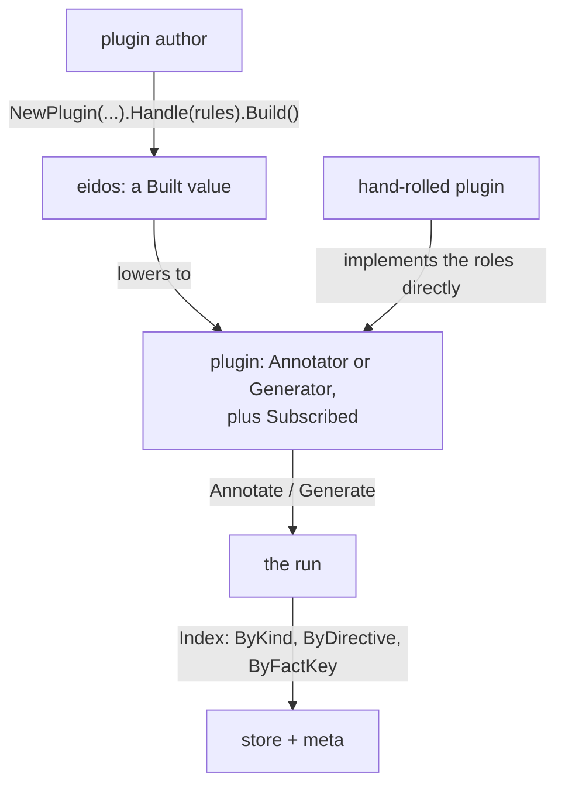
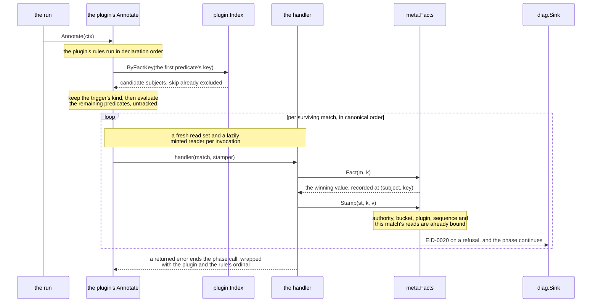
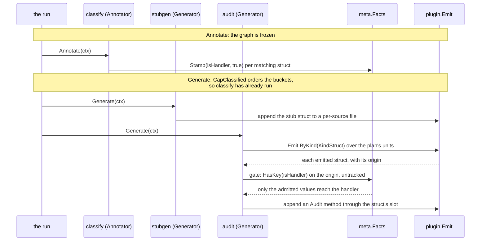

# RFC-0006: The authoring surface and dispatch

## Summary

This RFC pins the two layers a plugin is written and run against.
The `plugin` package is the service provider interface, or SPI: the
role interfaces the run invokes, the phase contexts they receive, the
emit store a plan accumulates into, and the subscription records the
engine indexes. The module's root package `eidos` is the authoring
surface over it. A plugin there is a value built once: its identity,
outputs, priorities and schemas are data, and only the handlers are
functions.

Handlers attach to kind-indexed triggers whose Match types generate
from the symbol schema. Gates are declarative, meaning a directive or
a stamped fact rather than a filter inside the handler. The handler's
second parameter picks its effect, and every rule set lowers to the
SPI roles. Dispatch is indexed: a gated rule visits its matches
through the store's kind and directive indexes and the fact store's
key index, so a rule costs what it matches, and only a bare rule visits
the whole graph.

## Motivation

The kernel now holds everything a plugin acts on: a frozen graph with
tracked readers, arbitrated fact bags, and validated typed
directives. It holds no way to write a plugin. Without this layer,
three of the framework's rules cannot be enforced at all:

- **Gates must be data.** A handler that starts with `if` contains
  selectivity the engine cannot see. Dispatch then degrades into
  scans, and the `(kind, directive)` and `(kind, factKey)` tuples
  that route dirtiness never exist. The only way to make that
  structural is a surface where the gate is declared next to the
  handler and recorded at Build.
- **Writes must carry provenance.** A fact write needs the rank
  fields, which are authority, bucket, plugin and a deterministic
  sequence, plus the reads that produced it. No handler author can be
  asked to assemble that envelope by hand every time. The effect
  surface binds it once, which is also what makes it uniform enough
  to audit.
- **Determinism must not be each plugin's job.** One dispatcher has
  to decide contribution order inside an output, sequence numbers
  under arbitration, and the order the matches run in. Split that
  across plugins and two of them disagree the first time a map
  iterates.

The role interfaces alone cannot carry these rules. A bare role
implementation is honest but expensive: it subscribes to everything
in scope, reads at whole-phase grain, and keeps its selectivity
private. That form stays public, because some plugins genuinely
want to see everything. It cannot be the only form, because indexed
dispatch, exact provenance and dirty routing all need the declared
form to exist.

One more requirement shapes the design. The seams that come after
this layer, meaning rendering, routing, incremental re-runs,
parallel buckets, new languages and new subject kinds, must arrive as
additions rather than reworks. Every section below states which
addition it expects and why the surface holds still when it
arrives.

## Detailed design

### Two packages, one boundary

The SPI lives in `plugin` (`go.dokimi.dev/eidos/core/plugin`). The
authoring surface lives in the module's root package `eidos`
(`go.dokimi.dev/eidos/core`), whose package doc already claims that
role. The boundary between them is the lowering guarantee: the run
invokes role interfaces and reads subscription data, and never
knows which layer authored a plugin. A hand-rolled SPI plugin and a
facade-built one are interchangeable to everything downstream.



Dependency position: `plugin` imports `store`, `meta`, `directive`,
`diag`, `emit`, `node`, `symbol` and `position`; the root package
imports `plugin` and the same set. Nothing under either imports
back up.

### The SPI: plugins and roles

```go
package plugin

// ID is a plugin's declared name: the one identity everywhere it
// appears. The diagnostic origin, the emit attribution and the
// arbitration rank's plugin field all carry this same type, so no
// boundary converts. It aliases the origin type the diagnostics
// package defines, because those envelopes live beneath this
// package and cannot import it; the definition sits at the
// bottom, and this is its spelling wherever plugins are the
// subject.
type ID = diag.Origin

// Plugin is the base contract: a stable name. The name never
// changes between versions, because everything durable keys on
// it.
type Plugin interface {
    Name() ID
}

// Role names one phase role a plugin can hold. Priorities are per
// role: one shared number cannot place a dual-role plugin's two
// halves independently.
type Role uint8

const (
    RoleAnnotator Role = iota + 1
    RoleGenerator
)

// Capability is a label one plugin provides and another requires.
// The provider exports it as a constant; requirers reference the
// constant, so a misspelled requirement is a compile error.
type Capability string

// Annotator stamps facts over the frozen graph.
type Annotator interface {
    Plugin
    Annotate(ctx *AnnotatorContext) error
}

// Generator produces emit values into one plan.
type Generator interface {
    Plugin
    Generate(ctx *GeneratorContext) error
}
```

Failure works the same way in both roles: a problem with one
subject attaches to the sink and the phase continues; a returned
error is fatal to the phase.

This proposal carries no Frontend, Backend or WorkspaceCheck
interface. A Frontend contract needs a source-language identity and
a Backend contract needs a target-language one, and no language
type exists in the kernel; a WorkspaceCheck needs manifests. Each
is an interface addition beside these two, in this package, and
adding one changes nothing here.

The capability surfaces are interfaces the composition asserts:

```go
// DirectiveProvider declares the schemas a plugin owns, for
// registration at composition.
type DirectiveProvider interface {
    Directives() []directive.Schema
}

// OutputProvider declares the file families a generator emits.
type OutputProvider interface {
    Outputs() []Output
}

// CapabilityProvider orders a plugin: a priority per role, plus
// the capability topology inside one priority bucket.
type CapabilityProvider interface {
    Priority(r Role) int
    Provides() []Capability
    Requires() []Capability
}

// OptionsProvider declares a typed options struct; the section
// below pins the contract it obeys.
type OptionsProvider interface {
    Options() any
}

// Versioned contributes to the run fingerprint.
type Versioned interface {
    Version() string
}
```

### Options

An options schema has four consumers and one source of truth: the
composition populates it from config, a validation fault names the
plugin and the field, the populated value folds into the plugin's
fingerprint, and the published config schema completes options in a
consumer's editor. All four derive from one tagged struct, the same
schema-from-struct-tags mechanism the model generator already runs
on:

- `Options(cfg)` takes a pointer to a struct. Its exported fields
  are the options, and nothing else is.
- The `opt` tag names the config key; an untagged field lowercases
  its name. The `doc` tag states the option's meaning, and a field
  without one is a composition fault, the same line the directive
  and metadata registries draw: the declaration is its
  documentation.
- Defaults are the values the plugin constructed the struct with. A
  default is Go data rather than a tag spelling, so it can be any
  value the type admits and it cannot drift from the type.
- The composition populates over those defaults, refuses an unknown
  key or a mistyped value as a collected fault naming the plugin
  and the field, and folds the populated struct into the
  fingerprint. `Options()` returns the same pointer.

The struct is the schema. There is no parallel spec list to drift
from it, and every consumer of the schema reads the same tags.

### The phase contexts and the dispatcher's index

Every context carries two read surfaces, because the store draws a
line between them: a plugin's read is tracked, and dispatch is not
a plugin's read and must not record one.

```go
// Index is the dispatcher's routing surface over one frozen run:
// untracked, scope-filtered enumeration plus the validated
// directive table and the skip table derived from it. Enumerating
// it records nothing. A plugin's own reads go through a Reader;
// conformance holds a plugin's output to its recorded reads, so an
// output only an Index walk explains fails there.
//
// Index wraps the graph rather than exposing it, and the wrapping
// is load-bearing twice over. Nothing reachable from a context can
// make a structural write, because AddPackage and AttachDirectives
// are not here; and nothing reachable can read another plugin's raw
// directives. What dispatch needs is exactly what is here.
type Index struct { /* graph, facts, validated, skips, scope */ }

// NewIndex builds the routing surface. It is refused over an
// unfrozen graph. validated holds each subject's typed instances
// in position order, as validation returned them; the index keeps
// the map, and the caller does not mutate it after handing it
// over. A nil scope admits everything.
func NewIndex(
    g *store.Graph, f *meta.Facts,
    validated map[symbol.Identity][]directive.Directive,
    sc store.Scope,
) (*Index, error)

// ByKind, ByDirective and ByFactKey enumerate candidates in the
// underlying indexes' identity orders, filtered by scope.
func (ix *Index) ByKind(k symbol.Kind) iter.Seq[symbol.Symbol]
func (ix *Index) ByDirective(n directive.Name) iter.Seq[symbol.Symbol]
func (ix *Index) ByFactKey(id meta.KeyID) iter.Seq[symbol.Identity]

// Lookup returns one declaration, untracked: how a fact-gated
// candidate resolves to its declaration and kind.
func (ix *Index) Lookup(id symbol.Identity) (symbol.Symbol, bool)

// DirectivesOf returns a subject's validated instances, position
// order. This is the gate's read, not a plugin's: a handler sees
// only the one instance that caused its call.
func (ix *Index) DirectivesOf(id symbol.Identity) []directive.Directive

// Skipped reports whether the kernel skip directive excludes a
// subject: for every plugin with no argument, for one plugin under
// skip plugin=<name>. The table is computed once at NewIndex, so a
// match costs one probe of a map holding only the subjects that
// carry skip.
func (ix *Index) Skipped(id symbol.Identity, p diag.PluginID) bool

// Reader mints a tracked handle under the index's scope, recording
// into reads. This is how dispatch gives each handler invocation
// its own read grain.
func (ix *Index) Reader(reads *store.ReadSet) (*store.Reader, error)
```

`Index.ByKind` filters by scope, which needs a declaration's owning
package without recording a read. The store grows the untracked
twin of the reader's existing lookup:

```go
package store

// PackageOf returns the package holding a declaration, untracked:
// the kernel's own path, beside the tracked [Reader.PackageOf].
func (g *Graph) PackageOf(id symbol.Identity) (*node.Package, bool)
```

The contexts:

```go
// AnnotatorContext carries what one Annotate call may touch.
type AnnotatorContext struct {
    Index  *Index
    Reader *store.Reader // the plugin's tracked read path
    Facts  *meta.Facts
    Sink   *diag.Sink
    Plugin diag.PluginID // rank and attribution identity
    Bucket int           // the arbitration rank's bucket field
}

// GeneratorContext adds the plan's emit store. The Reader is
// already scope-filtered to the plan's sources.
type GeneratorContext struct {
    Index  *Index
    Reader *store.Reader
    Facts  *meta.Facts
    Emit   *Emit
    Sink   *diag.Sink
    Plugin diag.PluginID
    Bucket int
}
```

A hand-rolled plugin reads through `ctx.Reader` and counts as one
implicit subscription to everything in scope. The facade never
touches `ctx.Reader`: it mints one reader per handler invocation
through the index, which is what makes a fact write's provenance
name the reads of its own match rather than the phase's. The same
grain keeps every invocation free of shared tracking state, which
is the precondition a parallel bucket needs and no plugin has to
think about.

### The emit store

Generators accumulate; nothing renders. The emit model deliberately
has no file container: the emit-side `File` kind carries only doc and
path, and imports are node-only, collected at render as a side effect
of spelling types. So the unit of accumulation is its own type, keyed
the way output families are addressed:

```go
// Cardinality says how many outputs a family produces.
type Cardinality uint8

const (
    PerSource Cardinality = iota + 1 // one per source file
    PerPackage                       // one per package
    PerPlan                          // one per plan
)

// Output declares one file family. The target spells the join and
// extension of Word at render, which is why neither appears here:
// the same declaration serves store_stub.go and store.stub.ts.
type Output struct {
    Tag  string      // "" is the primary family
    Per  Cardinality
    Word string      // the family's word, e.g. "stub"
}

// Unit is one accumulated output entity: everything one plugin
// contributed to one (family, cardinality key) in one phase call.
// It carries the full routing key, so no consumer re-derives any
// part of it from the declarations.
type Unit struct {
    Plugin diag.PluginID
    Tag    string
    Per    Cardinality
    Word   string
    // Key addresses the accumulator: the subject's source file
    // path for PerSource, the package path for PerPackage, and ""
    // for PerPlan. The per-source key is the same field a rendered
    // filename's stem derives from, so the key and the filename
    // cannot disagree.
    Key string
    // Pkg is the owning package's identity for per-source and
    // per-package units, zero for a plan unit: the namespace half
    // of the routing key.
    Pkg symbol.Identity
    // Decls holds the emit declarations, ordered by origin
    // identity, then instance order under a repeatable directive,
    // then insertion, so contributions arrive in canonical subject
    // order and never in dispatch order.
    Decls []symbol.Symbol
    // Origins holds the node identities this unit derives from,
    // sorted and deduplicated: the provenance the manifest carries.
    Origins []symbol.Identity
}

// Emit holds one plan's accumulated units, plus a per-kind index
// over their declarations that is maintained at Add: each unit's
// tree is walked once when it arrives, so an emit-triggered rule
// enumerates its matches rather than the emit graph.
//
// Emit is not safe for concurrent use: annotators and generators
// run sequentially, and parallelism inside a bucket is a workspace
// opt-in this proposal does not carry.
type Emit struct { /* units, kind index */ }

func NewEmit() *Emit

// Add records one unit. A second unit under the same
// (plugin, tag, key) is refused as the defect it is: one phase
// call flushes each accumulator once. A zero cardinality, an empty
// word and a plan unit naming a key are refused the same way.
func (e *Emit) Add(u Unit) error

// Units enumerates every unit: by plugin, then cardinality, then
// key, then tag. The order is total, so two runs agree.
func (e *Emit) Units() iter.Seq[Unit]

// ByKind enumerates the emit declarations of one kind across every
// unit, in Units order, each unit's tree walked depth first. This
// is the OnEmit trigger's enumeration: a weaver subscribing to
// methods visits every emitted method, wherever a slot holds it.
// Only values carrying a nonzero Origin are returned, because every
// emit-trigger mechanism resolves through the origin: predicates,
// skip and reporting alike. A value whose author left Origin zero
// still arrives in its unit; it is just not a subject.
func (e *Emit) ByKind(k symbol.Kind) iter.Seq[symbol.Symbol]
```

### Subscriptions

Build lowers gates into data the engine indexes without executing
plugin code:

```go
// RuleID is a rule's ordinal in its plugin's declaration order,
// stable as long as the declaration does not reorder.
type RuleID int

// Phase says when a subscription's rule runs.
type Phase uint8

const (
    PhaseAnnotate Phase = iota + 1
    PhaseGenerate // over node subjects
    PhaseEmit     // over emit values produced by earlier buckets
)

// Subscription is one gate tuple as data. A rule gated on two fact
// keys returns two records with one RuleID.
type Subscription struct {
    Rule      RuleID
    Kind      symbol.Kind    // zero for a graph-wide rule
    Directive directive.Name // "" when not directive-gated
    FactKey   meta.KeyID     // zero when not fact-gated
    Phase     Phase
}

// Subscribed is what Build produces: the plugin plus its gate
// tuples. A hand-rolled plugin may skip it entirely, which reads
// as one implicit subscription to everything in scope. That is
// honest, and it costs full-graph dispatch.
type Subscribed interface {
    Plugin
    Subscriptions() []Subscription
}
```

In this proposal the records are declaration data: the run reads
them to know what a plugin watches, and the conformance suite
asserts their stability. Nothing re-runs a single rule for a single
subject; the role for that is a method beside `Subscriptions`, not
proposed here.

### The authoring surface: a plugin is a value

```go
package eidos

// NewPlugin starts a plugin declaration. Everything on the builder
// is data; only the handlers inside rules are functions.
func NewPlugin(name string) *Builder

func (b *Builder) Version(v string) *Builder
func (b *Builder) Output(o plugin.Output) *Builder    // repeatable: families
func (b *Builder) Priority(r plugin.Role, p int) *Builder
func (b *Builder) Provides(caps ...plugin.Capability) *Builder
func (b *Builder) Requires(caps ...plugin.Capability) *Builder
func (b *Builder) Options(cfg any) *Builder           // carried; populated at composition
func (b *Builder) Handle(rules ...Rule) *Builder

// Build freezes the declaration and returns the lowered plugin.
// The dynamic type implements the roles the rules imply and no
// others: Stamper rules make an Annotator, Emitter rules a
// Generator, a mixed set both. It also implements Subscribed and
// the provider interfaces for what the builder declared.
//
// Build panics on a declaration defect: an empty name, no rules,
// a duplicate output tag, an empty output word, a zero
// cardinality, an empty capability label, a directive name carried
// by two wrappers, a gate wrapped around a graph rule, a zero
// predicate. A wrong declaration is a bug in the plugin's own
// constructor, and it panics on the first Build in any test,
// before a run exists. The code registry draws the same line:
// only initialization-time defects panic.
func (b *Builder) Build() plugin.Plugin
```

Composition faults are not Build's to raise. Two plugins claiming
one name, a schema the directive registry refuses, an unsatisfied
requirement: those are collected errors where the workspace
composes, so a composition reports every fault at once.

Presentation is absent by design: no `Templates`, no `Funcs`, no
per-target layering. Those enumerate what templates need, and no
template machinery exists in the kernel; they are builder additions
beside `Output`, and nothing here forecloses them.

### Rules and triggers

```go
// Effect is the set of handler effect surfaces. The handler's
// second parameter picks the plugin's role: a handler taking
// *Emitter generates, one taking *Stamper annotates.
type Effect interface{ *Emitter | *Stamper }

// Rule is one trigger bound to one handler, with its gates. Rules
// are opaque values: the On constructors make them and the scoping
// wrappers annotate them.
type Rule struct { /* kind, phase, handler, gates */ }
```

The kind-indexed constructors and their Match types generate from
the symbol schema, one pair per subject kind. The schema marks
subjects with a doc directive on the kind's struct:

```go
// package symbol/schema

//eidos:subject
type Interface struct { ... }
```

Ten kinds carry the mark: Interface, Struct, Enum, Sum, Function,
Method, Field, Constant, Variable and Alias. The generator refuses
the mark on a kind without a node-side identity, and regeneration is
what adds a trigger. Marking a new subject kind produces its Match
type and constructor; forgetting the mark produces nothing. The model
therefore bounds the trigger set, and use cases do not: a kind that
justifies subject treatment in its own right, say a package under
aggregate annotation, is a schema mark plus a regeneration rather
than a new mechanism. The member,
container and type-machinery kinds stay unmarked on purpose, Param,
Return, File, Package and TypeRef among them. A handler reaches those
through its subject, and a per-param trigger would invert that.

The generated shape, shown for one kind since each subject kind has
one of the same shape:

```go
// InterfaceMatch is the OnInterface subject.
type InterfaceMatch struct {
    match
    Interface *node.Interface
}

// OnInterface runs the handler once per interface in scope, or
// once per gating instance under a Directive wrapper.
func OnInterface[E Effect](h func(*InterfaceMatch, E) error) Rule
```

Two structural triggers are hand-written beside them:

```go
// GraphMatch is the OnGraph subject: the whole scope, through the
// match's reader. It has no subject identity.
type GraphMatch struct{ match }

// OnGraph runs the handler once per phase call: the pressure
// valve for logic that genuinely spans subjects. It takes the
// Emitter only. A stamper writes to its subject's bag and a graph
// rule names no subject; an annotator that wants facts on many
// declarations subscribes to their kinds.
func OnGraph(h func(*GraphMatch, *Emitter) error) Rule

// EmitMatch is the OnEmit subject: one emit value produced by an
// earlier-bucket plugin in the same plan. Its subject identity is
// the value's origin, so fact reads, predicates and skip all
// resolve against the origin.
type EmitMatch struct {
    match
    Value symbol.Symbol // the emit declaration, assert to its kind
}

// Origin returns the node identity the emit value derives from.
func (m *EmitMatch) Origin() symbol.Identity

// OnEmit runs the handler once per emit value of one kind,
// wherever a slot holds it. It takes the Emitter only: emit is per
// plan and plans run in parallel, so a fact stamped from the emit
// side would live in a universe sibling plans never see. A fact
// about generated output is a fact on its origin, stamped during
// Annotate.
func OnEmit(k symbol.Kind, h func(*EmitMatch, *Emitter) error) Rule
```

A plugin's own emit is invisible to its own emit rules by
construction: accumulators flush into the store when the phase call
returns, after every rule ran. That is the order-independence rule
made structural, because no rule can observe whether a sibling rule
ran first.

### Gates

```go
// Directive gates rules on a validated directive and carries the
// schema for registration. One wrapper may gate many rules and the
// schema registers once; a name carried by two wrappers is refused
// at Build, so one wrapper gates them all. On an emit-triggered
// rule the gate is the origin's instance.
func Directive(s directive.Schema, rules ...Rule) Rule

// Where gates rules on stamped facts. Wrappers compose: nested
// predicates conjoin, and a disjunction is two rules. For an
// emit-triggered rule the predicate evaluates against the origin.
func Where(p Pred, rules ...Rule) Rule

// Pred is a declarative fact predicate. Its key is data, which is
// what the subscription record holds; its test runs at dispatch.
type Pred struct { /* key id and name, test */ }

// HasKey admits a subject on which k reads present.
func HasKey[T meta.FactValue](k meta.Key[T]) Pred

// Equatable is the comparable half of the fact vocabulary; a list
// value has no equality gate.
type Equatable interface {
    meta.FactValue
    comparable
}

// KeyEquals admits a subject whose winning value for k equals v.
func KeyEquals[T Equatable](k meta.Key[T], v T) Pred
```

Gate evaluation is routing, so it reads untracked: presence through
the fact index, equality through the winning value. The
subscription tuple is what routes dirtiness for the gate itself,
and the handler's own reads are tracked per invocation. A rule that
is both directive-gated and fact-gated enumerates the directive
index and evaluates its predicates on each carrier.

### The Match

Every generated Match embeds one base surface:

```go
// Reader returns the invocation's tracked read handle, minted on
// first use, so a handler that never reads costs no tracking. A
// handler that needs a sibling declaration looks it up like anyone
// else, instead of escaping to a graph-wide rule for an ordinary
// lookup.
func (m *match) Reader() *store.Reader

// Directive returns the gating instance, nil for bare and
// fact-gated matches. Under a repeatable schema the handler runs
// once per instance and each match carries its one instance, so
// the accessor stays singular.
func (m *match) Directive() *directive.Directive

// Errorf, Warnf and Infof report with the plugin's origin and the
// subject's position pre-bound.
func (m *match) Errorf(c diag.Code, format string, a ...any)
func (m *match) Warnf(c diag.Code, format string, a ...any)
func (m *match) Infof(c diag.Code, format string, a ...any)
```

A `GraphMatch` has no subject, so it has no position, and a
positionless finding is a defect in whatever reported it. The graph
match therefore shadows the three with forms that demand one:

```go
func (m *GraphMatch) Errorf(
    c diag.Code, at position.Pos, format string, a ...any,
)
```

An `EmitMatch` reports at its origin's position.

A handler sees only its own gating instance. The other directives
on a subject are other plugins' annotations, invisible by design: a
directive's meaning belongs to the plugin that owns it, and its
effects are consumed through stamped facts. Anything else would
make every directive's params public API for every other plugin.

Fact reads are free functions over the match, so the type parameter
lives on the key rather than the surface:

```go
// Matcher is the closed set of match types; only this package's
// matches satisfy it.
type Matcher interface { /* unexported */ }

// Fact returns the subject's winning value for k, recording the
// read at (subject, key) into the invocation's read set; a miss
// records too. On an emit match the subject is the origin; on a
// graph match there is no subject and Fact returns false.
func Fact[T meta.FactValue](m Matcher, k meta.Key[T]) (T, bool)

// FactOf returns another declaration's winning value, recorded the
// same way: reading a sibling's stamped facts is the sanctioned
// channel between plugins.
func FactOf[T meta.FactValue](
    m Matcher, id symbol.Identity, k meta.Key[T],
) (T, bool)
```

This match surface carries no language identity and no source
rules: no language type exists in the kernel. Adding either is a
method beside `Reader`.

### The Emitter

```go
// Tag selects a declared output family; the zero value is the
// primary. Addressing an undeclared family panics: the family set
// is the plugin's own declaration, so the mismatch is a defect
// that panics on the first matching test.
type Tag string

// Emitter is a handler's write surface, scoped to its subject.
// Each accessor returns the one accumulator for its (cardinality
// key, family): created on first touch, appended to thereafter, so
// two interfaces in one source file assemble one per-source unit
// and a package's matches assemble one registry.
type Emitter struct { /* run state, subject */ }

func (e *Emitter) File(tags ...Tag) *Out        // key: subject's Position().File
func (e *Emitter) PackageFile(tags ...Tag) *Out // key: subject's package path
func (e *Emitter) PlanFile(tags ...Tag) *Out    // key: the plan

// Out is one accumulator seen from one match. The handle carries
// the match's subject, so an append is attributed without shared
// mutable state: two matches hold two handles onto one
// accumulator, which is what lets a parallel bucket arrive as a lock
// inside the accumulator rather than a new API.
type Out struct { /* accumulator, subject, instance */ }

// Append places emit declarations under the handle's subject. The
// flush orders a unit's declarations by origin identity, then by
// the gating instance's source order under a repeatable directive,
// then by insertion, so output order is canonical and never match
// order.
func (o *Out) Append(decls ...symbol.Symbol)
```

The accumulator is not an emit-side `File` value, because that kind
holds no declaration list: a generated file's layout belongs to
routing and its imports to rendering. When the phase call returns,
each accumulator flushes into the plan's store as one `Unit`, with
declarations in canonical order, the package identity resolved from
the subject, and origins sorted. A slot append inside a declaration
(`s.Methods.Append(...)`) needs no Emitter call, because the value
is already placed; slots are the composition seam. A subject
without a source position keys its per-source family under the
empty string, so a fixture exercising per-source families sets
positions.

One signature-mirroring helper lives in the framework, because its
correctness lesson is universal and easy to get wrong per plugin:

```go
// Mirror returns an emit method mirroring a node method's
// signature, type spellings verbatim, origin set. The receiver is
// named against the host type's name and the parameter names: a
// method declaring Put(s Session) must not bind its receiver to s,
// a duplicate-identifier compile error a formatter cannot catch.
func Mirror(host string, m *node.Method) *emit.Method
```

Import inference deliberately does not exist here: imports are
node-only in the model, collected at render as a side effect of
spelling types, so an emitter-side import guess would be a second
answer to a question the renderer owns.

### The Stamper

```go
// Stamper is the annotator effect: a write handle bound to its
// match's subject. A stamper writes only to its subject's bag, so
// the trigger fixes every write's target at compile time. A fact
// "about" a sibling is a fact on the subject whose value names the
// sibling.
type Stamper struct { /* facts, subject, rank fields, read set */ }

// Stamp records v under k with the envelope pre-bound: plugin
// authority, the context's bucket and plugin, a sequence assigned
// in canonical match order, and the invocation's point reads as
// the claim's derivation. The fact store refuses an unregistered
// key, a subject kind the key does not admit, a false boolean, and
// one source claiming two values. A refused write reports an Error
// at the subject's position and the phase continues.
func Stamp[T meta.FactValue](st *Stamper, k meta.Key[T], v T)
```

The sequence number is the dispatcher's: one counter per phase
call, incremented per invocation in canonical match order. Two
schedulings of the same run therefore assign the same sequence to
the same match, which is what "first claim in canonical match
order" requires of the rank's last field, and what keeps
arbitration deterministic under a parallel bucket.

The refusal reports under one new kernel code, declared where the
root package registers: `EID-0020`, `RefusedStamp`, an Error, meaning
the fact store refused a stamp, carrying the reason it gave.

### Dispatch

One phase call runs the plugin's rules of that phase, in
declaration order. Each rule enumerates through the narrowest
index:

| Rule | Enumeration | Then |
| --- | --- | --- |
| Directive-gated | `ByDirective` under the schema's spellings | filter each subject's validated instances by the schema's canonical name |
| Fact-gated | `ByFactKey` on the first predicate's key | `Lookup`, keep the trigger's kind, evaluate the remaining predicates |
| Bare kind trigger | `ByKind` | evaluate any predicates |
| Graph trigger | none | one invocation |
| Emit trigger | `Emit.ByKind` over the plan's units | predicates evaluate against each value's origin |

A directive-gated rule resolves its subjects without a registry in
hand: the schema's canonical and bare spellings are both queried
against the store's spelled-name index, and a subject qualifies
through its validated instances, which carry canonical names. A
bare spelling two plugins claim validates to nothing, so its
carriers match no rule, which is the ambiguity Error's runtime
shape.

Under a repeatable schema the handler runs once per instance, in
position order, each match carrying its one instance.

The kernel `skip` directive is honoured here, through the index's
precomputed table. A subject whose
validated instances carry `skip` drops out of bare and fact-gated
rules, or out of one plugin's rules alone when the instance spells
`plugin=<name>`. Directive-gated rules run anyway, because a
directive-gated subject opted in explicitly and withdraws by deleting
the directive. For an emit-triggered rule the origin's `skip`
governs, since the origin is the subject consulted. A graph rule has
no subject, so nothing excludes it.

Each invocation reuses its rule's match with a fresh read set,
minted lazily, and its own effect handle, so the reads a handler
makes are the reads its artifact records: a stamp's derivation names what this match
read, not what the phase read. Handlers are order-independent
within a plugin by rule, and dispatch is sequential in this
proposal; the read grain is what makes the parallelism opt-in
possible without changing any plugin.

A handler returning an error ends the phase call with that error,
wrapped with the plugin and the rule's ordinal. Everything
per-subject that is not worth ending the phase for goes to the sink
through the match.

One fact-gated rule, from the phase call to the write:



### A plugin, end to end

Three shapes cover most plugins. An annotator that classifies:

```go
const CapClassified plugin.Capability = "classified"

func Classifier(keyIsHandler meta.Key[bool]) plugin.Plugin {
    return eidos.NewPlugin("classify").
        Provides(CapClassified).
        Handle(eidos.OnStruct(
            func(m *eidos.StructMatch, st *eidos.Stamper) error {
                if strings.HasSuffix(m.Struct.Name, "Handler") {
                    eidos.Stamp(st, keyIsHandler, true)
                }
                return nil
            })).
        Build()
}
```

A generator gated on its own directive:

```go
func Stubs() plugin.Plugin {
    stub := directive.Schema{
        Plugin: "stubgen", Name: "stub",
        Params: []directive.ParamSpec{{
            Key: "prefix", Type: directive.TypeString,
            Doc: "the generated type's name prefix",
        }},
        Doc: "emit an unimplemented stub of the interface",
    }
    return eidos.NewPlugin("stubgen").
        Output(plugin.Output{Per: plugin.PerSource, Word: "stub"}).
        Handle(eidos.Directive(stub, eidos.OnInterface(
            func(m *eidos.InterfaceMatch, e *eidos.Emitter) error {
                prefix := "Stub"
                if v, held := m.Directive().Param("prefix"); held {
                    prefix = v.Str
                }
                s := &emit.Struct{
                    Origin: m.Interface.Identity(),
                    Name:   prefix + m.Interface.Name,
                }
                for _, mm := range m.Interface.Methods {
                    s.Methods.Append(eidos.Mirror(s.Name, mm))
                }
                e.File().Append(s)
                return nil
            }))).
        Build()
}
```

And a weaver that appends into another plugin's output through a
slot, gated on the classifier's fact, ordered by the capability:

```go
func Audit(keyIsHandler meta.Key[bool]) plugin.Plugin {
    return eidos.NewPlugin("audit").
        Requires(CapClassified).
        Handle(eidos.Where(eidos.HasKey(keyIsHandler),
            eidos.OnEmit(symbol.KindStruct,
                func(m *eidos.EmitMatch, e *eidos.Emitter) error {
                    s := m.Value.(*emit.Struct)
                    s.Methods.Append(&emit.Method{
                        Origin: m.Origin(), Name: "Audit",
                    })
                    return nil
                }))).
        Build()
}
```

The weave composes three sanctioned mechanisms and nothing else:
the owner promotes its conclusion to a declared fact, the weaver
declares its gate on that fact and appends through a slot, and the
capability edge turns the ordering into a scheduled guarantee. At
no point does either plugin read the other's directives or import
the other's package.



### The cost model

Stated per mechanism, so a regression is measurable rather than
felt. The indexes this dispatch enumerates are built and measured:
the store's directive index returns at 1.4ns per carrier with 20k
carriers, its kind index fills once at freeze, and the fact-key
index is maintained at stamp time.

- A directive- or fact-gated rule costs its carriers. Enumeration
  is a presized slice walk, and every candidate adds one `Lookup`
  for a fact gate or one validated-table probe for a directive
  gate.
- A bare rule costs the graph's population of its kind: the one
  honest full-price path, and the reason bare is a deliberate
  choice rather than a default people fall into.
- Skip is one probe of a map holding only the subjects that carry
  skip, computed once at `NewIndex`.
- Per invocation the steady-state cost is zero allocations: each
  rule reuses one match per phase call, valid for the duration of
  its handler call, and the read set and reader allocate on the
  first tracked read, so a handler that only writes allocates no
  tracking. Retaining a match past its call is a defect, under the
  same rule that forbids state on the plugin struct.
- Emit rules enumerate the per-kind index maintained at `Add`, one
  tree walk per unit when it arrives, instead of re-walking the emit
  graph per rule.
- Flush sorts each accumulator once by its ordering key and each
  unit's origins once.

### Lowering

Build assembles the dynamic type from what the rules imply:

- every rule lowers its gates to `Subscription` records;
- Stamper-effect rules make the value an `Annotator`, whose
  `Annotate` dispatches exactly the annotate-phase rules;
- Emitter-effect rules make it a `Generator`, whose `Generate`
  dispatches the generate- and emit-phase rules and flushes the
  accumulators into `ctx.Emit`;
- schemas carried by `Directive` wrappers surface through
  `DirectiveProvider`, outputs through `OutputProvider`, priorities
  and capabilities through `CapabilityProvider`, the options struct
  through `OptionsProvider`, and the version through `Versioned`.

The effect choice is a type switch over the two pointer types at
Build, not reflection: the constraint admits exactly two types, and
the zero value tells them apart.

The guarantee this buys: a facade-authored plugin and a hand-rolled
SPI twin are indistinguishable to the run. The conformance suite
holds both spellings of one plugin to byte-equal emit, which is
what keeps the SPI honest as a public base contract rather than an
implementation detail.

### What generates, what is written by hand

The model generator gains one vocabulary token (the subject doc
directive), one template, and one addition to the emit walk: a
generated `OriginOf(s symbol.Symbol) (symbol.Identity, bool)`,
because the emit kinds export the `Origin` field, so a method of
that name cannot exist, and a function honestly covers the kinds
that carry no origin storage. Generated into the root package,
under the same mirror guard as the models: the ten Match types and
their On constructors. Hand-written beside them: the match base, `Rule`
and the gates, the Builder and its lowering, the Emitter and `Out`,
the Stamper, the dispatcher, `OnGraph`, `OnEmit` and `Mirror`; and
the whole `plugin` package.

## Alternatives considered

### Explicit per-effect constructors

`OnInterfaceEmit(h)` and `OnInterfaceStamp(h)` per kind would avoid
the `Effect` type parameter and its risk that inference reads
poorly in real plugin code. Twenty constructors instead of ten, the
effect moves into the name, and the signature no longer states that
the handler picks the role. The generic form is one constructor per
kind with the effect visible at the call site, and if it fails
contact with real plugins, narrowing to explicit constructors is a
generator edit that breaks no SPI contract. The facade keeps the
generic form.

### The engine dispatches per rule through the subscription records

Instead of each plugin's role method walking its own rules, the run
could drive every (rule, subject) pair itself, invoking through a
per-rule entry beside `Subscriptions`. A warm run wants exactly that
shape, so it can re-run one rule for one dirty subject. It is still
not proposed here: nothing consumes recorded edges yet, the entry
role is an interface addition when something does, and giving the run
a per-rule entry now would freeze an invocation ABI before any
consumer exists. The role method stays the unit of invocation;
subscriptions stay data.

### The emit store inside `store`

One package for both sides was weighed. The store's contract is the
read side: it freezes, and everything after the freeze is a read. An
emit store runs the opposite lifecycle. It is all writes, per plan,
and stays unfrozen for the whole generate phase. Placing it in
`plugin` keeps the store's rule intact and puts the accumulation type
beside the context that carries it.

### Rules registered at package initialization

Diagnostic codes register through `MustRegister` at init, and the
same shape was considered for rules: a package-level registry the
run collects. Rules do not fit it: a plugin is instantiated per
composition, two compositions may hold different plugin sets in one
process, and a test builds throwaway plugins constantly. Values
built by a constructor and handed to the composition keep plugin
identity where the consumer's `main` composes it.

### Subscription discovery by reflection

Deriving gates by inspecting handler types would drop the wrapper
combinators. It reads the effect fine and cannot read the gate: a
directive schema and a fact predicate are values rather than types,
so they would move into struct tags or naming conventions, which is
the stringly surface the typed design exists to avoid. The engine
also must not execute plugin code to discover gates, which rules out
any discovery that runs the handler.

### One read set per phase call

The hand-rolled shape, one reader and one set per phase call, was
weighed for the facade too. It makes every stamp's derivation the
union of everything the phase read, so one fact's provenance names
reads that produced a different fact, and attribution degrades to
per-plugin. It also welds dispatch to sequential execution, because
every invocation would share one tracking structure. Per-invocation
sets allocate only when a handler reads, and they keep both the
claim's derivation and the parallel opt-in exact.

### A graph trigger that also annotates

Letting the graph rule take a Stamper was weighed for aggregate
annotators. It breaks the one rule that makes annotation analyzable,
that the write target is statically known from the trigger, because
a graph rule names no subject. The design refuses it and keeps two
returns that compose: an annotator that wants facts on many
declarations subscribes to their kinds, and a kind that deserves
aggregate annotation in its own right is marked a subject in the
schema and regenerated.

## Drawbacks

- Two surfaces to keep honest. The SPI and the facade can drift,
  and the guard is a conformance check (byte-equal twins) that this
  proposal specifies but does not implement. Until that check runs,
  the lowering guarantee is a design statement.
- The root package is wide: ten generated Match types and
  constructors, roughly fifteen hand-written exported symbols, and
  the `plugin` package another dozen. That is the counted cost of
  kind-indexed triggers and typed effects; the bound is the
  schema's subject marks, not use cases.
- `RuleID` is a declaration ordinal, so reordering rules renumbers
  subscriptions. Anything durable keyed on one, a warm-run record
  or a stats baseline, is invalidated by a reorder that changed no
  behaviour. The conformance suite's declaration check makes that
  visible; it cannot make it free.
- `Index` sits on every context, so a hand-rolled plugin can
  enumerate untracked. The rule "a plugin reads through its Reader"
  is enforced for facade authors by construction and for hand-rolled
  plugins only by conformance. Hiding the index would take a second,
  kernel-only context type plus a privileged path for the facade,
  which opens a bigger hole than the one it covers.
- A generic constraint in the primary authoring signature. If
  `Effect` inference confuses more than it helps, every plugin
  written before a narrowing is worth the migration.
- Sequential dispatch leaves bucket parallelism on the table. The
  read grain is chosen so turning it on is a dispatcher change, not
  a plugin change, but nothing proves that until it exists.
- One more place directive semantics live: the dispatcher honours
  `skip`, so its meaning is split between the schema (validation) and
  this layer (exclusion). Nothing avoids the split, because
  validation cannot know which rules exist, but it is still two
  places.

## Open questions

- Should `Emit.ByKind` also return the enclosing unit, so a weaver
  can ask which family it is appending beside? Nothing needs it
  yet, and a second iterator is a compatible addition, but if the
  conformance suite wants it for attribution assertions it should
  arrive here instead.
- Is the `doc` struct tag the right home for option documentation
  once options run long? A tag cannot hold paragraphs, and the
  alternative, a parallel spec list, reintroduces the drift the
  tagged struct removes. Proposed: the tag holds the one-line
  meaning, and long-form option docs live in the plugin's package
  documentation.

## Unresolved and future work

- Frontend, Backend and WorkspaceCheck interfaces, template and
  presentation declarations on the builder, and per-target
  layering are not proposed here; each is an addition beside the
  surfaces above.
- A per-rule invocation entry beside `Subscriptions`, for re-running
  one rule over one subject, is deliberately absent until a
  consumer of recorded edges exists.
- A graph-wide stamper for closure- and ranking-shaped annotation,
  meaning reachability, cycle membership, global ranking and
  collision renames, is deliberately absent. If one of those cases
  forces it, the shape is a separate `OnGraphStamp` constructor
  whose stamps name their target and whose subscription is marked
  write-dynamic, so the engine can quarantine what it cannot
  bound. A widened `Effect` generic is not that shape: the two
  returns that compose, subscribing per kind and marking a kind a
  subject, stay the default.
- Retaining generate-side per-invocation read sets, the
  unit-to-reads record a warm run consumes, has a natural role in
  the dispatcher, which already creates the sets; nothing retains
  them here.
- Bucket-parallel dispatch is an opt-in the read grain already
  supports; proposing it belongs with the scheduler that would use
  it.
- The conformance suite that races, replays and byte-compares
  plugins, the facade and SPI twin check among them, is specified
  elsewhere and consumes this surface as its fixture.

## References

- [06-plugins.md](../architecture/06-plugins.md), the plugin SPI and
  the role contracts
- [06b-authoring.md](../architecture/06b-authoring.md), the authoring
  surface, the `Stamp` and `Fact` effects and the visibility rule
- [04-metadata.md](../architecture/04-metadata.md), the rank fields a
  claim envelope carries
- [05-directives.md](../architecture/05-directives.md), the kernel
  schemas the dispatcher honours
- [18-routing-and-layout.md](../architecture/18-routing-and-layout.md),
  the output families and the `out` override
- [13-testing-and-conformance.md](../architecture/13-testing-and-conformance.md),
  the conformance checks, including the twin check
- [RFC-0003](0003-diagnostics-and-store.md), the graph, the tracked
  reader and the untracked kernel path
- [RFC-0004](0004-metadata-facts.md), the fact store the Stamper
  writes through
- [RFC-0005](0005-directive-grammar.md), the validated instances a
  gate matches on
