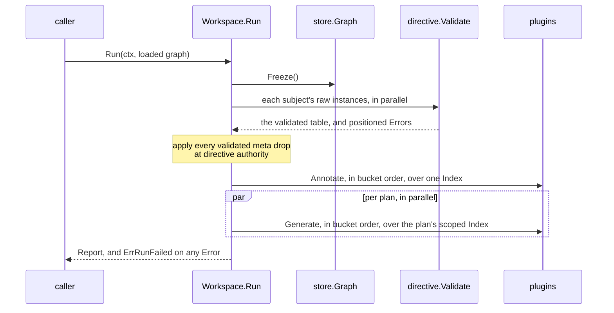

# RFC-0007: The Build ladder and the fixture run

## Summary

This RFC pins `workspace`: the composition that Build validates in
one pass, collecting every fault into one error, and the run frame
that takes a loaded graph through seal, directive validation,
annotate buckets and per-plan generation. Plans are values holding
generators and one backend against a registered target; at this
scope a backend is validated and never invoked, because nothing
renders. Two seams the composition needs are added to the service
provider interface: a key provider, so a plugin's metadata keys
register the way its directive schemas already do, and a minimal
target name with the backend contract that carries it. The
conformance suite gains the options-schema rung, and the
composition's own tests hold Build to the whole bill: a fixture
seeded with five distinct faults reports all five in one error.

## Motivation

Every piece the run needs exists and nothing composes it. The
dispatch surface, the fact store, the directive validator and the
routing index each work alone, and every test in the tree wires
them by hand: freeze here, validate there, build the table, mint
the index, order the calls. That wiring is the code a consumer
would otherwise write, and every copy of it re-decides what nobody
has decided once: which order plugins run in, when directive
validation happens, what a fault at composition looks like.

Three requirements shape the frame:

- **The whole bill at once.** A consumer fixing a composition wants
  every fault in one error, not an instalment plan. That forces
  collect-everything validation: no step may stop at its first
  finding, and every registry must refuse a duplicate by naming
  both claimants rather than failing on the second.
- **Nothing after Build fails on a name.** Capability labels,
  target names, option keys and directive constraints all resolve
  at Build, so no later phase has a name left to fail on.
- **The run is straight-line code.** Seal, validate, annotate,
  generate. The order is the frame's own, decided once, and a
  plugin cannot observe or depend on anything subtler than its
  bucket.

## Detailed design

### Two additions to the service provider interface

Directive schemas already register through a provider. Metadata
keys have no equivalent: registration is a function call answering
typed handles, so a data-only declaration cannot give the plugin
its handles back. The provider therefore takes the registry:

```go
package plugin

// KeyProvider registers the plugin's metadata keys at composition.
// The call runs at Build, once per workspace, and the plugin keeps
// the typed handles it is answered: they are composition
// constants, the same class as a directive schema, not run state.
// Faults are collected, so the error names what failed rather than
// stopping the bill.
type KeyProvider interface {
    Keys(r *meta.Registry) error
}
```

Plans need a target to validate against and a backend to hold one.
The target is a registered name, resolved at Build like every
other:

```go
// Target names a rendering target. It is a registered name: the
// composition declares the targets it recognises, and a plan whose
// backend names anything else is a Build fault.
type Target string

// Backend renders one plan's emit. At this scope the contract is
// carried and validated, never invoked: a plan must hold exactly
// one, and its target must be registered.
type Backend interface {
    Plugin
    Target() Target
}
```

The authoring surface passes the key seam through:

```go
package eidos

// Keys declares the registration the plugin performs at
// composition; the built value answers it through the provider.
func (b *Builder) Keys(register func(r *meta.Registry) error) *Builder
```

### The options contract, checkable alone

The options schema is one tagged struct: exported fields are the
options, the `opt` tag names the config key, the `doc` tag states
the meaning, and the constructed values are the defaults. Two
consumers need the same check at two times, so it lives beside the
provider and both call it:

```go
package plugin

// ValidateOptions holds a plugin's options struct to the tag
// contract: a pointer to a struct, exported fields only, every
// field documented, no duplicate keys. It answers one error per
// finding and nil where the plugin declares no options. The
// composition runs it before populating; the conformance suite
// runs it as a rung.
func ValidateOptions(p Plugin) []error
```

### The composition

```go
package workspace

// Config carries what the composition populates from: option
// values per plugin, keyed by plugin name, then option key. The
// typed struct is the contract a config file maps onto; no file
// format is part of this proposal.
type Config struct {
    Options map[string]map[string]any
}

// New answers an empty builder.
func New() *Builder

// Annotators registers the read side's stamping plugins.
func (b *Builder) Annotators(as ...plugin.Annotator) *Builder

// Plans registers the write sides.
func (b *Builder) Plans(ps ...Plan) *Builder

// Targets declares the target names this composition recognises.
func (b *Builder) Targets(ts ...plugin.Target) *Builder

// Keys registers composition-owned metadata keys, beyond what the
// plugins' own providers register: a consumer's keys, a fixture's.
func (b *Builder) Keys(register ...func(r *meta.Registry) error) *Builder

// Config hands over the values options populate from.
func (b *Builder) Config(c Config) *Builder

// Build climbs the ladder and answers the immutable workspace, or
// one error joining every fault it found.
func (b *Builder) Build() (*Workspace, error)

// Plan is one write side: a value, never a plugin.
type Plan struct {
    Name string
    // Scope filters what the plan's generators see; nil admits
    // everything.
    Scope store.Scope
    // Generators run in bucket order within the plan.
    Generators []plugin.Generator
    // Backend is carried and validated: exactly one per plan, its
    // target registered. Nothing invokes it at this scope.
    Backend plugin.Backend
}
```

### The ladder

Build validates in one pass and collects. Every step runs even when
an earlier one found faults, except where a fault empties a
following check for that one item. The error is `errors.Join` over
everything found, so a consumer reads the whole bill.

1. **The roster.** The plugin universe is the annotators, every
   plan's generators, and every backend, deduplicated by instance:
   one plugin serving two plans registers once. Two distinct
   plugins under one name are a fault naming both, because the
   name is the identity everything downstream keys on. A plugin
   named after a kernel phase is refused the same way, because its
   findings would answer under the kernel's identity.
2. **Registries.** The kernel's four directive schemas register
   first, because validation of the skip and meta instances reads
   them. Then every plugin's `KeyProvider` registers its keys, the
   builder's own `Keys` registrations follow, every
   `DirectiveProvider`'s schemas register, and the directive
   registry seals, resolving constraints. Capability labels
   collect: a label two plugins provide is a fault naming both,
   and a required label nothing provides is a fault naming the
   requirer. Target names collect the same way. The kernel's
   diagnostic codes registered at initialization; a duplicate
   there already panicked before Build ran.
3. **Lowering.** Subscriptions, outputs, priorities and
   capabilities are read from the provider surfaces as data.
   Within each role, plugins sort by priority, then by capability
   topology inside one priority, then by name; a capability cycle
   is a fault naming the members. The result is the bucket
   schedule, and a plugin's bucket number is its position in it:
   the same number the arbitration rank's bucket field carries.
4. **Options.** `ValidateOptions` runs per plugin; the config's
   values populate the struct over its constructed defaults. An
   unknown plugin name in the config, an unknown option key and a
   value of the wrong type are each one fault naming the plugin
   and the field.
5. **Plans.** Every plan is named once, holds at least one
   generator, and holds exactly one backend whose target is
   registered. A duplicate plan name is a fault naming both.
6. **The schedule.** The annotate schedule and each plan's
   generate schedule are fixed: ordered plugin lists with bucket
   numbers. The run executes them as data and decides nothing.

This ladder carries no policy step and no version handshake:
no policy registry and no second versioned component exist to
check against. Adding either is a step in this function, between
the ones that are here.

### The run

```go
// Workspace is the validated, immutable composition. Concurrent
// runs are safe: nothing on it mutates after Build, and every
// mutable structure a run touches is created per call.
type Workspace struct { /* schedules, registries, plans, config */ }

// Run takes one loaded graph through the frame: seal, directive
// validation, annotate buckets, per-plan generation. The caller
// loads packages and attaches raw directives before handing the
// graph over, which is the fixture's seat until a load phase owns
// it; Run seals the graph itself and refuses one already frozen.
//
// Run answers the report and ErrRunFailed when any Error-severity
// finding was reported. Per-item findings never stop the frame: a
// subject whose directives fail validation loses those instances
// and everything else still runs, so one report carries every
// finding the run could reach.
func (w *Workspace) Run(ctx context.Context, g *store.Graph) (*Report, error)

// ErrRunFailed classifies a run that reported errors; the findings
// themselves are in the report's sink.
var ErrRunFailed = errors.New("workspace: the run reported errors")

// Report is what a run leaves behind, for callers and their tests:
// the findings, the arbitrated facts, and each plan's emit store.
type Report struct {
    Sink  *diag.Sink
    Facts *meta.Facts
    // Emits holds each plan's store, keyed by plan name.
    Emits map[string]*plugin.Emit
}
```

The frame, in order:



- **Seal.** `Run` freezes the graph. A graph the caller already
  froze is refused as the defect it is, because attach-after-seal
  faults would then blame the wrong party.
- **Directive validation.** Every attached subject validates
  against the sealed directive registry, in parallel, because
  validation of one subject is independent of every other. A
  subject the graph does not hold reports the dangling-subject
  code. The survivors become the validated table the routing index
  carries, so a rejected instance never gates a rule.
- **Kernel directives.** Every validated meta instance applies its
  drop before any annotator runs: a key drop through the fact
  store's key tombstone, a group name through the group tombstone,
  each at directive authority with the instance's position as the
  claim's. The out and diag instances are carried, not consumed,
  because nothing routes output or filters findings at this scope.
- **Annotate.** One routing index over the whole graph; the
  annotate schedule runs in bucket order, each plugin handed a
  context carrying its own name and bucket. A returned error stops
  the frame and is joined into Run's error; sink findings never
  do.
- **Generate.** Plans run in parallel, each with its own emit
  store, its own scoped index, and its own reader; within a plan,
  generators run in bucket order, which is what an emit-triggered
  rule's visibility is defined against. Plans exchange nothing,
  and a plan's failure does not stop its siblings.

At this scope the run does no loading and no link step, because the
caller hands over a loaded graph with identities already assigned.
It does no layout, render, sink or manifest, because nothing lands
on disk. It does no close, no sweep and no cross-plan checks,
because there are no records to merge. It holds no ledger and no
sealed state, because nothing invalidates. Each of those is an
addition to this frame's straight line, between the phases that are
here.

### Dependency position

The workspace imports the service provider interface and the
stores beneath it: core/plugin, core/store, core/meta,
core/directive, core/diag and the Go stdlib. It never imports the
root package, for the same reason the conformance harness does
not: plugins arrive built, so the composition works at the floor
every authoring layer lowers to.

### The conformance rungs this completes

The suite gains the options rung, and the composition's tests hold
Build to the bill:

```go
package plugintest

// AssertOptionsSchema holds the plugin's options struct to the tag
// contract, through the same check the composition runs, so a
// plugin failing at Build fails in its own tests first.
func AssertOptionsSchema(tb assert.TB, setup Setup)
```

`RunPluginSuite` runs it when the plugin declares options. The
five-fault check is a workspace test rather than a rung, because
its subject is the composition, not a plugin: a fixture composed
with five distinct faults across the ladder's steps asserts that
Build's one error names all five.

## Alternatives considered

### Keys as declared data instead of a provider callback

Every other provider answers data, and a data-only key declaration
was weighed first: `Keys() []meta.KeySpec`. It cannot work, because
registration answers the typed handles the plugin's own handlers
close over, and data cannot answer anything back. Two ways round
that are worse. Resolving handles lazily at first use puts a
registry lookup on the hot path and moves the failure into the
wrong phase. Resolving them into a struct the workspace populates
by reflection makes key identity stringly. The callback runs plugin
code at Build, which is already true of `Build()` itself; the law
about never executing plugin code binds dispatch discovery, not
composition.

### Fail-fast Build

Stopping at the first fault is simpler and was how the earliest
composition frame worked. It turns an N-fault composition into N
build-fix cycles, and it quietly permits registries that refuse
duplicates by failing on the second claimant without naming the
first. Collect-everything costs each step a fault slice and one
`errors.Join`, and it is the reason every registry in the tree
answers errors instead of panicking.

### The run as a state machine

A phase enum with transitions was weighed against straight-line
code. The frame has no branching that a machine would earn: phases
are barriers, the order never varies, and the one conditional
(plans in parallel) is a loop. A machine would add states nobody
can observe. The conductor stays a function.

### Target as a workspace-local type

Keeping `Target` inside `workspace` would spare the SPI a type.
The backend contract then cannot mention it without importing the
workspace, which inverts the dependency: the SPI is the floor and
the workspace composes it. The name lives with the contract that
carries it.

### Validating directives at attach time

Validating each subject as its raws attach would spread validation
across the load and let early Errors report before the graph is
whole. It cannot check subject-wide rules: repeatability and the
requires and conflicts constraints read a subject's full list, and
the full list exists only at the seal. Validation stays a
post-freeze pass, parallel per subject.

## Drawbacks

- Two more provider surfaces on the SPI: `KeyProvider` and
  `Backend`, plus the `Target` name and one builder method on the
  authoring surface. The SPI is now eleven interfaces; each is
  small, but the floor is wider.
- `KeyProvider` executes plugin code at Build. A provider that
  panics takes the composition down rather than landing on the
  bill; wrapping every provider call in a recover would convert
  defects into faults and was deliberately not done, because a
  panicking registration is a broken plugin, not a broken
  composition.
- The run's phases are hand-ordered code, and the ladder is one
  function per step. Nothing enforces that a new phase lands in
  the right place except review and the frame's tests.
- `Config.Options` is `map[string]map[string]any`: typed at the
  field only after population. A config value of a wrong type is
  caught at Build, but nothing catches a misspelled plugin name
  except the unknown-name fault, which cannot suggest the right
  one.
- The five-fault test pins the bill's completeness but not its
  wording; a fault message regression passes it.
- Plans run in parallel over one fact store: reads are lock-free,
  but the report's `Facts` is shared state a test could misuse as
  a write surface after the run. Nothing seals a fact store today.

## Open questions

- Should `Report` carry the validated directive table too? Nothing
  needs it yet; the store's raw walk plus the sink's findings
  cover today's assertions, and adding a field is compatible.
- Is one `KeyProvider` panic worth converting to a fault via
  recover after all, so the bill survives a broken plugin? The
  proposal says no; a defect should look like one.

## Unresolved and future work

- The load and link phases, layout, render, sinks, the manifest,
  close, sweep, cross-plan checks, exports with their topological
  order, the policy step and the version handshake are not
  proposed here; each is an addition between the phases and steps
  that are.
- The parallelism opt-in inside an annotate bucket, and the race
  rung that holds plugins to it, wait on that opt-in existing.
- A config file format mapping onto `Config` is not proposed here.

## References

- [08-workspace-and-plans.md](../architecture/08-workspace-and-plans.md),
  the frame, the ladder and the runtime split this scopes down from
- [06-plugins.md](../architecture/06-plugins.md), the provider
  surfaces and the capability topology
- [13-testing-and-conformance.md](../architecture/13-testing-and-conformance.md),
  the conformance rungs
- [04-metadata.md](../architecture/04-metadata.md), the key
  registration and namespace claims the first step runs
- [05-directives.md](../architecture/05-directives.md), the
  validation the run performs per subject
