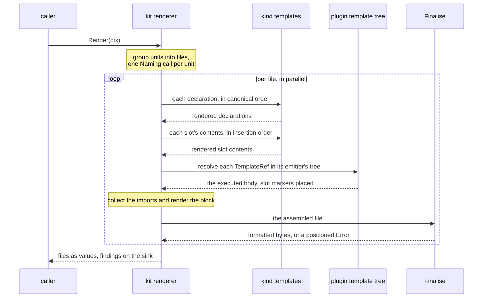

# RFC-0009: The render pass and the backend kit

## Summary

This RFC makes a backend invokable. The service provider interface
gains the render seam: a `Renderer` takes one plan's emit store and
answers files as values, bytes against names, with nothing landing
on disk. The kernel package `render` owns the pass every backend
runs: group units into files, render declarations through the
language's kind templates in canonical order, splice slot
contributions through the same machinery, resolve each template
reference in its emitting plugin's tree, collect imports, and
finalise through the language formatter, continuing past a format
failure. The root package gains `NewBackend`, the kit that builds a
renderer from the handful of things a language genuinely varies in.
Template lint checks every declared template statically, and the
conformance suite gains `backendtest` with the rungs a valueless
render can hold: byte-stable output, every kind rendered, slots
spliced, format failures survived. Headers, trailers and sinks are
the output contract's seams, consumed here and proposed elsewhere.

## Motivation

The emit model now says everything about what to render, bodies
included, and nothing renders it. Three laws have to be settled
before the first language arrives, because retrofitting them means
rewriting every backend that came first:

- **One pass, owned once.** Grouping, splice order, reference
  resolution, the format-failure rule and the merge order are the
  same work in every language. Written per satellite they drift
  apart, and the drift is exactly the kind byte-identity cannot
  tolerate. The kit owns the ritual; the author supplies what the
  language varies in.
- **No plugin renders a stranger's values.** Slot contributions
  render through the backend's kind machinery whichever mode the
  host uses, and a template reference resolves in its emitting
  plugin's tree alone. Both rules need the pass to enforce them,
  because no template can.
- **text/template fails late, so the lint must run early.** The
  engine reports at execute time and checks nothing statically.
  Both weaknesses are handled in the conformance ladder: the lint
  rung parses every declared template against each target's merged
  funcmap before any run exists, and an execute-time error maps to
  a template file and line with the emitting plugin named.

## Detailed design

### The render seam on the service provider interface

A backend is composed and validated where plans are; rendering is
what it does when a caller hands it a plan's emit. The contract
answers values, because what lands on disk, and whether anything
does, belongs to the sink:

```go
package plugin

// RenderedFile is one rendered output as a value: the derived
// filename under its owning package, and the finished bytes.
// Nothing here touches disk; paths, staging and commit belong to
// the sink that consumes it.
type RenderedFile struct {
    // Name is the target-spelled filename the unit's routing key
    // derives: word, tag and cardinality key joined the way the
    // language joins them.
    Name string
    // Pkg is the owning package's identity, zero for a plan file:
    // the namespace half of the file's address, because two
    // packages spell the same filename and stay two files,
    // whatever directory layout places them in.
    Pkg symbol.Identity
    // Body is the finished text: formatted, in the language's own
    // spelling. The output contract stamps and stages it.
    Body []byte
}

// Renderer renders one plan's emit into files as values. A
// problem with one file attaches to the context's sink and the
// pass continues with the remaining files; a returned error is
// fatal to the pass. Two calls over one store answer the same
// bytes, which the conformance suite holds every renderer to.
type Renderer interface {
    Render(ctx *RenderContext) ([]RenderedFile, error)
}

// RenderContext carries what one render call may touch.
type RenderContext struct {
    // Emit is the plan's store, complete: every generator ran and
    // every accumulator flushed before rendering starts.
    Emit *Emit
    // Schedule is the plan's generators in bucket order: what
    // declared template overrides resolve against, carried as
    // data so the pass decides nothing.
    Schedule []ID
    // Trees holds each plugin's declared template tree for this
    // target, keyed by plugin: what a template reference resolves
    // in. The composition reads them off the TemplateProvider
    // surface; a fixture hands them over directly.
    Trees map[ID]fs.FS
    // Funcs holds each plugin's template helpers for this target,
    // and Overrides the shared names each declares it replaces,
    // both read off the same surface. The merge is the pass's:
    // schedule order, latest wins, and a shared name shadowed
    // without a declaration is refused and reported.
    Funcs     map[ID]template.FuncMap
    Overrides map[ID][]string
    // Sink takes the pass's findings: an unresolved reference, a
    // dropped slot marker, a format failure.
    Sink *diag.Sink
    // Plugin is the backend's own identity, the origin its
    // findings carry.
    Plugin ID
}

// TemplateProvider declares a plugin's template trees: the bodies
// its references name, per target, and the helpers those
// templates call. Overrides names the shared vocabulary entries
// the plugin deliberately replaces, which is the replace verb: a
// shared name shadowed without a declaration is a lint finding,
// and where two plugins declare an override of one name, the
// latest schedule position wins, because a plugin that changes
// how a construct renders necessarily runs after what it changes.
type TemplateProvider interface {
    Templates(t Target) (fs.FS, bool)
    TemplateFuncs(t Target) template.FuncMap
    Overrides() []string
}
```

A backend that renders implements `Renderer` beside `Backend`. The
composition keeps validating the backend contract exactly as it
does; nothing at composition invokes rendering, so the seam is
additive and the plan value does not change. The authoring surface
passes the template declaration through the way it passes keys:

```go
package eidos

// Templates declares the plugin's tree for one target; repeatable,
// one tree per target.
func (b *Builder) Templates(t plugin.Target, tree fs.FS) *Builder
```

### What a language is to the kit

Two values carry everything the pass cannot know:

```go
// CommentSyntax is a language's comment forms, declared once per
// satellite and shared by the kits: the frontend strips comments
// with it, and the output contract writes the generated-file
// header through it.
type CommentSyntax struct {
    // Line holds the line-comment openers, first one canonical.
    Line []string
    // Blocks holds the block forms.
    Blocks []CommentBlock
}

// CommentBlock is one block-comment form, gutter included, so a
// doc block's continuation lines strip and render the same way.
type CommentBlock struct {
    Open   string
    Close  string
    Gutter string
}
```

Filename spelling is a language fact the plugin never writes: one
declaration serves `store_stub.go` and `store.stub.ts` alike, so
the join, the case rule and the extension come from the target.
The kit takes it as a function of the unit's routing key, declared
beside the pass that calls it:

```go
package render

// Naming spells a unit's filename for one target: the join and
// extension of the family's word, the tag's treatment, and the
// cardinality key's stem. It is total: every unit the plan admits
// answers a name, and units answering one name assemble one file,
// which is how two plugins share it.
type Naming func(u plugin.Unit) string
```

### The backend kit

The author supplies what the language varies in; the kit owns the
ritual and lowers to the SPI, the same boundary the plugin builder
holds:

```go
// NewBackend starts a backend declaration for one target.
func NewBackend(name plugin.ID, target plugin.Target, syntax plugin.CommentSyntax) *BackendBuilder

// FileTemplate sets the file skeleton; a kit default renders the
// package clause, the import block and the declarations in that
// order. The header is not the skeleton's: the output contract
// prepends it when it stamps, after the formatter ran.
func (b *BackendBuilder) FileTemplate(t string) *BackendBuilder

// KindTemplates declares how the language spells each emit kind,
// keyed by kind. Build refuses an empty set; the conformance
// suite's every-kind rung is what holds a backend to the full
// inventory, because which kinds render standalone and which
// render inside their hosts is the language's own split.
func (b *BackendBuilder) KindTemplates(ts map[symbol.Kind]string) *BackendBuilder

// Scaffold sets the language's statement printer: how each kind
// of the neutral scaffolding vocabulary spells, recording into
// the file's import set whatever it qualifies with. The body
// builtin calls it for slot contributions and scaffold content
// alike.
func (b *BackendBuilder) Scaffold(f func(s emit.Stmt, set *render.ImportSet) ([]byte, error)) *BackendBuilder

// Funcs registers the language's shared template vocabulary, once,
// into the overrideable bucket.
func (b *BackendBuilder) Funcs(fs template.FuncMap) *BackendBuilder

// Naming sets the target's filename spelling.
func (b *BackendBuilder) Naming(n Naming) *BackendBuilder

// Imports sets the renderer for a file's collected import set:
// grouping and sorting are language facts.
func (b *BackendBuilder) Imports(r func(set *render.ImportSet) string) *BackendBuilder

// Finalise sets the language formatter, run last per file. A
// failure is a positioned Error carrying the file, and the pass
// continues with the remaining files; the sink never receives an
// unformatted file.
func (b *BackendBuilder) Finalise(f func(src []byte) ([]byte, error)) *BackendBuilder

// Build freezes the declaration and answers the backend, which
// implements plugin.Backend and plugin.Renderer both. It panics
// on a declaration defect, the same law the plugin builder holds:
// an empty name, a zero target, an empty kind-template set, no naming, a
// template that does not parse.
func (b *BackendBuilder) Build() plugin.Backend
```

### The pass, in order

The kit's renderer runs the same pass for every language. Files
are independent after grouping, so the kit parallelises the
per-file loop; determinism survives because every ordering below
is defined and no file reads another.



1. **Group.** Every unit maps to one file through the target's
   Naming; units sharing a name merge into one file in unit order,
   and a name collision across plans is the output contract's to
   refuse, because only it sees every plan.
2. **Render declarations** through the kind templates, in
   canonical order: origin identity, then the unit's declaration
   order. A kind template exists for every kind by Build's own
   refusal.
3. **Splice slots.** Slot contents render through the same kind
   machinery, in the order they were appended, and the pass adds
   no sort of its own, because a slot item carries no attribution
   to sort by. The ordering law holds by construction: a
   contribution arrives only through a handler the run's bucket
   schedule already sequenced, so insertion order is the lowered
   order, priority, capability topology, then name.
4. **Resolve references.** A body whose form is a template claim
   resolves its name in the emitting plugin's tree for this
   target, never the backend's or a stranger's. The template must
   place the slot markers: a pending contribution into a body
   whose template dropped them is an Error naming the emitting
   plugin and counting what went unplaced, because a slot
   statement carries no attribution to name its contributor by.
5. **Collect imports.** Spelling a type feeds the file's one
   ImportSet as a side effect, and the Imports renderer groups and
   sorts the block the way the language's own formatter leaves it.
   Three constraints meet here: the funcmap registers once,
   templates parse once, and files render in parallel. The pass
   satisfies all three by cloning the parsed templates per worker
   and binding the spelling helpers to a worker-local file, which
   the loop swaps between files. That mechanism is contract, not an
   implementation detail: the clone count is bounded by the
   parallelism rather than the file count, and no two workers share
   a parse tree.
6. **Finalise.** The formatter runs per file. A failure is a
   positioned Error carrying the file it could not format, and the
   pass continues with the remaining files.

The pass ends at bytes. Stamping the header and trailer and
writing through a staged sink are the output contract's steps,
consumed by whoever holds both a renderer and a sink.

### Template lint, the static half

The lint is a kernel function beside the pass, and the conformance
suite is its caller. Every template of every plugin parses against
each declared target's merged funcmap. Three things are findings:
an undefined function, a colliding override, and a body template
without its slot markers.

Field references check wherever the bound type is known, which is
always for kind templates and for the emit-value half of body
templates, and never for a reference's payload. The verbatim form
is the one thing the lint cannot see into at all, which is the cost
verbatim was priced at.

### The conformance rungs this opens

`backendtest` holds a renderer to what a valueless render can
prove, over a hand-built emit fixture:

```go
package backendtest

// Fixture is a hand-built plan as the renderer sees it: the emit
// store, the schedule, and the template trees, helpers and
// override declarations the composition would have handed over.
type Fixture struct {
    Emit      *plugin.Emit
    Schedule  []plugin.ID
    Trees     map[plugin.ID]fs.FS
    Funcs     map[plugin.ID]template.FuncMap
    Overrides map[plugin.ID][]string
}

// Setup builds the backend under test with the emit fixture it
// renders, fresh per call, the way the plugin suite's Setup does.
type Setup func(tb assert.TB) (plugin.Renderer, *Fixture)

// RunBackendSuite holds a renderer to the rungs a render answers
// as values: two runs produce byte-identical files, every emit
// kind renders, slot contents render through the kind machinery,
// and a format failure reports positioned and does not stop the
// remaining files.
func RunBackendSuite(t *testing.T, setup Setup)
```

The header and trailer rungs join the suite with the output
contract, which owns their shape.

## Alternatives considered

### Rendering on the Backend interface

Growing `Backend` with a Render method puts the seam where the plan
already points. It lost because every composed backend would break
at compile time the day the method appears, and because carrying
and invoking are different capabilities: the composition validates
one, a run exercises the other, and two interfaces let a test fake
carry without rendering.

### A template method set instead of a pass

Letting each backend own its loop and giving it helpers was
weighed: it is how most template engines are consumed. It lost
because the loop is where the three laws in Motivation hold, and
the helpers are not. A backend owning the loop can splice a
stranger's values through its own templates, resolve a reference in
the wrong tree, or stop at the first format failure, and nothing
but review would notice.

### Rendering through the walk instead of unit order

Driving the pass off the emit walk would reuse generated
machinery. It lost because a unit already carries its declarations
in canonical order while the walk's order is the tree's, and
because rendering produces files, which are unit-shaped.

### A richer file value

Answering staged files with modes, directories and overwrite
intents was weighed. It lost at this seam: the renderer knows bytes
and names, the sink knows disk, and every field added here is one
the output contract has to validate twice.

## Drawbacks

- Two more SPI values and one interface: `Renderer`,
  `RenderContext`, `RenderedFile`, plus `CommentSyntax` carried
  for the output contract's benefit before anything stamps with
  it.
- The kit is the second builder on the root package, and its
  surface is seven methods. The precedent is the plugin builder;
  the cost is a wider root package either way.
- `Schedule` rides the context as data, so a fixture can hand a
  render pass an order the composition would never produce. The
  suite renders what it is given; only the composed path
  guarantees the order is the lowered one.
- Slot order is unverifiable at render: an item carries no
  attribution, so the pass renders insertion order and trusts the
  run to have sequenced the appends. A hand-built fixture that
  appends out of schedule order renders that order, honestly.
- The service provider interface grows by a fourth surface here,
  `TemplateProvider`, and it drags fs.FS and text/template into
  the SPI's vocabulary: both stdlib, both now contract.
- The lint parses templates it never executes, so a template that
  parses and still misbehaves at execute time, wrong data shape
  above all, reports at render with a file and line rather than at
  lint.
- Per-file parallelism makes render findings arrive in file order
  only after the sink sorts them; the pass itself reports in
  completion order.

## Open questions

- Should the kit's `Imports` and `ImportSet` land in this package
  or beside the lowering seam that feeds them? The set is a per
  file accumulator and the spelling helpers that fill it are the
  lowering's; this proposal keeps the set with the pass and leaves
  the helpers where the seam lands.
- Does `RunBackendSuite` need a rung refusing an undeclared kind
  template, or is Build's panic the whole answer? The proposal
  relies on Build.

## Unresolved and future work

- The builder facade declares template trees and nothing else: a
  plugin whose reference templates need helpers or an override
  declaration implements the provider directly. Widening the
  facade with the two sibling declarations is a follow-up no
  consumer has needed.
- The generated-file header, the provenance trailer, the staged
  sinks and the write path are the output contract's, proposed
  separately and consumed by whoever holds both halves.
- The lowering seam that spells types and feeds the ImportSet, and
  the Go backend built on this kit, are their own proposals.
- Claimed file templates, the per-output presentation path, wait
  on declared outputs meeting layout.

## References

- [07-rendering.md](../architecture/07-rendering.md), the verbs,
  the dispatch ladder, the funcmap and the engine choice
- [11-languages.md](../architecture/11-languages.md), the kit
  surfaces and the comment syntax
- [18-routing-and-layout.md](../architecture/18-routing-and-layout.md),
  filename derivation as a language fact
- [17-output-and-determinism.md](../architecture/17-output-and-determinism.md),
  the header, trailer and sink contracts this pass hands off to
- [13-testing-and-conformance.md](../architecture/13-testing-and-conformance.md),
  the backend rungs and the template lint
