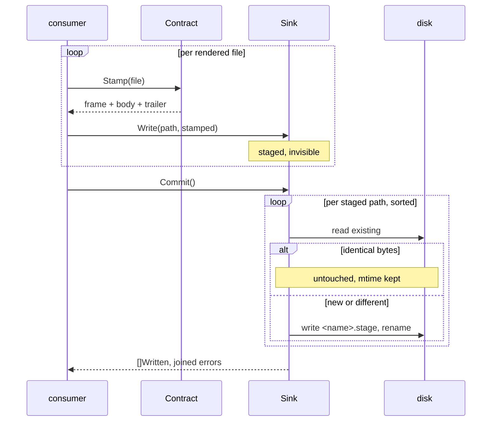

# RFC-0010: The output contract

## Summary

This RFC takes rendered files the last step: from values to disk.
A `Contract` stamps each file with the generated-code marker, the
derivation lines naming the plugins and sources it came from, and
the provenance trailer, all spelled through the target's comment
syntax under a required brand. A `Sink` stages the stamped bytes
and commits them write-if-changed, atomically, inside a jailed
root; discarding a staged sink leaves no trace. Disk, memory and
fan-out sinks ship with the kernel, and the contract stays public
for consumers with somewhere exotic to write.

Nothing here runs inside the composition. A plan carries no sink
and the run invokes no rendering; the consumer is whoever holds a
renderer, a contract and a sink together, which today is a test
and a satellite's own binary.

## Motivation

The render pass ends at bytes in memory, deliberately: two calls
over one store return the same values, and the conformance suite
holds every renderer to that. Three problems remain between those
values and a file a person reviews.

First, the bytes carry no proof of what they are. Review tools,
linters and coverage exclusions need a machine-recognisable
generated-code marker; Go's toolchain looks for a comment line
starting with "// Code generated" and ending with "DO NOT EDIT."
before the package clause, and every ecosystem has its spelling.
Without a marker, generated output reads as hand-written code,
and gets reviewed, linted and edited like it.

Second, nothing says where a file came from. Ownership needs
proof: a generator may only overwrite or delete what it can prove
it produced, and the proof has to be carried in the file itself,
because the manifest that would answer faster is not committed,
and a fresh clone or a CI runner arrives with no state. And a
reviewer needs attribution: the question at the top of a
generated file is which plugins produced it and from what, and
the file is the only record that is reliably present to answer
the question. A trailer carrying the brand and a hash of the body makes
ownership and integrity decidable per file; derivation lines
carrying the plugins and sources make attribution readable where
the reader already is.

Third, writing is where determinism meets the filesystem.
Consumers' build systems key on mtimes, so rewriting an unchanged
file breaks every downstream cache. A reader must never see a
half-written file. A layout bug must produce an error instead of
a file outside the workspace. And a failed or dry run must leave
the previous generation of files exactly in place, which means
writes stage first and commit as a step of their own.

These three are one seam, because they share the file's frame:
the header and trailer decide what the bytes on disk look like,
and the sink decides how they get there.

## Detailed design

### The brand

```go
// Brand names the tool built on the kernel: the name the marker
// attributes generation to and the trailer claims ownership
// under. Lowercase letters, digits and hyphens, nothing else.
//
// There is no default. Two tools built on the kernel and run in
// one repository must never prove ownership of each other's
// files, so every consumer states its own name.
type Brand string

// Valid reports whether b is spelled the way the frame requires:
// one character at least, every one from the set above.
func (b Brand) Valid() bool
```

The kernel ships no brand value. `NewContract` refuses an empty
brand and any character outside the set, so the brand is safe to
embed in a comment line, a frame token and a state-directory
name without escaping.

### The contract

```go
// Contract stamps rendered files for one target: the marker the
// ecosystem recognises as generated code, the derivation lines
// that attribute it, and the trailer that proves ownership and
// integrity, all spelled through the language's comment syntax.
type Contract struct { /* brand, comment spelling */ }

// NewContract composes the stamp for one target. It refuses an
// invalid brand and a syntax carrying neither a line form nor a
// block form, because a language without comments cannot carry
// the frame.
func NewContract(b Brand, s plugin.CommentSyntax) (*Contract, error)

// Brand returns the name this contract stamps under.
func (c *Contract) Brand() Brand

// Stamp returns the finished bytes: the marker line, one
// derivation line per plugin and per source, one blank line, the
// file's body unchanged, and the trailer as the final line. Two
// calls over one file return the same bytes.
//
// It refuses a body that contains a carriage return or does not
// end in a newline, and a plugin or source value containing a
// line break, because each would break the frame; the text
// policy is LF only, and the formatter that produced the body is
// where a violation is fixed.
func (c *Contract) Stamp(f plugin.RenderedFile) ([]byte, error)

// Provenance is the record a stamped file carries.
type Provenance struct {
    // Brand is the name the trailer claims ownership under.
    Brand Brand
    // Plugins and Sources are the derivation lines, in file
    // order.
    Plugins []plugin.ID
    Sources []string
    // Hash is the trailer's claim: "sha256:" and the hex hash of
    // the body.
    Hash string
}

// Read parses the frame of any brand's stamped file: the marker,
// the derivation lines, and the trailer as the final line. It
// returns false where no frame is present. Read checks nothing:
// pairing the record with an integrity check is Verify's job,
// and reading another plugin's record is how adoption tells another
// tool's intact file from a hand-written one.
func Read(stamped []byte) (Provenance, bool)

// Verify reads a stamped file back and holds it whole: the frame
// parses, the trailer carries this contract's brand, the trailer
// is the file's final line, and its hash matches the body. It
// returns the record it verified; anything appended after the
// trailer, another plugin's brand, or a hash mismatch returns an
// error naming what broke.
func (c *Contract) Verify(stamped []byte) (Provenance, error)
```

The stamped file has one frame:

```text
// Code generated by acme. DO NOT EDIT.
// acme:plugin stubgen
// acme:plugin acme-audit
// acme:source svc/store.go

<the renderer's body, byte for byte>
// acme:provenance sha256:9f2c…
```

**The marker** is the first line: `Code generated by <brand>.`
closed with `DO NOT EDIT.`, which is the spelling Go's
`ast.IsGenerated` recognises, served to every line-commented
language through its own opener. A language with only block
comments wraps each frame line in its first block form, one line
each. The marker carries no version, no date, no command line
and nothing else that varies with the invocation, because two
runs over one workspace must produce identical bytes whatever
the phrasing that started them.

**The derivation lines** follow the marker, one entry per line:
every plugin whose units assembled the file, then every source
key the file derives from, each spelled `<brand>:plugin <name>`
or `<brand>:source <path>`. One entry per line, rather than one
delimited list, because paths may contain any delimiter a list
could pick, and because a review diff then shows a derivation
change as one line per entry. The order is fixed and the entries
are sorted, so the lines are as deterministic as the body. A
file that derives from nothing, such as a plan-level file,
carries no source line at all. The grammar is
keyed, and a reader skips keys it does not know, so a record can
grow a key without breaking an older reader.

**The blank line** after the derivation lines is the frame's
boundary. No frame line is blank, so the first blank line
separates frame from body, and `Read` finds the body without
guessing.

**The trailer** is one comment line, `<brand>:provenance
sha256:<hex>`, and it is the file's final bytes. The hash covers
the body: the bytes between the blank line and the trailer line,
which are exactly the bytes the renderer returned. Hashing the
body rather than the whole file keeps the proof attached to what
was generated: renaming the brand, or a derivation change that
leaves the body identical, changes the frame and not the hash,
so a file's integrity record survives its attribution. And
because the trailer is the final line, anything appended after
it fails `Verify`, which closes the append-past-the-marker hole.

The marker says generated, do not edit. The derivation lines say
who made it and from what. The trailer proves whose it is and
that it is intact. Ownership is decidable from the bytes alone:
overwrite and delete only what carries this brand's trailer, and
treat everything else as hand-written.

### The file knows its derivation

The derivation lines need data a rendered file does not carry
today. The service provider value grows two fields:

```go
type RenderedFile struct {
    Name string
    Pkg  symbol.Identity
    // Plugins names the emitters whose units assembled the
    // file: distinct, sorted.
    Plugins []ID
    // Sources names what the file derives from: the distinct
    // routing keys of its units, sorted. A source-keyed unit
    // contributes its source path, a package-keyed unit its
    // package path, and a plan file contributes nothing.
    Sources []string
    Body []byte
}
```

The render pass fills both from the group it already holds. A
file is routinely assembled from more than one source: units
sharing a filename merge, and each distinct key becomes one
source line. The granularity is the routing key, deliberately: a
package-keyed file names its package once, not every member file
of the package, so the frame stays a handful of lines however
large the package grows. The change is additive; a hand-rolled
renderer that sets neither field stamps a frame with no
derivation lines, which is the honest reading of a file that
declares none.

### The sink

```go
// Sink takes stamped files to their destination in two steps:
// stage, then commit. Staging is invisible, so a failed or
// abandoned plan leaves the previous generation of files exactly
// in place, and a dry run is a sink that never commits.
type Sink interface {
    // Write stages one file under a workspace-relative,
    // slash-separated path. It refuses a path that is invalid,
    // escapes the root, ends in the reserved ".stage" suffix or
    // was staged before, and it refuses every call after Commit
    // or Discard.
    Write(path string, body []byte) error
    // Commit makes the staged files real, one atomic rename per
    // file, write-if-changed: identical bytes leave the file and
    // its mtime untouched. It returns one record per staged
    // file, sorted by path, and keeps going past a file that
    // fails, joining the errors.
    Commit() ([]Written, error)
    // Discard drops the staged files without touching the
    // destination. A discarded sink held nothing and leaves
    // nothing.
    Discard() error
}

// Written is one committed file's record.
type Written struct {
    // Path is the staged path, workspace-relative.
    Path string
    // Action returns what the commit did.
    Action Action
    // Hash is "sha256:" and the hex hash of the file's bytes as
    // written: the stamped file, frame included.
    Hash string
}

// Action is what one commit did to one path.
type Action uint8

// String spells the action for a diagnostic or a dry run.
func (a Action) String() string

const (
    // ActionCreated: the path did not exist.
    ActionCreated Action = iota
    // ActionUpdated: the path existed with different bytes.
    ActionUpdated
    // ActionUnchanged: identical bytes; the file and its mtime
    // were not touched.
    ActionUnchanged
)

// ErrFinished reports a sink used after Commit or Discard: a
// sink serves one staging and is not reused.
var ErrFinished = errors.New("output: the sink already committed or discarded")
```

Two hashes exist and they are not the same. The trailer's hash
covers the body and proves generation. `Written.Hash` covers the
whole stamped file and records what reached disk, which is the
value a manifest stores and the shortcut a warm run compares.
Confusing them breaks drift detection, so both are named where
they appear.

Note the sink knows nothing of markers, derivation or rendering:
it takes paths and bytes. The layering means a consumer can sink
anything it stamps, and stamp nothing at all where a target has
no comment form to carry a frame.



### The three sinks

```go
// NewDisk stages for a directory tree. The root is opened once
// and every staged path resolves inside it: the jail is the
// operating system's, through os.Root, so a symlink pointing out
// of the tree does not escape it either. Commit and Discard
// close the root; the sink serves one staging.
func NewDisk(root string) (*Disk, error)

// NewMem stages in memory, for tests and dry runs. Files returns
// the committed files; before Commit it returns nothing, because
// staged means invisible everywhere.
func NewMem() *Mem
func (m *Mem) Files() map[string][]byte

// NewTee stages into several sinks at once. Every call fans out
// and the errors join; Commit returns the first sink's records,
// so the first sink is the one of record.
func NewTee(first Sink, rest ...Sink) *Tee
```

The disk sink stages bytes in memory and touches the tree only
at Commit. Per file, in path order: create the parent
directories, read the existing file, and stop there when the
bytes are identical. Otherwise write to a sibling named
`<name>.stage` and rename it over the target, so a reader sees
the old file or the new one and never a half of either. The
suffix is reserved at Write so a staged file can never collide
with a commit in progress, and a stage file left by a killed
process is stale by definition: the next commit removes and
rewrites it. Path validation runs twice by design: `Write`
refuses invalid and non-local paths immediately, and `os.Root`
enforces the jail again at the filesystem, where symlinks live.

### The conformance check

The backend suite holds renderers to files as values and takes
no brand, so stamping stays out of it. One assertion joins the
two halves, beside the suite rather than inside it:

```go
// AssertStamped renders the fixture, stamps every file through
// the contract, and holds the frame: every stamp is accepted,
// the marker is the first line, the trailer is the final line,
// and Verify returns the derivation the file declared.
func AssertStamped(tb assert.TB, setup Setup, c *output.Contract)
```

A satellite runs it beside `RunBackendSuite` with its own brand
and syntax, which is exactly the pair its binary ships.

### What this proposal does not do

The composition does not change: a plan carries no sink, nothing
at composition validates one, and the run invokes no rendering.
The plan's name is not in the frame for the same reason: which
plan produced a file is a composition fact the stamp never sees,
and the record that carries it is the manifest's. There is no
manifest, no drift comparison, no adoption, no overwrite
refusal, no workspace lock and no prune; every one of those
consumes the records this proposal defines, and none of them is
needed to hold the stamp and the sinks to their rules. Deriving a
path from a file's package and name belongs to layout, which is
its own seam; every consumer here hands the sink a finished
workspace-relative path.

## Alternatives considered

### Ownership by manifest only, no trailer

A manifest keyed by path already records the hash, plugins and
sources. It lost because the manifest is not committed: a fresh
clone, a CI runner and a colleague's machine all arrive with no
state, and the ownership and attribution questions have to be
answerable there. The proof is in the file, or it is nowhere.

### Ownership by VCS attributes

`.gitattributes` with `linguist-generated` hides files from
review and is already ecosystem practice. It lost because it is
display metadata for one forge: it proves nothing about which
tool produced the file, detects no drift, and says nothing on a
filesystem outside the repository.

### Derivation as one clause on the marker line

`Code generated by acme from svc/store.go. DO NOT EDIT.` keeps
the frame to one line. It lost twice over: a delimited list is
ambiguous because paths may contain any delimiter a list could
pick, and a file deriving from several sources and plugins makes
the one line unreadable exactly where a reviewer looks first.
One keyed line per entry has no delimiter, diffs one line per
change, and leaves the marker line identical for every file.

### Derivation in the trailer block

Putting the plugin and source lines at the end keeps the top of
the file to one line. It lost because attribution is for the
reader, and readers meet a file at the top; the trailer's own
rule also stays simpler when it is a single final line, because
"anything after the trailer is drift" needs no block parsing.

### The hash in the marker line

One frame line instead of two. It lost because a leading hash
leaves the end of the file unguarded: bytes appended after the
generated block still verify, and appended code is exactly the
hand edit most likely to happen. The trailer is the final line
by rule, so the append case fails verification.

### Hashing the whole stamped file

Hashing everything before the trailer is coherent and simpler to
frame. It lost because the proof should attest what was
generated, not how it was labelled: with a body hash, renaming
the brand or a derivation change that leaves the body identical
changes no file's integrity record, and two tools can agree a
body is intact while disagreeing about everything else. The
whole-file hash exists too, in `Written`, where recording what
reached disk is the point.

### A write-through sink

Writing on `Write` and skipping the staging step drops a whole
state machine. It lost because staging is what makes three
promises structural: a failed plan leaves the previous
generation in place, a dry run is a sink that never commits, and
plans cannot observe each other's half-written output. A
write-through sink keeps those promises only if every caller
remembers to.

### Jailing by path arithmetic

`filepath.Clean` plus a prefix check refuses `../` escapes
without opening the root. It lost because path arithmetic cannot
see symlinks: a staged path that resolves through a link out of
the tree passes every string check and still escapes. `os.Root`
holds the jail at the operating system, and the string check
stays as the fast first refusal.

### A default brand

`eidos` as the fallback brand would let small consumers skip a
parameter. It lost because ownership is brand-keyed: two
kernel-built tools sharing one repository under one default
brand would each prove ownership of the other's files, and the
overwrite refusal that drift detection depends on would refuse
nothing between them. A required parameter makes the collision
impossible at the API instead of documented against.

## Drawbacks

- The service provider value grows two fields, `Plugins` and
  `Sources`, filled by the render pass. Suites and fixtures
  comparing whole values see them; renderers that set neither
  lose only the derivation lines.
- The derivation lines sit outside the body hash. A hand edit to
  a plugin or source line passes `Verify` and is only corrected on
  the next run, when the regenerated frame differs and
  write-if-changed rewrites the file. Pulling them under the
  hash would make integrity depend on attribution, which is the
  property the body hash exists to avoid.
- Two hash vocabularies per file, body and stamped, are one
  confusion waiting to happen. Both docblocks name the other;
  the cost stands.
- The frame grows with the derivation: a file assembled by four
  plugins from three keys opens with eight comment lines. The
  entries are routing keys, not member files, which bounds it.
- One filename suffix, ".stage", is reserved workspace-wide: a
  naming that returns it is refused at Write.
- Staging holds a plan's whole output in memory until Commit. At
  the bench scale of two hundred thousand declarations that is
  about forty megabytes of rendered bytes, held once.
- The frame rule rests on the first blank line. A language whose
  comment opener cannot precede a blank line, or a body that
  must begin before any blank line, has no room in this frame;
  no known target does either.
- A `Contract` is per target and per brand: one marker spelling,
  one trailer spelling. A target needing per-file markers needs
  two contracts and a caller that picks.
- `NewTee` reports the first sink's records only. A consumer
  that needs every sink's actions reads them from its own sinks
  directly.
- `os.Root` pins the disk sink to the platform's confinement
  semantics; where the OS lacks a beneath-resolution primitive,
  Go emulates it with a per-component walk, which costs a
  commit a few extra opens per directory level.

## Open questions

- Is the brand charset too tight? Lowercase, digits and hyphens
  covers `acme` and `acme-gen`; a reverse-DNS consumer wanting
  `io.acme.gen` needs dots admitted, and dots are safe in every
  place the brand arrives.
- Does the frame need an explicit version key, or is the keyed
  grammar with readers skipping unknown keys enough? A version
  line is one more byte of ceremony on every file; its absence
  bets that keys are only ever added.

## Unresolved and future work

- The manifest, drift refusal, adoption and the workspace lock
  consume these records and are proposed separately.
- Wiring a sink role into the plan and a render step into the
  run is the composition's own change, proposed with it; the
  plan's name joins the manifest's record there, not the frame.
- Path derivation from a file's package and name is the layout
  seam's, proposed with layout.

## References

- [17-output-and-determinism.md](../architecture/17-output-and-determinism.md):
  the owning architecture document; the sink contract, header,
  trailer and manifest rules this design implements.
- [08-workspace-and-plans.md](../architecture/08-workspace-and-plans.md):
  plans as the write side that stages and commits together.
- [RFC-0009](0009-render-pass-and-backend-kit.md): the render
  pass that returns files as values and the comment syntax the
  backend carries.
- [Go generated-code convention](https://golang.org/s/generatedcode)
  and `ast.IsGenerated`, checked at go1.27.0: the marker line's
  prefix and suffix.
- `os.Root`, checked at go1.27.0: `OpenRoot`, `Create`,
  `OpenFile`, `MkdirAll`, `ReadFile`, `Rename`, `Remove`, `Stat`.
