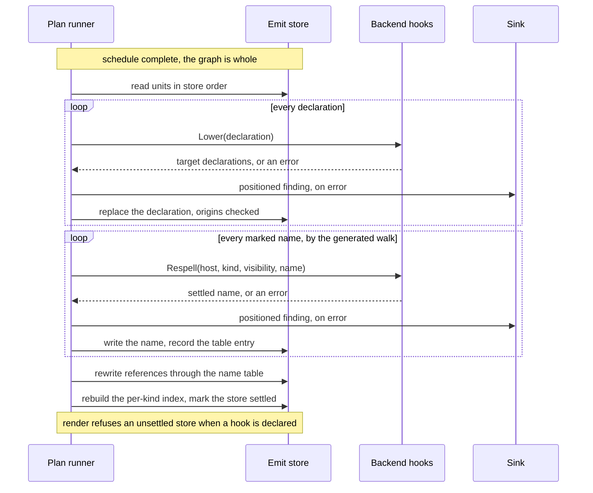

# RFC-0011: Neutral emit and the target lowering seams

## Summary

One generator writes one emit graph per plan; the plan's backend
makes it idiomatic. Language specificity enters that sentence at
four layers: which declaration shapes state a fact, which case a
name takes, which declarations render where, and which keywords
spell each fact. The render pass already owns the last two, through
Split, Cluster and the kind templates. This RFC gives the first two
their owners.

The lower seam turns a neutral construct into the target's own
declaration shape: a Sum becomes a sealed interface and its
permitted records in a Java plan, an Enum becomes a defined type
and a constant group in a Go plan. The respell seam turns a neutral
name into the target's convention, and carries the visibility that
Go folds into a name's first rune. Both hooks are backend-supplied
and run in the settle, the stage between a plan's schedule and its
render. Both stand under one contract: deterministic, positioned
refusals for what no idiom covers, provenance held by the kernel
rather than promised by the backend.

The kernel learns no language from any of it. It owns the
traversal, the invocation points, the enforced properties and the
findings. Every hook signature speaks the model's vocabulary; every
function behind a hook lives in a satellite; the template trees
stay the one place a plugin writes target text on purpose.

## Motivation

Three pressures meet between the emit store and the render pass.

- **An idiom stated once per target, not once per generator.** Emit
  stores are per plan, so a generator can read its plan's target
  and shape declarations for it: sealed interfaces for Java, error
  returns for Go, camel case throughout. Every generator then
  repeats every target's dialect, and two generators disagree on
  one target's idiom. Construct shapes and case conventions are
  knowledge about the target. The backend already owns every other
  target spelling: filenames through its naming hook, statements
  through its scaffold, imports through its import renderer.
  Declarations and their names are the remaining spellings owned by
  the wrong side.
- **Some facts have no token spelling in some targets.** Java
  spells a declared failure as a `throws` clause, one token in a
  template. Go spells the same fact as an extra return value, which
  no template can add. The model normalizes visibility as data, and
  Go's only spelling for it is the case of the name itself, which
  no template can change. A Sum is one declaration in the model and
  several in a Java file. For each of these, the backend today has
  one honest answer, a positioned refusal, and a refusal serves
  nobody when an idiom exists: a Java plan that refuses every Sum
  is honest and useless.
- **The suite cannot pin conventions that nothing owns.** The
  conformance suite proves properties as bytes. While generators
  case their own names and shape their own constructs, idiomatic
  output is a property of each fixture rather than of the backend,
  and no test holds `fetch_row` in Rust against `fetchRow` in
  TypeScript from one source of truth.

Four backends exist and each new one repeats the choice, so the
rule is settled now, the way the render pass settled grouping and
splice order before the satellites multiplied.

## Detailed design

### The four layers

Language specificity separates into four questions, listed in the
order the write side answers them:

| Layer | Question | Owner |
|---|---|---|
| Constructs | Which declaration shapes state this fact? | The lower seam, this proposal |
| Names | Which case does a name take, and does visibility fold into it? | The respell seam, this proposal |
| Grouping | Which declarations render where, and together? | Split and Cluster, in the render pass |
| Tokens | Which keywords and marks spell each fact? | The kind templates and the vocabulary |

Grouping changes no declaration: Cluster gathers methods under one
impl block and Split fans a unit into files, and every declaration
survives both unchanged. Tokens change no declaration either. The
first two layers are where declarations themselves must change, and
they are the layers this proposal owns.

### Every fact takes a layer

This table places every fact the emit model carries, so a claim
about a target is checked against a cell rather than against the
framework. Six cell words cover the placements. `tokens`: a template or vocabulary helper spells the
fact. `respell`: the name carries it. `lower`: the backend reshapes
declarations for it. `group`: Split or Cluster place it. `holds`:
the target's semantics state the fact already, and the spelling is
empty. `refuse`: the target declares no idiom, and the render
reports a positioned finding rather than narrowing the output.

| Fact | Go | TypeScript | Java | Rust |
|---|---|---|---|---|
| Visibility | respell | tokens | tokens | tokens |
| Level | refuse | tokens | tokens | tokens |
| Mutability | refuse | tokens | tokens | refuse |
| Abstract | refuse | tokens | tokens | refuse |
| Final | holds | refuse | tokens | holds |
| Override | refuse | tokens | tokens | refuse |
| HasDefault | refuse | refuse | tokens | tokens |
| Async | refuse | tokens | refuse | tokens |
| Throws | lower | refuse | tokens | lower |
| Annotations | refuse | tokens | tokens | tokens |
| Type parameters, bounds, variance, defaults, const | tokens | tokens | tokens | tokens |
| Initializers | tokens; fields refuse | tokens | tokens | refuse |
| Field tags | tokens | refuse | refuse | refuse |
| Interface properties | refuse | tokens | refuse | refuse |
| Docs, comments, variadic parameters | tokens | tokens | tokens | tokens |
| Several returns | tokens | tokens | refuse | tokens |
| Supertypes | tokens; implements holds | tokens | tokens | tokens; structs refuse |
| Method attachment | tokens | tokens | tokens | group |
| Enum | lower | tokens | tokens | tokens |
| Sum | refuse | lower | lower | tokens |
| Nested types | refuse | refuse | tokens | refuse |
| Associated types | refuse | refuse | refuse | tokens |
| Parameter defaults | refuse | tokens | refuse | refuse |

Three properties of the distribution carry the argument. Most
cells are tokens: the template layer that exists today spells most
of the surface, and the per-target refusals inside it, variance
outside TypeScript among them, already run through the vocabulary
helpers. The respell seam carries exactly one fact, and it is the
one no template can reach. The lower seam carries five cells, Go's
Throws and Enum, Rust's Throws, and the Sum in TypeScript and
Java, each a construct with a real idiom and no single-declaration
spelling. Every refuse cell names a semantic gap in the target
rather than a missing feature in eidos: Go declares no
annotations, Java declares one return.

A refuse cell is not fixed for all time. It records that the
satellite declares no idiom today; a satellite that declares one
moves the fact to the lower seam, and the change is a satellite
change with its own pinned bytes, never a kernel one.

Each backend declares this coverage as data: the facts it renders,
holds and refuses. The suite asserts rendered output against the
declaration, and the guard that reports an unspelt fact reads the
same data, so the table above is the human view of a tested
artifact rather than a promise the satellites drift away from.

### The neutral emit contract

A generator emits the model's shapes, not a target's:

- **Constructs** are the model's kinds. A generator emits a Sum
  with its variants and never a sealed interface with records; it
  emits Throws as data and never an error return.
- **Names** take one boundary-detectable convention, lower camel
  recommended, and never a target's case. The naming package
  recovers word boundaries and initialisms from it, so `httpRow`
  reaches Pascal as `HTTPRow` and snake as `http_row`.
- **Bodies** prefer the scaffolding vocabulary, whose statements
  are data. A verbatim body declares itself target text and gives
  up every neutrality the vocabulary would have kept.

Three spellings stay the generator's, and they are the declared
limits of neutrality:

- **Composite type spellings.** The model carries no array, map or
  pointer structure by design. A reference spelled `[]store.Row` or
  `Vec<Row>` is target dialect the moment it is written, and the
  settle leaves it as it stands.
- **Builtin type dialect.** Whether a neutral `string` spells
  `String`, or an integer spells `i64`, is a representation choice.
  A width is meaning rather than form, and it belongs to the
  generator, where the domain fixes it.
- **Qualified references.** A reference across packages either
  spells its qualifier, `store.Row` or `pkg::Name`, which is
  dialect, or resolves bare through its target identity, and no
  backend qualifies a bare resolved reference at render.
  Qualification is backend knowledge in the import renderer's
  family, recorded under future work; a neutral generator reaches
  single-package plans today.

The alternative to these limits is a composite-type vocabulary in
the model, a second type system, and the model chose spelling
strings plus resolved identities instead. This proposal keeps that
choice.

### Template trees stay target text

A plugin's template trees are declared per target, and that is the
contract that keeps them out of both seams. An author writing the
Rust tree writes Rust: the text may call a declared function, and
the author spells it `fetch_row()` there, because that tree renders
into exactly one target. Neither seam reads template text, the same
way neither reads a verbatim body. The structured model is the
neutral surface; the trees are the declared way out of it.

The backend's own kind templates need no change for either seam.
They run after the settle, so `{{.Name}}` reads the settled
spelling of a settled declaration.

### The lower seam

The kernel defines one function type and one provider interface:

```go
// Lower rewrites one declaration into the target's own
// construct shape: the same fact, the target's declarations.
// Every returned declaration carries the input's origin. An
// error is the target refusing the construct; the settle
// reports it and the declaration is withheld from render.
type Lower func(symbol.Symbol) ([]symbol.Symbol, error)

// Lowerer is the provider a backend implements when its target
// reshapes constructs. A backend without it renders
// declarations as emitted.
type Lowerer interface {
    Lower(symbol.Symbol) ([]symbol.Symbol, error)
}
```

The seam is declaration-local: one declaration in, its target
shapes out, and no reads beyond the input. Locality costs less than
it appears to, because the model nests the parts a construct needs.
A Sum carries its variants, so a sealed interface plus its
permitted records comes out of one input. A lowering runs once per
declaration; its outputs do not re-enter the seam.

Five rules make the seam safe to own:

- **Provenance is enforced, not promised.** The kernel checks that
  every output carries the input's origin, so manifests and drift
  trace every rendered file to its source symbol through any
  construct change. A unit's routing key and its collected origins
  survive lowering for the same reason.
- **The principal output keeps the source name.** A Sum named
  `shape` lowers to a principal declaration still named `shape`,
  plus companions whose names the idiom derives, in the neutral
  form. References to `shape` keep resolving, and the respell seam
  spells every name once, afterwards. Companions render at the
  input's position, in the order the lowering returns them.
- **A lowering consumes the fact it lowers.** The output states
  the fact in the target's shape and no longer in the model's:
  the idiom that appends an error return clears Throws in the
  same step. A second settle then changes nothing, and the
  coverage guard never meets a fact the backend already lowered.
- **Outputs stay inside the spellable inventory.** A lowering
  produces kinds the backend's templates spell, and the suite holds
  that closure. Lowering an unspellable kind into further
  unspellable kinds is a composition defect, caught before any plan
  runs.
- **Structured bodies may change; verbatim bodies refuse.** An
  idiom that rewrites a signature can rewrite the statements that
  depend on it, because the scaffolding vocabulary is data: an
  idiom appending an error return appends the return statement's
  value in the same step. A verbatim body the idiom would have to
  change makes the lowering refuse instead, because verbatim is
  text the backend must not edit.
- **One idiom per construct, declared and pinned.** The backend's
  lowering is its documented answer, byte-pinned in its template
  tests like every other spelling. A generator that wants a
  different idiom emits the lowered shape itself, and the hook
  returns those declarations unchanged.
  Where no defensible idiom exists, the answer stays a refusal,
  never a guess: a Go plan refuses a Sum rather than inventing a
  tagged union convention.

Which constructs lower where is each satellite's decision, pinned
at adoption. The five lower cells in the placement table name the
work: a Java Sum as a sealed interface plus permitted records, a
TypeScript Sum as an alias over its variant declarations, a Go
Enum as a defined type plus a constant group, a Go Throws as an
appended error return, a Rust Throws as a Result return.

### The respell seam

The kernel defines one function type and one provider interface:

```go
// Respell spells one declared name in the target's own
// convention. Host is the kind of the declaration a member
// sits in, zero at file level; a kind without visibility
// passes the zero value. An error means the target cannot
// spell the name at that visibility; the settle reports it
// and the declaration is withheld from render.
type Respell func(
    host, kind symbol.Kind, v symbol.Visibility, name string,
) (string, error)

// Respeller is the provider a backend implements when its
// target respells declared names. A backend without it renders
// names as emitted.
type Respeller interface {
    Respell(host, kind symbol.Kind, v symbol.Visibility, name string) (string, error)
}
```

The signature speaks `symbol.Kind` and `symbol.Visibility`, the
model's normalized enums, and nothing else. That curation is a
model-level claim: identifier conventions key on what kind of
thing is named, on who may see it, and on the kind of declaration
holding it. Types take one case, members another, constants a
third, and Go folds access into the first rune. Java alone already
requires the host: a field inside an interface is a constant and
takes screaming snake case, the same field inside a class takes
camel, and Kotlin's companion members repeat the pattern. No
surveyed convention keys on a fourth fact. The claim stays
falsifiable the way every normalization in the model is, and a
language that breaks it grows the schema through a design change,
never through a parameter added for one target.

Parameters and type parameters pass their own kinds, `KindParam`
and `KindTypeParam`, with zero visibility. Identity is the expected
answer for type parameters, whose single-capital convention is near
universal.

A satellite implements the hook in its spell package beside its
filename spelling, over the naming package's `Caser`, with the
backend's own initialism set. The Go hook is where visibility
becomes case: public spells Pascal, package spells camel, and the
scopes Go cannot express return errors. Withholding a declaration
whose visibility cannot spell is the honest degradation, because
rendering a private declaration under a public spelling misstates
access.

### The settle

The settle runs once per plan, after the schedule's final phase and
before the render pass, and applies the two seams in order: lower,
then respell.

The position is forced by slots. A member contributed by a later
plugin arrives after its host flushed, so a hook applied at flush
time misses late members. The settle is the first point at which
the plan's graph is whole, and the last point before anything reads
it. The order inside the settle is forced too: lowerings synthesize
companion names in the neutral form, and running respell second
spells every name, emitted and synthesized alike, exactly once.



The settle mutates the store in place. After the schedule the graph
is the plan's: a plugin holds no right to values it flushed, a rule
that exists implicitly today and becomes load-bearing here. The
settled store is the one store every consumer reads. The render
pass, the manifest and drift detection see the same declarations
under the same names, so nothing downstream joins across two
spellings of one fact.

The settle also maintains what the store derives: the per-kind
index rebuilds over the lowered population, so a reader after the
settle never meets a kind a lowering replaced. When it finishes,
the settle marks the store settled, and a renderer whose backend
declares either hook refuses an unsettled store. A hand-wired
composition that skips the settle fails at the first render
instead of writing the wrong bytes without a finding.

The traversal is generated rather than hand-written. The schema
marks name fields with a tag option, the model generator emits the
walk over them the way it emits the member walk today, and the
mirror guard holds schema and traversal together. The kernel
enumerates no field list of its own; the model declares its own
name surface.

Determinism holds by construction. Both hooks are pure, the walk
runs in store order, and the same store settles the same way on
every run, so byte identity survives both seams untouched. A
backend that composes neither hook skips the settle entirely.

### Reference following

The respell walk builds the plan's name table as it goes: emitted
name to settled name per scope, and origin identity to settled
name. References rewrite in three classes, by precision:

- **Resolved references.** A type reference whose target carries a
  node identity follows the declaration whose origin matches it.
  Origins themselves never change: identity is the durable join
  that manifests and drift key on, and the settle renames the
  declaration, never its derivation.
- **Bare-name references.** A reference whose spelling exactly
  equals a name declared in the same package follows the table.
  Its arguments are references of their own and rewrite
  independently, under the instantiation contract that a reference
  carrying arguments holds the bare name in its spelling. Matching
  never crosses packages: a bare name from another package is
  unresolvable by design, because its spellable form is qualified
  and qualification is one of the contract's limits. Two
  declarations sharing an emitted name in one package whose
  settled names diverge make a reference ambiguous; the settle
  reports it, positioned, and the reference stands as written.
- **Structured body references.** Statement names and expression
  names follow the same table, locals first, parameters and
  declaring assignments, then the declaring package. A verbatim
  body stands as written, and its callable's parameter names stand
  with it: a signature respelled away from the text that reads it
  would break the body, so the settle keeps both as emitted and
  reports a positioned finding where a parameter would have
  respelled differently. Template text stands for the reason
  above.

Composite spellings stand, as the contract states. When matching
misses, the reference keeps the generator's bytes unchanged, so the
heuristic degrades to no help and never to corruption.

### Collisions and refusals

Respelling can merge names that were distinct. Go folds visibility
into the first rune, so an emitted `fetchRow` and an emitted
`FetchRow` both settle to `FetchRow` at public visibility. The
settle detects collisions per scope, the package for file-level
declarations and the host for members, reports one positioned
finding naming both declarations, and leaves the pair as emitted.
References to either follow the emitted names, so the store stays
consistent while the finding says what to fix.

A hook error is the target refusing a construct or a name. The
settle reports the finding at the declaration's position and
withholds the declaration from render, the same degradation the
render pass applies to a kind without a template. Both findings
take codes in the render pass's numbering.

### What each seam may change

The lower seam takes declarations and returns declarations. It may
reshape a construct, derive companion declarations and rewrite
structured bodies. It never touches origins, routing keys or unit
provenance, never reads outside its input, and never emits a kind
outside the spellable inventory. The kernel checks origins and the
suite checks the inventory closure.

The respell seam changes name fields and reference spellings, and
nothing else. The suite holds every settled store to walk equality
with its emitted store modulo the marked name fields, so a hook
that changes structure fails the suite rather than shipping.

The render pass keeps its own rule: it never restructures. Grouping
remains a view over settled declarations. Structural change happens
in the settle, declared by the backend and provenance-checked by
the kernel, or it does not happen at all. The rule that the render
side is not a transformer survives this proposal because the settle
is not part of the render; it is the step that ends emission.

### The kit and the conformance suite

The backend kit gains two methods, `.Lower(fn)` and `.Respell(fn)`,
wiring the hooks into the composed backend's provider surface.
Composing neither costs nothing: the settle skips what a backend
does not declare.

The conformance suite grows with the settle:

- The canonical fixture's names go neutral, lower camel, and each
  satellite's suite output proves its conventions and idioms as
  bytes: one fixture renders `FetchRow` into Go, `fetchRow` into
  TypeScript and Java, `fetch_row` into Rust.
- A provenance check holds every lowered declaration to its
  input's origin, and an inventory check holds every lowered kind
  to the backend's templates.
- A structure check holds every respelt store to walk equality
  with its emitted store modulo names.
- A second settle over a settled store changes nothing, which
  pins determinism and the rule that a lowering consumes its
  fact in one assertion.
- The settle takes its own pinned allocation budget beside the
  render's. A render benchmark loops over a store settled once,
  so the settle's cost stays visible only under its own
  measurement.

### The kernel stays neutral by construction

Four guarantees, and none of them is a convention:

- **Dependency direction.** No code in the kernel converts case or
  shapes a construct. The conversion machinery lives in the lang
  family's naming package, and every convention and idiom lives in
  a satellite's spell and backend packages. The build holds the
  direction: the kernel imports none of them.
- **Model-typed signatures.** Every seam passes model facts, whole
  declarations or the model's enums, and never a parameter shaped
  around one target's question. A parameter added for one language
  is the failure mode this rule names and refuses; the schema
  grows by normalization or not at all.
- **Generated traversal.** The schema declares which fields are
  names and which members walk. The kernel hand-lists neither, so
  a model change updates every seam mechanically and the mirror
  guard catches the drift.
- **Asserted, not promised.** Determinism, provenance, inventory
  closure and structure preservation are suite assertions that run
  against every backend, in-tree and out.

## Alternatives considered

- **Generator-side lowering and casing libraries.** Every generator
  repeats every target, and two generators disagree on one
  target's idiom. Conventions and idioms are backend knowledge; the
  filename hook set the precedent. Rejected.
- **Both seams inside the render pass, as Language fields.** The
  pass either mutates declarations shared with the store on every
  render or clones the graph per render, a real cost at corpus
  scale. Worse, the manifest would record emitted names while files
  carry settled ones, splitting the record a consumer joins on.
  Rejected.
- **One general transform hook, `func(Unit) Unit`.** A unit cannot
  see the declarations other units reference, so cross-unit renames
  break. A hook that may rewrite anything makes structure
  preservation a matter of backend discipline; two narrow seams
  make it a matter of construction. Rejected.
- **Conventions as data, a kind-to-style table.** Inspectable, and
  unable to state visibility folding; a table plus an escape
  function is two mechanisms where one suffices. Rejected.
- **A composite-type vocabulary, so references never carry
  dialect.** A second type system inside the emit model, with every
  language's container types normalized into it. The model's
  spelling strings plus resolved identities exist to refuse that
  growth. Out of scope, recorded as the boundary this design
  accepts.
- **Templates that lower.** A kind template renders one declaration
  into text. It cannot emit three declarations, cannot rewrite a
  signature, and cannot rename anything, which is what the
  constructs and names layers need. Tokens stay the templates' one
  layer.
- **Settle into a copied store.** One copy per plan, taken at the
  settle, keeps the emitted store as the structure check's
  comparand and deletes the rule that a plugin holds no right to
  flushed values. Peak memory decides it: two whole stores at
  corpus scale, against a suite that takes its comparand from two
  isolated fixture builds anyway. Among the rejections this is
  the closest call.

## Drawbacks

- The in-place mutation after the schedule turns an implicit rule
  into a load-bearing one: a plugin holds no right to values it
  flushed. The contract is stated here and enforced by review
  rather than by the type system.
- Bare-name matching is exact-string. A generator that emits
  composite spellings gets exactly the neutrality it emitted.
- The write side gains a stage with two seams. The opt-out keeps it
  free for backends that render declarations as emitted, but every
  backend author learns two more hooks.
- A backend's lowering is one idiom. A generator that disagrees
  pre-lowers and forgoes the seam for that construct, which is a
  real cost paid for one documented answer per target.
- The fixture's move to neutral names re-pins byte twins across the
  satellites once. The churn is the proof: the pins afterwards
  state each target's convention explicitly.

## Open questions

- Case-insensitive identifier targets: PHP compares function names
  without case. Whether bare-name matching folds case for such a
  target is a question the hook alone cannot answer; it may need a
  matching rule beside the hook when such a backend arrives.
- Whether the walk offers type parameter names to the hook at all,
  against skipping `KindTypeParam` and keeping single capitals
  universal.
- The initialism set is the backend's default today. Whether a plan
  states domain acronyms of its own, through composition options,
  and how two sources of initialisms merge.
- The placement table puts the Go enum at the lower seam, and
  Cluster can express the same constant group as a view, the way
  Rust's impl blocks group. Whether a construct both layers can
  express picks its layer per adoption or under a general rule
  stays open.

## Unresolved and future work

- Keyword visibility, member modifiers, asynchrony markers and
  annotations spell at the tokens layer, in templates per target;
  this proposal carries only what templates cannot spell.
- A satellite adopting either hook holds it beside its filename
  spelling, and the satellite anatomy documents record that
  placement as part of adoption.
- Qualifying a bare resolved reference at render is backend
  knowledge in the import renderer's family. No seam owns it; the
  contract records qualified spellings as the generator's, and a
  qualification seam beside the import renderer is the named
  candidate. Builtin type dialect stays the generator's with it,
  so the remaining unneutral spellings are these two, stated
  rather than discovered.

## References

- [RFC-0001: The symbol schema and its contract](0001-symbol-model-contract.md)
- [RFC-0002: The model generator](0002-model-generator.md)
- [RFC-0008: The emit body and the scaffolding vocabulary](0008-emit-body-content.md)
- [RFC-0009: The render pass and the backend kit](0009-render-pass-and-backend-kit.md)
- [RFC-0010: The output contract](0010-output-contract.md)
