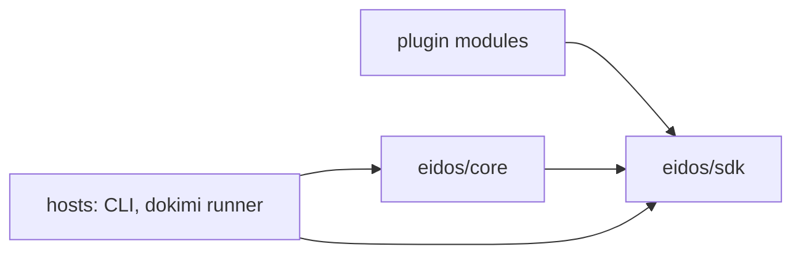

# RFC-0012: The SDK contract module

## Summary

One module, `go.dokimi.dev/eidos/sdk`, carries everything a
plugin's code compiles against: the generated models, the shared
vocabulary, the plugin and render contracts, and the authoring
surface. The kernel's engine imports it and runs what plugins
declare; a plugin module requires the SDK and nothing else. The
dependency arrow, visible in every plugin's `go.mod`, becomes the
compatibility promise: the engine iterates behind it, and the
contract holds still in front of it.

## Motivation

A backend satellite today imports six kernel packages: the root
kit, `plugin`, `render`, `symbol`, `emit`, and its tests add
`backendtest` and `output`. Nothing marks which of those exports
are the supported plugin surface and which are engine internals a
plugin happens to be able to reach. The supported surface is
implicit — it is whatever the kernel exports — and an implicit
surface drifts the way implicit fact coverage drifted before
RFC-0011 made it data: silently, one reach-around import at a
time, each one hardening an internal into a contract nobody
declared.

The cost arrives with the near roadmap. The dokimi project is about
to author generators and annotators against this kernel, which
multiplies plugin modules and their import lists. Every week
before the boundary exists adds imports that a later boundary has
to migrate; every week after it exists, a new plugin cannot take
the wrong dependency in the first place, because there is nothing
useful for it on the wrong side.

A module boundary also gives the contract its own version. The
engine's packages — the render pass, the settle, the workspace —
change with every performance round and every pipeline feature.
The types a plugin compiles against change when the schema
changes, which is deliberate and rare. One module cannot promise
both cadences at once; two modules can.

## Detailed design

### The module

The repository gains the module `go.dokimi.dev/eidos/sdk` in the
directory `eidos-sdk`, following the existing pairing of
`eidos-core` with `go.dokimi.dev/eidos/core`. The workspace file
adds it; ergon iterates it like every other module.

### The placement rule

One rule decides every placement:

> The SDK holds what a plugin compiles against. The kernel holds
> what only a host runs.

A plugin compiles against the models it reads and writes, the
types its hook signatures mention, the contexts its handlers
receive, and the authoring surface that assembles it. A host —
the CLI, a test harness, dokimi's runner — additionally runs the
pipeline: graph freezing, directive validation, annotation and
generation scheduling, the settle, the render pass, the output
contract and its sinks. Plugins never call the pipeline; the
pipeline calls plugins.

Applied to today's packages:

| Today | Placement | Why |
|---|---|---|
| `emit`, `node` (generated models) | sdk | the interchange every plugin reads and writes; the model generator retargets its output |
| `symbol`, `position` | sdk | the shared vocabulary every signature mentions |
| `diag` | sdk | plugins report findings; the sink and codes are contract |
| `plugin` contract types: `ID`, `Target`, `Unit`, `CommentSyntax`, the role interfaces, the phase contexts, `Lower`, `Respell` | sdk | hook signatures and identities |
| `render` contract types: `Coverage`, its verdicts, `ImportSet`, `Split`, `Cluster`, `GroupName`, the builtin names | sdk | a backend declaration states them |
| the authoring surface: the plugin facade, the match types, `Stamper`, `Emitter`, the generated dispatch | sdk | assembling a plugin is the plugin author's act |
| the render pass, the settle, the workspace, `output`, the model and dispatch generators, `symbol/schema` | core | only hosts run them; the schema is the generators' input |
| `store` | split by the rule | `Reader`, `ReadSet` and `Scope` are what a context hands a plugin; the graph, its freeze and its indexes are what a host builds |
| `meta`, `directive` | split by the rule | keys, facts and schemas are stated by plugins; arbitration and validation run in the pipeline |

The split packages take their exact per-symbol assignment during
migration under the rule; the table fixes the clear cases and the
rule decides the rest, so a disagreement during migration is
settled by asking who calls the symbol, never by taste.

### The dependency arrows

Nothing imports a plugin module; the SDK imports nothing of the
kernel's. Core's dependency on the SDK is ordinary and public:
the engine operates on contract types. A plugin module's `go.mod`
requires the SDK alone, and that requirement is the visible form
of the rule.

### Declarations, not compositions

The backend kit already states its own destination: everything on
the builder is data except the language functions. This proposal
completes that sentence. A backend module exports its
declaration — the kind templates, the vocabulary, the hooks, the
coverage, the comment syntax, all SDK types — and the host
composes the render pass from it through the kernel. The
composition call the satellites make today moves to the host
side, because composing a pass is running the engine.

The hand-written `Renderer` remains possible for a host, which
may drive any renderer it likes; it stops being a plugin-side
option, because implementing a render is running the engine by
other means. The conformance suite keeps holding declared
backends to the same checks, composing them itself.

Generators and annotators change the least: the facade already
returns a built plugin as data plus handlers, and the facade
itself moves into the SDK with the dispatch it generates.

### Enforcement

Two mechanisms, one now and one available later:

- ergon's mod stage gains the dependency rule: a module enrolled
  as a plugin must not require `go.dokimi.dev/eidos/core`
  directly. The four language satellites, the shape plugin and
  the reference module enroll. The rule reads the `go.mod` the
  way the commit-msg check reads a message, so a violation fails
  before review.
- Once the migration settles, any kernel package with no host
  consumer outside the module can move under `internal/`, and the
  compiler seconds the rule. This is an option, not a
  precondition: the ergon rule alone holds the boundary.

### Test kits

`backendtest` and `plugintest` drive the real engine — the settle
and the render are what they prove — so they stay kernel-side. A
plugin module's test files may require core for them; its
production packages may not. The asymmetry is deliberate: a test
that proves engine behaviour has to run the engine.

### Migration

The migration runs in the workspace, pre-1.0, with no external
consumers to break, in this order: create the empty module;
retarget the model generator's output; move the contract types
and the authoring surface with techne; re-point core; invert the
kit call from the satellites to the hosts and the suites; enroll
the ergon rule. Each step compiles and tests green before the
next, the way every horizontal slice has.

## Alternatives considered

- **A facade package inside core** — `core/sdk/backend`
  re-exporting through aliases. Rejected: plugins still require
  core, the aliases are throwaway the moment types move, and the
  boundary is invisible in `go.mod`.
- **A facade module importing core** — the same aliases behind a
  module path. Rejected for the same transitive dependency, and
  because an alias mediates nothing: the aliased type is the
  underlying type, so the engine cannot change behind it.
- **`internal/` alone, no module** — move the engine under
  `internal` and leave the public packages as the de facto SDK.
  Rejected: it enforces reachability but gives the contract no
  version of its own and no visible dependency statement, and the
  public-package set stays an implicit surface.

## Drawbacks

- A twelfth module, with the tagging and workspace discipline
  that carries.
- A schema change moves two modules together: the generator in
  core writes models into the SDK. Pre-1.0 this is one commit;
  post-1.0 it is a contract release by definition, which is the
  point, but it is also ceremony.
- The contract types freeze earlier than they otherwise would.
  The mitigation is what this repository already does: the models
  are schema-generated and coverage-forced, so the stable half is
  stable by construction.
- Plugin test files still require core for the test kits, so the
  dependency rule needs the `_test` carve-out stated rather than
  absolute.

## Unresolved and future work

- The frontend contract joins the SDK when the first frontend
  exists; until then the node model and the graph-building half
  of `store` fix its shape from the host side.
- The qualification seam RFC-0011 names as a candidate is a
  render-contract type when it is designed, and belongs in the
  SDK by the placement rule.
- dokimi's generator and annotator surface layers its own
  contract module on top of this one; its shape is dokimi's RFC,
  not this one's.
- The pipeline envelope at the benchmarking document's large size
  stays unmeasured until a host exists that composes at that
  scale.

## References

- [RFC-0001: The symbol schema and its contract](0001-symbol-model-contract.md)
- [RFC-0002: The model generator](0002-model-generator.md)
- [RFC-0006: The authoring surface and dispatch](0006-authoring-surface-and-dispatch.md)
- [RFC-0009: The render pass and the backend kit](0009-render-pass-and-backend-kit.md)
- [RFC-0011: Neutral emit and the target lowering seams](0011-neutral-emit-and-the-target-lowering-seams.md)
- [Architecture: repositories and the kernel](../architecture/01-repos-and-kernel.md)
- [Architecture: plugins](../architecture/06-plugins.md)
- [Architecture: compatibility](../architecture/15-compatibility.md)
