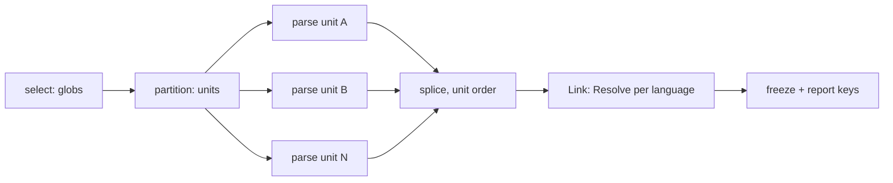

# RFC-0013: The frontend kit and its conformance suite

## Summary

A frontend turns source into the node graph, and the kit owns
everything around the author's parser: file selection, unit
partitioning, jailed reads that feed a unit fingerprint,
classification stamps, the comment pipeline, the import scopes
Link resolves through, and scoped diagnostics. The author writes
one function from a unit to declarations; the kit lowers the
declaration to a `plugin.Frontend` role, and `RunFrontendSuite`
holds any frontend — kit-built or hand-rolled — to the same
checks. The workspace joins this read side to its run at
milestone 0005; until then the suite drives frontends the way
backendtest drives renderers, over fixtures.

## Motivation

The render side settled its shape by building the kit before the
second consumer arrived: the declaration is data, the kit owns the
merge, the failure flow and the parallelism, and four backends now
share one tested procedure. The read side has nothing yet — no
`Frontend` role in the SPI, no unit contract, no harness — and
five frontends are about to be written together: Go, protobuf,
TypeScript, Rust and Java, per capability, over one shared
corpus. Building any parser first and the contract second would
harden that language's habits into the contract; the kit and its
suite come first, and four audits of the old frontends against
this document already did what the wave will keep doing — every
contract defect they found arrived through a language the others
did not share.

Two properties must be mechanisms rather than review rules, and
both live in this contract. Hermeticity: a frontend that can open
files at will defeats the cache, so bytes enter through one jailed
door that records every read into the unit fingerprint.
Classification: a frontend that excludes files hardcodes a policy
the consumer owns, so the kit admits everything parseable and
stamps what it saw.

## Detailed design

### The role

`core/plugin` gains the frontend role, which the kit lowers to
and the exotic case implements directly:

```go
// Frontend loads one language's source into the node graph.
type Frontend interface {
    Name() ID
    Lang() symbol.Lang
    Syntax() CommentSyntax

    // Selection is the file claim, gitignore-style globs against
    // workspace-relative paths, negations included: a testdata
    // tree is not Go source by Go's own definition, and that
    // belongs in the claim. What stays out of it is policy —
    // whether test files take part is the consumer's call through
    // scopes, never a selection line.
    Selection() []string

    // Partition groups the selected files into units, the
    // language's own grain: package directories for Go, whatever
    // the language's own compilation unit is elsewhere. Every
    // selected file appears as a member of exactly one unit, and
    // the refs a unit returns carry the shared inputs the
    // frontend declares for them. The reader is recorded rather
    // than jailed, because a grain can live inside bytes the
    // selection must not claim — a package clause sits in a
    // selected file, a module boundary in go.mod — and a
    // partition that cannot look would guess; every partition
    // read folds into every resulting unit's fingerprint, because
    // the partition decided their shape.
    Partition(ctx context.Context, files []SourceRef, r FileReader) ([][]SourceRef, error)

    // Parse loads one unit through its handle. A unit's problem
    // reports through the handle and parsing continues; a
    // returned error is fatal to the whole load, every frontend's
    // — Link resolves over the union, and a partial union
    // resolves wrong, so a broken satellite stops the run rather
    // than shipping a graph missing its language. The context
    // carries cancellation into a long parse; the old kernel
    // recorded how expensive threading it in later proved, so it
    // is in the shape from the start.
    Parse(ctx context.Context, u *SourceUnit) error

    // Resolve says what a spelling could mean in one file's
    // recorded import scope: the candidate identities in the
    // language's own probe order. Link keeps the first candidate
    // the graph holds; several present candidates are the
    // ambiguity finding, and none leaves the reference spelling
    // only.
    Resolve(scope ImportScope, spelling string) []symbol.Identity
}
```

`SourceRef` names a file without opening it: the workspace-relative
path and its declared shared inputs — a list of workspace paths
per file, the shape fixed here so no language reshapes it later;
the members are each language's own. Go declares its module
files, TypeScript its config chain, proto its root mapping, and
every declared input's bytes fold into the dependent unit's
fingerprint.

`ImportScope` is what the resolution phase hands a language's
`Resolve` for one file: the file's assigned identity, and the
bindings the frontend recorded at parse time in the language's own
form — `Bindings any`, stored by the kernel, type-asserted back
by that language's `Resolve` alone. Go binds package aliases,
TypeScript binds members with rename and form, proto scopes per
declaration site, and a kernel that fixed one shape would fix
Go's; the cost is that a binding-shape mistake reports at Link
rather than compile, which the suite's linked fixture exercises
per language. `FileReader` is the partition's recorded door over
the workspace tree, before units exist: not jailed to the
selection, because a unit's shape can depend on a file the
selection must not claim — a Go module file, a TypeScript config —
and hermeticity holds through the fold alone. It is not the
graph's [store.Reader], and the two never meet. Link is a
kernel phase after every frontend finished: it visits every
`TypeRef` in the graph, nested type arguments included, asks the
owning language's `Resolve` for each node's spelling, keeps the
first candidate the graph holds — in scope or signature-only —
reports several present candidates as an ambiguity, and leaves
builtins and externals as spellings, which is degradation the
reader can ask about, not failure. A file whose parse recorded no
scope resolves nothing: there are no bindings to resolve through,
and the suite's linked check is what catches a frontend that
forgot to record them. A `Partition` error is fatal
to the load: unit shape is structural, and a frontend that cannot
say what its units are has nothing to parse.

### The unit

`SourceUnit` is kernel-owned and is the only surface a `Parse` call
touches:

```go
u.Files() []SourceRef          // the unit's members
u.Read(path) ([]byte, error)   // the one door: jailed, recorded
u.Depth() Depth                // Full | Signatures
u.Graph() *GraphBuilder        // declarations, scopes, attachments
u.Doc(raw string) []string     // comment text through the syntax
u.DocLines(lines []string)     // text already clean
u.Errorf / u.Warnf / u.Infof   // positioned, origin-bound findings
```

`Read` refuses a path outside the unit's files and its declared
shared inputs, and every accepted read folds path and content into
the unit fingerprint. The fingerprint closes over the read set by
construction: a frontend cannot depend on bytes the cache does not
know about, because there is no other way to bytes. A unit's
recorded key folds, by value, in this order: every read's path and
content, the partition's reads, the unit's `Depth` — the same
bytes at `Signatures` produce a different graph and must key
differently — the frontend's declared version, the frontend's
configuration in its canonical encoding, the composition's
plugin-set fingerprint, and the kernel's model fingerprint,
because a schema change reshapes the graph the same source
produces. Each part is length-prefixed, so two parts cannot trade
bytes and collide, and the one stated order holds because a key
derived two ways diverges. Configuration is in the fold by
contract: a knob that changes the graph without changing a read —
a tag set, an embedded-descriptor toggle — must key, and bytes a
frontend ships embedded count as configuration. The plugin-set
fingerprint is supplied by the load's driver: a recorded graph
carries stamps a changed plugin set reinterprets, the
incrementality architecture already requires the fold, and the
old kernel spelled it as its one capitalised MUST after learning
why — deriving it at milestone 0007 instead would fork the key. The version is the declared
[plugin.Versioned] one, bumped with any change to the produced
graph; the old kernel's history shows a hand constant serving
stale graphs across every stamping change, so the suite holds the
fold honest rather than trusting the discipline. The load's
report carries each unit's key, which is where the conformance
suite reads them; milestone 0007 consumes them, this milestone
records them.

`Depth` is the kit telling the frontend how deep this unit loads.
Signature-only loading is the same `Parse` observing
`Signatures` and skipping bodies and unexported members — one code
path, so a dependency package cannot drift from the in-scope
parse.

### The graph builder

`GraphBuilder` is the write handle into the node model, scoped to
the unit:

```go
gb.Package(path) *node.Package          // created once per path
gb.Scope(file *node.File, bindings any) // what Resolve reads
gb.Attach(subject symbol.Symbol, raw directive.Raw)
gb.Stamp(subject symbol.Symbol, s meta.RawStamp)
```

Scopes, attachments and stamps are recorded by node pointer rather
than by identity, because canonical identities do not exist until
the splice assigns them, and a derivation spelled once per
frontend would drift.

A unit declares as many packages as its bytes do: a Go directory
holds `foo` beside its external `foo_test`, one proto load spells
several packages, and a nested module spells a sub-path — the
grain is the unit's, the package set is the source's. Two units
contributing one language and package path merge at the splice,
files appended in unit order, so the shape stays deterministic
without a cardinality rule the languages would each break. The
splice validates what a unit built: an emit-side symbol or a
nameless declaration of a named kind panics naming the frontend,
because a malformed graph discovered at Link points away from the
frontend that built it. The resolution step then assigns every
identity under the canonical rules the model fixes — a package is
lang:path, a file is named by its whole workspace-relative path, a
member's owner is the dotted chain of enclosing type names, and a
callable's discriminator is its parameter type spellings,
comma-joined, so overloads spell apart. A second declaration
spelling one identity is not a defect — it is the unit's own
source broken mid-edit, or a platform-variant collision the
language must resolve — so it reports through the diagnostics, the
first stands, and the duplicate's subtree leaves every index; an
attachment on the duplicate re-homes onto the survivor, whose
identity is the same derivation. Reparsing an unchanged file
yields the same identities, which is what 0007's diff-by-identity
later stands on. Directive carriers strip through
the syntax value, parse under the kernel grammar, and attach as
raw instances; validation against schemas stays the freeze's, the
step between Link and the first handler, exactly as the plugin
fixture does it today. Two frontends claiming one file is a
composition defect the workspace's Build refuses at milestone
0005, before anything parses, naming both: selection claims
partition the tree, and an overlap resolved by splice order would
resolve by accident. The suite drives one frontend and cannot
meet the case, which is a stated hole in the stand-in, not a
forgotten one. Directive
comment lines — `//go:build`, `//nolint` and their kin — are not
documentation: the comment pipeline drops them from doc lines, so
a pragma can never render double-commented downstream.

Units parse in parallel; the assembled graph does not observe it.
Each unit's builder accumulates privately, and the kernel splices
unit graphs in unit order — units sorted by their first file's
path — so scheduling never orders the graph and parse-twice
byte-identity holds under any worker count.

### The kit

The authoring surface follows the backend kit's shape — the
declaration is data, `Build` freezes it and panics on a
declaration defect:

```go
frontend.New(name, lang, syntax).
    Match("**/*.go").
    Classify(classifiers...).   // stamps facts; excludes nothing
    Units(partition).
    Parse(parseUnit).
    Resolve(resolve).
    Build()                     // lowers to plugin.Frontend
```

A `Classifier` inspects a parsed unit and stamps classification
facts — `go.testFile`, the generated-marker for foreign
generators' output — through the same fact store discipline
annotators use, at plugin authority under the frontend's
identity: the authority order gains no new level, a directive or
a manual override still wins, and a second write at the same
authority still refuses. The mechanism is the raw directive's: a
stamp records against the parsed node as a pre-claim carrying the
key's boundary name, the store carries it beside the raw
directives, and the phase holding the registry — the workspace run
today, the suite standing in — applies it between the seal and
the first handler, refusals reported under the fact store's own
code. The stamp's origin is the kernel's to fill at the splice, so
a stamp cannot speak for another plugin, and rank decides every
winner at read, so a directive-authority drop beats a
classification stamp whichever applied first.

A frontend that needs configuration declares it the way any
plugin does, through [plugin.OptionsProvider], and the kit folds
the options' canonical encoding into every unit key. Conditional
compilation is the worked case: the Go frontend's configuration
states one build-constraint set per load, every selected file
parses, a file outside the set contributes its classification —
the constraint stamped as a fact — and its declarations stay out,
because two platform variants of one function share one canonical
identity and a graph holding both would misreport each. Another
platform is another load under another configuration, which the
key separates by construction. This is the language's own
semantics, not an exclusion policy: whether test files take part
is a consumer's call, but which `//go:build` variant compiles
never was. The kit refuses exclusion
by construction: there is no API that drops a parseable file. The
one exclusion is the kernel's own, enforced before `Parse` sees a
unit: files this workspace generated itself, proven by a manifest
entry or a provenance trailer, do not load.

### The conformance suite

`core/frontend/frontendtest` is to frontends what backendtest is
to renderers: fixtures in, checks the kernel owns.

```go
type Fixture struct {
    Sources    fs.FS    // the unit tree the suite selects from
    Signatures []string // unit roots loaded signature-only;
                        // everything else loads Full
    Schemas []directive.Schema      // what the carriers validate under
    Keys    func(*meta.Registry) error // what the stamps apply under
}
type Setup func(tb assert.TB) (plugin.Frontend, *Fixture)

func RunFrontendSuite(t *testing.T, setup Setup)
```

Depth is per unit, not per fixture, because the Link check needs
both in one graph: an in-scope package resolving into a
signature-only dependency is the case that matters.

The granular assertions, each taking the `assert.TB` role so its
own failure path is testable:

- `AssertDeterministicParse`: one fixture parses to an identical
  graph twice, encoded bytes compared, and reparsing an unchanged
  file yields the same identities.
- `AssertPositionedDiagnostics`: a finding without a position or
  an origin is a defect in the frontend that reported it.
- `AssertClassified`: the declared classifiers' stamps are present
  on the fixture's units, and no file was silently dropped — every
  selected file's declarations or refusal findings appear.
- `AssertFingerprinted`: the load report's keys fold every read,
  the partition's reads, the depth, the declared version, the
  configuration, the plugin-set fingerprint the suite drives, and
  the model fingerprint — an untouched unit's key is stable
  across two parses, one unit parsed at the two depths keys
  differently, and a changed version or configuration changes
  every key, which is what keeps the fold honest against a
  constant nobody bumped.
- `AssertJailedReads`: a scripted frontend reaching outside its
  unit is refused at `Read`, and the refusal names the path.
- `AssertSignatureDepth`: a unit parsed at `Signatures` carries no
  bodies and no unexported members, and the same unit at `Full`
  is a superset under the same identities.
- `AssertAttachedDirectives`: `//+gen:` carriers strip from the
  documentation, parse under the kernel grammar, attach as raw
  instances on the subjects that carried them, and validate under
  the fixture's schemas at the suite's freeze, after Link — the
  same point the workspace validates at, because the suite stands
  in for it until milestone 0005 and a stand-in that skips
  validation re-opens the silent-acceptance window the old
  kernel's cache lesson closed.
- `AssertLinked`: over a two-package fixture, in-graph spellings
  resolve to canonical identities, builtins and externals keep
  spelling only, and `Reader.Lookup` joins across the packages
  afterwards.

The suite composes them and skips what a fixture cannot state, the
way the plugin suite does. It drives the SPI, so a kit-built
frontend and a hand-rolled one are held to the same checks.

### The load pipeline



Parse fans out; everything before and after is sequential and
ordered, which is where determinism lives. Until milestone 0005
the conformance suite drives this pipeline; the workspace takes
it over without changing it.

### What this does not decide

Tier-1 projections (`rules/`) are the milestone's later slices and
their own design: the kit hands them a frozen graph and nothing
here constrains their shape. The toolchain adapter is specified in
the testing architecture and arrives with the last slice. Native
attribute sugar — Rust's `#[gen::…]`, TypeScript decorators,
Java annotations lowering to canonical directives — is a kit
addition beside `Classify` that arrives with the wave's directive
slice, now that three in-wave languages carry real sugar; its
shape is decided against those carriers, not invented for Go,
which has none. The
workspace's Load step — driving selection, partitioning and
parallel `Parse` across registered frontends, then Link, then
Freeze — is milestone 0005's join; the suite stands in for it
until then.

## Alternatives considered

- **Parser first, contract second** — write the Go frontend
  directly against the store and extract the kit afterwards. The
  render side's history argues the other way: the kit held because
  two consumers arrived through one surface; a contract extracted
  from one parser carries that parser's shape.
- **Exclusion hooks on the kit** — a `Skip(glob)` beside `Match`.
  Refused by the architecture: whether test files or foreign
  generated output take part is the consumer's call through scopes
  and gating, and an exclusion hook would make it a satellite's.
- **On-demand resolution instead of a Link phase** — resolve
  `TypeRef`s lazily at first read. Two packages parse in parallel
  and neither can resolve into the other until both exist; a lazy
  resolver either blocks on load order or resolves differently
  before and after the graph completes. One phase over the whole
  graph resolves once.
- **Three old-kernel surfaces retire without successors, by
  choice** — the `value` directive's cases move to `meta` at
  directive authority; the consumer directive-prefix override
  gives way to one kernel grammar with plugin-prefixed names; the
  `pkg=` routing key gives way to package identity derived from
  the `gen.module` facts. Recorded here so the next audit does
  not re-open them.

## Drawbacks

- The `Unit` jail makes ad-hoc frontend experiments stiffer: a
  quick parser that wants to glance at a neighbouring file must
  declare it or fail. That stiffness is the mechanism working.
- `Resolve` puts a per-language callback inside a kernel phase, so
  a slow resolver slows Link; the suite's determinism check runs
  it twice and a benchmark gate pins the load once the Go frontend
  exists.

## Unresolved and future work

- Export surfaces arrive with the TypeScript frontend at
  milestone 0009: a re-export binds no local name and declares
  nothing with an identity, so resolving through a barrel needs
  an export-surface record to walk and a Link that rewrites a
  candidate to the canonical declaring identity. The
  candidate-ordered `Resolve` here is shaped so that growth
  extends the seam instead of reshaping it.
- Cross-package semantic facts the old Go frontend stamped
  through its type checker — a Stringer satisfaction, an iter.Seq
  return — re-derive as rules beside milestone 0004's Tier-2 set;
  a classifier runs before Link and cannot know them.
- Dependency artifacts (`u.Artifacts()` for JARs and `.d.ts`
  trees) arrive with the Java frontend's dependency loading, the
  first consumer with no source to read; until then a dependency
  type keeps its spelling, which is the recorded degradation.
- The facade's curated list grows by `frontendtest` and the
  frontend surfaces when they exist; the mirror guard shows the
  addition.

## References

- [Architecture: languages](../architecture/11-languages.md)
- [Architecture: the symbol model](../architecture/02-symbol-model.md)
- [Architecture: directives](../architecture/05-directives.md)
- [Architecture: testing and conformance](../architecture/13-testing-and-conformance.md)
- [RFC-0009: The render pass and the backend kit](0009-render-pass-and-backend-kit.md)
- [RFC-0012: The SDK facade module](0012-the-sdk-contract-module.md)
- [Milestone 0004](../roadmap/0004-go-loads-into-graph.md)
