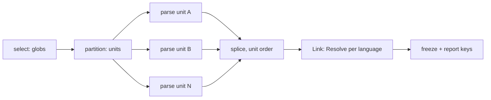

# RFC-0013: The frontend kit and its conformance suite

## Summary

A frontend turns source into the node graph, and the kit owns
everything around the author's parser: file selection, unit
partitioning, jailed reads that feed a unit fingerprint,
classification stamps, the comment pipeline, the import scopes
Link resolves through, and scoped diagnostics. The author writes
one function from a unit to declarations; the kit lowers the
declaration to a `plugin.Frontend` role, and `RunFrontendSuite`
holds any frontend — kit-built or hand-rolled — to the same
checks. The workspace joins this read side to its run at
milestone 0005; until then the suite drives frontends the way
backendtest drives renderers, over fixtures.

## Motivation

The render side settled its shape by building the kit before the
second consumer arrived: the declaration is data, the kit owns the
merge, the failure flow and the parallelism, and four backends now
share one tested procedure. The read side has nothing yet — no
`Frontend` role in the SPI, no unit contract, no harness — and the
Go frontend is about to be written. Building the parser first and
the contract second would harden one language's habits into the
contract; the kit and its suite come first so the Go frontend is
the first consumer of a surface a TypeScript frontend can also
implement.

Two properties must be mechanisms rather than review rules, and
both live in this contract. Hermeticity: a frontend that can open
files at will defeats the cache, so bytes enter through one jailed
door that records every read into the unit fingerprint.
Classification: a frontend that excludes files hardcodes a policy
the consumer owns, so the kit admits everything parseable and
stamps what it saw.

## Detailed design

### The role

`core/plugin` gains the frontend role, lowered to like every other
role and public for the exotic case:

```go
// Frontend loads one language's source into the node graph.
type Frontend interface {
    Name() ID
    Lang() symbol.Lang
    Syntax() CommentSyntax

    // Selection is the include-shaped file claim, gitignore-style
    // globs against workspace-relative paths.
    Selection() []string

    // Partition groups the selected files into units, the
    // language's own grain: package directories for Go, files for
    // TypeScript. Every selected file appears in exactly one unit.
    Partition(files []SourceRef) ([][]SourceRef, error)

    // Parse loads one unit through its handle. A unit's problem
    // reports through the handle and parsing continues; a returned
    // error is fatal to the load.
    Parse(u *Unit) error

    // Resolve says what a spelling means in one file's recorded
    // import scope: the candidate identity Link checks against the
    // graph. A spelling outside the scope returns false, and the
    // reference keeps spelling only.
    Resolve(scope ImportScope, spelling string) (symbol.Identity, bool)
}
```

`SourceRef` names a file without opening it: the workspace-relative
path and the declared shared inputs that apply to it. `ImportScope`
is what the frontend recorded at parse time for one file: the
file's identity and its local name bindings, `alias → package
path` for Go. Link is a kernel phase after every frontend
finished: it visits every `TypeRef` in the graph, nested type
arguments included, asks the owning language's `Resolve` for each
node's spelling, keeps the identity when the graph holds that
declaration — in scope or signature-only — and leaves builtins and
externals as spellings, which is degradation the reader can ask
about, not failure. A `Partition` error is fatal to the load: unit
shape is structural, and a frontend that cannot say what its units
are has nothing to parse.

### The unit

`Unit` is kernel-owned and is the only surface a `Parse` call
touches:

```go
u.Files() []SourceRef          // the unit's members
u.Read(path) ([]byte, error)   // the one door: jailed, recorded
u.Depth() Depth                // Full | Signatures
u.Graph() *GraphBuilder        // declarations, scopes, attachments
u.Doc(raw string) []string     // comment text through the syntax
u.DocLines(lines []string)     // text already clean
u.Errorf / u.Warnf / u.Infof   // positioned, origin-bound findings
```

`Read` refuses a path outside the unit's files and its declared
shared inputs, and every accepted read folds path and content into
the unit fingerprint. The fingerprint closes over the read set by
construction: a frontend cannot depend on bytes the cache does not
know about, because there is no other way to bytes. A unit's
recorded key folds, in a defined order: every read's path and
content, the unit's `Depth` — the same bytes at `Signatures`
produce a different graph and must key differently — the
frontend's version, and the kernel's model fingerprint, because a
schema change reshapes the graph the same source produces. The
load's report carries each unit's key, which is where the
conformance suite reads them; milestone 0007 consumes them, this
milestone records them.

`Depth` is the kit telling the frontend how deep this unit loads.
Signature-only loading is the same `Parse` observing
`Signatures` and skipping bodies and unexported members — one code
path, so a dependency package cannot drift from the in-scope
parse.

### The graph builder

`GraphBuilder` is the write handle into the node model, scoped to
the unit:

```go
gb.Package(path) *node.Package          // one per unit, created once
gb.Add(decl symbol.Symbol)              // node declarations, in order
gb.Scope(file symbol.Identity, s ImportScope)  // what Resolve reads
gb.Attach(subject symbol.Identity, raw directive.Raw)
```

The builder validates at the append: an emit-side symbol, a
declaration without an identity, or a second package in one unit
is a defect and panics, because a malformed graph discovered at
Link points away from the frontend that built it. Identities
follow the canonical rules the model fixes; reparsing an unchanged
file yields the same identities, which is what 0007's
diff-by-identity later stands on. Directive carriers strip through
the syntax value, parse under the kernel grammar, and attach as
raw instances; validation against schemas stays the workspace
seal's, exactly as the plugin fixture does it today. Directive
comment lines — `//go:build`, `//nolint` and their kin — are not
documentation: the comment pipeline drops them from doc lines, so
a pragma can never render double-commented downstream.

Units parse in parallel; the assembled graph does not observe it.
Each unit's builder accumulates privately, and the kernel splices
unit graphs in unit order — units sorted by their first file's
path — so scheduling never orders the graph and parse-twice
byte-identity holds under any worker count.

### The kit

The authoring surface follows the backend kit's shape — the
declaration is data, `Build` freezes it and panics on a
declaration defect:

```go
eidos.NewFrontend(name, lang, syntax).
    Match("**/*.go").
    Classify(classifiers...).   // stamps facts; excludes nothing
    Units(partition).
    Parse(parseUnit).
    Resolve(resolve).
    Build()                     // lowers to plugin.Frontend
```

A `Classifier` inspects a parsed unit and stamps classification
facts — `go.testFile`, the generated-marker for foreign
generators' output — through the same fact store discipline
annotators use, at plugin authority under the frontend's
identity: the ladder gains no new rank, a directive or a manual
override still wins, and a second same-rank write still refuses. The kit refuses exclusion
by construction: there is no API that drops a parseable file. The
one exclusion is the kernel's own, enforced before `Parse` sees a
unit: files this workspace generated itself, proven by a manifest
entry or a provenance trailer, do not load.

### The conformance suite

`core/frontendtest` is to frontends what backendtest is to
renderers: fixtures in, checks the kernel owns.

```go
type Fixture struct {
    Sources    fs.FS    // the unit tree the suite selects from
    Signatures []string // unit roots loaded signature-only;
                        // everything else loads Full
}
type Setup func(tb assert.TB) (plugin.Frontend, *Fixture)

func RunFrontendSuite(t *testing.T, setup Setup)
```

Depth is per unit, not per fixture, because the Link check needs
both in one graph: an in-scope package resolving into a
signature-only dependency is the case that matters.

The granular assertions, each taking the `assert.TB` role so its
own failure path is testable:

- `AssertDeterministicParse`: one fixture parses to an identical
  graph twice, encoded bytes compared, and reparsing an unchanged
  file yields the same identities.
- `AssertPositionedDiagnostics`: a finding without a position or
  an origin is a defect in the frontend that reported it.
- `AssertClassified`: the declared classifiers' stamps are present
  on the fixture's units, and no file was silently dropped — every
  selected file's declarations or refusal findings appear.
- `AssertFingerprinted`: the load report's keys fold every read,
  the depth, the frontend version and the model fingerprint — an
  untouched unit's key is stable across two parses, and one unit
  parsed at the two depths keys differently.
- `AssertJailedReads`: a scripted frontend reaching outside its
  unit is refused at `Read`, and the refusal names the path.
- `AssertSignatureDepth`: a unit parsed at `Signatures` carries no
  bodies and no unexported members, and the same unit at `Full`
  is a superset under the same identities.
- `AssertAttachedDirectives`: `//+gen:` carriers strip from the
  documentation, parse under the kernel grammar, and attach as
  raw instances on the subjects that carried them.
- `AssertLinked`: over a two-package fixture, in-graph spellings
  resolve to canonical identities, builtins and externals keep
  spelling only, and `Reader.Lookup` joins across the packages
  afterwards.

The suite composes them and skips what a fixture cannot state, the
way the plugin suite does. It drives the SPI, so a kit-built
frontend and a hand-rolled one are held to the same checks.

### The load pipeline



Parse fans out; everything before and after is sequential and
ordered, which is where determinism lives. Until milestone 0005
the conformance suite drives this pipeline; the workspace takes
it over without changing it.

### What this does not decide

Tier-1 projections (`rules/`) are the milestone's later slices and
their own design: the kit hands them a frozen graph and nothing
here constrains their shape. The toolchain adapter is specified in
the testing architecture and arrives with the last slice. Native
attribute sugar — Rust's `#[gen::…]`, TypeScript decorators
lowering to canonical directives — is a kit addition beside
`Classify` that arrives with the first language carrying it, at
milestone 0009; deferred here so its shape is decided against a
real carrier rather than invented for Go, which has none. The
workspace's Load step — driving selection, partitioning and
parallel `Parse` across registered frontends, then Link, then
Freeze — is milestone 0005's join; the suite stands in for it
until then.

## Alternatives considered

- **Parser first, contract second** — write the Go frontend
  directly against the store and extract the kit afterwards. The
  render side's history argues the other way: the kit held because
  two consumers arrived through one surface; a contract extracted
  from one parser carries that parser's shape.
- **Exclusion hooks on the kit** — a `Skip(glob)` beside `Match`.
  Refused by the architecture: whether test files or foreign
  generated output take part is the consumer's call through scopes
  and gating, and an exclusion hook would make it a satellite's.
- **On-demand resolution instead of a Link phase** — resolve
  `TypeRef`s lazily at first read. Two packages parse in parallel
  and neither can resolve into the other until both exist; a lazy
  resolver either blocks on load order or answers differently
  before and after the graph completes. One phase over the whole
  graph answers once.

## Drawbacks

- The `Unit` jail makes ad-hoc frontend experiments stiffer: a
  quick parser that wants to glance at a neighbouring file must
  declare it or fail. That stiffness is the mechanism working.
- `Resolve` puts a per-language callback inside a kernel phase, so
  a slow resolver slows Link; the suite's determinism check runs
  it twice and a benchmark gate pins the load once the Go frontend
  exists.

## Unresolved and future work

- The shape of declared shared inputs on `SourceRef` — Go needs
  `go.mod` and `go.work` folded into dependent fingerprints; the
  exact declaration surface is decided when the Go frontend
  states its own.
- Dependency artifacts (`u.Artifacts()` for JARs and `.d.ts`
  trees) stay out until a language needs them; Go resolves from
  source.
- The facade's curated list grows by `frontendtest` and the
  frontend surfaces when they exist; the mirror guard shows the
  addition.

## References

- [Architecture: languages](../architecture/11-languages.md)
- [Architecture: the symbol model](../architecture/02-symbol-model.md)
- [Architecture: directives](../architecture/05-directives.md)
- [Architecture: testing and conformance](../architecture/13-testing-and-conformance.md)
- [RFC-0009: The render pass and the backend kit](0009-render-pass-and-backend-kit.md)
- [RFC-0012: The SDK facade module](0012-the-sdk-contract-module.md)
- [Milestone 0004](../roadmap/0004-go-loads-into-graph.md)
