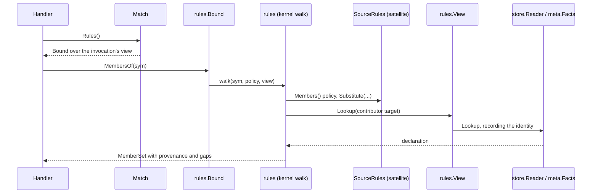

# RFC-0014: The projection vocabulary and the rules seam

## Summary

A generator that doubles an interface, builds a value or writes a
check asks the same questions of every declaration, and each
question has a different answer per language: what a callable's
signature means, what shape a type has, what a name in a directive
refers to, which members a type effectively holds, and what a value
of a type looks like. This RFC gives those questions one home.

The kernel package `core/rules` declares the neutral vocabulary and
owns the three walks that every language would otherwise repeat:
the member walk, the signature mapping and the type-shape fold. A
language returns the decisions inside those walks and the questions
that are grammar: which member lists contribute and how names
shadow, which parameter is a context and which return carries the
failure, what a builtin spelling means, what a value of a type looks
like, and what a human's spelling names. A satellite's `rules/`
package returns that contract for one language; the workspace holds
the returned set per language; and every match hands a handler a
bound `Rules()` that reads through the invocation's tracked view.

Two model changes come with it. A type reference gains a structural
form beside its verbatim spelling, because a projection that has to
re-parse a spelling after resolution cannot recover the identities
the resolution step assigned inside it. The emit model gains a value
tree and a scaffolding expression that carries one, because a sample
spelled as text cannot cross a package boundary.

## Motivation

Three pressures decide where these questions live.

- **Two consumers, one declaration.** A builder generator and a
  double generator both ask what a field's type is and what a value
  of it looks like. Each deciding privately is how two plugins come
  to disagree about one declaration, and a plugin that decides in
  its own helper binds neutral code to the one language its author
  happened to test. The placement rule is fixed: a question two
  neutral consumers ask goes in the contract, and a question one
  language binding asks stays in that language's own package.
- **The read side stops at declarations.** The frontend parses, the
  resolution step assigns identities and targets, and the graph
  seals. Nothing in the kernel says what a Go `(T, error)` return
  means, which members a struct holds through its embeds, or that a
  `*T` field is optional. Those are language rules, and the kernel
  knows no language. The shape catalog's detectors, the
  cross-language lowering and every check-emitting generator wait
  on one contract that returns them.
- **Five languages, one walk.** A member walk needs a cycle guard, a
  depth budget, argument binding, provenance and a stated gap for
  every contributor it cannot follow. Written per language, that is
  five copies of the same machinery with five sets of defects, and
  the language-specific part of each is four decisions. The shared
  language module already holds the helpers the four backends each
  spelled before it existed; the read side takes the same split
  before the first copy exists.
- **Silence is the defect.** A projection that hands back a zero
  value where it could not reason lets a generator write a check
  that passes against code doing nothing. Every return in this
  vocabulary refuses visibly, with a reason a consumer can report,
  and the conformance suite holds implementations to it.

## Detailed design

### The package and its position

`core/rules` holds the vocabulary, the contract and the three
kernel-owned walks. It imports `core/node`, `core/emit`,
`core/symbol`, `core/store`, `core/meta` and `core/directive`, and
nothing imports it back except the authoring root, the workspace
and the satellites' `rules/` packages. The generated facade
re-exports it, so a plugin imports `sdk/rules`.

A language's own decisions live in the satellite, beside its
frontend: `eidos-lang-go/rules` returns the contract for Go and
nothing else. The kernel never imports a satellite; the satellite
imports the facade.

### Source identity

Two spellings of language identity already exist and stay separate:
`symbol.Lang` names the language a declaration was written in, and
`plugin.Target` names the language a plan renders into. A
`SourceRules` value declares the `symbol.Lang` it returns for. The
two share one namespace of spellings, so a frontend's `Lang()` and a
rules value's `Lang()` agree by construction, and a plan's target
never reaches a source rules lookup because the types differ.

### What the kernel owns and what the language returns

The split follows one rule: machinery the walks share is the
kernel's, and decisions that differ per language are the language's.

| Projection | The kernel owns | The language returns |
|---|---|---|
| Callable | mapping receiver, parameters, returns, variadic and async from the model | the role of each parameter, the role of each return, the error model |
| TypeShape | folding the reference's form and children into a shape; classifying a resolved target | the meaning of a builtin spelling, and the well-known mapping |
| MemberSet | the walk: cycle guard, depth budget, argument binding, provenance, gaps, order | which member lists contribute, in which order, and how names shadow |
| Resolve | the resolution kinds and the validation binding | what a spelling names in a scope |
| Values | the value tree, its refusal vocabulary, the authored-value precedence | deriving two values, the zero, and a literal from text |
| Naming | nothing | the join |

One call path shows where every read records:



### The contract

```go
package rules

// SourceRules is what every language returns. Implementing it is
// what makes a language a language on the read side. A value is
// safe for concurrent use: the run calls it from parallel plans and
// from parallel validations, so it holds no state of its own.
type SourceRules interface {
    // Lang names the language the rules return for.
    Lang() symbol.Lang

    // Members states how this language's member walk proceeds.
    Members() MemberPolicy

    // ParamRole classifies one parameter of a callable.
    ParamRole(p *node.Param, v View) ParamRole

    // ReturnRoles classifies a callable's returns, one role per
    // return in order, and names the error model the signature
    // states.
    ReturnRoles(rs []*node.Return, v View) ([]ReturnRole, ErrorModel)

    // Builtin projects a named reference the resolution step left
    // without a target: a builtin, a well-known type, an external.
    // It returns Opaque for a spelling it cannot classify.
    Builtin(ref *node.TypeRef, v View) TypeShape

    // Resolve says what a human's spelling names in a scope, at a
    // declared resolution kind. It returns the declaration or an
    // error naming what it looked for.
    Resolve(scope Scope, name string, kind directive.ResolutionKind, v View) (symbol.Symbol, error)

    // SamplesOf returns two distinct values of a type, or two
    // refusals carrying the reason. Authored values are read by the
    // kernel before this is asked.
    SamplesOf(ref *node.TypeRef, hint string, v View) (sample, alternate Sample)

    // ZeroValue returns the type's zero value, and reports false
    // where the language has no spelling for it.
    ZeroValue(ref *node.TypeRef, v View) (emit.Value, bool)

    // LiteralFor turns text that already went through the
    // language's quoting into a value of a type, and reports false
    // where the text cannot be one.
    LiteralFor(f *node.File, ref *node.TypeRef, text string, v View) (emit.Value, bool)

    // TypeName joins a generator's word onto an author's base name
    // the way the language spells a derived type name.
    TypeName(word, base string) string
}
```

Every method that reads takes the view it reads through, so a
projection holds nothing across invocations and every read records
on the invocation that asked. Two calls with one view over one graph
return equal values, which the conformance suite holds every
implementation to. This contract replaces the Tier-1 shape the
projection architecture pins, which placed the three walks on the
language; accepting this RFC edits that document to read as this
one states.

### The view

A projection reads declarations and facts, and both reads record.

```go
// View is what a projection reads through: the invocation's
// tracked declaration reader, the run's arbitrated facts, and the
// read set both record into.
type View struct {
    Decls *store.Reader
    Facts *meta.Facts
    Reads meta.Recorder
}

// Lookup returns one declaration by identity, recorded.
func (v View) Lookup(id symbol.Identity) (symbol.Symbol, bool)

// Fact returns a subject's winning value for a key, recorded.
func Fact[T meta.FactValue](v View, id symbol.Identity, k meta.Key[T]) (T, bool)
```

The workspace mints the view per invocation. A projection called
with a zero view refuses with `RefusedNoView` rather than reading an
untracked graph, because an unrecorded read is an invalidation edge
the engine cannot see.

### Reaching the rules

The composition registers one `SourceRules` per language:

```go
workspace.New().
    Rules(gorules.New(), protorules.New()).
    // ...
```

Build refuses two values for one language and a value declaring the
zero language. Nothing at Build says which languages the graph
holds, because the graph arrives at Run. A handler asking for a
language the composition registered nothing for receives
`rules.Absent(lang)`, a value whose member policy contributes
nothing, whose roles are `Input` and `Value` under the `None` error
model, whose `Builtin` returns Opaque, whose `Resolve` errors, and
whose values refuse with `RefusedNoRules`. The run records one
Warning per plugin and language the first time it happens, keyed in
the run's own state, naming both. The refusal is a value, so a
generator's `OK()` gate holds without a nil check, and the Warning
is what keeps the omission from passing as a language with no
members.

Every match binds the rules to the invocation:

```go
// On every *Match:
Rules() Bound                    // the subject's language
RulesFor(lang symbol.Lang) Bound // another language's

// Bound is the kernel's walks and the language's decisions over
// the invocation's view.
type Bound struct { /* unexported */ }

func (b Bound) CallableOf(sym symbol.Symbol) (Callable, bool)
func (b Bound) TypeOf(ref *node.TypeRef) TypeShape
func (b Bound) MembersOf(sym symbol.Symbol) (MemberSet, bool)
func (b Bound) SamplesOf(subject symbol.Identity, ref *node.TypeRef, hint string) (Sample, Sample) // subject: the declaration carrying the type; zero for none
func (b Bound) ZeroValue(ref *node.TypeRef) (emit.Value, bool)
func (b Bound) LiteralFor(f *node.File, ref *node.TypeRef, text string) (emit.Value, bool)
func (b Bound) TypeName(word, base string) string
func (b Bound) Witnesses(params []*node.TypeParam) []*node.TypeRef // authored first, derived where the language can
func (b Bound) Source() SourceRules // for the optional-capability assertions
func (b Bound) View() View
```

`TypeOf` memoises per reference for the invocation, on the match's
own scratch, so a detector that asks one parameter's shape twice
computes it once. A graph match has no subject, so `Rules()` on it
returns the `Absent` value for the zero language, and `RulesFor` is
how a graph rule reaches a language. The authoring surface's pinned
`Rules()` returns the unbound contract; this RFC replaces it with
the bound value, for the reason the alternatives give.

### The structural vocabulary

One closed enum names the structure a type reference has, and the
same enum names the structure a shape has. The frontend sets the
structural half from syntax; the fold adds the leaves:

```go
package symbol

// TypeForm names the structure of a type reference or a shape.
// The structural forms are a frontend's to set from syntax; the
// leaf forms are the projection's, and a frontend never sets one.
type TypeForm uint8

const (
    FormNamed TypeForm = iota // a name, resolved or not: the default
    FormOptional              // one child; Go *T, Kotlin T?, TypeScript T | undefined
    FormList                  // one child; a slice, an array of open length, a repeated field
    FormArray                 // one child; a fixed length the reference records
    FormMap                   // two children, key then value
    FormFunc                  // children: the parameters, then the returns from Split
    FormTuple                 // children in order
    FormUnion                 // children in order; untagged
    FormStream                // one child; a channel, an async iterator
    FormBorrow                // one child; a Rust reference, a C++ reference
    FormWildcard              // one child, the bound; the reference records the variance
    FormInline                // no children; an inline struct, interface or object body

    // The leaves, set by the fold alone.
    FormScalar
    FormBool
    FormText
    FormBytes
    FormReference // names a declaration the graph holds
    FormSum       // names a Sum declaration
    FormOpaque    // representable, not projectable; carries the spelling
)
```

There is no Set, because every set in the languages in scope is a
library type and projects as a Reference. A fixed-length array is
its own form because the length is part of the type. Union and Sum
stay separate: a Sum is a declaration the reference names, and a
Union is a structure the spelling states.

### The model change

A type reference carries its spelling verbatim, its resolved target
and the arguments of an explicit instantiation. The resolution step
resolves the one named type a decorated spelling names, `[]api.User`
to `User`, and stops at structures no single declaration owns: a
map's key and value, a function type's parameters, a channel's
element. Their named types stay spellings.

A projection cannot recover those identities. The import scope the
resolution step resolved through belongs to the load, and the sealed
graph does not carry it, so a projection reading
`map[string]api.User` can name the value type and cannot identify
it. Re-parsing the spelling returns the form and loses the target.

The proposal is that the frontend states the structure it parsed,
and the reference carries it beside the spelling:

```go
type TypeRef struct {
    ID       symbol.Identity `eidos:"node"`
    Pos      position.Pos    `eidos:"node"`
    Spelling string          `eidos:"both"`      // source text, verbatim
    Target   symbol.Identity `eidos:"both"`      // zero until resolution, and for builtins and externals
    Form     symbol.TypeForm `eidos:"both"`      // the structure; FormNamed by default
    Elems    []*TypeRef      `eidos:"both,walk"` // the form's children, in the form's fixed order
    Split    int             `eidos:"both"`      // FormFunc: the index in Elems where the returns begin
    Length   int             `eidos:"both"`      // FormArray: the fixed length; 0 when the spelling is not a literal count
    Variance symbol.Variance `eidos:"both"`      // FormWildcard: In for a lower bound, Out for an upper one
    Args     []*TypeRef      `eidos:"both,walk"` // the type arguments of an instantiation
}
```

The children's order is fixed per form, so no language reshapes it:
one child for Optional, List, Array, Stream and Borrow; the key then
the value for Map; the parameters then the returns for Func, with
`Split` saying where the returns begin; the members in order for
Tuple and Union; the bound for Wildcard; none for Inline and Named.
A function type's parameter names, defaults and optionality are not
carried; the spelling keeps them, and a language whose function
types name parameters sits at level two of the degradation scale for
that row.

`Spelling` stays verbatim. A frontend that decomposes nothing leaves
every reference `FormNamed` with no children, which is the whole
surface today, and its composites project as Opaque, which the
completeness check reports. The resolution step walks `Elems` the
way it walks `Args`, so a map's value type gains its target, and the
fold reads `Form`, `Elems` and `Target` and parses nothing.

On the emit side the fields follow one rule, so a generator knows
which to fill. A same-language generator copies a source reference
whole, and the backend spells `Spelling` verbatim, as it does today.
A cross-language generator writes a shape, which the target lowers
through its own type spelling under the cross-language conversion's
contract. A backend meeting a reference with an empty spelling and a
form refuses it, positioned, because no rule says how it spells the
form.

Every frontend fills the structural forms for its own composites:
Go's pointers, slices, arrays, maps, channels and function types;
TypeScript's arrays, tuples, unions, function types and the
`T | undefined` form as Optional; Java's arrays and wildcards; Rust's
references, slices, arrays, tuples and function pointers; proto's
`repeated`, `map` and `optional`. A Go array length that is a
constant expression rather than a literal, a Rust lifetime and a
TypeScript conditional type stay in the spelling, and the
reference's form is Inline where the language has no structure for
what it parsed.

The `Constraint` kind leaves the schema in the same edit. No
frontend produces one: a Go constraint interface is an `Interface`
whose type-set elements the frontend stamps under its own key, a
Rust trait bound is a reference, and a bound is what the
parameter's `Bounds` carries. The identity assignment drops its
case for the kind, and the generated models, codecs and the model
fingerprint follow the schema.

### TypeShape and the fold

```go
// ScalarClass says which number a Scalar is.
type ScalarClass uint8 // ScalarInt | ScalarUint | ScalarFloat

type TypeShape struct {
    Form     symbol.TypeForm
    Spelling string          // the source spelling, on every form
    Class    ScalarClass     // Scalar
    Bits     int             // Scalar: 0 for the platform width
    Length   int             // Array
    Split    int             // Func: the index in Elems where the returns begin
    Variance symbol.Variance // Wildcard
    Async    bool            // Stream
    Elems    []TypeShape     // the form's children, in the form's order
    Ref      symbol.Identity // Reference and Sum
    Args     []TypeShape     // Reference type arguments
}
```

`TypeOf` is the kernel's fold and never panics. A structural form
folds into the same form with its children folded; a Named reference
with a target the view holds classifies by the declaration it names,
a Sum as `FormSum` and every other kind as `FormReference`; a Named
reference without a target goes to the language's `Builtin`, which
returns a leaf or Opaque. A target in another language classifies
through that language's rules. Well-known types are not forms: a
small kernel registry holds blessed identities, `timestamp` and
`duration` and no others, and a language's `Builtin` maps its
spelling in, so `time.Time` projects as the `timestamp` Reference.

The fold has one rule of its own beyond structure: a List whose
element folds to an eight-bit unsigned Scalar folds to Bytes, so
Go's `[]byte`, Java's `byte[]` and Rust's `Vec<u8>` project alike.
The Go rules classify builtins by name: the integer and float
spellings as Scalar with their widths, `byte` as the eight-bit
unsigned Scalar it aliases, `bool` as Bool, `string` as Text, `any`,
`error` and `comparable` as Opaque, and `time.Time` and
`time.Duration` through the well-known registry. A channel projects as a synchronous Stream, and its
direction stays in the spelling, which a Go-only question reads.

### Callable

```go
type Callable struct {
    Receiver *ParamView   // nil for a free function or a type-level member
    Params   []ParamView
    Returns  []ReturnView
    Errors   ErrorModel   // None | LastReturn | ResultType | Thrown | Raised
    Async    bool
}

type ParamView struct {
    Name     string
    Ref      *node.TypeRef // project through Bound.TypeOf on demand
    Role     ParamRole     // Context | Input
    Variadic bool
}

type ReturnView struct {
    Name string
    Ref  *node.TypeRef
    Role ReturnRole // Value | OkBool | Stream | Error
}

type ParamRole uint8  // ParamInput | ParamContext
type ReturnRole uint8 // ReturnValue | ReturnOkBool | ReturnStream | ReturnError
type ErrorModel uint8 // ErrorsNone | ErrorsLastReturn | ErrorsResultType | ErrorsThrown | ErrorsRaised
```

The kernel maps the model's receiver, parameters, returns, variadic
flag and async flag; the language classifies. `Errors` says how the
callable reports failure, and the `Error` return role marks which
slot carries it where the model is `LastReturn` or `ResultType`, so
a generator binding a call knows where the failure arrives without
re-deriving the convention. `ParamView` and `ReturnView` carry the
reference and no shape: a detector that needs a parameter's shape
asks the bound `TypeOf`, which memoises, so the catalog's detectors
over every callable compute the shapes they read and no others.

The Go rules return a first parameter of type `context.Context` as
`Context`, a last return of type `error` as the `Error` role under
`LastReturn`, a two-value return whose second is `bool` as `OkBool`
on the second, a return of `iter.Seq` or `iter.Seq2` as `Stream`,
and `Sync` always, because Go's concurrency is caller-side and never
appears in a signature.

### MemberSet

```go
// MemberPolicy is what a language states about its member walk.
type MemberPolicy struct {
    // Contributes lists the member lists a type's effective set
    // draws on, in walk order: Embeds for Go, Extends then
    // Implements for the JVM languages, Extends for TypeScript.
    Contributes []Contribution
    // Shadowing says how two members of one name settle.
    Shadowing Shadowing
    // Depth bounds the walk; 0 takes the kernel's default of eight.
    Depth int
}

type Contribution uint8 // ContributesEmbeds | ContributesExtends | ContributesImplements

// Shadowing is the language's rule for one name reached twice.
type Shadowing uint8

const (
    ShadowPromote   Shadowing = iota + 1 // the shallowest wins; equal depth cancels both: Go
    ShadowOverride                       // the nearer declaration replaces the farther: the JVM languages
    ShadowMerge                          // every declaration survives, as overloads: TypeScript interfaces
    ShadowLinearise                      // the first in the declared order wins: Python
)

type MemberSet struct {
    Members []Member
    Gaps    []Gap
}

// Member is one effective member and where it came from.
type Member struct {
    Symbol      symbol.Symbol     // *node.Field or *node.Method
    Owner       symbol.Identity   // the declaration that declared it
    Through     []symbol.Identity // the contributors traversed, outermost first; empty for a declared member
    Depth       int
    ViaOptional bool              // a contributor on the path has the Optional form; see below
}

// Gap is one contributor that yielded nothing, and why.
type Gap struct {
    Host        symbol.Identity
    Contributor *node.TypeRef
    Reason      GapReason // Unresolved | NotMembered | Cyclic | Generic | Conflict
}

func (s MemberSet) Complete() bool
```

The kernel walks: it follows each contributing list in policy order,
guards cycles by identity, stops at the depth budget, records the
path every member arrived through, and settles same-named members
under the language's shadowing rule, with a declared member always
winning over an arrived one. An embedded interface contributes its
whole effective set, walked the same way, and a set over an
interface is a set: two arrivals of one name with one signature are
one member, and two with different signatures are a gap under
`Conflict`. `ViaOptional` records that a contributor on the member's
path has the Optional form, which a Go double generator reads: a
pointer embed promotes the pointer receiver's methods as well as the
value receiver's. A contributor carrying type arguments binds them
into the contributed members through the language's `Substitute`,
and reports `Generic` only for a parameter that stays unbound or for
a language returning no generics capability. A contributor whose
reference carries no target reports `Unresolved`, one whose
declaration is not a type with members reports `NotMembered`, and
one already on the path reports `Cyclic`.

A contributor in another language walks under that language's
policy, because a Go struct can embed a declaration a proto load
produced and Go promotion says nothing about a message. A
contributor outside the plan's scope reports `Unresolved`, which is
what the scope is for: the same declaration projects differently
under two plans, and neither plan sees what it could never read.

A generator that must not ship a partial double reads `Gaps` and
reports; one filling a table treats them as a footnote. Severity is
the consumer's policy, which is why the set returns the gaps rather
than reporting them.

### Resolve

Directive reference parameters carry a human's spelling. The
freeze's validation binds each one before any handler runs, so "this
names a sibling callable" is schema rather than prose.

```go
// Scope is where a spelling is read: the subject that carried it,
// and the file whose imports qualify it.
type Scope struct {
    Subject symbol.Identity
    File    *node.File
}
```

The resolution kinds are the schema's own, and gain one:
`ResolveTypeInScope`, for a param that names a type, which the
witness directive needs. `Validate` gains a resolver the workspace
supplies from its rules set. It lives in the directive package,
which imports no model, so it takes the subject's identity and the
workspace finds the file behind it:

```go
package directive

// Resolver binds one reference param. The workspace derives it
// from the registered rules and a view minted over the sealed
// graph for validation; the view's reads record into a set the
// run discards, because validation runs whole on every run.
type Resolver func(subject symbol.Identity, name string, kind ResolutionKind) (symbol.Identity, error)
```

A reference that resolves to nothing is a positioned Error under the
directive's own code, naming the spelling and the kind it was read
at. Validation runs one subject per goroutine, which is why the
contract states that a `SourceRules` value is safe for concurrent
use.

The Go rules resolve a bare name in the subject's package, a
qualified name through the file's recorded imports, a value field
through the member walk over the subject's type, a host parameter on
the subject's own signature, a member on a handle through the
handle's resolved type, and a type in scope the way a bare or
qualified type spelling resolves.

### Values

A sample is a value tree, and the tree is emit vocabulary, because a
check that writes a value writes it into a generated body and the
backend spells it there.

```go
package emit

// ValueKind selects a value's populated fields. The zero kind
// names no value.
type ValueKind uint8

const (
    ValueLiteral    ValueKind = iota + 1 // Literal and Text
    ValueConversion                      // Type applied to Inner: Weekday(42)
    ValueComposite                       // Type with Fields: Point{X: 42}; positional where a field has no name
    ValueCall                            // Callee applied to Args: time.Unix(42, 0)
    ValueAddress                         // the address of Inner: &Point{X: 42}
)

// LiteralKind says what a literal's text is, so a target spells it
// its own way: the string's quotes, the absent value's name.
type LiteralKind uint8

const (
    LiteralInt LiteralKind = iota + 1
    LiteralFloat
    LiteralString // Text holds the content, unquoted
    LiteralBool
    LiteralNil    // the language's absent value; Text is empty
    LiteralRaw    // Text in the source language, which only that language's backend spells
)

// Value is one value a generated body writes. Every reference in
// it is qualified by the backend for the file it is written into,
// which is what text alone could never do.
type Value struct {
    Kind    ValueKind
    Literal LiteralKind
    Text    string
    Type    *TypeRef        // Conversion and Composite: the type spelled
    Callee  symbol.Identity // Call: the function spelled and imported
    Fields  []ValueField    // Composite
    Args    []Value         // Call
    Inner   *Value          // Conversion and Address
}

type ValueField struct {
    Name  string // "" for a positional field
    Value Value
}
```

The scaffolding vocabulary gains one expression kind, `ExprValue`,
carrying a `Value`, so a check's call can take a sample as an
argument. The kernel copies a source reference into the emit
reference a value carries, spelling, target, form and children
alike, so the backend qualifies it the way it qualifies any emit
reference. The scaffold stays too small to write logic in: a value is
data, and the four statement kinds do not grow. Each backend's
scaffold spells the tree, registering the imports its references
need through the import set it already holds, and refuses a leaf it
cannot spell, positioned: a `LiteralRaw` from another language, a
conversion in a language without one.

```go
package rules

type Sample struct {
    Value   emit.Value
    Refusal Refusal
}

// OK reports whether a value was derived: no refusal, and a value
// with a kind.
func (s Sample) OK() bool

type Refusal uint8

const (
    RefusedNone Refusal = iota // a value was derived
    RefusedNoView
    RefusedNoRules
    RefusedNoLiteral           // the type admits no distinguishable value
    RefusedUnresolved          // a named type the view does not hold
    RefusedDepth               // a self-referential type past the walk's budget
)
```

`SamplesOf` returns two distinct values because a check comparing
against one value passes whenever the subject already held it, and
what it held is not always knowable. The hint names the declaration
the value belongs to, so a string value carries it and a failure
message says where the value came from. `ZeroValue` returns the
type's zero, which is what a declared default is compared against.
`LiteralFor` turns text that already went through the language's
quoting, such as a struct tag's value, into a value of the type, and
reports false where the text cannot be one.

All three refuse rather than guess, and a refusal carries its
reason, because only `RefusedNoLiteral` is a fact about the type.
The rest describe an input the caller can fix, and the response to
every one is to emit no check, so a run missing a package otherwise
produces a test that asserts less than it appears to.

The Go rules derive: a builtin's pair from a fixed table; a defined
type's pair as a conversion of its underlying type's; a struct's as
a composite setting its first settable exported field; a slice's and
an array's as a one-element composite differing in the element; a
map's as a one-entry composite differing in the key, because a map
to an empty struct is how Go spells a set; a pointer's as the
address of the inner value; `time.Time` as a call and
`time.Duration` as a conversion, from a curated table, because the
standard library is never in the graph. An interface, a function
type, a channel and an inline body refuse with `RefusedNoLiteral`.
The value tree carries no function literal and no channel, because
a check calling a sampled function asserts nothing about the
subject, and a channel has no literal in any language in scope; a
member of either type takes no check.

### Authored values

An author knows values a derivation cannot: which string a validator
accepts, which types a generic parameter is meant to run at. Two
kernel directives carry them, the kernel reads their stamps before
it asks the language to derive, and every consumer receives the
authored answer without knowing an annotator exists.

```
//+gen:sample value="us-east" alternate="eu-west"
//+gen:witness T=int U=time.Duration
```

`sample` takes two string params, `value` and `alternate`, on every
declaration that carries one type: a field, a parameter, a return, a
variable, a constant, an alias, a struct, an enum, a sum. A callable
carries several and is refused. A language whose comment placement
cannot reach a parameter or a return, as Go's cannot, reports that
carrier under its own refusal, positioned; the key admits the kind
for the languages that can. An authored value is text in the source
language, so it stamps as text and arrives as a `LiteralRaw`, which
the source language's backend spells and another language's
refuses.

`witness` takes one key per type parameter, so its schema is open:

```go
type Schema struct {
    // ...
    // Open types every key the Params do not declare; nil closes
    // the schema, which is the default. The reserved keys keep
    // their meaning under an open schema: role, out and tag are
    // never read as open keys.
    Open *ParamSpec
}
```

The witness annotator holds the declaration, so it refuses a key
naming none of the subject's type parameters, positioned at the
carrier, and resolves each value through `Resolve` at
`ResolveTypeInScope`. The kernel registers three keys beside the
module keys: `gen.sample` and `gen.alternate` as strings on the
kinds `sample` admits, and `gen.witness` as an identity on type
parameters, with an empty package for a builtin, so a witness naming
`time.Duration` arrives with the package a backend qualifies and
imports.

The two handlers are ordinary annotators built on the authoring
surface, in `core/authored`, and a composition lists them like any
other annotator. They are default in the sense that the reference
composition and every corpus fixture register them; the kernel's
workspace never imports the authoring root, so it registers no
plugin on anyone's behalf.

The bound `SamplesOf` takes the declaration carrying the type and
reads `gen.sample` and `gen.alternate` on it first, then on the
declaration the type names where the reference has a target, and
asks the language to derive only what neither stated. Each half
reads independently, because a derived first value is often fine
where the second has to differ in a way the derivation cannot know.
`Witnesses` reads `gen.witness` per parameter first and derives only
for a bound whose type set is knowable without loading the declaring
package, which in Go means `any` and `comparable`. The bound
`Witnesses` assembles the list, authored entries first, and returns
it whole or not at all, because an entry point instantiates every
parameter at once.

### Naming

`TypeName(word, base)` joins a generator's word onto an author's
name the way the language spells a derived type: Go joins in
PascalCase and keeps the base's export by its first rune. It serves
a generator writing into the source language's own plan. A plan
rendering into another language respells every name through the
target's own seam, so a cross-language generator composes the word
and the base and lets the respell case them.

### The optional capabilities

A language declares an optional capability by satisfying an
interface on its `SourceRules` value, and a consumer finds it by
asserting on `Bound.Source()`. A consumer that asserts and is refused
reports once and generates nothing for that language, which beats a
projection built on a default nobody chose.

```go
type EnumRules interface {
    EnumOf(e *node.Enum, v View) EnumInfo
}

type EnumInfo struct {
    Form       EnumForm      // Identifier | Value: where a variant's text comes from
    Variants   []VariantText // in declaration order
    Zero       string        // the variant whose value is the type's zero; "" when none
    Duplicate  string        // the first text two variants share; "" when none
    OutOfRange emit.Value    // a value outside the declared set; zero when none derives
    Foreign    []string      // packages declaring variants outside the type's own, sorted
}

// VariantText is one variant's identifier and its textual form as
// a string literal, quoted by the language that spells it.
type VariantText struct {
    Name string
    Text emit.Value
}

// Property is a computed view pairing a getter with its setter; a
// projection, never a change to the model.
type Property struct {
    Name   string
    Type   *node.TypeRef
    Getter *node.Method
    Setter *node.Method // nil for a read-only property
}

type Ownership uint8 // OwnByValue | OwnBorrow | OwnBorrowMut

type ErrorValueRules interface {
    SentinelName(base string) string
    IsSentinelName(ident string) bool
}

type TagRules interface {
    Tag(f *node.Field, key string) (string, bool)
}

type GenericsRules interface {
    // Derive returns a witness for one parameter the author left
    // unstated, and reports false where the bound's type set is
    // not knowable without loading the declaring package.
    Derive(p *node.TypeParam, v View) (*node.TypeRef, bool)
    // Substitute rewrites a reference with each parameter replaced
    // by its argument, copying what it rewrites.
    Substitute(ref *node.TypeRef, params []*node.TypeParam, args []*node.TypeRef) *node.TypeRef
    Reified() bool
}

type PropertyRules interface {
    Properties(s *node.Struct, v View) []Property
}

type ConstructRules interface {
    Constructors(s *node.Struct, v View) []Callable
}

type ThrowsRules interface {
    Throws(c Callable) []*node.TypeRef
}

type OwnershipRules interface {
    Ownership(p ParamView) Ownership // ByValue | Borrow | BorrowMut
}

type PromotionRules interface {
    Settable(s *node.Struct, v View) []Member
}

type EqualityRules interface {
    Comparable(ref *node.TypeRef, v View) (ok bool, problems []*node.TypeRef)
}
```

`AnnotationRules` is not minted. Every declaration kind carries
`Annotations` on the model, read statically by the frontend, so the
model field is the projection and an interface over it would return
the field.

The Go rules satisfy `EnumRules`, `ErrorValueRules`, `TagRules`,
`GenericsRules`, `PromotionRules` and `EqualityRules`. `EnumOf`
reads the exact values the frontend stamped under
`golang.constValue`, so iota arithmetic is evaluated once, at parse,
and read here. `Comparable` is the rule the Go annotator already
applies to stamp `golang.comparable`; the annotator calls the rules
rather than carrying a second copy, so the stamped fact and the
projected answer cannot drift. The generics capability reads a
bound's target declaration where the graph holds one and its
spelling otherwise.

### Reads, re-execution and the budget

A projection reads only through the view it was handed, so every
declaration and fact it touched is an edge on the invocation that
asked, at the same grain as any other read: a lookup records the
identity, an enumeration records set membership, a fact records the
subject and key. A projection holds no cache across invocations; the
one memo, `TypeOf` per reference, lives on the invocation and dies
with it.

Every walk carries a ceiling from its first measurement, the way the
backend kit's settle and render do. `rulestest.BenchRules` drives
the four hot projections over the conformance corpus at the
canonical scale, one thousand packages of ten files of twenty
declarations: `CallableOf` over every callable, `MembersOf` over
every type, `TypeOf` over every reference, and `SamplesOf` over
every field. Each satellite pins its own allocation ceilings from a
profiled run with headroom, and the profile names what to cut before
a ceiling moves.

### The conformance suite

`core/rules/rulestest` holds any implementation to the properties
the contract promises, over a fixture the caller supplies: a loaded
graph and the rules under test.

- `AssertDeterministic`: every projection returns equal values on
  two calls with one view.
- `AssertTotal`: `TypeOf` returns a shape for every reference in the
  graph, and `CallableOf` reports false for every non-callable kind,
  without panicking.
- `AssertRefusesWithReason`: a sample that is not OK carries a
  refusal other than `RefusedNone`, and a member set with a gap
  names the contributor and a reason.
- `AssertDistinctSamples`: where both halves are OK, the values
  differ.
- `AssertWitnessesWhole`: a witness set is nil or one entry per
  parameter.
- `AssertRecorded`: a projection over a subject records at least the
  subject's identity on the view it was handed.
- `AssertConcurrent`: the projections over one graph from parallel
  goroutines return what the serial run returned, under the race
  detector.

The suite runs in each satellite over the conformance corpus, and in
the corpus module over every language that returns rules. The
corpus's coverage verdicts grow from the two read-side verdicts to
the four levels of the degradation scale, and each level is a
predicate the check evaluates over the feature's declarations:

1. **Projects.** Every reference reachable from the feature's
   declarations folds to a form other than Opaque or Inline, every
   callable projects, every type's member set is complete, and the
   feature's corpus entry names no remainder keys.
2. **Projects partly.** At least one reference folds to Opaque or
   Inline or one member set carries a gap, and every remainder key
   the feature's corpus entry names is present on the declaration
   carrying the remainder.
3. **Opaque.** The reference the feature declares itself folds to
   Opaque or Inline, an alias of an inline body for instance, and
   every declared key is present.
4. **Refuses.** The corpus carries nothing under the feature, as the
   read-side refusal already holds.

A feature that arrives better than declared fails too: a feature
declared at level two whose every reference folds and whose every
member set is complete fails the check, because a capability nobody
declared is a capability nobody tested. A frontend that leaves its
composites `FormNamed` fails the same way, since its composites fold
to Opaque under a level-one declaration.

### Refusal codes

Four diagnostic codes join the kernel's: a reference param that
resolves to nothing at validation, an authored witness naming a type
parameter the subject does not declare, a rules lookup for a
language the composition registered none for, and a scaffold value
a backend cannot spell. Each is positioned at the carrier, the
subject or the unit that caused it.

## Alternatives considered

- **Every language implements every projection whole.** Have each
  satellite own its member walk, its signature mapping and its type
  fold, the way it owns its parser. Five walks carry five cycle
  guards, five depth budgets and five gap vocabularies, and the
  language-specific part of each is four decisions. The kernel walk
  with a policy is the same hoist the backends took for their shared
  helpers, taken before the copies exist.
- **Projections as facts.** Have the frontend or an annotator stamp
  every projection on every symbol at load, and let generators read
  facts. A member set with provenance and gaps is a structure, and
  facts are flat values. Stamping every projection of every
  declaration is also eager work over the whole graph on every run,
  against an engine that runs the readers a change reaches and
  nothing else.
- **Re-parsing spellings inside the fold.** Keep the reference
  verbatim and have each language parse its composite grammar in the
  projection. The form comes back and the identities do not: the
  import scope the resolution step resolved through belongs to the
  load, and the sealed graph does not carry it. The model change is
  the smaller cost.
- **Two vocabularies, one for the reference and one for the shape.**
  Give the reference a syntactic form list and the shape a canonical
  kind list. They overlap on seven members, drift the first time one
  grows, and a frontend deciding the syntactic list already does
  half the fold's work. One enum with a stated split between the
  structural half and the leaves.
- **Samples as text.** Return a value as source text with the
  identities it names. Text cannot be qualified for the file it is
  written into, so a defined type from another package spells wrong,
  and a nested composite cannot be qualified at all. The value tree
  costs one expression kind in the scaffold, and every backend can
  spell or refuse the sample it carries.
- **Rules bound to the frontend.** Have `plugin.Frontend` return its
  language's rules. A graph loaded from a recorded key needs rules
  with no frontend present, a read-only language ships rules the same
  way, and a composition that runs over a graph it did not load has
  nowhere to ask. The composition registers rules by language, the
  way it registers everything else.
- **Shapes on the callable view.** Carry each parameter's projected
  shape on `ParamView`. Every `CallableOf` then allocates every
  parameter's shape, and the shape catalog asks `CallableOf` once per
  detector per callable. The view carries the reference, and the
  bound fold memoises per invocation.
- **A spelling-keyed resolver.** Hand projections a resolver that
  returns a declaration for a spelling, as a resolver over qualified
  names does. Identities exist by the time a projection runs, and
  the tracked reader already resolves one; a second resolver keyed on
  text would be a second place for scope rules to drift.
- **One `Rules()` returning the unbound contract.** Have the match
  hand back `SourceRules` and let handlers pass a view per call.
  Every call then repeats the view argument, and a handler that
  passes a view from another invocation records its reads on the
  wrong one. Binding at the match keeps the read set and the rules
  on one invocation.

## Drawbacks

- The model change touches every frontend: a language that fills the
  structural forms has to keep them consistent with the spelling,
  and the completeness check is what reports a composite left
  `FormNamed`.
- The policy split fixes four shadowing strategies in the kernel. A
  language whose rule fits none of them needs a kernel change, which
  is the cost of one walk; the four cover the languages in scope.
- `SourceRules` is still wide. A language returns ten methods before
  it returns anything, and the refusing defaults make a thin
  implementation honest rather than small.
- A value tree in the scaffold is a second thing every backend has
  to spell, and a target language without a conversion form or an
  address operator refuses samples that another target spells.

## Unresolved and future work

None. Every question the design raised is decided above: which
kinds `sample` admits, how a channel projects, that the `Constraint`
kind leaves the schema, that a function-typed or channel-typed
member takes no check, and that the projection architecture and the
authoring surface read as this RFC states once it is accepted.

## References

- [Architecture: the projection vocabulary](../architecture/03-projection.md)
- [Architecture: the symbol model](../architecture/02-symbol-model.md)
- [Architecture: directives](../architecture/05-directives.md)
- [Architecture: authoring](../architecture/06b-authoring.md)
- [Architecture: cross-language conversion](../architecture/10-cross-language.md)
- [Architecture: the shape catalog](../architecture/12-shape-catalog.md)
- [Architecture: testing and conformance](../architecture/13-testing-and-conformance.md)
- [RFC-0005: The directive grammar, schemas and validation](0005-directive-grammar.md)
- [RFC-0008: The emit body and the scaffolding vocabulary](0008-emit-body-content.md)
- [RFC-0011: Neutral emit and the target lowering seams](0011-neutral-emit-and-the-target-lowering-seams.md)
- [RFC-0013: The frontend kit and its conformance suite](0013-the-frontend-kit.md)
