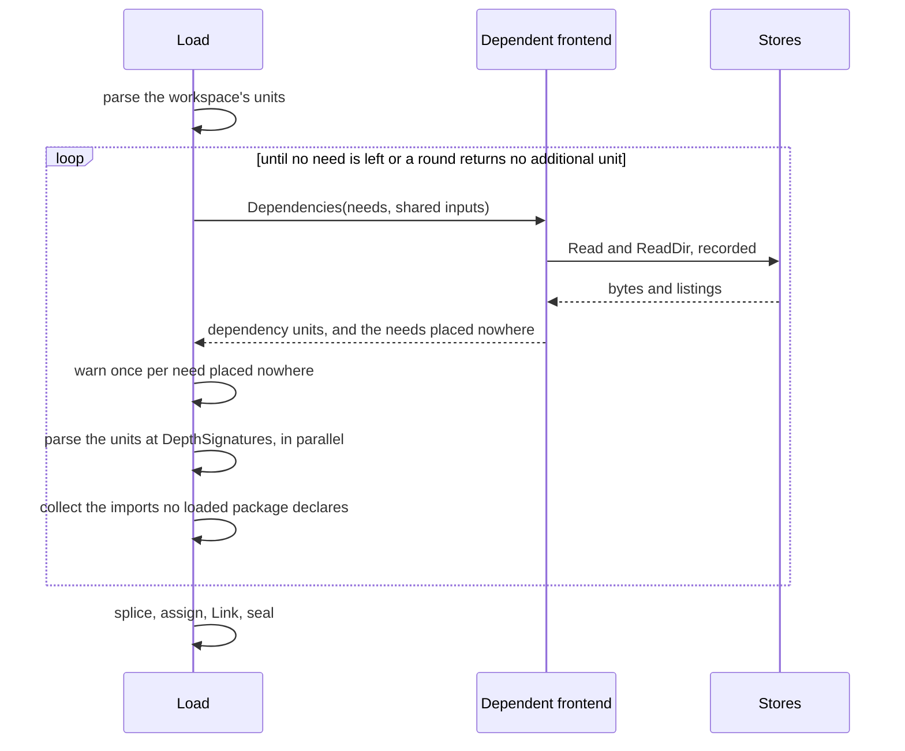

# RFC-0015: Tree-sitter frontends, dependency stores and re-exports

## Summary

TypeScript, Rust and Java get frontends that parse through one tree-sitter
layer in `eidos-lang`, and the frontend kit gains the two capabilities those
languages and Go need. The load reads dependency units signature-only from
named read-only stores, such as a Go module cache, the Go standard library, a
JDK's `ct.sym` and a Maven or Gradle cache. An optional frontend role returns
those units round by round, from the imports the loaded units name. A second
optional role lets Link follow re-exports, so a reference through a
TypeScript barrel module or a Rust `pub use` resolves to the declaration it
names. Each of the three languages gets a graded entry in the conformance
corpus.

## Motivation

### A reference into a dependency resolves to nothing

The Go frontend loads the workspace tree and nothing else. It skips
`vendor/`, and it reads neither the module cache nor the standard library.
On 2026-09-30 we loaded this repository with the Go frontend, 86 units. We
counted every named type reference by how Link resolved it:

| References | Count |
|---|---|
| Named type references | 14,025 |
| Resolved to a workspace declaration | 8,681 |
| Builtins, which keep their spelling by design | 4,081 |
| Standard library | 872 |
| Dependency modules: `go.dokimi.dev/assert` 310, protocompile's `ast` 43 | 353 |
| Workspace packages, unresolved through the method-scope defect under [Kernel fixes](#kernel-fixes) | 38 |

Of the 9,944 references that are not builtins, 1,225 name a declaration that
no load contains. Each keeps its spelling alone. The member walk reports a
gap for every embed of such an interface, so a generator that doubles an
interface embedding `io.Reader` states an incomplete member set.

Java has no pure-Go parser and no door to its dependencies, so a Java file
resolves nothing outside the workspace, `java.lang.String` included. The JDK
distributes its API as class files, and a library is a JAR of class files.
No source that declares them is on disk to parse.

### Re-exports declare nothing

A TypeScript module can publish a name it does not declare. With
`export * from './user'` in `src/models/index.ts`, the module publishes the
`User` that `src/models/user.ts` declares. A file that imports `User` from
`./models` names `src/models/index`, which declares no `User`, and Link
resolves a spelling only to a declaration. A Rust crate root that publishes
`pub use crate::store::Table` publishes a name that another module declares
in the same way.

### Division of the work

- The kernel supplies the door to bytes outside the workspace, because the
  kernel folds every byte a unit reads into that unit's key. A frontend that
  opened a module cache itself would read bytes no key folds, and a warm run
  would serve a graph built from bytes that have since changed.
- The language maps an import to files, because only the language knows the
  layout: Go's escaped module paths, the release directories of `ct.sym`,
  Cargo's crate targets.
- Link follows re-exports, because Link runs after every file has parsed. A
  frontend's `Resolve` reads one file's recorded bindings, and the unit's
  jail refuses a read of the barrel module, which belongs to another unit.
- One tree-sitter layer parses all three languages. None of them has a
  pure-Go parser the project can pin, and a single binding layer keeps the
  cgo dependency and the binding's known defects in one module.

## Detailed design

### Components

| Component | Module | Responsibility |
|---|---|---|
| `lang/treesitter` | eidos-lang | Wraps go-tree-sitter: grammars, parsing, trees, nodes, positions and syntax errors, and exports no type of the binding |
| `lang/treesitter/typescript`, `/rust`, `/java` | eidos-lang | One pinned grammar each, so a satellite compiles only its own grammar's C |
| Stores and qualified paths | eidos-core `plugin`, `frontend/load` | Named read-only trees outside the workspace, addressed as `store://path` |
| `plugin.Dependent` | eidos-core `plugin`, `frontend/load` | Returns dependency units in rounds, which the load parses signature-only |
| `plugin.Exporter` | eidos-core `plugin`, `frontend/load` | Returns what a file publishes and does not declare, which Link follows |
| Kit hooks | eidos-core `frontend` | `Builder.Dependencies` and `Builder.Exports` put a kit-built frontend in either role |
| Suite checks | eidos-core `frontend/frontendtest` | Check both roles against the contract over fixtures |
| Go dependencies | eidos-lang-go `frontend` | The module cache, the vendor tree and the standard library |
| TypeScript, Rust and Java frontends | each satellite's `frontend` | Source into the graph through the kit |
| Class-file reader | eidos-lang-java `frontend/classfile` | Decodes class files and `ct.sym` entries, which the Java frontend reads from JARs and stores and lowers into declarations |
| Corpus entries | eidos-conformance | One graded tree per language |

### The tree-sitter layer

`lang/treesitter` is the only package in the repository that imports
go-tree-sitter. Each grammar package beneath it is the only importer of one
grammar binding.

```go
// Package treesitter parses source with a pinned tree-sitter grammar
// and returns the syntax tree through its own types, so no type of
// the binding appears in a satellite.
package treesitter

// Grammar is one pinned tree-sitter language: its node kinds and
// field names, resolved once, and the module versions a frontend
// folds into its own version. A Grammar is safe for concurrent use.
type Grammar struct{ /* unexported */ }

// Load wraps the language pointer a grammar binding returns, under
// the grammar's name and the path of the module the binding is in.
// It reads the versions of that module and of the runtime binding
// from the running binary's build information. Only the grammar
// packages beneath this one call it. It panics on a language whose
// ABI the runtime does not accept, and on a binary whose build
// information does not list either module.
func Load(name, module string, language unsafe.Pointer) *Grammar

// Name returns the grammar's name, such as "typescript".
func (g *Grammar) Name() string

// Version returns the grammar's module and the runtime binding's
// module at the versions the binary was built with, as in
// "tree-sitter-java v0.23.5, go-tree-sitter v0.25.0". A frontend
// appends it to the version every unit key folds, so an upgrade of
// either module re-keys every unit the grammar parsed.
func (g *Grammar) Version() string

// Kind returns the id of a named node kind, and of the ERROR kind for
// "ERROR". It panics on a name the grammar does not declare, so a
// frontend written against another grammar version fails when it is
// constructed and not during a parse.
func (g *Grammar) Kind(name string) Kind

// KindName returns the name of a kind, and nothing for an id the
// grammar does not assign.
func (g *Grammar) KindName(k Kind) string

// Field returns the id of a field name, and panics as Kind does.
func (g *Grammar) Field(name string) Field

// Parse parses one file. It returns ctx.Err() without parsing when
// the context is done. Otherwise it returns a tree for any input,
// because a syntax error is an ERROR or MISSING node inside the tree
// and never an error return. The caller closes the tree.
func (g *Grammar) Parse(ctx context.Context, file string, src []byte) (*Tree, error)

// Kind and Field are ids scoped to one Grammar.
type (
    Kind  uint16
    Field uint16
)

// Tree is one parsed file and the source it parsed. One goroutine
// uses a Tree at a time.
type Tree struct{ /* unexported */ }

// Root returns the root node.
func (t *Tree) Root() Node

// Errors yields the tree's ERROR and MISSING nodes in document order.
func (t *Tree) Errors() iter.Seq[Node]

// Close releases the tree's C memory, and is safe to call twice.
// Every Node of a closed tree reports IsZero.
func (t *Tree) Close()

// Node is a value handle on one syntax node. The zero Node is the
// absent node, and so is every node of a closed tree: every accessor
// on it returns a zero value.
type Node struct{ /* unexported */ }

func (n Node) IsZero() bool
func (n Node) Kind() Kind
func (n Node) Named() bool
func (n Node) IsError() bool     // an ERROR node
func (n Node) IsMissing() bool   // a node the parser inserted to recover
func (n Node) IsExtra() bool     // an extra of the grammar, such as a comment
func (n Node) Text() string      // the node's source bytes
func (n Node) Pos() position.Pos // the tree's path, 1-based line, 1-based byte column
func (n Node) End() position.Pos
func (n Node) Child(f Field) Node
func (n Node) Children(f Field) iter.Seq[Node]
func (n Node) NamedChildren() iter.Seq[Node]
func (n Node) AllChildren() iter.Seq[Node] // keywords, punctuation and extras too
func (n Node) Parent() Node
func (n Node) PrevNamedSibling() Node
func (n Node) NextNamedSibling() Node

// Compact returns the node's tokens without the whitespace between
// them and without its extras, one space kept between two tokens whose
// facing characters can both be part of an identifier, so reformatting
// a node changes nothing Compact returns.
func (n Node) Compact() string

// TextThrough returns the source from the node's first byte through
// the last byte of another node of the same tree, as written.
func (n Node) TextThrough(last Node) string
```

Each grammar package exports its grammars as package variables:

```go
// Package typescript pins tree-sitter-typescript.
package typescript

// TypeScript parses .ts, .mts and .cts files, and TSX parses .tsx
// files. The upstream binding compiles both in one package.
var TypeScript, TSX *treesitter.Grammar
```

`lang/treesitter/rust` and `lang/treesitter/java` each export one `Grammar`.

The layer pins the newest version of each module that the Go module proxy
listed on 2026-09-30:

| Module | Version | Commit date |
|---|---|---|
| `github.com/tree-sitter/go-tree-sitter` | v0.25.0 | 2025-02-02 |
| `github.com/tree-sitter/tree-sitter-typescript` | v0.23.2 | 2024-11-11 |
| `github.com/tree-sitter/tree-sitter-java` | v0.23.5 | 2024-12-21 |
| `github.com/tree-sitter/tree-sitter-rust` | v0.24.2 | 2026-03-27 |

A go.sum line pins go-tree-sitter v0.25.0, which the module proxy serves at
commit `adc13ffd`. The upstream repository no longer has the tag. Its master
branch is six commits past that commit, and none of the six changes a leak
that the following invariants avoid.

Invariants:

- No package outside `lang/treesitter` and its grammar packages imports a
  `github.com/tree-sitter` module, which a depguard rule in `.golangci.yml`
  enforces. No exported identifier of the layer names a type of the binding:
  a grammar package hands `Load` an `unsafe.Pointer`, and every exported type
  wraps the binding's in an unexported field.
- The layer calls no binding function that leaks at v0.25.0.
  - `Language.IdForNodeKind` and `Language.FieldIdForName` pass a `C.CString`
    they never free (`language.go:92` and `:124`), and
    `Node.ChildrenByFieldName` calls the second on every use (`node.go:266`).
  - The kind table builds once per grammar. `NodeKindForId` names every id,
    and the runtime's `ts_language_symbol_for_name`, which the layer declares
    itself and calls with the name's bytes and length, returns the id every
    node of a named kind reports. The first id of a name is not always that
    id: Rust's grammar aliases `scoped_type_identifier_in_expression_position`,
    id 244, to `scoped_type_identifier`, and its nodes report id 245.
  - The field table builds once per grammar from `FieldNameForId`, which
    allocates no C memory. `Child` and `Children` go through
    `ChildByFieldId`.
- `Parse` passes no `ParseOptions`. At v0.25.0, `ParseWithOptions` registers
  non-nil options with `pointer.Save` and never releases them
  (`parser.go:350`), so a progress callback leaks once per parse. A load
  cancels between files instead.
- `Parse` creates a parser, parses, and closes the parser before it returns.
  The binding sets no finalizer, so a pooled parser that the garbage
  collector drops would never release its C memory.
- `Tree.Close` clears its pointer after the first call. The binding's `Close`
  frees without clearing it, so a second call would free twice.
- The layer reads nodes and walks trees through the runtime's own C
  functions. Its cgo preamble repeats their declarations from
  `tree_sitter/api.h`, and the layer keeps each `TSNode` and `TSTreeCursor`
  by value in Go memory. The binding returns every node it reads as a heap
  allocation. A walk of a
  node's children makes one call into C per child it yields, and `Compact`
  one call per node. A compile-time check pins that the binding's `Node` is
  the runtime's `TSNode` alone.
- The layer sets the runtime's allocator back to libc's when it initializes,
  because the binding routes every allocation through a call back into Go.
  Both allocate from libc, so either frees what the other allocated. With no
  call back left, the layer's C calls are `nocallback` and `noescape`, so
  the compiler allocates each cursor on the Go stack.
- Through the binding's own node and cursor reads, a Java parse of the
  canonical corpus of 200k declarations makes 15.5 million allocations in
  3.7 s. Through the runtime's functions, it makes 1.9 million in 2.4 s.
- Positions add one to tree-sitter's zero-based row and byte column. The
  columns of go/token are 1-based bytes too, so a Go finding and a TypeScript
  finding at the same byte print the same column.

Each grammar compiles from its `parser.c`: 8.7 MB of C for TypeScript and
8.8 MB for TSX, which the upstream binding compiles together, 2.6 MB for Java
and 6.5 MB for Rust. A binary that links a tree-sitter satellite needs
`CGO_ENABLED=1` and a C11 compiler.

### Stores and qualified paths

```go
package load

type Config struct {
    // The existing fields are unchanged.

    // Stores maps each store's name to its read-only tree outside the
    // workspace, which dependency units read: a Go module cache, a Go
    // standard library, a JDK's ct.sym, a Maven or Gradle cache. The
    // composition opens the trees, and no key folds where they are.
    // The load refuses a name that ValidStoreName refuses, and a name
    // without a tree.
    Stores map[string]fs.FS
}
```

```go
package plugin

// ErrStoreAbsent reports a qualified path naming a store the load does
// not provide. A dependent frontend reads it as that source being off:
// the composition configured no such tree, which differs from a
// configured store that lacks a file.
var ErrStoreAbsent = errors.New("plugin: no such store")

// StorePath returns the qualified path of a file inside a store: the
// store's name, "://", and the slash path inside the store, as in
// "gomod://golang.org/x/mod@v0.41.0/modfile/rule.go". No workspace
// path is a qualified path, because fs.ValidPath refuses the empty
// element that "//" spells.
func StorePath(store, path string) string

// CutStorePath splits a qualified path into its store and the path
// inside the store, and reports false for a workspace path. The root
// of a store is the qualified path with nothing after the separator.
func CutStorePath(qualified string) (store, path string, ok bool)

// ValidStoreName reports whether a name can name a store: it is not
// empty, and it contains neither the colon nor the slash that a
// qualified path separates on.
func ValidStoreName(name string) bool

// StoreFS is a workspace tree with named stores beside it. The load
// hands every unit a StoreFS, and a unit resolves a qualified path
// through it.
type StoreFS interface {
    fs.FS

    // Store returns one named store, and false for a name the load
    // does not provide.
    Store(name string) (fs.FS, bool)
}

// ReadFile returns the bytes of one file: a workspace path from the
// tree itself, and a qualified path from the store it names, which the
// tree provides as a StoreFS. A qualified path whose store the tree
// does not provide returns an error wrapping ErrStoreAbsent.
func ReadFile(fsys fs.FS, path string) ([]byte, error)

// ReadDir returns one directory's entries sorted by name, and resolves
// a qualified path the way ReadFile does.
func ReadDir(fsys fs.FS, path string) ([]fs.DirEntry, error)
```

- A qualified path is a path like any other wherever the kit spells one: a
  `SourceRef`'s `Path` and `Shared`, a `node.File`'s `Path`, a
  `position.Pos`'s `File` and a `UnitReport`'s `Files`. A dependency file's
  identity is `lang:package/qualified path`, derived as a workspace file's
  is.
- `SourceUnit.Read` resolves a qualified member or shared input through
  `ReadFile` over the unit's tree, and folds the path and the content as it
  does for any read. A qualified read of a store the load lacks returns an
  error that wraps `ErrStoreAbsent` and names the store, and so does a
  qualified read through a tree that is not a `StoreFS`.
- `NewSourceUnit` keeps its signature. The load passes it a `StoreFS`, and
  every other caller passes a plain `fs.FS` and reads no qualified path, so
  no other caller changes.

### Dependency units

```go
package plugin

// Need is one import path that no loaded package of the frontend's
// language declares, and the files that import it, in path order.
type Need struct {
    Path string
    From []string
}

// Unplaced is one need a frontend reported placed nowhere: its import
// path, and the reason the load's finding quotes.
type Unplaced struct {
    Path   string
    Reason string
}

// DependencyRound is one dependency round of a frontend: its number,
// its needs and its shared inputs, and the needs the frontend reports
// it cannot place. The load passes the round by pointer and reads the
// reports after Dependencies returns. A round is not safe for
// concurrent use.
type DependencyRound struct {
    // Number counts the rounds from one.
    Number int

    // Needs are the import paths no loaded package declares and no
    // earlier round passed, sorted by path. The first round runs even
    // when it has none.
    Needs []Need

    // Shared lists the shared inputs the frontend's partition
    // declared on the workspace's units, sorted and without repeats:
    // the build files a language reads its dependency set from, such
    // as the nearest go.mod above each workspace file.
    Shared []string

    // unexported: the reports, in report order
}

// Unplace reports one of the round's needs as placed nowhere, and why.
// The reason is a clause the load's finding quotes, such as "no module
// the go.mod files require provides it".
func (r *DependencyRound) Unplace(path, reason string)

// Unplaced returns the needs the frontend reported placed nowhere, in
// report order.
func (r *DependencyRound) Unplaced() []Unplaced

// StoreReader is a dependency round's recorded door: reads and
// directory listings over the workspace tree and the stores. Every
// read and every listing folds into the key of every unit the round
// returns.
type StoreReader interface {
    FileReader

    // ReadDir returns one directory's entries sorted by name, for a
    // workspace path or a qualified one.
    ReadDir(path string) ([]fs.DirEntry, error)
}

// Dependent is the optional role of a frontend whose sources name
// declarations outside the workspace tree. After the workspace's
// units parse, the load calls Dependencies once per round, parses
// every returned unit at DepthSignatures, and calls it again with
// the imports the returned units name.
type Dependent interface {
    // Dependencies returns the units that declare the round's needs,
    // grouped as Partition groups, and every unit the language's
    // build declares whatever the needs are, such as a Java
    // classpath. A member is a qualified store path, or a workspace
    // path the selection does not claim, such as a Go vendor tree. A
    // need the language cannot place yields no unit, the frontend
    // reports it through DependencyRound.Unplace, and its references
    // keep their spellings. A returned error is fatal to the load.
    Dependencies(ctx context.Context, round *DependencyRound, r StoreReader) ([][]SourceRef, error)
}
```

```go
package load

// UnplacedNeed reports an import a dependent frontend places in no
// dependency unit, at Warning. Every reference into the import keeps
// its spelling alone.
var UnplacedNeed = diag.MustRegister(diag.KernelPrefix, diag.CodeSpec{
    Number:  47,
    Meaning: "an import places in no dependency unit, and its references keep their spellings",
})
```



The load follows these rules:

- It runs each Dependent frontend's rounds in composition order. A round's
  units parse in parallel, and the rounds run one after another.
- A round's needs are the `Import.Path` values of the frontend's loaded files
  that no package of the frontend's language declares, less every path an
  earlier round passed. The frontend reads a path as its language defines
  one: an import path in Go, a package in Java.
- A dependency unit loads at `DepthSignatures`. Its key folds the reads of
  the round that returned it in the place where a workspace unit's key folds
  the partition's reads.
- `UnitReport` gains `Round int`: zero for a unit the partition returned, and
  the round's number for a dependency unit.
- A round after the first runs only when it has a need that no earlier round
  passed. The rounds end when there is none, or when a round returns no
  additional unit. Because each round after the first consumes at least one
  distinct import path, a load runs at most one round more than it has
  distinct import paths.
- The splice orders units by their first member path, qualified paths
  included. The order is total, because no file is a member of two units.
- A need the frontend reports placed nowhere reports `EID-0047`
  (`UnplacedNeed`) once, at Warning, positioned at the need's first import
  in the first of its `From` files. The message quotes the frontend's reason
  and counts the files that import the need. Reporting reads nothing, so it
  leaves every key unchanged.

The toolchains treat an import that nothing provides as a broken build. The
go command reports it as provided by no required module, and javac reports
that the package does not exist. The kernel cannot detect it alone, because
it compares import paths with package paths only. A Java static import names
a class, and cgo's `import "C"` names no package, so only the frontend knows
what its need means. The warning explains every unresolved reference into
the need, which a store, a classpath entry or a requirement the composition
lacks causes most often.

Each of these conditions in a round's result is fatal to the load and names
the frontend:

- an empty unit
- a member that some frontend's selection claims
- a member that the round returns twice
- a unit with some members already loaded and others not
- a report of a path that is no need of the round

The load drops a returned unit when a loaded unit already has every one of
its members, so a language that returns its declared dependencies in every
round loads them once.

### Re-exports

```go
package plugin

// Exporter is the optional role of a frontend whose files publish
// names they do not declare, as a TypeScript export-from statement
// and a Rust pub use do. When a candidate names no declaration, the
// resolution step calls Exports for each file of the candidate's
// package with the candidate's name, and resolves the returned
// candidates by the same rule.
type Exporter interface {
    // Exports returns the candidates that a name the file publishes,
    // and does not declare, could mean, in shadowing tiers. It
    // returns nil for a name the file does not publish. The scope is
    // the file's own, with a zero Owner. It is called after every
    // unit parsed.
    Exports(scope ImportScope, name string) Candidates
}
```

The one change to Link's `resolve` is that it follows a candidate whose
`Owner` is empty and whose bare identity names no declaration, when the
candidate's language has an Exporter frontend.

1. Link calls `Exports(scope, candidate.Name)` for each file of the
   candidate's package that recorded a scope, in path order.
2. The returned tiers resolve by the rule a reference's own tiers follow, and
   Link follows their candidates the same way. The first file whose tiers
   resolve decides, and the files after it are not asked.
3. The declarations that following finds count as the candidate's hits in
   the candidate's own tier. A declaration that a tier names directly and one
   it finds through a re-export compete in that one tier.
4. A visited set of package and name pairs stops a cycle, which TypeScript
   permits between two `export *` modules. A cycle finds nothing.

Take three files:

```ts
// src/models/user.ts
export interface User { id: string }

// src/models/index.ts
export * from './user';

// src/api.ts
import { User } from './models';
export interface Session { user: User }
```

1. In `src/api.ts`, the TypeScript `Resolve` returns the file's own package
   first, `[typescript:src/api.User]`, which names nothing and which
   `src/api.ts` does not re-export.
2. The import binding's tiers follow: `[typescript:src/models.User]`, and
   then `[typescript:src/models/index.User]`, the file candidate before the
   directory index, which is TypeScript's order.
3. No package `src/models` exists, and `src/models/index` declares no `User`.
4. Link calls `Exports` for `src/models/index.ts`, whose `export *` returns
   `[[typescript:src/models/user.User], [typescript:src/models/user/index.User]]`.
5. The first candidate names the interface, so the reference's target is
   `typescript:src/models/user.User`.

### Go dependencies

The Go frontend implements `Dependent` through the kit's
`Builder.Dependencies`, and reads two stores:

| Store | Root | Paths inside |
|---|---|---|
| `gomod` | the module cache | `<escaped path>@<escaped version>/…` for a module's tree, and `cache/download/<escaped path>/@v/<escaped version>.ziphash` for its hash record |
| `goroot` | the `src` directory of GOROOT | the standard library, and the packages it vendors under `vendor/` |

For a composition, `frontend.Stores(getenv func(string) string)
(map[string]fs.FS, error)` in the Go frontend package builds both stores
without running a tool, under the names `frontend.ModCacheStore` and
`frontend.GoRootStore`. It resolves each root in the order the go command
does:

- The module cache is the `GOMODCACHE` variable, then the go env file's
  value, then the first `GOPATH` entry with `/pkg/mod` appended, where
  `GOPATH` defaults to `$HOME/go`. The go env file is `$GOENV`, or `go/env`
  under the user configuration directory.
- GOROOT is the `GOROOT` variable, then the go env file's value, then the
  directory two levels above the `go` binary that `PATH` names, with symlinks
  resolved, when that directory contains `src/runtime`. The go command finds
  its own root two levels above its executable in the same way.
- It searches `PATH` without `os/exec`, which the frontend's import graph
  excludes.
- A root it cannot resolve is an error that names the variable to set.

The frontend places each need in order:

1. A need whose first path element contains no dot is a standard-library
   package, which is the go command's rule, and it maps to
   `goroot://<path>`. The parse of a standard-library file records an import
   whose first element has a dot under `vendor/`, because the standard library
   imports modules only from its vendor tree, so the need is
   `vendor/golang.org/x/…` and maps under `goroot://vendor/`.
2. A module path that a workspace go.mod declares in its module directive is
   a workspace module. Its packages load from the workspace tree and never
   from a store.
3. The round's `Shared` lists the nearest go.mod above each workspace file,
   and the frontend parses each with x/mod's `modfile.Parse`. `ParseLax`
   reads a dependency's go.mod and drops its replace directives, which a
   workspace go.mod needs kept. For every other module path, the selected
   version is the highest that any of them requires, after the replace
   directives of the go.mod that requires that version. A workspace is one
   build, and a graph contains one package per import path.
4. A need maps to the selected module whose path is its longest prefix. A
   need that no selected module prefixes yields no unit, and its references
   keep their spellings. The go command reports such an import as provided by
   no required module.
5. A replacement by another module path reads the replacement's tree and
   keeps the original import path. A directory replacement inside the
   workspace names a workspace module. A directory replacement outside the
   workspace fails the load.

The round reports every need it places nowhere, with the reason:

| Need | Reason |
|---|---|
| a package of a workspace module that the selection does not claim | a workspace module declares it, and the selection claims no file of its package |
| an import no selected module provides | no module the go.mod files require provides it |
| a module that a directory inside the workspace replaces | the go.mod, the module and the directory, and the selection claims no file of its package |
| a package directory that the module, the vendor tree or GOROOT lacks | no package directory is at the qualified path |
| a package directory without a Go file outside its tests | the directory has no Go file outside its tests |
| a store the load does not provide | the load provides no `gomod` or `goroot` store |

The import `"C"` names cgo's preamble and no package, so the round passes
over it and reports nothing.

The frontend verifies a module by the go command's own rules for a module it
uses:

- A cached module is complete when its tree exists, it has no `.partial`
  record, and it has a `.ziphash` record.
- The text of the `.ziphash` record must equal the h1 hash that the first
  workspace go.sum to record the module and version states. Every workspace
  go.mod has its own go.sum, and a module the selecting go.mod requires
  without importing its packages can be missing from that go.sum. A mismatch
  fails the load and names both hashes. A module that no go.sum records fails
  the load with the command `go mod download <path>`.
- The frontend does not rehash the tree, because the go command does not
  either. `go build` compares the `.ziphash` record with go.sum and reads the
  tree as it is. Only `go mod verify` rehashes a tree.

When the cache lacks the selected version, the vendor tree is the second
source: a workspace module whose `vendor/modules.txt` lists that version
provides the package from `vendor/<import path>`. The modules.txt must first
pass the go command's four consistency checks against its go.mod: every
requirement marked explicit, every replacement listed, every explicit module
required, and every listed replacement present in the go.mod. A failed check
fails the load and names the first mismatch. When neither source has the
module, the load fails with the command `go mod download <path>@<version>`.

A dependency unit is one package directory: its `.go` files except the
`_test.go` ones, because a dependency's tests are not part of the API it
exports.

- Each member's `Shared` is the selecting go.mod, and a standard-library
  member's is empty. `Parse` derives the import path, and a replacement's
  original path, through the jailed door, as it does for a workspace unit. A
  vendored copy loads under its path below `vendor/`.
- A dependency package is outside every workspace module, so the parse
  stamps no `gen.module` or `gen.moduleRoot` on it.
- The build constraints of the frontend's options apply to dependency files
  as they do to workspace files. A file that they exclude parses only its
  package clause and imports, which is how the go command reads such a file.
  Over this repository, that cut the load's allocations by 30% and its time
  by 13%.
- At `DepthSignatures`, the parse records on each file only the imports that
  its retained declarations name. The next round then follows the packages
  that exported signatures reference, and not every package a function body
  calls. protocompile v0.14.1 and google.golang.org/protobuf v1.34.2, which
  the protobuf satellite requires, contain 153 package directories, and the
  satellite's source names types in one of them, protocompile's `ast`.
- On 2026-10-01 the load of this repository's 90 units ran 4 rounds and 76
  dependency units in 154 ms, with 3.8 million allocations. Without the
  pruning it ran 7 rounds and 321 dependency units in 284 ms, with 6.9
  million allocations. The workspace alone loads in 51 ms.

The frontend parses go.sum and modules.txt itself, because x/mod v0.41.0
exports a parser for neither. A go.sum line has three fields, and the line
that hashes a go.mod alone spells its version with a `/go.mod` suffix, so it
never keys a tree. modules.txt is the line grammar the go command writes, read
the way `readVendorList` in the go command reads it. From x/mod the frontend
takes `modfile`, `semver`, and `module` for path escaping.

### The TypeScript frontend

#### Units and packages

- The selection is `**/*.ts`, `**/*.tsx`, `**/*.mts` and `**/*.cts`,
  negating `**/node_modules/**`. Declaration files are claimed like any
  other.
- A unit is one file, because TypeScript scopes a module's names to its file.
  When `a.ts` and `b.ts` in one directory both declare `Props`, the graph
  contains two identities.
- A file's package is its path without the extension. `.d.ts`, `.d.mts` and
  `.d.cts` count as one extension, so `src/models/user.ts` is the package
  `src/models/user`.
- A namespace `A.B` in that file is the package `src/models/user/A/B`, which
  `typescript.namespace` stamps with `A.B`.
- A `declare module 'x'` block is the package `x`, which is what a bare
  import of `x` names.
- A script file, one without any import or export statement, declares into
  the package with the empty path, which is TypeScript's global scope. So
  does a `declare global` block.
- Each ref's `Shared` is the governing `tsconfig.json` and its `extends`
  chain. The partition finds the governing file by probing upward from the
  file's directory. A relative `extends` names a file. A package `extends`
  resolves through the nearest `node_modules`, as Node resolves it.
- A tsconfig is JSON with comments and trailing commas.
  `github.com/tailscale/hujson` reduces it to JSON for `encoding/json`.
- `.tsx` files parse with the TSX grammar, and every other file with the
  TypeScript grammar.
- A second declaration of an interface or namespace in one file merges into
  the first, as TypeScript merges them. Across files, as in a module
  augmentation, the load keeps the first declaration and reports the second
  as a duplicate.

#### Declarations

| TypeScript | Model |
|---|---|
| `class`, `abstract class` | Struct: Abstract, Extends from `extends`, Implements from `implements` |
| `interface` | Interface: Extends; a property is a Field, a method signature a Method |
| index signature | Method with Indexer, named `[]`; `typescript.readonly` for a `readonly` signature |
| constructor, construct signature | Method with Constructs, named `constructor` in a class and `new` in an interface |
| call signature | no member: `typescript.callSignature` stamps its text on the host, because the model has no callable-object member |
| `enum`, `const enum` | Enum, Const for `const enum`; each member an EnumVariant, Value verbatim |
| `type` alias | Alias |
| `function` | One Function per overload signature. A function without overload signatures is one Function. The implementation of an overloaded function is none, because TypeScript hides it from callers. `typescript.generator` for `function*` |
| method | Method: Abstract, Level Type for `static`, Accessor for `get` and `set`, Hard for a `#` name, Override, Async; overloaded as a function is; `typescript.generator` for `*` and `typescript.optional` for `?` |
| property | Field: Optional for `?`, Mutability Immutable for `readonly`, Level, Hard, Value; `typescript.definiteAssignment` for `!` |
| parameter property | a constructor Param and a Field, both stamped `typescript.parameterProperty` |
| a declaration a `declare` statement, a `declare` block, an ambient module or a declaration file states | the declaration, stamped `typescript.ambient` |
| `const` | Constant |
| `let`, `var` | Variable, with a nil Type when the source states none |
| `export default` of an anonymous class or function | its declaration, named `default` |
| namespace, `declare module`, `declare global` | a package, as described in Units and packages |
| decorator | an entry in the declaration's Annotations |
| `import`, `import x = require()`, `export … from`, `export { … }`, `export =` | File Imports and Exports, with renames, the default form and the namespace form; `export =` publishes its name as the default |

#### Types

A frontend sets the structural forms from syntax. Every other reference is
Named with its verbatim spelling. The projection folds that spelling into a
shape.

| TypeScript | Model |
|---|---|
| `A`, `ns.A`, `A<T>` | Named, the type arguments in Args |
| `number`, `string` and the other predefined types | Named, which no candidate resolves |
| `T[]`, `readonly T[]` | List, the `readonly` in the spelling |
| `[A, B]`, `readonly [A, B]` | Tuple, the `readonly` in the spelling |
| `T \| undefined`, `T \| null` | Optional, when one member is left after every `undefined` and `null` |
| any other union | Union |
| `A & B` | Intersection, a chain `A & B & C` flattened into its three members |
| `(a: A) => B` | Func, the parameters and then the return |
| `new (a: A) => B` | Func, the parameters and then the type it constructs, the `new` in the spelling |
| `{ [k: K]: V }` with no other member | Map |
| any other object type | Inline, its members lowered as an interface's are into the reference's Fields and Methods |
| conditional, mapped, indexed access, `keyof`, `typeof`, literal and template literal types | Named, spelling verbatim |

#### Overloads

Because the frontend declares `Overloads()`, a discriminator spells each
parameter's type from the syntax tree. The spelling removes every whitespace
run from the type's tokens and keeps one space between two word tokens, as
in `keyof T`. A rest parameter is typed as one argument it takes, as every
backend renders a variadic parameter: the element of `T[]`, `readonly T[]`,
`Array<T>` and `ReadonlyArray<T>`. A tuple or another type states no element,
and the parameter keeps it. A rest parameter's type takes a `...` prefix, so
`...xs: string[]` spells `...string`, as Java's `String...` does. An optional
parameter's type takes a `?` suffix. Reformatting a signature keeps its
identity: `fill(n: Array< int >, m?: number)` and
`fill(n: Array<int>, m?: number)` both spell `Array<int>,number?`.

#### Resolution

For each file, the parse records the package, the enclosing namespaces, the
import bindings with their renames and forms, and the tsconfig's `baseUrl`
and `paths`. `Resolve` returns tiers in TypeScript's scope order:

1. The enclosing namespaces, innermost first, one tier each, and then the
   file's own package.
2. The import bindings. A named or default binding names the module's
   candidates. `N.A`, where `N` is a namespace import, names `A` in the
   module's candidates.
3. The global package.

A module specifier resolves to candidate packages without a read:

- A relative specifier from the directory `d` names `d/x` in one tier and
  `d/x/index` in the next. TypeScript tries the file before the directory in
  the same order.
- A trailing `.js`, `.mjs` or `.cjs` names the emitted file. The specifier
  resolves as the source file's package, which is TypeScript's extension
  substitution. A directory module's `package.json` is not read.
- A specifier that a `paths` pattern matches names each substitution in
  pattern order, each as a pair of tiers. A substitution is relative to
  `baseUrl`, and to the directory of the configuration that states `paths`
  where no `baseUrl` is set.
- A specifier that is not relative names the file and the index below
  `baseUrl` after the `paths` substitutions, where a `baseUrl` is set.
- Every specifier that is not relative names the package of its own
  spelling last, which only a `declare module` block declares. A package
  under `node_modules` is not loaded.

#### Re-exports

The frontend implements `Exporter`. `Exports(scope, name)` returns two
tiers:

1. The explicit re-exports of `name`: `export { a as name } from './x'`, and
   `export { a as name }` of an imported binding.
2. The candidates for `name` in every `export *` module, in source order. Two
   such modules that both publish `name` are an ambiguity, and TypeScript
   exports neither.

A default import resolves through `Exports(scope, "default")`, which returns
the declaration that `export default` names.

#### The rest

- Classification: `typescript.testFile` stamps a file under a `__tests__`
  directory, a file named `test` or `spec`, and a file whose name ends in
  `.test` or `.spec` before its extension, which is Jest's default match.
- Comments: a declaration's documentation and carriers are the comments
  directly before it, or before its outermost `export` or `declare` wrapper,
  with decorators skipped. A carrier works in a `//` line and inside a
  `/** */` block. A member of an inline object type has no identity, so a
  carrier on one reports `TYPESCRIPT-0003` and no key stamps one.
- Signature depth leaves out a declaration the module does not export, a
  `private` or `#`-named member, and a namespace member that is not exported.
- Codes: `TYPESCRIPT-0001` for a syntax error, `TYPESCRIPT-0002` for a
  carrier outside the kernel grammar, `TYPESCRIPT-0003` for a carrier on a
  subject the model cannot address, and `TYPESCRIPT-0004` for a tsconfig
  chain that does not read whole. The files that chain governs resolve
  without its `baseUrl` and `paths`.
- Keys: `typescript.testFile`, `typescript.namespace`,
  `typescript.callSignature`, `typescript.ambient`, `typescript.generator`,
  `typescript.definiteAssignment`, `typescript.parameterProperty`,
  `typescript.optional` and `typescript.readonly`. Each records a fact the
  syntax states and the model has no field for.

### The Rust frontend

#### Units and packages

- The selection is `**/*.rs`, negating `**/target/**`, which is Cargo's build
  output.
- A unit is one crate target. An inherent `impl` block anywhere in a crate
  adds methods to a type the crate declares, and the module tree starts at
  the crate root, so both need the whole crate in one unit.
- The partition finds each file's governing `Cargo.toml` by probing upward,
  and the manifest is the ref's `Shared` input.
  `github.com/BurntSushi/toml` v1.6.0 reads it.
- Cargo's target layout places a file. The library is `src/lib.rs` or
  `[lib] path`. A binary is `src/main.rs`, `src/bin/<name>.rs` or
  `src/bin/<name>/main.rs`. An integration test, an example and a bench are
  under `tests/`, `examples/` and `benches/`.
- A file below the directory of the library's root belongs to the library,
  and a file under `src/` to the `src/main.rs` binary, because Cargo finds a
  crate's modules below its root's directory. Where both directories contain
  a file, the deeper one's target takes it, and the library takes a tie.
  Neither takes a file under `src/bin/`, which Cargo's layout reserves for
  binaries.
- A file under `tests/` that no test target roots, such as
  `tests/common/mod.rs`, is a unit of its own under the package path
  `<package>/tests/<dir>`. Every test crate that declares `mod common;`
  includes it, and a file is a member of one unit.
- A library's package path is `[lib] name`, else `[package] name` with
  hyphens replaced by underscores, which is Cargo's rule. A binary, test,
  example or bench takes its target's name.
- A module's package path is the crate's path followed by the module path,
  as in `mycrate/store/table`. `Parse` walks the module tree from the crate
  root through `mod x;` items, and honours `#[path]`. An inline `mod x { }`
  is a nested package. A member that no `mod` item names loads under its
  layout path, with an Info finding at the file.
- A manifest that does not parse, and a virtual workspace manifest, which
  names no package, state no target. Each file they govern is a crate of its
  own, named for its path.
- A module that a cfg predicate keeps out loads no file below it, and each
  such file reports an Info finding, so no member of the crate drops in
  silence.

#### Declarations

| Rust | Model |
|---|---|
| `struct` | Struct; a tuple struct's fields unnamed |
| `enum` without any payload | Enum, discriminants in Value, because the model splits a variant set by payload |
| `enum` with a payload | Sum; a tuple variant's fields unnamed |
| `union` | Struct, stamped `rust.union` |
| `trait` | Interface: supertraits in Extends; a method with a default body HasDefault, one without Abstract; an associated type an Alias with a nil Target in Types; an associated constant a Constant in Types |
| inherent `impl` | its methods folded onto the type, a function without `self` at Level Type, and its associated constants folded onto a struct's or an enum's Fields at Level Type, immutable. A data enum has no field list, so its constants report an Info finding |
| `impl Trait for Type` | Trait in the struct's Implements when the crate declares the struct. Enum and Sum have no Implements, so an enum's trait impl adds nothing. The impl adds no method, because the trait declares them |
| `fn`, and a function in an `extern` block | Function: Async, type parameters with their bounds |
| `const` | Constant |
| `static`, `static mut` | Variable, Mutability Mutable for `mut` |
| `type` | Alias |
| `use`, `pub use`, `extern crate` | File Imports, one per module a use tree names. An unrestricted `pub use` is in File Exports as well |
| attribute | an entry in Annotations, and an inner attribute an entry in the File node's. `#[doc]` adds documentation, and `#[cfg]` is evaluated as well |
| lifetime parameter | no type parameter: `rust.lifetimeParams` stamps the names, which the scale keeps as metadata |
| `macro_rules!`, a macro invocation | none, because a macro's expansion is outside what the syntax states |

#### Types

| Rust | Model |
|---|---|
| `T`, `a::T`, `T<U>` | Named, Args. A lifetime, a const argument and an associated type binding are Named arguments. A path, and a name a `use` binds, records its module's package path as Package |
| `&T`, `&mut T` | Borrow |
| `[T; N]` | Array, Length when N is an integer literal |
| `[T]` | List |
| `(A, B)` | Tuple |
| `fn(A) -> B` | Func |
| `dyn Trait`, `impl Trait`, `dyn A + B` | Intersection of the trait bounds in order, a lifetime and a `use` bound left out as from a bound list, the `dyn` or `impl` in the spelling |
| `Option<T>`, `Box<T>`, raw pointers, `!` | Named, spelling verbatim |

#### Resolution and the rest

- Visibility: `pub` is Public, `pub(crate)` is Internal, and no modifier is
  Private. `pub(super)` and `pub(in path)` are Internal, and
  `rust.visibility` records the spelling.
- Conditional compilation: the options state one set of cfg predicates per
  load, the features and the target keys. The test predicate is always
  true, inside `all`, `any` and `not` too. `#[cfg(test)]` classifies: the
  item loads and `rust.test` stamps it. Any other predicate outside the set
  keeps the item out, and `rust.cfg` stamps the file with the predicate,
  because two variants of one item share one identity. An inner
  `#![cfg]` predicate outside the set keeps every item of its module out.
- Resolution: before a module's items lower, the parse records the child
  modules its `mod` items declare, its `use` bindings with their renames, its
  glob imports, and the crates its `extern crate` declarations bind under
  another name.
  - `Resolve` returns the module's own item and its `use` binding of a name
    as one tier, and its glob imports as the next.
  - A path spelled from `crate::`, `self::` or `super::` names one candidate
    in the module it spells.
  - A path from a child module that a `mod` item of the module declares
    names that module, a path from a name a `use` binds names what the
    binding names, and a path from an `extern crate` alias names that crate.
    A path from any other name names an external crate, and then a child
    module that no `mod` item the parse read declares, such as one a macro
    declares.
  - A module's items are not in scope in its child modules, as in Rust.
- Re-exports: the frontend implements `Exporter`. A module publishes what
  each name its `use` declarations bind names as the first tier, and what its
  glob imports name as the second. A private `use` publishes too, because
  the module's descendants see it through `super::Name` and `use super::*`,
  and the compiler refuses every other reference to it.
- Classification: `rust.test` stamps a `#[test]` or `#[cfg(test)]` item, and
  every file of a `tests/` target.
- Comments: `///` and `/** */` document the item after them, and attributes
  between the two are skipped. A doc comment on the line of the item before
  documents the item after it, and a plain comment there is the trailing
  comment of the item before. `//!` and `/*! */` document the enclosing
  module. The kernel fix for line markers applies here.
- Overloads: Rust cannot overload, and every Rust callable takes the empty
  discriminator.
- Signature depth leaves out every item and field without `pub`. A module
  loads at every depth, because a `pub use` can publish the `pub` items of a
  private module.
- Codes: `RUST-0001` to `RUST-0003`, as for TypeScript. `RUST-0004` reports a
  file that no `mod` item names, `RUST-0005` a manifest that does not read or
  parse, `RUST-0006` an associated constant without a field list to join, and
  `RUST-0007` a file that a cfg predicate keeps out.
- Keys: `rust.test`, `rust.cfg`, `rust.union`, `rust.visibility` and
  `rust.lifetimeParams`.

### The Java frontend

#### Units and packages

- The selection is `**/*.java`.
- A unit is one directory, because a Java package is the files of one
  directory under a source root. A package's main and test sources are two
  directories, and both contribute to the package at the splice.
- The package path is the package clause with slashes for dots, as in
  `com/acme/store`, which is the spelling the Java backend writes back as
  `com.acme.store`. A file without a package clause is in the package with
  the empty path, Java's unnamed package.
- The partition probes upward for a `pom.xml`, which is the ref's `Shared`
  input. `gen.module` stamps `<groupId>:<artifactId>`, with the parent's
  groupId where the module states none, and `gen.moduleRoot` its directory. A
  `pom.xml` that does not read or parse reports `JAVA-0004`, and the packages
  it governs load without a module. A Gradle build states its identity in
  configuration, because Gradle computes it by running a script.
- `package-info.java` gives the package its documentation and annotations.
  `module-info.java` declares no type, and `java.module` stamps its file with
  the module's name.

#### Declarations

| Java | Model |
|---|---|
| `class` | Struct: Abstract, Final, Sealed and Permits, Extends from the superclass, Implements; nested types in Types, Level Type for `static` and Instance for an inner class |
| `record` | Struct, Final, each component a public Field with Mutability Immutable, and a compact constructor's parameters the components. `java.record` stamps it, and a nested record has Level Type |
| `interface` | Interface: Extends, Sealed and Permits; a `default` method HasDefault; a `static` method Level Type; a field a Field with Level Type and Mutability Immutable |
| `@interface` | Interface, each element a Method; `java.annotationType` stamps it |
| `enum` | Enum: each constant an EnumVariant, Value its constructor arguments verbatim, with Fields and Methods. A type an enum declares reports `JAVA-0005`, because Enum has no list of nested types |
| method | Method: Level Type for `static`, Abstract, Final, Throws, type parameters with their bounds, a varargs parameter Variadic, no Returns for `void`, and an explicit receiver parameter as the Receiver |
| constructor | Method with Constructs, named after its class |
| field | Field: Level Type for `static`, Mutability Immutable for `final`, Value |
| annotation | an entry in Annotations |
| compact source file, one with a method outside a type | Struct, Final, with package access in the unnamed package and named after its file without `.java`, as javac names it. The file's methods, fields and types are its members |
| initializer block, local class, anonymous class | none, because each is part of a body |

#### Types

| Java | Model |
|---|---|
| `int` and the other primitives | Named, which no candidate resolves |
| `A`, `a.b.A`, `A<B>` | Named, Args |
| `T[]` | List |
| `? extends T`, `? super T` | Wildcard of the bound, Variance Out and In |
| `?` | Wildcard without a child, Variance Invariant |

#### Resolution and the rest

- Visibility: `public`, `protected` and `private` map to their levels, and no
  modifier is Package. An interface member is Public.
- Overloads: the frontend declares `Overloads()`, and a discriminator follows
  the TypeScript rule without the optional marker. Type annotations are left
  out, because they are not part of the signature:
  `f(@NonNull List< String > a, int... b)` spells `List<String>,...int`.
- Resolution follows the shadowing order of the Java Language Specification
  (§6.4.1), one tier per scope:
  1. The member types of each enclosing type, innermost first.
  2. The single-type imports.
  3. The package's types, the file's own among them, because Java refuses a
     file that imports a type of the name one of them has.
  4. The on-demand imports, with `java.lang`.
- A static import resolves a type name as a type import does, and its
  `Import.Path` is the slash path of the type that declares the members.
- A qualified name names a member type of its first name first, where that
  name is a type in scope (§6.5.5.2). Then `a.b.C` names `C` in the package
  `a/b` before `C` nested in the type `a.b`. A member type that a supertype
  declares resolves only when an import names it, because `Resolve` sees one
  file and not the type hierarchy.
- An annotation processor's output that no file on disk contains, such as
  the accessors Lombok generates, is absent, because a processor runs inside
  the compiler.
- Classification: `java.testFile` stamps a file under a `src/test/`
  directory, the layout Maven and Gradle share, or named as Surefire's
  default includes: `Test*.java`, `*Test.java`, `*Tests.java` and
  `*TestCase.java`.
- Comments: the Javadoc block or line comments directly before a
  declaration, and the comments among its modifiers.
- Signature depth keeps the public and protected declarations and members,
  and leaves out the package-private and private ones.
- Codes: `JAVA-0001` to `JAVA-0003`, as for TypeScript, `JAVA-0004` for a
  `pom.xml` that does not read or parse, a Warning, `JAVA-0005` for a type an
  enum declares, an Info, and `JAVA-0006` for a class file, a JAR or a JAR's
  entry that does not read or decode, an Error.
- Keys: `java.testFile`, `java.record`, `java.annotationType` and
  `java.module`.

### Java dependencies and the class-file reader

The Java frontend implements `Dependent` over three stores:

| Store | The composition opens | Paths inside |
|---|---|---|
| `jdk` | `$JAVA_HOME/lib/ct.sym`, read into memory and opened with `archive/zip` | `<release characters>/<module>/<package>/<Class>.sig` |
| `m2` | the Maven local repository, `$HOME/.m2/repository` | `<group path>/<artifact>/<version>/<artifact>-<version>.jar`, beside `.jar.sha1` |
| `gradle` | Gradle's cache, `$GRADLE_USER_HOME/caches/modules-2/files-2.1` | `<group>/<artifact>/<version>/<SHA-1>/<artifact>-<version>.jar` |

For a composition, `frontend.Stores(getenv func(string) string)
(map[string]fs.FS, error)` in the Java frontend package builds the three
stores without running a tool, under the names `frontend.JDKStore`,
`frontend.MavenStore` and `frontend.GradleStore`:

- An unset `JAVA_HOME` or `HOME` is an error that names the variable to set,
  and `GRADLE_USER_HOME` defaults to `$HOME/.gradle`.
- It reads ct.sym into memory whole, because a store has no `Close` that
  would release an open file. A ct.sym that does not read, or does not open
  as a ZIP file, is an error.
- A store the load does not provide turns that source off.

`ct.sym` is a ZIP file of stripped class files: the documented API of each
release, which javac's `--release` reads for a release older than the JDK
itself. In the JDK 27 on the build machine, ct.sym has 21,487 entries,
release 27 included. Each top-level directory's name lists the releases its
entries apply to, one character per release: `8`, `9`, and `A` for 10
onwards, so `R` is release 27. Release 27 has 58 modules and 5,696 classes,
5.4 MB of class files, and `java.base` has 2,168 of those classes. The
JDK 25 that CI installs has 20,668 entries, and its release 25, `P`, has
5,581 class files in 255 packages. Every entry of both is a `.sig` file.

```go
package frontend // lang/java/frontend

// Options is the Java frontend's configuration, folded into every
// unit key.
type Options struct {
    // Release is the Java release the load reads: the ct.sym release,
    // and the version a multi-release JAR resolves for. Zero reads
    // the newest release ct.sym lists.
    Release int

    // Classpath lists the libraries the workspace compiles against,
    // group:artifact:version each, transitive ones included.
    Classpath []string
}
```

- Round one returns one unit per classpath library, whose member is the
  JAR's qualified path, looked up in `m2` and then in `gradle`. A library is
  `group:artifact:version`, and one without three parts that are not empty
  fails the load.
- Every round returns one unit per JDK package its needs name, and round one
  returns `java/lang` as well, because Java imports it implicitly. A JDK
  package unit's members are the package's `.sig` entries for the release, in
  path order. A need that names a class, as a static import's does, places
  the class's package: the frontend leaves out the need's last names until a
  package matches.
- The release's character selects the top-level directories whose names
  contain it. Release 0 is the newest release ct.sym lists. A release outside
  8 to 35, which no one character names, and a release ct.sym does not list,
  fail the load.
- A library that neither store has fails the load, and names the library
  and both stores.
- A need whose package neither ct.sym nor a classpath JAR has yields no
  unit, and the round reports it. Round one reads the packages of the JARs
  it returns from their ZIP directories, by the entries a multi-release JAR
  provides for the release, because the needs that a JAR places are still
  needs in the round that returns it. A later round's needs are packages
  that no loaded JAR declares. A load without the `jdk` store reports every
  JDK package its sources import.
- A JAR's SHA-1 digest must match its record. In `m2`, the record is the
  `.jar.sha1` file beside the JAR, which is the unit's `Shared` input, and its
  first field compares without case, because a record can follow the digest
  with the JAR's name. In `gradle`, the record is the name of the JAR's
  directory, which Gradle writes without leading zeros, so the two compare
  without them. A mismatch, and an `m2` JAR without a record, fail the load.
- The frontend reads no dependency from `pom.xml`. Maven computes the
  effective dependency set from parent POMs, imported BOMs, dependency
  management and nearest-definition mediation, and that computation is the
  build tool's. The classpath option states its result, as configuration
  states a Gradle build's identity.

The class-file reader in `frontend/classfile` decodes what a signature
needs, per chapter 4 of the JVM specification for Java SE 25:

- The header, all 17 constant pool tags, the access flags, the class and its
  supertypes, the fields and the methods.
- The attributes Signature, InnerClasses, Record, PermittedSubclasses,
  Exceptions, MethodParameters, ConstantValue, and the RuntimeVisible and
  RuntimeInvisible Annotations and ParameterAnnotations. AnnotationDefault
  and Deprecated are skipped, because no declaration of the model has a
  place for either. Every other attribute is skipped by its length, as the
  specification requires of a reader (§4.7.1).
- Modified UTF-8, the descriptor grammar and the Signature grammar
  (§4.7.9.1).
- Every index and length is bounds-checked, and the nesting of type
  arguments, array types and annotation values is capped at 64 levels. A
  class file that breaks the format, or has bytes after its attributes,
  returns an error that wraps `classfile.ErrMalformed`.

The frontend lowers each class to what its source declares. It leaves out
what a caller cannot name, and what the source does not write:

- a synthetic member, bridge methods among them, and `<clinit>`
- a local or anonymous class, whose InnerClasses entry names no declaring
  class
- a private member, and at signature depth a member with package access
- Object as a superclass, the sole Object bound of a type parameter, and the
  `java.lang.annotation.Annotation` that an annotation interface extends
- an enum's member classes, because Enum has no list of nested types

The lowering also follows these rules:

- `package-info.class` annotates its File node, as `package-info.java` does.
- Each class file and `ct.sym` entry has a File node of its own, and so does
  each package of a JAR, whose classes in that package share it. Every
  declaration is at line 1, column 1 of its file, because a class file has no
  lines.
- Nesting comes from InnerClasses and never from a `$` in a binary name,
  because `$` is a legal identifier character. A member class lowers into the
  class that declares it.
- An enum constant is an EnumVariant without a value, because a class file
  does not state a constant's constructor arguments. An enum keeps `values`
  and `valueOf`, and a record keeps its accessors, because the source
  declares them implicitly.
- A parameter's name comes from MethodParameters when the method has one
  entry per descriptor parameter, and is empty otherwise, so the parameter's
  identity is positional. javac writes MethodParameters under `-parameters`,
  and without it for a method with a mandated parameter, such as an inner
  class constructor. An abstract method has no LocalVariableTable to read
  names from.
- A constructor is a Method with Constructs, named after its class. A
  parameter that MethodParameters flags synthetic is left out, and so is the
  mandated enclosing instance of an inner class constructor. The lowering
  keeps every other mandated parameter, such as a compact canonical
  constructor's and an enum's `valueOf`'s, because the source declares it
  implicitly. Without
  MethodParameters, an inner class constructor's first parameter is the
  enclosing instance when its type is the declaring class (JLS §8.8.1).
- A Signature attribute and the parameter annotations can leave out the
  leading parameters that the source does not declare, so both align to the
  last parameters (§4.7.9.1, §4.7.18). A signature with more parameters than
  the descriptor is ignored.
- A varargs method's last parameter is positionally variadic, of its array's
  element type, where that parameter is an array.
- A multi-release JAR resolves each class to its highest
  `META-INF/versions/N` entry with N at most the release, and to its root
  entry otherwise, as the JAR specification states. A JAR is multi-release
  when its manifest's main section states `Multi-Release: true`, and release
  0 takes the highest version. Each entry is capped at 64 MiB.
- A reference spells its class's binary name in dotted form, as in
  `java.util.Map$Entry`, and records the class's package. The File node's
  scope maps each spelling to the one identity the class has, whose owners
  and name InnerClasses splits. A wildcard spells as the source's compact
  form does: `?`, `?extends T` and `?super T`.
- Each File node imports, on demand, every package other than its own that
  its declarations reference, so the next round's needs include them.
- A class file, a JAR or a JAR's entry that does not read or decode reports
  `JAVA-0006` at its file and entry, and the load continues without it. A JAR
  whose manifest does not read reports the same way, and loads its root
  entries.

We found no maintained Go library that decodes the Signature grammar,
records, permitted subclasses and MethodParameters together. The reader is
1,544 lines, and the lowering, the JAR reader, the rounds and the stores are
1,289. Readers of similar scope in other projects measure 2,017 to 2,824
lines.

### Annotations

Every annotation, decorator and attribute that a declaration states is an
entry in the declaration's `Annotations` field. The entry is the name as
written without its `@` or `#[ ]`, and the arguments verbatim, one per
argument in source order. A Java class file contributes its RuntimeVisible
and RuntimeInvisible annotations the same way. It names each by its binary
name in dotted form, because a class file has no import to shorten it, and
spells each element-value pair as `name = value`, the value as the source
spells it.

- The field is the node model's record of what the source wrote. The Go
  frontend fills it from `//go:` directives, and the Java, TypeScript and
  Rust backends write it back.
- No annotation lifts into a metadata key in this proposal. A key registers
  one name with one value type before the registry seals, so the open set of
  annotation names cannot be keys. A lifted key such as `java.nullability`
  registers with the rule that reads it.
- This proposal lowers no annotation to a canonical directive as native
  sugar.

### Model changes

The model gains one type form and two fields of the type reference, and it
states the unbounded wildcard. Each change is a schema edit plus a
regeneration. Each changes `node.ModelFingerprint`, so every unit key
changes once.

```go
package symbol

const (
    // FormNamed through FormUnion are unchanged.

    // FormIntersection has its members as children, in order: a value
    // of it has every member's type. TypeScript's A & B, and a Rust dyn
    // or impl type over its bounds, one bound included.
    FormIntersection

    // FormStream and FormBorrow are unchanged.

    // FormWildcard has one child, the bound, and the reference records
    // the variance. An unbounded wildcard has no child, and its variance
    // is invariant.
    FormWildcard

    // FormInline has no children: an inline struct, interface or
    // object body, whose members the reference records as its fields
    // and methods.
    FormInline
)
```

```go
package schema // the node model's TypeRef

type TypeRef struct {
    // The existing fields are unchanged.

    Fields  []*Field  `eidos:"node,walk"` // FormInline: the body's fields, without identities
    Methods []*Method `eidos:"node,walk"` // FormInline: the body's methods, without identities
}
```

- Intersection: TypeScript composes component properties, mixins and
  branded types with `A & B`. Rust names a trait through `dyn` and `impl` in
  `Box<dyn Error>`, `impl Iterator<Item = T>` and `&dyn Read`. With the form,
  each member links to its declaration. The spelling keeps `&`, `dyn` and
  `impl`. The TypeScript, Rust and Java backends write that spelling, as for
  every form other than Named. The Go backend refuses the form because it
  cannot restate it. Java writes an intersection only among a type
  parameter's bounds, which lower to a list of bounds. Go has no
  intersection type expression.
- The unbounded wildcard: Java's `List<?>` is `? extends Object` (JLS
  §4.5.1). Kotlin's `Foo<*>` reads as `out Any?`. A language-neutral model
  names no top type. The unbounded wildcard therefore has no child, and a
  backend writes `?` for it.
- Inline members: the types inside an inline body link to their
  declarations through its members. That covers `type P = { a: A }`,
  `A & { x: X }`, a parameter typed `{ a: A }` and Go's `struct{ X T }`. A
  test generator that builds the argument for `f({ a, b }: { a: A; b: B })`
  reads them.
  - The members are the Field and Method nodes a declaration has, and the
    generated walk visits them.
  - The assignment step gives them no identity, because it descends through
    declarations and never into a type reference. No directive and no stamp
    can address one, so a carrier on one refuses, and the store indexes none.
  - Link resolves the references among them. A type parameter of an inline
    method shadows an enclosing name and has no identity, so a reference
    that spells it targets nothing.
  - The emit model has neither field, and a backend writes an inline body
    from the reference's spelling.
  - The TypeScript frontend lowers an object type's members as it lowers an
    interface's. The Go frontend lowers an inline struct's named fields and
    an inline interface's methods, without their comments. A Go body's
    embedded fields, embedded interfaces and constraint elements remain in
    its spelling alone, because a reference has no embed list.

### Kernel fixes

- The comment splitter takes the first line marker of the syntax that a line
  starts with. Rust declares `//`, `///` and `//!` in that order, because the
  render side writes the first. We fed `/// Outer doc.` through
  `SourceUnit.Comment` under that syntax on 2026-09-30, and it returned the
  documentation line `/ Outer doc.` and did not recognise a carrier behind
  `///`. The splitter takes the longest marker that the line starts with.
- The Go frontend folds a method onto the declaration of its receiver type.
  Link walks the method under the scope of the file that declares the type,
  so a method written in another file resolves through the wrong file's
  imports. The 38 references in the Motivation table are all in such
  methods, `Workspace.Run` in `eidos-core/workspace/run.go` among them. Link
  resolves each declaration under the scope of the file its position names.
  Where two packages each contain a file of that path, the file in the
  declaration's own package is the one. A Rust `impl` block in another module
  folds its methods onto a type in another package, and the methods resolve
  through the `use` bindings of the impl's own file. A position that names no
  file with a recorded scope, as a Go line directive can, keeps the enclosing
  scope.
- `GraphBuilder.Package("")` spells the empty path as no segments. On
  2026-09-30 it spelled one empty segment. TypeScript's global scope and
  Java's unnamed package use the empty path.

### The conformance corpus

| Feature | TypeScript | Rust | Java |
|---|---|---|---|
| `struct_fields` | Loads | Loads | Loads |
| `struct_methods` | Loads | Loads | Loads |
| `method_overloads` | Loads | Refuses: Rust has no overloading | Loads |
| `constants` | Loads | Loads | Refuses: Java declares a constant inside a type only |
| `cross_package_ref` | Loads | Loads | Loads |
| `composite_refs` | Loads | Loads | Loads |
| `builtin_ref` | Loads | Loads | Loads |
| `directive_carrier` | Loads | Loads | Loads |
| `test_classification` | Loads | Loads | Loads |
| `interfaces` | Loads | Loads | Loads |
| `enum_values` | Loads | Loads | Loads |

- Each entry registers no rules, so every verdict is Loads or Refuses.
- The inventory changes in one feature. `composite_refs` checks that
  `Holder`'s three fields have the optional, map and func forms, which are
  Go's syntax. TypeScript, Rust and Java spell the same three composites with
  library generics, as in `Option<Target>` and `Map<String, Target>`, or with
  a union. The check becomes the property the feature's documentation
  states: each field's reference tree has, below its root, a named reference
  that targets the sibling package's `Target`. The Go entry passes the
  changed check.
- The protobuf entry refuses `composite_refs`, because a schema spells no
  function type. Its optional, map and repeated fields meet the changed
  check, so the protobuf entry spells the feature, and the feature projects
  whole.
- A TypeScript module's package is its file's path without the extension.
  The TypeScript entry spells a feature's root in `a.ts` and a sibling
  package in `<sub>/d.ts`, and its `PackageOf` maps each feature onto those
  modules. A test file is a module of its own, so `PackageOf` places the root
  package of `test_classification` at its test module, `a.test.ts`.
- Two TypeScript modules alias `int` to `number`, so the discriminators of
  `Store.Get` and `Box.Fill` spell `int`, as the inventory's do.
- The Rust entry is the crate `corpus`, rooted at `[lib] path = "lib.rs"` so
  that its modules are under `f/`, and its `PackageOf` prefixes the crate's
  name.
  The Java entry uses the default slash convention.
- The TypeScript entry loads `f/constants` at signature depth, which leaves
  out the module's unexported `limit`. The Java entry loads `f/struct_fields`
  at signature depth, which leaves out the two fields of `Point` with
  package access. A crate is one Rust unit, so a signature root would load
  every Rust feature shallow, and the Rust entry states none.

### Tests and benchmarks

- `lang/treesitter` tests `Load`'s two panics, `Version` against the build
  information, `Kind` against the id of every node a parsed tree reports, a
  parse per grammar, `Errors` over broken input, positions against a fixture
  counted by hand, `Close` twice, `Kind` and `Field` panicking on an unknown
  name, and a context that is done.
- The kernel tests cover these cases:
  - the path helpers and a qualified read through a `StoreFS`
  - the rounds, their contract errors and the warning for a need placed
    nowhere
  - `Round` in the report
  - following through re-exports, a cycle included
  - the references among an inline body's members

  The scripted language gains the types `ScriptedDependent` and
  `ScriptedExporter` for these cases. The SDK facade regenerates for the
  added names.
- `frontendtest.Fixture` gains `Stores map[string]fs.FS` and
  `Reexported []symbol.Identity`. The suite runs each of the two checks when
  the frontend implements the matching role and the fixture states the
  matching field:
  - `AssertDependencies` checks that a round returns a unit, and that a
    changed byte in the first member of the first dependency unit re-keys
    that unit. The load itself parses every dependency unit at
    `DepthSignatures` and refuses a claimed member, so no frontend can fail
    a check of either.
  - `AssertReexports` checks that a reference in the graph targets each
    declaration the fixture lists in `Reexported`.
- The depth check counts only the units the partition returned, because a
  dependency unit loads at `DepthSignatures` under any signature root.
- The Go frontend's tests build fixture stores over `fstest.MapFS` for a hash
  mismatch, a missing go.sum line, a missing module, the vendor fallback,
  inconsistent vendoring, a replacement by module path, a directory
  replacement outside the workspace, and the standard library's vendored
  packages.
- The class-file reader's tests read committed class files and a JAR, which
  javac 27 compiled with `--release 25` from the sources beside them. A
  crafted case replaces a string of a compiled class file with one of the
  same length, in place of a class file another compiler wrote. A test
  over the machine's ct.sym runs when `JAVA_HOME` is set, and fails in CI
  without it.
- Each language runs `RunFrontendSuite` and its corpus entry.
- Each benchmark pins an allocation ceiling a few percent over a measured
  run, on 4 cores of an AMD Ryzen 9 9950X3D:

  | Benchmark | Corpus | Time | Bytes | Allocations | Ceiling |
  |---|---|---|---|---|---|
  | TypeScript `BenchmarkParse` | 1,000 packages of 10 files of 20 declarations, one unit per file | 2.13 s | 226 MB | 2,550,004 | 2,650,000 |
  | Rust `BenchmarkParse` | 1,000 crates of 10 modules of 20 items | 1.65 s | 238 MB | 2,500,005 | 2,600,000 |
  | Java `BenchmarkParse` | 1,000 packages of 10 files of 20 types | 2.40 s | 296 MB | 1,933,001 | 2,000,000 |
  | `classfile` `BenchmarkClass/Parse` | the fixture library's 27 class files | 57 µs | 154 KB | 1,767 | 1,850 |

  Each parse benchmark runs the partition once before its loop, so it
  measures the tree-sitter parse and the lowering alone.
- `BenchmarkGolang` in the conformance module loads this repository over the
  machine's module cache and GOROOT. It reports the rounds, the workspace
  units and the dependency units beside the time and the allocations. It
  pins no ceiling, because its input is the repository and the installed
  toolchain, and both change without a change to the load.

## Alternatives considered

### Satellites import the upstream bindings directly

Each satellite that parses with tree-sitter imports go-tree-sitter and its
grammar, and walks nodes with the binding's types.

**Why not:** with the binding in three modules, a move to a pure-Go binding
would change all three, and each module would have to avoid the v0.25.0
leaks and the double free on its own.

### A declaration outline library over tree-sitter

`go.dokimi.dev/treesitter` returns each file's declarations as an outline,
from tree-sitter queries.

**Why not:** its API returns a flat outline without type structure, and it
closes the tree before it returns, so it cannot give Link a type reference.
Its per-language query enumeration and its four ways an annotation attaches
to a declaration informed the frontends in this proposal.

### Queries as the extraction mechanism

A frontend matches declarations with tree-sitter queries and reads each
match.

**Why not:** a query finds a node, and the frontend still walks each match
for types, parameters and members. Measured against compiler oracles, query
enumeration found 97.44% of TypeScript's declarations, 99.45% of Java's and
99.52% of Rust's. A direct walk that the corpus grades turns each such gap
into a failing row. At v0.25.0 `QueryCaptures.Next` also leaks one
allocation per call.

### An artifact list on the unit

`u.Artifacts()` lists a unit's declared dependency artifacts, such as JARs
and `.d.ts` files, and the unit reads them through a second door.

**Why not:** an artifact is a file whose bytes a unit reads, and a qualified
member path gives it the jail, the fold, positions and the splice order that
the kit defines for files. An artifact list would restate each of them.

### Every package of every required module

The Go frontend loads every package of every module the go.mod files require,
and needs no rounds.

**Why not:** the two third-party modules that the protobuf satellite requires
contain 153 package directories, and its source names types in one of them. A
round loads only the packages that a loaded file imports.

### Each module's own versions

Each workspace module loads its dependencies at the versions its own go.mod
selects.

**Why not:** an identity names a package by its import path. A graph contains
one package per path, so the load would keep the first of two versions of
one package and report the second as a duplicate.

### Running the go command

The composition runs `go env GOMODCACHE GOROOT`, or the frontend runs
`go list -deps`.

**Why not:** a frontend runs no tool. A load that ran `go env` would read
the roots of whichever toolchain the machine has, on every run. The go
command documents its rules for both roots, and following them takes a few
dozen lines.

### Rehashing each module tree

The frontend recomputes each module's h1 hash from its tree.

**Why not:** on every build, the go command compares the `.ziphash` record
with go.sum and rehashes nothing. Rehashing reads every file of every module,
where a load reads a few packages of each, and the unit key already folds
every byte a parse reads.

### Maven resolution from pom.xml

The Java frontend computes the classpath from `pom.xml` and the POMs in the
local repository.

**Why not:** the effective dependency set depends on parent POMs, imported
BOMs, dependency management, profiles and nearest-definition mediation. That
is Maven's resolver, and the project refuses to run or reimplement a build
tool's computation, as it refuses to run a Gradle script for a module's
identity.

### The JDK from jmods, lib/modules or src.zip

The Java frontend reads the platform from another file in the JDK.

**Why not:** the format of `lib/modules` is unspecified and can change
without notice. A jmod bundles native libraries and configuration with its
classes: `java.base.jmod` is 24.8 MB, against 2.0 MB for `java.base`'s class
files in ct.sym. `src.zip` is the one candidate the JDK names for external
use, and it is 53.3 MB of source for the whole JDK, which the Java frontend
would parse on every cold load. ct.sym contains the documented API alone, as
class files in a ZIP, which is the input the class-file reader already
decodes.

### An existing class-file library

The Java frontend imports a Go class-file parser.

**Why not:** of the maintained libraries we surveyed on 2026-09-30,
`github.com/yaklang/javajive` v0.4.0 leaves Record, PermittedSubclasses,
MethodParameters and parameter annotations unparsed.
`github.com/wreulicke/classfile-parser` returns an error on an attribute it
does not know, which the specification requires a reader to skip. The other
libraries are unmaintained, incomplete, or internal packages of another
module.

### Resolving re-exports inside Resolve

The TypeScript `Resolve` reads the barrel module and returns the declaring
module's candidates itself.

**Why not:** `Resolve` reads one file's recorded bindings, and the jail
refuses a read of the barrel, which belongs to another unit. `Resolve` cannot
see what the barrel publishes.

### A key per annotation name

The Java frontend lifts each annotation into a key such as
`java.annotation.Entity`.

**Why not:** a key registers one name with one value type before the
registry seals. An open set of names has no keys to register, and the value
vocabulary is flat, so an annotation's arguments have no value to go into.

### A unit per Rust file

The Rust partition makes each file a unit, as the TypeScript partition does.

**Why not:** an inherent `impl` block can be in any module of its crate, so a
unit per file cannot fold its methods onto a type another file declares. The
module tree also needs the crate root to spell a file's module path.

### A read record per dependency unit

Each dependency unit declares the files its selection read, and the load
folds only those into its key.

**Why not:** a declared list is a rule a frontend can break without a
failing check. The round fold is hermetic by construction, as the partition
fold is. Its imprecision is a drawback, counted below.

## Drawbacks

- The kernel grows by these additions:
  - two optional roles, `Dependent` and `Exporter`, and the two kit hooks
    that state them, `Builder.Dependencies` and `Builder.Exports`
  - four types, `Need`, `Unplaced`, `DependencyRound` and `StoreReader`,
    and the round's two methods, `Unplace` and `Unplaced`
  - one optional interface, `StoreFS`, one sentinel, `ErrStoreAbsent`, and
    five helpers: `StorePath`, `CutStorePath`, `ValidStoreName`, `ReadFile`
    and `ReadDir`
  - one `Config` field, one `UnitReport` field and one code, `EID-0047`
  - one type form, `FormIntersection`, and two fields of the type
    reference, `Fields` and `Methods`
  - the rounds in `Load`, and following in Link's `resolve`
- A member of an inline body has no identity, so no directive can address
  it, and a carrier on one refuses. Addressable anonymous declarations need
  a design of their own.
- A Go inline body's embedded field is no member, so a reference its type
  spells keeps its spelling.
- A load without the `jdk` store warns once for every JDK package its Java
  sources import. Round one also parses the ZIP directory of every classpath
  JAR, whose bytes it reads for the digest in any case.
- Every binary that links a tree-sitter satellite needs `CGO_ENABLED=1` and a
  C11 compiler, and a cross-compiled binary needs a C cross-compiler. A build
  compiles 17.5 MB of TypeScript and TSX parser C, 6.5 MB of Rust and 2.6 MB
  of Java, for the satellites it links.
- A round's reads fold into every unit of the round. An import added in the
  workspace adds a need to round one, and re-keys every unit round one
  returns.
- The code to maintain grows by three frontends, the Go dependency resolution
  with its go.sum and modules.txt parsers, and the class-file reader. The
  reader alone is 1,544 lines.
- The repository takes on go-tree-sitter v0.25.0 with
  `github.com/mattn/go-pointer` v0.0.1, three grammar modules,
  `golang.org/x/mod` v0.41.0, `github.com/BurntSushi/toml` v1.6.0, and
  `github.com/tailscale/hujson`, which has no tagged release.
- The binding's v0.25.0 tag no longer exists upstream. The module proxy
  serves the version. A fresh clone of the repository does not contain it.
- Java's classpath is an option, so a changed classpath re-keys every Java
  unit, workspace units included.
- A Java load decodes every class of every classpath JAR, whatever its
  sources reference.
- A Java reference that spells a qualified name without an import, as
  `java.util.List` written out does, adds no need, because a round's needs
  are import paths. The reference resolves only when an import of its
  package loads the package.
- The JDK names the files under `lib/` that are for external use, `src.zip`
  and `jexec` among them, and treats the rest as private, with names, format
  and content subject to change without notice. `ct.sym` is not among the
  named files. The Java frontend's ct.sym test runs against CI's JDK, so a
  JDK whose ct.sym layout differs fails that test. The fallback is `src.zip`,
  parsed by the Java frontend at signature depth.
- The layer avoids the binding's leaks through the functions it calls. A
  call into the binding that a change adds can bring a leak back, and no
  check detects one.
- The standard library's content follows the GOROOT the environment names,
  so two machines with different Go releases build different dependency
  units. Each unit's key folds its bytes, so neither machine serves the
  other's graph.
- The model has no field for these facts, and the graph leaves them out:
  - the interfaces a Java enum implements and the traits a Rust enum
    implements, because Enum and Sum have no Implements
  - the bounds of a Rust associated type, because an Alias has no bounds
  - the default of a Java annotation type's element, because a Method has no
    default value
  - the members of a TypeScript rest tuple, `...args: [A, B]`, because a
    variadic Param types one argument, so the parameter keeps the tuple
- A method that an impl block in an inline module folds onto a type in the
  same file resolves through the type's module. Both modules' File nodes
  have the file's path, and Link takes the one in the declaration's own
  package.

## Open questions

None.

## Unresolved and future work

- TypeScript's `node_modules` declaration files and Rust's registry sources
  can load through the same stores and role. This proposal loads neither.
- Native sugar: a decorator, annotation or attribute that lowers to a
  canonical directive.
- A key per dependency unit's own inputs, measured against the round fold
  once warm runs consume keys.
- A namespace re-export, `export * as ns from './x'`, publishes a module and
  no declaration, so a reference through `ns` keeps its spelling.
- Lifted annotation keys, such as `java.nullability`, with the Java rules
  that read them.
- Gradle's `gradle.lockfile` as a classpath source beside the option.
- The projection rules of TypeScript, Rust and Java.
- Upstream fixes for the go-tree-sitter leaks, and a pure-Go binding when one
  is released.
- Each grammar has one satellite that parses with it. This proposal pins all
  three in eidos-lang beside the binding, and moving each pin into its
  satellite is not proposed here.

## References

| What | Where |
|---|---|
| go-tree-sitter at v0.25.0, commit `adc13ffd`: `language.go:92` and `:124`, `node.go:266`, `parser.go:350`, `tree.go:113` | <https://github.com/tree-sitter/go-tree-sitter/tree/adc13ffd8b2c0b01b878fda9f7c422ce0df5fad3> |
| The Go module proxy's version list for go-tree-sitter, read 2026-09-30 | <https://proxy.golang.org/github.com/tree-sitter/go-tree-sitter/@v/list> |
| tree-sitter-typescript v0.23.2 | <https://github.com/tree-sitter/tree-sitter-typescript/tree/v0.23.2> |
| tree-sitter-java v0.23.5 | <https://github.com/tree-sitter/tree-sitter-java/tree/v0.23.5> |
| tree-sitter-rust v0.24.2 | <https://github.com/tree-sitter/tree-sitter-rust/tree/v0.24.2> |
| Go modules reference: the module cache, go.sum, vendoring | <https://go.dev/ref/mod> |
| The go command at go1.27.1: `checkMod` (`modfetch/fetch.go:703`), `DownloadDir` (`modfetch/cache.go:74`), GOMODCACHE and GOROOT (`cfg/cfg.go:465`, `:554`), vendor consistency (`modload/vendor.go:143`) | <https://go.googlesource.com/go/+/refs/tags/go1.27.1/src/cmd/go/internal/> |
| golang.org/x/mod v0.41.0 | <https://pkg.go.dev/golang.org/x/mod@v0.41.0> |
| The Java Virtual Machine Specification, Java SE 25, chapter 4 | <https://docs.oracle.com/javase/specs/jvms/se25/html/jvms-4.html> |
| The Java Language Specification, Java SE 25, §6.4.1 | <https://docs.oracle.com/javase/specs/jls/se25/html/jls-6.html> |
| JAR File Specification, Java SE 25 | <https://docs.oracle.com/en/java/javase/25/docs/specs/jar/jar.html> |
| javac, the `-parameters` and `-g` options | <https://docs.oracle.com/en/java/javase/25/docs/specs/man/javac.html> |
| JEP 247, ct.sym and `--release` | <https://openjdk.org/jeps/247> |
| JEP 220, the files under `lib/` intended for external use | <https://openjdk.org/jeps/220> |
| TypeScript modules reference: extension substitution, directory modules, `paths` | <https://www.typescriptlang.org/docs/handbook/modules/reference.html> |
| The Rust Reference: modules, use declarations, visibility, conditional compilation | <https://doc.rust-lang.org/reference/items/modules.html> |
| Cargo targets and their names | <https://doc.rust-lang.org/cargo/reference/cargo-targets.html> |
| Jest's default `testMatch` | <https://jestjs.io/docs/configuration> |
| Maven Surefire's default includes | <https://maven.apache.org/surefire/maven-surefire-plugin/test-mojo.html> |
| `go.dokimi.dev/treesitter`, and its recall against compiler oracles | <https://github.com/dokimasia/treesitter> |
| Class-file libraries surveyed | <https://github.com/yaklang/javajive>, <https://github.com/wreulicke/classfile-parser> |
| The reference count over this repository, 2026-09-30 | The Go frontend loading the repository root, 86 units, and counting named type references by how Link resolved them |
| ct.sym of OpenJDK 27 | `$JAVA_HOME/lib/ct.sym`, counted on 2026-09-30: 21,487 entries; release 27 has 58 modules and 5,696 classes |
| ct.sym of Temurin 25.0.2, the JDK CI installs | `$JAVA_HOME/lib/ct.sym`, counted on 2026-10-01: 20,668 entries; release 25 has 5,581 class files in 255 packages |
| The Java Language Specification, Java SE 25, §8.8.1 | <https://docs.oracle.com/javase/specs/jls/se25/html/jls-8.html> |
| The Java Language Specification, Java SE 25, §4.5.1, wildcards | <https://docs.oracle.com/javase/specs/jls/se25/html/jls-4.html> |
