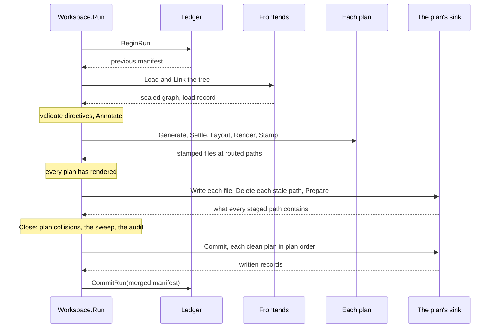

# RFC-0017: The end-to-end run, its manifest and its commit

## Summary

`Workspace.Run` takes a source tree from Load to a committed record. The
composition registers its frontends, so the run loads and links the tree
itself. Every plan renders first. Each plan then stages into a sink of its
own, and the sink reports what every staged path contains before anything
is written. That report decides drift, adoption and collisions with
hand-written files. Close checks the plans against each other, sweeps the
outputs of plans the composition no longer declares and verifies the
metadata completeness contracts. Each clean plan then commits, and a ledger
in the brand's state directory records the merged manifest strictly last. A
crash between the two leaves files that the next run derives again byte for
byte. Cancellation stops the run between units of work, and the report
states each plan's outcome. A pipeline suite in the kernel checks one plan
against this contract over real source.

## Motivation

### The frame stopped at a commit that nothing recorded

The run started from a graph the caller loaded. It annotated, generated,
settled and rendered every plan, opened one sink for the whole run, and
committed every plan's files in one commit. It recorded nothing about what
it wrote. Four consequences followed.

- A file that no plan produced any more remained on disk, because no record
  listed what the previous run wrote.
- A generated file a person edited was refused at the commit with a plain
  error, after the commit had renamed every file before it in path order.
  The plan was half written, and the finding had no code.
- One Error anywhere withheld every plan's files. A plan could not fail
  alone, so one broken plan blocked every other plan in the workspace.
- A cancelled context stopped the frame between plugins, and a cancellation
  during the commit was not observed. The report listed written files and
  no plan's outcome.

### The specification's commit was not built

The specification gives each plan a staging of its own, decides ownership
from the provenance trailer, keeps a manifest of every generated file in the
brand's state directory, and commits in two phases with the ledger last. The
output contract built the trailer and the sinks. It left the manifest,
drift, adoption, the lock and the removal of stale files to separate
proposals. This proposal takes all of them except the lock, together with
the frame that calls them.

## Detailed design

### Components

| Component | Package | Responsibility |
|---|---|---|
| `Builder.Frontends`, `Builder.Ledger`, `Builder.Workspace` | `core/workspace` | The composition's readers, its record and its name |
| `Input`, `Report`, `PlanReport`, `PlanStatus` | `core/workspace` | One run's inputs and outcome |
| The run | `core/workspace` | Begin, Load, Annotate, the render, the staging, Close, the commits and the record, in that order |
| `Sink.Delete`, `Sink.Prepare`, `Change`, `Found`, `ActionDeleted` | `core/output` | Staged removal, and what each staged path contains before a commit |
| `stagefile.Replace` | `core/internal/stagefile` | The replacement of one file through a synced staging file, which the disk sink and the disk ledger share |
| `manifest.Manifest`, `manifest.Entry` | `core/manifest` | The versioned record of every generated file |
| `ledger.Ledger`, `ledger.Dir`, `ledger.Mem` | `core/ledger` | Reading the previous record and writing this run's, in `.<brand>/` |
| Six codes | `core/workspace` | Drift, foreign files, plan collisions, kept outputs, unreadable records and unmet contracts |
| `pipelinetest.RunPipelineSuite` and its five checks | `core/workspace/pipelinetest` | One plan over real source, checked for its bytes, its record, its idempotence and its independence of the directory |
| The end-to-end fixture | `eidos-conformance` tests | A stub generator and an audit weaver over Go source, through the Go backend |

### The composition

```go
// Frontends registers the frontends a run loads its tree with, in
// load order. Build refuses a nil frontend, a frontend without a
// declared version, because every unit key folds the version, an
// empty name, a name another frontend of the composition already has,
// and a frontend named after a kernel phase. A language's frontend and
// backend may share the language's name, as the Go satellite's both
// report under golang.
func (b *Builder) Frontends(fs ...plugin.Frontend) *Builder

// Ledger declares where a run reads the previous run's record and
// writes its own: open returns a fresh ledger, and every run of a
// composition declaring output calls it once before it loads. A
// composition declaring no ledger runs as if no run had ever
// committed: it removes nothing, and records nothing.
func (b *Builder) Ledger(open func() (ledger.Ledger, error)) *Builder

// Workspace names the workspace in its manifest. Empty leaves the name
// to the ledger, and the disk ledger records the base name of the
// workspace root.
func (b *Builder) Workspace(id string) *Builder
```

### The run

```go
// Input is what one run reads: a tree the composition's frontends
// load, or a graph the caller loaded or built. Exactly one of Tree and
// Graph is set.
type Input struct {
    // Tree is the workspace tree. Every path in a run is relative to
    // its root.
    Tree fs.FS
    // Stores are the read-only trees dependency units read, keyed by
    // store name: a Go module cache, a JDK's ct.sym.
    Stores map[string]fs.FS
    // Graph is a sealed graph, or one the run seals. The run starts at
    // directive validation and audits every declaration in it.
    Graph *store.Graph
    // Dry runs every phase and commits nothing: each plan stages,
    // prepares and discards, and the ledger records nothing.
    Dry bool
}

// Run takes the input through the frame and returns what happened.
//
// A plan that reports an Error commits nothing, and its siblings
// commit. An Error in a phase every plan shares, Load, validation,
// Annotate or Close, commits nothing at all. Every finding is in the
// report's sink, and any Error returns ErrRunFailed beside the report.
// A cancelled context stops the run between units of work and returns
// the context's error beside the report, which states each plan's
// outcome. An input that sets neither or both of a tree and a graph is
// the one refusal that returns a nil report.
func (w *Workspace) Run(ctx context.Context, in Input) (*Report, error)

// Report is what a run leaves behind: its findings, its facts, each
// plan's outcome and the manifest it recorded.
type Report struct {
    // Sink has every finding of the run: the shared phases' first, then
    // each plan's in composition order, then Close's.
    Sink  *diag.Sink
    Facts *meta.Facts
    // Load is the load's record, nil for a graph the caller handed over.
    Load *load.Report
    // Plans has one entry per plan, in composition order.
    Plans []PlanReport
    // Swept lists the files the run removed for plans the composition
    // no longer declares, sorted by path.
    Swept []output.Written
    // Manifest is the record the run committed, or the record it would
    // commit under Dry. A run that commits nothing records the previous
    // record's entries.
    Manifest manifest.Manifest
    // Emits is each plan's store, keyed by plan name. It is empty where
    // the frame stopped before the plans ran.
    Emits map[string]*plugin.Emit
}

// PlanReport records one plan's status and the changes its commit
// made, or would make under Dry.
type PlanReport struct {
    Name   string
    Status PlanStatus
    // Changes lists what the plan's commit did to each path, or what it
    // would do under Dry, sorted by path. A path the commit refused is
    // absent, and a plan that did not commit lists nothing.
    Changes []output.Change
}

// PlanStatus is how one plan's run ended. The zero value names no
// status.
type PlanStatus uint8

const (
    // PlanCommitted reports a plan whose staging committed.
    PlanCommitted PlanStatus = 1
    // PlanFailed reports a plan that reported an Error or returned an
    // error, or that a shared phase's Error kept from committing.
    PlanFailed PlanStatus = 2
    // PlanCancelled reports a plan whose commit the run's cancellation
    // skipped.
    PlanCancelled PlanStatus = 3
    // PlanPrepared reports a plan of a dry run, which prepared and
    // committed nothing.
    PlanPrepared PlanStatus = 4
)
```

`Report.Written` is deleted. A plan's written records are its `Changes`.

The run in order:



1. **Begin.** The run opens the ledger and reads the previous manifest. An
   unreadable record is `UnreadableRecord`, an Info, and the run proceeds
   with the empty manifest, so it removes nothing. A composition without
   output or without a ledger reads the empty manifest.
2. **Load.** The run loads the tree with the composition's frontends, the
   composition's brand and fingerprint, and the input's stores. Load
   excludes the brand's own outputs by their trailers before anything
   parses. A graph the caller handed over is sealed instead.
3. **Annotate.** Directive validation, the stamp replay, the kernel's drops
   and the annotate schedule run as before.
4. **Render**, each plan in parallel: Generate, Settle, Layout, Render and
   Stamp, over the plan's own emit store, scoped index, readers and
   findings. The plans run after a shared Error too, so the report has
   every plan's store and findings.
5. **Stage**, each plan in parallel, after every plan has rendered and only
   where no shared phase reported an Error. The plan opens its sink, writes
   each file at its routed path, stages the removal of each stale entry
   that no plan of the run routes a file to, and calls `Prepare`. The
   preparation's verdicts decide whether the plan can commit. The run then
   merges each plan's findings into the report's sink in composition order.
6. **Close**, on one goroutine, over the plans' records: plan collisions,
   the sweep of plans the composition no longer declares, and the audit.
7. **Commit.** Each plan that can commit commits, in composition order. The
   sweep commits after them.
8. **Record.** The ledger records the merged manifest, strictly after the
   last commit.

The barrier between the render and the staging protects a file that moved
between plans. The file is a stale entry of the plan that wrote it before
and a routed path of the plan that writes it now. Every plan's routes are
known before any plan stages, so no plan stages the removal of a path that
a plan of the run writes.

### Drift, adoption and collisions with hand-written files

The sink gains two methods and reports, per staged path, what the
destination contains before anything is written.

```go
type Sink interface {
    // Write stages one file. It refuses an invalid path, a path staged
    // before or staged for removal, a path that cannot exist beside the
    // staged ones, and a call after Prepare.
    Write(path string, body []byte) error
    // Delete stages the removal of one file. It refuses an invalid
    // path, a path staged for writing, a path staged before, and a call
    // after Prepare. Every call after Commit or Discard returns
    // ErrFinished.
    Delete(path string) error
    // Prepare reads the destination and returns, per staged path in
    // path order, the action Commit takes and what the path contains
    // now. It writes nothing. A sink prepares once, before Commit or
    // Discard, and refuses a second call.
    Prepare() ([]Change, error)
    // Commit makes the staged files real, one atomic rename per file,
    // write-if-changed. A sink over a destination that has files of its
    // own refuses to overwrite a file its brand did not write. It
    // removes a staged removal's file only where the file is the brand's
    // intact output, and leaves any other file in place without a
    // record. It keeps going past a file that fails, joining the errors.
    Commit() ([]Written, error)
    // Discard drops the staged files without touching the destination.
    Discard() error
}

// Change is one staged path before the commit.
type Change struct {
    Path string
    // Action is what Commit does to the path when it proceeds.
    Action Action
    // Found is what the path contains before the commit.
    Found Found
    // Hash is "sha256:" and the hex digest of the staged bytes, empty
    // for a removal.
    Hash string
}

// Found is what a destination path contains before a commit, as the
// brand's trailer proves it. The zero value names no verdict.
type Found uint8

const (
    // FoundNothing reports a path with no file.
    FoundNothing Found = 1
    // FoundSame reports a file whose bytes equal the staged bytes.
    FoundSame Found = 2
    // FoundIntact reports the brand's intact output: a frame under the
    // brand and a body that hashes to its trailer.
    FoundIntact Found = 3
    // FoundDrifted reports the brand's frame over a body edited since
    // its stamp.
    FoundDrifted Found = 4
    // FoundForeign reports a path without the brand's frame: a
    // hand-written file, another tool's output, a generated file whose
    // trailer was deleted, or a directory.
    FoundForeign Found = 5
)

// ActionDeleted reports a file the commit removed.
const ActionDeleted Action = 3
```

A file with bytes after its trailer has no frame that parses, because the
trailer is the frame's final line. It is `FoundForeign`.

The run reads each staged path's `Found`:

| Found | Where the plan writes | Where the plan removes a stale entry |
|---|---|---|
| `FoundNothing` | The file is created | The entry leaves the manifest |
| `FoundSame` | Nothing is written. A path without an entry is adopted into the manifest | Not reported for a removal |
| `FoundIntact` | The file is updated | The file is removed, and the entry leaves the manifest |
| `FoundDrifted` | `DriftedOutput`, an Error naming the plan the record lists for the path, or the writing plan where the record lists none. The plan commits nothing, and the file remains as edited | `KeptOutput`, a Warning. The file remains, and its entry remains in the manifest |
| `FoundForeign` | `ForeignFile`, an Error naming the path and the kind and name of the declaration routed to it. The plan commits nothing | `KeptOutput`, a Warning. The file remains, and the entry leaves the manifest, because the file is now hand-written |

Ownership is decided from the bytes, so a fresh clone with no state
directory gets the same verdicts. The manifest supplies the plan a drift
finding names and the list of files to remove. A run can accept a loss only
through options this proposal does not add: a drifted or foreign path where
a plan writes fails that plan.

The disk sink checks each path again at the commit. A written path whose
file changed after `Prepare` is refused, and the plan's commit returns the
error with the records of the files it wrote. A removal whose file changed
after `Prepare` is skipped without an error, and the entry remains in the
manifest.

### The manifest

```go
// Package manifest encodes the record of every file a workspace
// generated: versioned, deterministic, and public.
package manifest

// Version is the format this package writes and reads.
const Version = 1

// Manifest is the record of every generated file of one workspace.
type Manifest struct {
    Version   int    `json:"version"`
    Workspace string `json:"workspace"`
    // Files is sorted by path, one entry per path.
    Files []Entry `json:"files"`
}

// Equal reports whether two manifests record one version, one
// workspace name and the same files. A nil list and an empty one are
// equal, which is how Encode writes both. Equal allocates nothing.
func (m Manifest) Equal(o Manifest) bool

// Entry is one generated file.
type Entry struct {
    // Path is workspace-relative and slash-separated.
    Path string `json:"path"`
    // Plan is the plan that wrote the file.
    Plan string `json:"plan"`
    // Hash is "sha256:" and the hex digest of the file's bytes, frame
    // included: the value Written.Hash records.
    Hash string `json:"hash"`
    // Plugins are the emitters whose units assembled the file and the
    // plugins that appended into the units' slots, distinct and sorted:
    // the names the file's frame attributes it to.
    Plugins []plugin.ID `json:"plugins"`
    // Sources are the canonical identities of the declarations the file
    // derives from, sorted, in the canonical spelling that symbol.Parse
    // reads back.
    Sources []string `json:"sources"`
}

// Encode returns the manifest's bytes: JSON indented by two spaces,
// with a final newline, and [] wherever a list is nil. Two equal
// manifests encode to equal bytes. It refuses a manifest that breaks
// the package's invariants, naming the first entry that breaks one.
func Encode(m Manifest) ([]byte, error)

// Decode reads a manifest. It returns an error wrapping ErrUnsupported
// for another version, for bytes that are not a JSON object of the
// format, and for a record that breaks the package's invariants. A key
// the format does not know is skipped.
func Decode(b []byte) (Manifest, error)

// ErrUnsupported reports a manifest this package cannot read.
var ErrUnsupported = errors.New("manifest: unsupported format")
```

The invariants are the format's version, workspace-relative and
slash-separated paths in sorted order with one entry per path, a plan on
every entry, a hash of `sha256:` and 64 lowercase hex digits, and plugins
and sources sorted with no repeat.

An entry's sources are the canonical identities of the origins of the units
that assembled the file. The frame's derivation lines list the units'
routing keys instead: a source file, or a package path. An entry's plugins
are the plugins the frame's derivation lines list: the emitters whose units
assembled the file, and the plugins that appended into the units' slots.
The record contains no clock, no command line and no absolute path, so two
runs over one tree write the same bytes.

### The ledger

```go
// Package ledger reads and writes a run's record in the brand's state
// directory.
package ledger

// Ledger is one run's access to the record: the manifest the last
// committed run recorded, read before the run loads, and the manifest
// this run commits, written strictly after every plan commit. A Ledger
// serves one run.
type Ledger interface {
    // BeginRun returns the recorded manifest, and the empty manifest
    // where no run has committed. An error means the record exists and
    // does not read, and the run proceeds as if no run had committed.
    BeginRun(ctx context.Context) (manifest.Manifest, error)
    // CommitRun records the run's manifest. A manifest equal to the
    // recorded one writes nothing, so a run that changed nothing
    // touches no file of the state directory either.
    CommitRun(ctx context.Context, m manifest.Manifest) error
}

// StateDir returns the brand's state directory, workspace-relative:
// .<brand>.
func StateDir(brand output.Brand) string

// ManifestPath returns where the brand's manifest is recorded,
// workspace-relative and slash-separated: .<brand>/manifest.json.
func ManifestPath(brand output.Brand) string

// OpenDir returns the ledger of the state directory .<brand>/ under
// root, which it creates on the first commit. A manifest without a
// workspace name is recorded under the base name of root. A commit
// writes the manifest to a staging file beside it, syncs it, renames
// it over the manifest and syncs the directory, so a reader sees the
// old record or the new one. It refuses a brand outside
// output.Brand.Valid and a root that is not a directory.
func OpenDir(root string, brand output.Brand) (*Dir, error)

// NewMem returns a ledger that records in memory, for tests and for a
// composition that keeps no state. One Mem serves any number of runs
// one after another.
func NewMem() *Mem

// Writes returns how many commits changed the record: what a test
// reads to tell a run that changed nothing from one that rewrote the
// record.
func (l *Mem) Writes() int
```

The ledger records the manifest and nothing else. It writes no artifact
table: an artifact row keys on the read sets of the matches that produced
the file, and no part of this proposal collects read sets per file.

The disk sink and the disk ledger replace a file the same way, through
`stagefile.Replace` in `core/internal/stagefile`. It writes the staging
file, syncs and closes it, renames it over the target, and removes the
staging file where any step fails. Every path resolves inside the workspace
root through an `os.Root`.

### Close

Close runs on one goroutine after every plan has staged and prepared. It
reads records, never emit values.

1. **Plan collisions.** Two plans that route files to one path, to two
   paths that differ only in case, or to a path another needs as a
   directory are `PlanCollision`, an Error at the second plan's file with
   the first plan's file as related. No plan of the run commits.
2. **The sweep.** A stale entry is an entry of the previous manifest whose
   path no plan of this run routes a file to, and whose plan either ran in
   this run or is no longer declared. A plan stages the removal of its own
   stale entries in its staging. Close stages the removals of the plans the
   composition no longer declares into a sink of their own. Each removal
   then follows the removal column of the drift table. A failed plan
   removes nothing, and its entries remain as they were. A run that a
   shared Error or a collision blocks sweeps nothing.
3. **The audit.** For every metadata key that declares a completeness
   contract, every declaration of the contract's kinds that lacks the key
   is `UnmetContract`, at the declaration's position and at the contract's
   severity. The audit covers the declarations of units loaded at full
   depth, and every declaration of a graph the caller handed over, because
   a dependency's declarations are signatures that no annotator is
   promised to stamp. An `UnmetContract` at Error severity blocks every
   commit, as any Error at Close does.
4. **The merge.** The merged manifest contains, per plan that commits, the
   entries of the files it routed and the stale entries whose files
   remain: a drifted file, and the brand's intact output that the commit
   skipped because it changed after `Prepare`. Per plan that does not
   commit, it contains the plan's previous entries unchanged. A removed
   plan's entries leave the manifest where the sweep commits, except the
   entries whose files remain. A path a committing plan routes a file to
   takes that plan's entry, whatever plan the previous entry named.

This proposal adds no workspace check role and no plan exports, so Close
runs no check and publishes no export.

### The commit and its crash windows

The commit is two-phase. Every plan stages first, and nothing is written
until Close has read every plan's record. The clean plans then commit one
after another, and `CommitRun` runs strictly after the last of them. So the
record never lists a file that the disk does not contain.

| The run stops | The disk | The record | The next run |
|---|---|---|---|
| Before any commit | Unchanged, because staging is in memory | The previous manifest | Derives again and writes what changed |
| During a plan's commit | Each file old or new, never half, by the per-file rename | The previous manifest | Derives the same bytes: renamed files are `FoundSame` and the rest are written |
| Between the last commit and `CommitRun` | Every committed file new | The previous manifest | Every path is `FoundSame`, so nothing is written. A new path missing from the old record is adopted, and the record is written |

The kernel's tests produce the third window with a ledger whose
`CommitRun` returns an error. A second run over the same tree then uses a
disk ledger. It reports `FoundSame` for every path, writes no file, moves no
mtime and writes the record.

### Cancellation

The run checks its context at these points:

- Before the load, inside the load, and after it
- Before the annotate schedule, and before each annotator and each
  generator
- Before Layout and before `Prepare`
- Before each plan's commit

A plan's render and a plan's commit run to their end once begun. No file is
half written as a result, and no plan is half committed. A cancellation
observed before a plan's commit skips that commit and the commit of every
plan after it, the sweep's included. Those plans report `PlanCancelled`, and their sinks
discard their staging. `CommitRun` still runs where a plan or the sweep
committed. It runs under `context.WithoutCancel`: the record has to match
the disk. Run returns the context's error joined with any other error. The
report states each plan's outcome.

### Failure semantics

| Code | Name | Severity | Position | Meaning |
|---|---|---|---|---|
| EID-0055 | `DriftedOutput` | Error | The origin of the file's first declaration | A generated file was edited since its stamp, and the run does not overwrite it |
| EID-0056 | `ForeignFile` | Error | The origin of the file's first declaration | A generated path contains a file the brand did not write |
| EID-0057 | `PlanCollision` | Error | The second plan's file, with the first plan's as related | Two plans route a file to one path |
| EID-0058 | `KeptOutput` | Warning | The kept file | A stale output remains, because it was edited or lost its frame |
| EID-0059 | `UnreadableRecord` | Info | The manifest's path | The previous record does not read, and the run removes nothing |
| EID-0060 | `UnmetContract` | The contract's | The declaration | A declaration lacks a fact its key's completeness contract promises |

`UnreadableRecord` reports under the load's phase. The other five report
under Close's. A finding about a file is at the origin of the file's first
declaration, or at the file's own path where that origin has no position.
Nothing in the source causes a failure to open a sink or a ledger, or a
ledger's failure to commit. Run returns each as an error and reports no
finding for it. The ledger's failure to commit leaves the third crash
window.

### The pipeline suite

```go
// Package pipelinetest checks one plan end to end over real source.
package pipelinetest

// Fixture is one plan's end-to-end case: a source tree, the stores its
// load reads, the composition it runs under, and every file the run
// generates.
type Fixture struct {
    // Tree is the source tree. A check copies it into each directory it
    // runs the fixture in.
    Tree fs.FS
    // Stores are the read-only trees the load's dependency units read,
    // keyed by store name.
    Stores map[string]fs.FS
    // Compose builds the workspace over root, the directory a check runs
    // the fixture in: its output is a disk sink at root, and its ledger
    // is the state directory under root. A check composes once per run,
    // and the suite runs its checks in parallel, so Compose builds fresh
    // plugin instances on every call and is safe for concurrent use.
    Compose func(root string) (*workspace.Workspace, error)
    // Want is every file the run generates, frame included, keyed by its
    // workspace-relative, slash-separated path.
    Want map[string][]byte
}

// RunPipelineSuite checks the fixture's one plan against the pipeline
// contract, each check in a parallel subtest over temporary
// directories of its own.
func RunPipelineSuite(t *testing.T, f Fixture)

// AssertClean runs the fixture in root and checks the run: it reports
// no Error, positions every finding at a file, and returns no error.
func AssertClean(tb assert.TB, f Fixture, root string)

// AssertGenerated runs the fixture in root and checks that the files
// under the brand's frame are the fixture's wanted files, byte for byte.
func AssertGenerated(tb assert.TB, f Fixture, root string)

// AssertRecorded runs the fixture in root and checks that the state
// directory's record lists exactly the wanted paths, each under the
// composition's one plan and with the digest of the file at the path.
func AssertRecorded(tb assert.TB, f Fixture, root string)

// AssertIdempotent runs the fixture twice in root and checks that the
// second run changes no byte and moves no mtime. It sets every file's
// times to an instant in the past between the runs, so a rewrite moves
// an mtime on a file system of any timestamp resolution.
func AssertIdempotent(tb assert.TB, f Fixture, root string)

// AssertRelocated runs the fixture in two directories and checks that
// the runs generate the same bytes and record the same files.
func AssertRelocated(tb assert.TB, f Fixture, one, two string)
```

Every check runs one plan, and a composition of any other number of plans
fails each check. `AssertClean` alone judges the run's error and findings.
The other checks read what the runs left on disk. Each check also takes the
assert module's `TB` role on its own, and the kernel's tests run each check
against compositions it must reject.

The suite is kernel code and imports no satellite. The Go fixture runs in
`eidos-conformance`, the module whose tests load every satellite's corpus.
A plugin module cannot host it: it imports the SDK facade alone, and the
facade does not re-export the workspace. The fixture's module declares
`Store` in `svc/store.go` under `//+acme:stub tag=test`. A stub generator
declares a primary and a test family, and the author's tag picks the test
family. The
stub declares each method on a pointer receiver through `eidos.Mirror` and
the satellite's `PointerReceiver`, and delegates each call to a wrapped
`Store`. An audit weaver appends one delegate call into the prologue of
every method the generator emits. A fixture store provides the standard
library's `context` package to the load, and the suite expects
`svc/store_stub_test.go`. The kernel's own tests cover drift, adoption, the
sweep, the audit, the crash window and cancellation with fixture frontends
and backends.

### Cost

- Each plan keeps its staged files in memory until its commit, as the run
  did before.
- `Prepare` reads every destination file once, and the disk sink's commit
  reads each again to write only what changed and to refuse a file that
  changed after `Prepare`.
- The end-to-end benchmark, 1,000 packages of 200 declarations through a
  memory sink on one worker, measures about 483,000 allocations and 136 to
  148 ms per run over 10 iterations, under its ceiling of 520,000
  allocations. Its peak RSS is 228 to 236 MB in a process that runs one
  iteration.
- The manifest has one entry per generated file. Encoding, decoding and
  comparing it is linear. At 10,000 files, `Decode` allocates about four
  times per entry, `Encode` allocates once per growth step of its buffers,
  19 to 93 times, and `Equal` allocates nothing.
- The audit costs one binary search of the key's sorted facts per
  declaration per contract.

### Migration

| Caller | Change |
|---|---|
| 47 call sites of `Workspace.Run` across 8 test files | 46 move the graph into `Input.Graph` |
| `workspace/compose_test.go`, the one test that loaded with `load.Load` and then ran | It registers its frontend and passes `Input.Tree` |
| `Report.Written`, read in 3 test files | Read `Plans[i].Changes` |
| `output.Disk`, `output.Mem`, `output.Tee` | Implement `Delete` and `Prepare` |
| The sink's test doubles | Implement the two methods |
| `eidos-sdk` | The facade regenerates for the new exported names |

## Alternatives considered

### One sink per run, committed as one

The run stages every plan into one sink and commits once, as it did before.
It keeps one commit per run. It lost on plan isolation. A plan's failure
withholds every plan's files. A cross-plan finding at Close also has no
per-plan staging it can withhold. One sink per plan is the decision already
recorded for the composition's output.

### Stage each plan as soon as it renders

Each plan opens its sink and prepares the moment its own render finishes,
with no barrier between the plans. A fast plan's staging overlaps a slow
plan's render. It lost on files that move between plans. The old plan
stages the removal of its stale entry before the new plan has routed the
path, and the old plan's commit can remove the file the new plan writes.
The barrier costs that overlap and nothing else.

### Detect drift at the commit

The disk sink already refuses to overwrite an edited file, and the run
could turn that refusal into a finding. It lost on two counts. The refusal
arrives mid-commit, after the commit has written the files before it in
path order, which leaves the plan half committed. A dry run also needs the
verdict without committing anything.

### Refuse a stale removal at the commit

The sink returns an error for a staged removal whose file drifted or lost
the brand's frame. It lost because a staged removal cannot be unstaged: the
error would fail the plan's whole commit over a file the plan no longer
writes. `Prepare` reports the verdict instead, the run reports
`KeptOutput`, and the commit skips the file.

### Decide ownership from the manifest

A file the manifest lists belongs to the brand, and the recorded hash
decides drift. It lost because nobody commits the manifest. A fresh clone
and a CI runner start without a state directory, and their verdicts must
match a developer's. The trailer decides ownership. The manifest supplies
the plan a drift finding names and the list of files to remove.

### Write the manifest at Close

Close computes the merged manifest and could write it at once. It lost on
the crash window. A crash between that write and the plan commits leaves a
record of files the disk does not contain. The next run then reads a
missing file as one a person deleted. Writing the record last makes every
crash window conservative.

### An artifact table in the same commit

The ledger writes the artifact rows the warm path keys on beside the
manifest. It lost because a row keys on the read sets of the matches that
produced the file. No part of the run collects read sets per file. A table
whose key cannot be computed records nothing a reader can trust.

### A lock on the state directory

A run takes an exclusive lock on `.<brand>/`, and a second run fails
immediately. It is the specification's rule. It lost here on portability.
The Go standard library offers `syscall.Flock` on Unix systems. Windows has
no equivalent outside `golang.org/x/sys`, which the kernel does not import.
Without the lock, two concurrent runs can each commit, and the ledger
records the last manifest. The ownership rule still protects every file the
brand did not write.

## Drawbacks

- `Workspace.Run` changes signature, and its 47 call sites across 8 test
  files change with it. `load.Load` remains public for the 20 call sites
  that load and do not run.
- `output.Sink` gains two methods, so every implementation outside the
  kernel breaks until it adds them.
- `Report.Written` is deleted, and 3 test files read the plan reports
  instead.
- The kernel gains the packages `manifest`, `ledger`, `pipelinetest` and
  `internal/stagefile`. The workspace gains six codes, and the run gains a
  second read of every output file.
- A plan's staging waits for the slowest plan's render.
- Without a lock, two runs over one workspace at once can interleave their
  commits. Each file is still whole and the brand's, and the record lists
  the files of whichever run committed last.
- A plan with one drifted file commits nothing, so one hand edit blocks
  every other change of that plan until the edit moves into source or is
  reverted.
- The audit reads every declaration of a full-depth unit once per contract,
  which is linear in the workspace and runs on every run.

## Open questions

None.

## Unresolved and future work

- The options that accept a loss, overwriting a drifted file or replacing a
  foreign one, need the run to tell the sink which refusals to skip, and
  are not proposed here.
- A narrowed run, which reads part of the workspace and removes only the
  outputs of what it read, is not proposed here. The runs this proposal
  describes read the whole workspace.
- Plan exports and the workspace check role run in Close, and are not
  proposed here.
- The lock on the state directory needs a lock primitive on every platform
  the kernel supports.

## References

| What | Where |
|---|---|
| Workspaces and plans, the frame this run implements | [08-workspace-and-plans.md](../architecture/08-workspace-and-plans.md) |
| Output and determinism: the sink contract, drift, adoption and the manifest | [17-output-and-determinism.md](../architecture/17-output-and-determinism.md) |
| Testing and conformance: the pipeline suite | [13-testing-and-conformance.md](../architecture/13-testing-and-conformance.md) |
| D26, D30, D42 and D63: the sink, drift, adoption and the trailer | [21-decisions.md](../architecture/21-decisions.md) |
| D60 and D61: the runtime and the two-phase commit | [21-decisions.md](../architecture/21-decisions.md) |
| D98: one sink for each plan a run commits | [21-decisions.md](../architecture/21-decisions.md) |
| `syscall.Flock`, present on Unix ports only, checked at go1.27.1 | https://pkg.go.dev/syscall#Flock |
