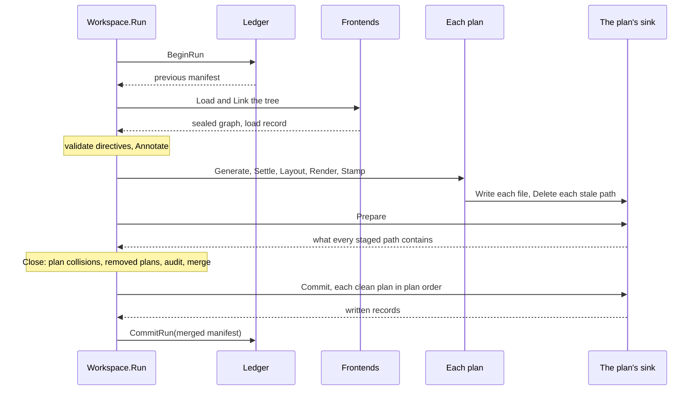

# RFC-0017: The end-to-end run, its manifest and its commit

## Summary

`Workspace.Run` takes a source tree from Load to a committed record. The
composition registers its frontends, so the run loads and links the tree
itself. Each plan stages into a sink of its own, and the sink reports what
every staged path contains before anything is written. That report decides
drift, adoption and collisions with hand-written files. Close checks the
plans against each other, removes the outputs no plan produces any more and
verifies the metadata completeness contracts. Each clean plan then commits,
and a ledger in the brand's state directory records the merged manifest
strictly last. A crash between the two leaves files that the next run
derives again byte for byte. Cancellation stops the run between units of
work, and the report states each plan's outcome. A pipeline suite in the
kernel checks one plan against this contract over real source.

## Motivation

### The frame stops at a commit that nothing records

The run starts from a graph the caller loaded (`workspace/run.go:44`). It
annotates, generates, settles and renders every plan, opens one sink for the
whole run, and commits every plan's files in one commit
(`workspace/write.go:124`). It records nothing about what it wrote. Four
consequences follow.

- A file that no plan produces any more remains on disk, because no record
  lists what the previous run wrote.
- A generated file a person edited is refused at the commit with a plain
  error (`output/disk.go:106`), after the commit renamed every file before it
  in path order. The plan is half written, and the finding has no code.
- One Error anywhere withholds every plan's files. A plan cannot fail alone,
  so one broken plan blocks every other plan in the workspace.
- A cancelled context stops the frame between plugins, and a cancellation
  during the commit is not observed. The report lists written files and no
  plan's outcome.

### The specification's commit is not built

The specification gives each plan a staging of its own, decides ownership
from the provenance trailer, keeps a manifest of every generated file in the
brand's state directory, and commits in two phases with the ledger last. The
output contract built the trailer and the sinks. It left the manifest, drift,
adoption, the lock and the removal of stale files to separate proposals.
This proposal takes all of them except the lock, together with the frame
that calls them.

## Detailed design

### Components

| Component | Package | Responsibility |
|---|---|---|
| `Builder.Frontends`, `Builder.Ledger`, `Builder.Workspace` | `core/workspace` | The composition's readers, its record and its name |
| `Input`, `Report`, `PlanReport`, `PlanStatus` | `core/workspace` | One run's inputs and outcome |
| The run | `core/workspace` | Load, the plans, Close, the commits and the record, in that order |
| `Sink.Delete`, `Sink.Prepare`, `Change`, `Found`, `ActionDeleted` | `core/output` | Staged removal, and what each staged path contains before a commit |
| `manifest.Manifest`, `manifest.Entry` | `core/manifest` | The versioned record of every generated file |
| `ledger.Ledger`, `ledger.Dir`, `ledger.Mem` | `core/ledger` | Reading the previous record and writing this run's, in `.<brand>/` |
| Six codes | `core/workspace` | Drift, foreign files, plan collisions, kept outputs, unreadable records and unmet contracts |
| `pipelinetest.RunPipelineSuite` | `core/workspace/pipelinetest` | One plan over real source, checked for its bytes, its routes, its manifest and its idempotence |
| The end-to-end fixture | `eidos-lang-go` tests | A stub generator and an audit weaver over Go source, through the Go backend |

### The composition

```go
// Frontends registers the frontends a run loads its tree with, in
// load order. Build refuses a frontend without a declared version,
// because every unit key folds the version, and a name another plugin
// of the composition already has.
func (b *Builder) Frontends(fs ...plugin.Frontend) *Builder

// Ledger declares where a run reads the previous run's record and
// writes its own: open returns a fresh ledger, and every run calls it
// once before it loads. A composition declaring no ledger runs as if
// no run had ever committed: it removes nothing, and records nothing.
func (b *Builder) Ledger(open func() (ledger.Ledger, error)) *Builder

// Workspace names the workspace in its manifest. Empty leaves the name
// to the ledger, and the disk ledger records the base name of the
// workspace root.
func (b *Builder) Workspace(id string) *Builder
```

### The run

```go
// Input is what one run reads: a tree the composition's frontends
// load, or a graph the caller loaded or built. Exactly one of Tree and
// Graph is set.
type Input struct {
    // Tree is the workspace tree. Every path in a run is relative to
    // its root.
    Tree fs.FS
    // Stores are the read-only trees dependency units read, keyed by
    // store name: a Go module cache, a JDK's ct.sym.
    Stores map[string]fs.FS
    // Graph is a sealed graph. The run starts at directive validation
    // and audits every declaration in it.
    Graph *store.Graph
    // Dry runs every phase and commits nothing: each plan stages,
    // prepares and discards, and the ledger records nothing.
    Dry bool
}

// Run takes the input through the frame and returns what happened.
//
// A plan that reports an Error commits nothing, and its siblings
// commit. An Error in a phase every plan shares, Load, validation,
// Annotate or Close, commits nothing at all. Every finding is in the
// report's sink, and any Error returns ErrRunFailed beside the report.
// A cancelled context stops the run between units of work and returns
// the context's error beside the report, which states what committed.
// A missing input is the one refusal that returns a nil report.
func (w *Workspace) Run(ctx context.Context, in Input) (*Report, error)

// Report is what a run leaves behind: its findings, its facts, each
// plan's outcome and the manifest it recorded.
type Report struct {
    Sink  *diag.Sink
    Facts *meta.Facts
    // Load is the load's record, nil for a graph the caller handed over.
    Load *load.Report
    // Plans has one entry per plan, in composition order.
    Plans []PlanReport
    // Swept lists the files the run removed for plans the composition
    // no longer declares.
    Swept []output.Written
    // Manifest is the record the run committed, or the record it would
    // commit under Dry.
    Manifest manifest.Manifest
    // Emits is each plan's store, keyed by plan name.
    Emits map[string]*plugin.Emit
}

// PlanReport records one plan's status and the changes its commit
// made, or would make under Dry.
type PlanReport struct {
    Name   string
    Status PlanStatus
    // Changes lists what the plan's commit did to each path, or what it
    // would do under Dry, sorted by path.
    Changes []output.Change
}

// PlanStatus is how one plan's run ended.
type PlanStatus uint8

const (
    // PlanCommitted reports a plan whose staging committed.
    PlanCommitted PlanStatus = 1 // committed
    // PlanFailed reports a plan that reported an Error, or that a
    // shared phase's Error kept from committing.
    PlanFailed PlanStatus = 2 // failed
    // PlanCancelled reports a plan whose commit the run's cancellation
    // skipped.
    PlanCancelled PlanStatus = 3 // cancelled
    // PlanPrepared reports a plan of a dry run, which prepared and
    // committed nothing.
    PlanPrepared PlanStatus = 4 // prepared
)
```

`Report.Written` is deleted. A plan's written records are its `Changes`.

The run in order:



1. **Begin.** The run opens the ledger and reads the previous manifest. An
   unreadable record is `UnreadableRecord`, an Info, and the run proceeds
   with the empty manifest, so it removes nothing.
2. **Load.** The run loads the tree with the composition's frontends, the
   composition's brand and fingerprint, and the input's stores. Load
   excludes the brand's own outputs by their trailers before anything
   parses.
3. **Annotate.** Directive validation, the kernel's drops and the annotate
   schedule run as they do today.
4. **Each plan**, in parallel: Generate, Settle, Layout, Render and Stamp.
   The plan opens its sink, writes each file at its routed path, stages the
   removal of each stale path (see the sweep below), and calls `Prepare`.
   The plan's findings go to a sink of the plan's own, which the run merges
   into the report's sink in plan order when the plans finish.
5. **Close**, on one goroutine, over the plans' records: plan collisions,
   the removal of outputs whose plan left the composition, the audit, and
   the merged manifest.
6. **Commit.** Each plan with no Error commits, in composition order. The
   removed plans' sweep commits after them.
7. **Record.** The ledger records the merged manifest, strictly after the
   last commit.

### Drift, adoption and collisions with hand-written files

The sink gains two methods and reports, per staged path, what the
destination contains before anything is written.

```go
type Sink interface {
    // Write stages one file. It also refuses a path staged for
    // deletion.
    Write(path string, body []byte) error
    // Delete stages the removal of one file. It refuses an invalid
    // path, a path staged for writing and a path staged before, and
    // every call after Commit or Discard.
    Delete(path string) error
    // Prepare reads the destination and returns, per staged path in
    // path order, the action Commit takes and what the path contains
    // now. It writes nothing. A sink prepares once, before Commit or
    // Discard, and refuses a second call.
    Prepare() ([]Change, error)
    // Commit and Discard are unchanged, except that Commit performs
    // the staged removals and refuses to remove a file the brand did
    // not write or a file edited since its stamp.
    Commit() ([]Written, error)
    Discard() error
}

// Change is one staged path before the commit.
type Change struct {
    Path string
    // Action is what Commit does to the path when it proceeds.
    Action Action
    // Found is what the path contains before the commit.
    Found Found
    // Hash is "sha256:" and the hex digest of the staged bytes, empty
    // for a removal.
    Hash string
}

// Found is what a destination path contains before a commit, as the
// brand's trailer proves it.
type Found uint8

const (
    // FoundNothing reports a path with no file.
    FoundNothing Found = 1 // nothing
    // FoundSame reports a file whose bytes equal the staged bytes.
    FoundSame Found = 2 // same
    // FoundIntact reports the brand's intact output: a frame under the
    // brand and a body that hashes to its trailer.
    FoundIntact Found = 3 // intact
    // FoundDrifted reports the brand's frame over a body edited since
    // its stamp.
    FoundDrifted Found = 4 // drifted
    // FoundForeign reports a file without the brand's frame: a
    // hand-written file, another tool's output, or a generated file
    // whose trailer was deleted.
    FoundForeign Found = 5 // foreign
)

// ActionDeleted reports a file the commit removed.
const ActionDeleted Action = 3
```

The run reads each written path's `Found`:

| Found | Manifest entry for the path | Outcome |
|---|---|---|
| `FoundNothing` | Any | The file is created |
| `FoundSame` | Any | Nothing is written. A path without an entry is adopted into the manifest |
| `FoundIntact` | Any | The file is updated |
| `FoundDrifted` | Any | `DriftedOutput`, an Error. The plan commits nothing, and the file remains as edited |
| `FoundForeign` | None | `ForeignFile`, an Error naming the path and the declaration routed to it. The plan commits nothing |
| `FoundForeign` | Present | `ForeignFile` as well: the trailer was deleted by hand, and the file is now hand-written |

Ownership is decided from the bytes, so a fresh clone with no state
directory gets the same verdicts. The manifest adds the plan to name in
a drift finding, and the record of what to remove. A run can accept a
loss only through options this proposal does not add: a drifted or foreign
path fails its plan.

The disk sink keeps its own refusal at the commit. A file that changes
between `Prepare` and `Commit` is refused there, and that plan's commit
returns the error with the records of what it wrote before the refusal.

### The manifest

```go
// Package manifest encodes the record of every file a workspace
// generated: versioned, deterministic, and public.
package manifest

// Version is the format this package writes and reads.
const Version = 1

// Manifest is the record of every generated file of one workspace.
type Manifest struct {
    Version   int    `json:"version"`
    Workspace string `json:"workspace"`
    // Files is sorted by path, one entry per path.
    Files []Entry `json:"files"`
}

// Entry is one generated file.
type Entry struct {
    // Path is workspace-relative and slash-separated.
    Path string `json:"path"`
    // Plan is the plan that wrote the file.
    Plan string `json:"plan"`
    // Hash is "sha256:" and the hex digest of the file's bytes, frame
    // included: the value Written.Hash records.
    Hash string `json:"hash"`
    // Plugins are the emitters whose units assembled the file, sorted.
    Plugins []plugin.ID `json:"plugins"`
    // Sources are the canonical identities of the declarations the file
    // derives from, sorted, in the canonical spelling that symbol.Parse
    // reads back.
    Sources []string `json:"sources"`
}

// Encode returns the manifest's bytes: JSON indented by two spaces,
// with a final newline. Two equal manifests encode to equal bytes.
func Encode(m Manifest) ([]byte, error)

// Decode reads a manifest. It returns an error wrapping
// ErrUnsupported for another version and for bytes that are not a
// manifest.
func Decode(b []byte) (Manifest, error)

// ErrUnsupported reports a manifest this package cannot read.
var ErrUnsupported = errors.New("manifest: unsupported format")
```

An entry's sources are the union of the origins of the units that
assembled the file, which the render pass already reads for the frame's
derivation lines. The record contains no clock, no command line and no
absolute path, so two runs over one tree write the same bytes.

### The ledger

```go
// Package ledger reads and writes a run's record in the brand's state
// directory.
package ledger

// Ledger is one run's access to the record: the manifest the last
// committed run recorded, read before the run loads, and the manifest
// this run commits, written strictly after every plan commit. A Ledger
// serves one run.
type Ledger interface {
    // BeginRun returns the recorded manifest, and the empty manifest
    // where no run has committed. An error means the record exists and
    // does not read, and the run proceeds as if no run had committed.
    BeginRun(ctx context.Context) (manifest.Manifest, error)
    // CommitRun records the run's manifest. A manifest equal to the
    // recorded one writes nothing, so a run that changed nothing
    // touches no file of the state directory either.
    CommitRun(ctx context.Context, m manifest.Manifest) error
}

// OpenDir returns the ledger of the state directory .<brand>/ under
// root, which it creates on the first commit. The manifest is
// .<brand>/manifest.json, and a manifest without a workspace name is
// recorded under the base name of root. A commit writes the manifest
// to a staging file beside it, syncs it, renames it over the manifest
// and syncs the directory, so a reader sees the old record or the new
// one.
func OpenDir(root string, brand output.Brand) (*Dir, error)

// NewMem returns a ledger that records in memory, for tests and for a
// composition that keeps no state.
func NewMem() *Mem
```

The ledger records the manifest and nothing else. It writes no artifact
table: an artifact row keys on the read sets of the matches that produced
the file, and no part of this proposal collects read sets per file.

### Close

Close runs on one goroutine after every plan has staged and prepared. It
reads records, never emit values.

1. **Plan collisions.** Two plans that route a file to one path are each
   `PlanCollision`, an Error naming both plans. Neither plan commits.
2. **The sweep.** A stale entry is an entry of the previous manifest whose
   plan ran in this run and did not route a file to its path, or whose plan
   the composition no longer declares. A plan stages the removal of its own
   stale entries in step 4 of the run, and Close stages the removals for
   plans the composition no longer declares into a sink of their own. A
   stale path that contains the brand's intact output is removed. A stale
   path that contains nothing leaves the manifest. A stale path whose file
   drifted or lost the brand's frame remains on disk under `KeptOutput`, a
   Warning. A drifted path keeps its entry, and a path without the frame
   leaves the manifest, because the file is now hand-written. A failed plan
   removes nothing, and its entries remain as they were.
3. **The audit.** For every metadata key that declares a completeness
   contract, every declaration of the contract's kinds that lacks the key
   is `UnmetContract`, at the declaration's position and at the contract's
   severity. The audit covers the declarations of units loaded at full
   depth, and every declaration of a graph the caller handed over, because
   a dependency's declarations are signatures that no annotator is
   promised to stamp.
4. **The merge.** The merged manifest contains, per plan that commits,
   the entries of the files it routed and the drifted stale entries it
   kept, and per plan that does not commit, its previous entries unchanged.
   A removed plan's entries leave the manifest when their files are
   removed or absent.

This proposal adds no workspace check role and no plan exports, so Close
runs no check and publishes no export.

### The commit and its crash windows

The commit is two-phase. Every plan stages first, and nothing is written
until Close has read every plan's record. The clean plans then commit one
after another, and `CommitRun` runs strictly after the last of them. So the
record never lists a file that the disk does not contain.

| The run stops | The disk | The record | The next run |
|---|---|---|---|
| Before any commit | Unchanged, because staging is in memory | The previous manifest | Derives again and writes what changed |
| During a plan's commit | Each file old or new, never half, by the per-file rename | The previous manifest | Derives the same bytes: renamed files are `FoundSame` and the rest are written |
| Between the last commit and `CommitRun` | Every committed file new | The previous manifest | Every path is `FoundSame`, so nothing is written. A new path missing from the old record is adopted, and the record is written |

The kernel's tests produce the third window with a ledger whose
`CommitRun` returns an error. A second run over the same tree then uses a
disk ledger. It reports `FoundSame` for every path, writes no file and moves
no mtime.

### Cancellation

The run checks its context at these points:

- Before the load, and between the load's phases
- Before each annotator and each generator
- Before Layout and before `Prepare`
- Before each plan's commit

A plan's render and a plan's commit run to their end once begun. No file is
half written as a result, and no plan is half committed. A cancellation
observed before a plan's commit skips that commit and every later one.
Those plans report `PlanCancelled`, and their sinks discard their staging.
`CommitRun` still runs when at least one plan committed. It runs under
`context.WithoutCancel`, because the record has to match the disk. The
ledger records nothing when no plan committed. Run returns the context's
error joined with any other error. The report states each plan's outcome.

### Failure semantics

| Code | Name | Severity | Position | Meaning |
|---|---|---|---|---|
| EID-0055 | `DriftedOutput` | Error | The file's first declaration's origin | A generated file was edited since its stamp, and the run does not overwrite it |
| EID-0056 | `ForeignFile` | Error | The file's first declaration's origin | A generated path contains a file the brand did not write |
| EID-0057 | `PlanCollision` | Error | The second plan's declaration's origin, the first plan's as related | Two plans route a file to one path |
| EID-0058 | `KeptOutput` | Warning | The kept file | A stale output remains, because it was edited or lost its frame |
| EID-0059 | `UnreadableRecord` | Info | The manifest's path | The previous record does not read, and the run removes nothing |
| EID-0060 | `UnmetContract` | The contract's | The declaration | A declaration lacks a fact its key's completeness contract promises |

A failure to open a sink or a ledger, and a ledger's failure to commit, are
returned errors, not findings, because nothing in the source causes them.
The ledger's failure to commit leaves the third crash window above.

### The pipeline suite

```go
// Package pipelinetest checks one plan end to end over real source.
package pipelinetest

// Fixture is one plan's end-to-end case.
type Fixture struct {
    // Tree is the source tree. The suite copies it into a fresh
    // directory for every run it makes.
    Tree fs.FS
    // Stores are the dependency stores the run reads.
    Stores map[string]fs.FS
    // Compose builds the workspace over the root the suite supplies:
    // its output is a disk sink at root and its ledger the state
    // directory under root.
    Compose func(root string) (*workspace.Workspace, error)
    // Want is every file the run generates, keyed by path.
    Want map[string][]byte
}

// RunPipelineSuite runs the fixture's one plan and checks it against
// the pipeline contract: the generated files equal Want byte for byte
// and no other file has the brand's frame, the run reports no Error and
// every finding is positioned, the manifest lists exactly Want's paths
// under the plan with each file's hash, a second run changes no byte and
// moves no mtime, and a run in a second directory writes the same bytes
// and the same manifest.
func RunPipelineSuite(t *testing.T, f Fixture)
```

The suite is kernel code and imports no satellite. The Go satellite
runs it over the end-to-end fixture: a module with `svc/store.go` declaring
`Store` under `//+acme:stub tag=test`, a stub generator declaring a primary
and a test family, and an audit plugin that appends one delegate call into
every stub method's prologue through the Emitter. The stub declares each
method on a pointer receiver through `eidos.Mirror` and the satellite's
`PointerReceiver`, and the suite expects `svc/store_stub_test.go`. The
kernel's own tests cover drift, adoption, the sweep, the audit, the crash
window and cancellation with fixture frontends and backends.

### Cost

- Each plan keeps its staged files in memory until its commit, as the run
  does today. At the canonical scale that is about 40 MB once.
- `Prepare` reads every destination file once, and the disk sink's commit
  reads each again to write only what changed. At the canonical scale that
  is a second read of about 40 MB per run.
- The manifest has one entry per generated file. Encoding, decoding and
  comparing it is linear, and the allocation bound is one allocation per
  entry on decode and none on the comparison.
- The audit costs one fact lookup per declaration per contract.

### Migration

| Caller | Change |
|---|---|
| 45 call sites of `Workspace.Run` across 8 test files | The graph moves into `Input.Graph` |
| `workspace/compose_test.go`, the one test that loads with `load.Load` and then runs | It registers its frontend and passes `Input.Tree` |
| `Report.Written`, read in 3 test files | Read `Plans[i].Changes` |
| `output.Disk`, `output.Mem`, `output.Tee` | Implement `Delete` and `Prepare` |
| The sink's test doubles | Implement the two methods |
| `eidos-sdk` | The facade regenerates for the new exported names |

## Alternatives considered

### One sink per run, committed as one

The run stages every plan into one sink and commits once, as it does today.
It keeps one commit per run. It lost on plan isolation. A plan's failure
withholds every plan's files. A cross-plan finding at Close also has no
per-plan staging it can withhold. One sink per plan is the decision already
recorded for the composition's output.

### Detect drift at the commit

The disk sink already refuses to overwrite an edited file, and the run
could turn that refusal into a finding. It lost on two counts. The refusal
arrives mid-commit, after the commit has written the files before it in
path order, which leaves the plan half committed. A dry run also needs the
verdict without committing anything.

### Decide ownership from the manifest

A file the manifest lists belongs to the brand, and the recorded hash
decides drift. It lost because nobody commits the manifest. A fresh clone
and a CI runner start without a state directory, and their verdicts must
match a developer's. The trailer decides ownership. The manifest supplies
the plan a drift finding reports and the list of files to remove.

### Write the manifest at Close

Close computes the merged manifest and could write it at once. It lost on
the crash window. A crash between that write and the plan commits leaves a
record of files the disk does not contain. The next run then reads a
missing file as one a person deleted. Writing the record last makes every
crash window conservative.

### An artifact table in the same commit

The ledger writes the artifact rows the warm path keys on beside the
manifest. It lost because a row keys on the read sets of the matches that
produced the file. No part of the run collects read sets per file. A table
whose key cannot be computed records nothing a reader can trust.

### A lock on the state directory

A run takes an exclusive lock on `.<brand>/`, and a second run fails
immediately. It is the specification's rule. It lost here on portability.
The Go standard library offers `syscall.Flock` on Unix systems. Windows has
no equivalent outside `golang.org/x/sys`, which the kernel does not import.
Without the lock, two concurrent runs can each commit, and the ledger
records the last manifest. The ownership rule still protects every file the
brand did not write.

## Drawbacks

- `Workspace.Run` changes signature, and its 45 call sites across 8 test
  files change with it. `load.Load` remains public for the 20 call sites
  that load and do not run.
- `output.Sink` gains two methods, so every implementation outside the
  kernel breaks until it adds them.
- `Report.Written` is deleted, and 3 test files read the plan reports
  instead.
- The kernel gains the packages `manifest`, `ledger` and `pipelinetest`.
  The workspace gains six codes, and the run gains a second read of every
  output file.
- Without a lock, two runs over one workspace at once can interleave their
  commits. Each file is still whole and the brand's, and the record lists
  the files of whichever run committed last.
- A plan with one drifted file commits nothing, so one hand edit blocks
  every other change of that plan until the edit moves into source or is
  reverted.
- The audit reads every declaration of a full-depth unit once per contract,
  which is linear in the workspace and runs on every run.

## Open questions

None.

## Unresolved and future work

- The options that accept a loss, overwriting a drifted file or replacing a
  foreign one, need the run to tell the sink which refusals to skip, and
  are not proposed here.
- A narrowed run, which reads part of the workspace and removes only the
  outputs of what it read, is not proposed here. The runs this proposal
  describes read the whole workspace.
- Plan exports and the workspace check role run in Close, and are not
  proposed here.
- The lock on the state directory needs a lock primitive on every platform
  the kernel supports.

## References

| What | Where |
|---|---|
| Workspaces and plans, the frame this run implements | [08-workspace-and-plans.md](../architecture/08-workspace-and-plans.md) |
| Output and determinism: the sink contract, drift, adoption and the manifest | [17-output-and-determinism.md](../architecture/17-output-and-determinism.md) |
| Testing and conformance: the pipeline suite | [13-testing-and-conformance.md](../architecture/13-testing-and-conformance.md) |
| D26, D30, D42 and D63: the sink, drift, adoption and the trailer | [21-decisions.md](../architecture/21-decisions.md) |
| D60 and D61: the runtime and the two-phase commit | [21-decisions.md](../architecture/21-decisions.md) |
| D98: one sink for each plan a run commits | [21-decisions.md](../architecture/21-decisions.md) |
| `syscall.Flock`, present on Unix ports only, checked at go1.27.1 | https://pkg.go.dev/syscall#Flock |
