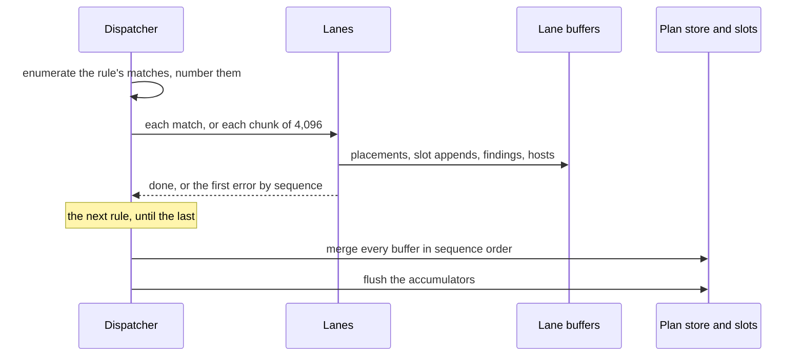

# RFC-0018: Parallel dispatch inside a bucket, and slot appends through the Emitter

## Summary

A composition can let one plugin's phase call run its matches on more than
one goroutine, through `Builder.Parallel`. The dispatcher buffers three
kinds of effect with the invocation's sequence number: the declarations it
places into accumulators, the values it appends into slots, and the
findings it reports. When the phase call's rules have run, the buffers
apply in canonical match order. The same buffering applies on one worker,
so the output does not depend on the worker count. A stamp arrives in the
fact store at once, because the store ranks claims by sequence and not by
arrival.

A handler appends into a slot through `Emitter.Slot`, which returns a
`SlotView`. An append into a value an earlier bucket placed names the
plugin among the contributors of the unit that contains the value. The
file's frame and its manifest entry then name the weaver beside the
emitter. The plugin suite gains a check that runs every plugin on one
worker and on eight and requires the same output.

## Motivation

### Accumulator and slot order under parallel dispatch

The phase call shares these structures across its invocations and writes
them without a lock:

- The accumulators. `Out.Append` appended to the accumulator's list, and the
  sequence that breaks ties in the flush's order was the list's length at
  the append. Under parallel dispatch that number depends on which goroutine
  appended first.
- The slots. `emit.Slot.Append` appends in insertion order and is not safe
  for concurrent use. An `OnEmit` handler appended into another plugin's
  value directly. Two invocations appending into one host's slot race, and
  their order follows the schedule.
- The phase call's reusable matches, its handle pool, its running sequence
  and its record of the languages it already warned about.

On one worker their order is deterministic, because one invocation runs at
a time. The specification makes parallelism inside a bucket a
workspace opt-in. A plugin whose handlers spend real time on projections
gains from it. The fact store is already safe for concurrent stamps, and
its arbitration ranks claims by their sequence and not by their arrival.
The accumulators and the slots have no such rule.

### Buffering in the dispatcher

A plugin cannot order its own invocations, because it sees one match at a
time and does not know the canonical order. Every plugin would need its own
locks and its own sort, and every slot owner would need to defend its slots
against every weaver. The dispatcher knows the order of every match before
it applies any effect, so buffering in the dispatcher orders every
plugin's effects through one mechanism.

### Weavers missing from the attribution

A weaver that appended into another plugin's slot assembled no unit of its
own. The file's frame and its manifest entry listed the emitters of the
file's units, so the weaver's code was in the file and its name was not.
When every slot append goes through the Emitter, the dispatcher knows
which plugin appended into which value, and the unit that contains the
value records it.

## Detailed design

### Components

| Component | Package | Responsibility |
|---|---|---|
| `Builder.Parallel` | `core/workspace` | The composition's opt-in: how many invocations one phase call runs at once |
| `Workers` on the phase contexts | `core/plugin` | The opt-in as the SPI reads it |
| The dispatcher | `core` root package | Numbers a rule's matches in canonical order, runs them on one lane or on several, buffers their effects, and applies the buffers in order |
| `Emitter.Slot`, `SlotView` | `core` root package | The one write view of a slot |
| `Unit.Contributors`, `Emit.Contribute` | `core/plugin` | The plugins that appended into a unit's slots |
| The contributors of a routed file | `core/layout`, `core/backend/render` | A file's frame and manifest entry name the contributors of its units |
| `AssertParallelDispatch`, `Fixture.Workers` | `core/plugin/plugintest` | Runs every plugin on one worker and on eight and compares the output |

### The opt-in

```go
// Parallel lets one phase call run up to workers invocations at once:
// an annotator's or a generator's matches inside its bucket. Zero and
// one dispatch sequentially, which is the default, and Build refuses
// a negative count. The output does not depend on the count: the
// placements, slot appends and findings of a phase call apply in
// canonical match order, and the fact store ranks stamps by that
// order. Plans run in parallel whatever the count.
func (b *Builder) Parallel(workers int) *Builder
```

`plugin.AnnotatorContext` and `plugin.GeneratorContext` gain one field:

```go
// Workers is how many invocations the call may run at once. Zero
// and one mean sequentially. A plugin implementing the role
// directly may ignore it, and a plugin that runs work on
// goroutines joins them before its call returns, whatever the
// count.
Workers int
```

The schedule numbers every plugin of a role apart, so a bucket is one
plugin's phase call, and parallelism inside a bucket runs that plugin's
matches at once.

### Dispatch

The dispatcher takes one rule at a time, in declaration order, and numbers
its matches in canonical match order: the order the rule's index
enumerates the subjects in, then each subject's gating instances in source
order. The numbers continue across the phase call's rules.

1. **On fewer than two workers**, each match runs as the index enumerates
   it, on the call's first lane, under the next sequence number. Nothing is
   collected.
2. **On two or more workers**, the dispatcher collects the matches. A
   collected match is the trigger's value and the gating instance, 24 bytes
   on a 64-bit platform. When 4,096 matches are collected, and when the
   rule's enumeration ends, the collected chunk runs on up to the worker
   count. The calling goroutine runs the first lane, and `sync.WaitGroup.Go`
   starts the others. Each lane takes the next match from an atomic counter,
   resolves its subject and position again, and invokes the handler. The
   sequence numbers continue from one chunk to the next.
3. **A failed invocation** stops the rule. On two or more workers, the lane
   sets a stop flag, and no lane takes another match. Every match below the
   failed one was taken before the flag was set, so the error earliest in
   canonical match order is the one the call returns, wrapped with the
   plugin and the rule.
4. **A panic** in a handler is recovered on its lane and raised again on the
   calling goroutine: the panic earliest in canonical match order, unless an
   earlier invocation failed.

When every rule has run, the phase call applies the lanes' buffers in
sequence order, then flushes its accumulators into the plan's store. A lane
runs its invocations in increasing sequence, so each lane's buffer is
sorted, and the apply is a merge that takes the lane whose next effect has
the lowest sequence.



### Effects

| Effect | Buffered during the run | When it applies |
|---|---|---|
| An accessor call, `File`, `PackageFile` or `PlanFile` | One touch record | At the end, creating the accumulator in canonical order |
| `Out.Append` | One record per call, with the declarations copied into the lane's buffer | At the end. The flush orders a unit's declarations by origin identity, then gating instance, then canonical match order and the order of the appends |
| `SlotView.Append` | One record per call, with the values copied into the lane's buffer of the slot's element type | At the end, in sequence order, then in the call's order |
| An append into a slot of an earlier bucket's value | One host record per invocation | At the end, naming the plugin among the contributors of the unit that contains the value |
| A finding through the match | The finding | At the end, into the run's sink |
| The warning for a language without rules | One per lane and language | At the end, once per phase call and language, from the first invocation in canonical match order |
| `Stamp` and `StampOn` | Not buffered | At once. The store ranks claims by authority, bucket, plugin and sequence, so the claim that ranks first does not depend on arrival |
| A read through the match | The invocation's read set | At once. The read set is the invocation's own |

A handler sees the slots and the plan's store as they were when its phase
call began. It does not see another invocation's appends, its own included.
That follows the rule that handlers are order-independent within a plugin,
and it applies on one worker as well, because the buffering does not depend
on the worker count.

### Failure

| Event | On one worker | On two or more workers |
|---|---|---|
| A handler returns an error | The rule stops. The findings of the invocations up to the failed one arrive in the sink, and no placement, slot append or contribution applies | The same, for the error earliest in canonical match order. Invocations after it can have run, and their buffered effects are dropped |
| A handler panics | The panic propagates | The panic earliest in canonical match order is raised again on the calling goroutine |
| Stamps | The stamps made before the failure remain in the fact store | The stamps of invocations after the failed one can remain as well |

A failed annotate call fails the run, and a failed generate call fails its
plan. In both cases the run commits nothing for the failed scope, so the
fact store's extra stamps do not change any output.

### The slot view

```go
// Slot returns the invocation's write view of one slot: a slot of a
// value this plugin creates, or, through [OnEmit], a slot of a value
// an earlier bucket placed. Appends through the view apply when the
// phase call's rules have run, in canonical match order, and an append
// into a slot of an earlier bucket's value names the plugin among the
// contributors of the unit that contains the value. The view is valid
// during the handler call. A nil slot panics, because the view would
// append nowhere.
func (e *Emitter) Slot[T any](s *emit.Slot[T]) SlotView[T]

// SlotView is one invocation's write access to one slot, returned by
// [Emitter.Slot]. Its zero value has no invocation to buffer with,
// and appending through it panics.
type SlotView[T any] struct{ /* the invocation's lane, sequence and host, and the slot */ }

// Append buffers values for the slot, in order. They apply when the
// phase call's rules have run, after the values of every invocation
// earlier in canonical match order. An append of no values is not
// recorded.
func (v SlotView[T]) Append(values ...T)
```

The call to `Slot` infers its type parameter from the slot, a method type
parameter that Go 1.27 accepts. The conformance suite's Go fixture weaves an
audit call into the prologue of every method a stub generator emits:

```go
func weave(m *eidos.EmitMatch, e *eidos.Emitter) error {
    method, is := m.Value.(*emit.Method)
    if !is || len(method.Params) == 0 {
        return nil
    }
    callee := emit.Expr{Kind: emit.ExprName, Name: auditCallee}
    e.Slot(&method.Body.Prologue).Append(emit.Stmt{
        Kind: emit.StmtExpr,
        Value: emit.Expr{
            Kind: emit.ExprCall,
            Fn:   &callee,
            Args: []emit.Expr{{Kind: emit.ExprName, Name: method.Params[0].Name}},
        },
    })
    return nil
}
```

`emit.Slot.Append` remains, because a builder assembling a value it has not
placed yet appends to a slot only its own invocation can see. A direct
append into a value another invocation can see is a data race on two or
more workers. The plugin suite detects the race under the race detector.
A direct append also does not record a contributor.

### Attribution

```go
// in package plugin, on Unit:

// Contributors are the plugins that appended into slots of the
// unit's declarations through their Emitter, sorted, without the
// unit's own plugin: the attribution a weaver gets in the file's
// frame and its manifest entry beside the unit's plugin.
Contributors []ID

// Contribute records that a plugin appended into a slot of a
// declaration the store contains: the unit whose tree contains host
// names the plugin among its [Unit.Contributors]. It reports false for
// a host the per-kind index does not list, which is a declaration
// without an origin or one no unit contains. The unit's own plugin is
// not recorded, and a plugin is recorded once.
func (e *Emit) Contribute(host symbol.Symbol, p ID) bool
```

The dispatcher calls `Contribute` when it applies a host record. A
hand-rolled generator that appends into another plugin's value calls it
itself. `Contribute` finds the unit through an index of every declaration
the store's per-kind index lists, which the first call after a unit arrives
builds, so a plan without contributions never builds it.

Layout gives each routed unit the contributors of every source unit it
takes declarations from, sorted and distinct. A unit records its
contributors whole, so a declaration that a tag moves to another file takes
its source unit's contributors along. The render adds each unit's
contributors to the emitters in `RenderedFile.Plugins`, which the output
contract writes as one frame line per plugin and the run records as the
manifest entry's `Plugins`. The Go fixture's file opens:

```text
// Code generated by acme. DO NOT EDIT.
// acme:plugin acme-audit
// acme:plugin stubgen
// acme:source svc/store.go
```

The frame is outside the body that the trailer hashes. The body's digest is
unchanged.

### The parallel check

```go
// AssertParallelDispatch runs every phase the plugin implements over
// two isolated fixtures, one dispatching sequentially and one on eight
// workers, and fails unless both runs emit the same bytes, end with the
// same fact values and report the same findings in the same order: the
// output of a phase call does not depend on its worker count. Run under
// the race detector, the parallel run also exposes state a handler
// writes outside its effects.
func AssertParallelDispatch(tb assert.TB, setup Setup)
```

`RunPluginSuite` runs it as its parallel dispatch subtest.
`Fixture.Workers` sets a fixture's worker count. Because the emit encoding
the suite compares includes each unit's contributors, `AssertTwins` also
fails a hand-rolled twin of a weaver that does not call `Contribute`.

### Cost

These costs were measured on a 16-core AMD Ryzen 9 9950X3D. Every benchmark
ran capped at four cores while other work ran on the machine.

- **Sequential dispatch.** Against the last commit, in alternating rounds of
  12 runs per side, the dispatch benchmarks take 2.2% less time and 0.6%
  more bytes at the geometric mean, with 0.5% fewer allocations. A bare
  rule over 200,000 structs whose handler does nothing takes 14% longer,
  10.2 ms against 11.7 ms, or about 7 ns per match. The difference is the
  one call per match that runs or collects it. A directive-gated rule over
  20,000 subjects takes 19% less time. A phase call that places 10,000
  declarations allocates 5 more times and 2.3% more bytes, for its buffers.
- **Collection.** A call on two or more workers collects at most one chunk
  of 4,096 matches at 24 bytes each, 96 KiB, and reuses the chunk for every
  rule.
- **Buffers.** Each lane keeps a 24-byte record per accessor call, append
  call, finding and contributing invocation, plus the declarations and
  values it copied, 16 bytes per declaration. The buffers grow by
  doubling, and the phase call applies them when its rules have run.
- **End to end.** The pipeline benchmark runs 1,000 packages of 200
  declarations, whose handlers stamp or mirror one struct each, 10
  iterations in each of 3 runs. On one worker a run takes 136 to 148 ms,
  483,100 allocations and 137.9 MB. On four workers it takes 134 to 139 ms,
  484,150 allocations and 131.2 MB. The peak RSS is 317 to 323 MB on both,
  in a process that runs the benchmark ten times. Dispatch is a small share
  of this run, so four workers save little time on it.

## Alternatives considered

### Lock the accumulators and the slots

Each accumulator and each slot takes a mutex, and appends arrive
concurrently. It changes the least code. It lost because a lock makes the
appends safe and leaves their order to the schedule, so the output still
differs between runs. Ordering after the fact needs each append to record
its sequence anyway, which is the buffer without its benefits.

### Run the plugins of one level at once

Plugins with no capability edge between them run at once, each
sequentially. It parallelises without touching a handler's view. It lost
here because the slot and accumulator orders between plugins are then the
same problem one level up, and the schedule gives each plugin its own
bucket. It is compatible with this proposal and not proposed here.

### Let a handler see earlier appends in sequential mode

Buffering applies under parallel dispatch alone, and a sequential run keeps
the handlers' view of earlier appends. It lost on determinism. The output
would then depend on the worker count, and the opt-in must not change the
output.

### A per-plugin opt-in

A plugin declares that its handlers are safe to run at once, and the
dispatcher parallelises those plugins alone. It lost for two reasons. The
plugin contract already requires every handler to be order-independent
within its plugin. The specification also puts the opt-in on the
workspace. A plugin that keeps state across invocations breaks the contract
on one worker too.

### Collect every match of a rule before running it

The dispatcher collects the rule's whole match list, and the lanes take
from it. It is the simplest form of the parallel path. It lost on memory:
on four workers, the pipeline benchmark allocated 44 MB more per run, the
growth of two collected lists of 200,000 matches. A fixed chunk of 4,096
matches bounds the collection at 96 KiB.

### Enumerate matches through an iterator

Each index enumeration is an `iter.Seq` of matches, which the sequential
path ranges over and the parallel path collects. It lost on time: the bare
rule over 200,000 structs took 27% longer than at the last commit, from a
closure call and three copies of a 144-byte match per invocation. The
enumerations call one method directly, which runs or collects each match.

### Buffer one record per declaration

`Out.Append` buffers each declaration as a placement record of its own,
with its accumulator key, family, subject and instance. It lost on
allocation: placing 10,000 declarations took 172% longer and 18.5 MiB
against 6.7 MiB. One record per call, with the declarations copied into one
slice, costs 2.3% more bytes than placing them directly.

## Drawbacks

- A handler no longer sees its own plugin's slot appends from earlier
  invocations of the same phase call. A plugin that read them depended on
  dispatch order, which breaks the plugin contract, and its output changes.
- `emit.Slot.Append` remains public. A direct append into another plugin's
  value compiles. It races on two or more workers, and it does not record a
  contributor. The race detector in the plugin suite catches the race at
  test time, and nothing catches the missing attribution.
- Sequential dispatch costs about 7 ns more per match than direct
  invocation. Duplicating the four enumerations, one set per mode, would
  remove the call that runs or collects each match.
- A phase call keeps every placement, slot append and finding in its lanes'
  buffers until its rules have run.
- On two or more workers, a failed phase call can leave stamps of
  invocations after the failed one in the fact store. The failure fails the
  run's scope, which commits nothing, so no output differs.
- Every file a weaver appends into gains one frame line, so the first run
  after this change rewrites each such file once.
- The workspace builder gains one method, each phase context one field, the
  Emitter a generic method and a view type with one method, `plugin.Unit`
  one field, `plugin.Emit` one method, and `plugintest` one assertion and
  one fixture field.
- Each plugin's suite runs its fixture twice more, on one worker and on
  eight.

## Open questions

None.

## Unresolved and future work

- Running the plugins of one priority level at once, each in its own
  bucket, is not proposed here.
- An invocation runs to its end, and the run observes cancellation between
  phase calls. Cancelling inside a phase call is not proposed here.
- The render's error for a slot contribution that its template dropped
  identifies the emitting plugin. Identifying the contributing plugin needs
  attribution per slot value, which is not proposed here.

## References

| What | Where |
|---|---|
| The authoring surface: the Emitter, slot access and the ordering rules | [06b-authoring.md](../architecture/06b-authoring.md) |
| The plugin concurrency contract | [06-plugins.md](../architecture/06-plugins.md) |
| Metadata arbitration under parallelism | [04-metadata.md](../architecture/04-metadata.md) |
| The frame's attribution lines and the manifest's plugins | [17-output-and-determinism.md](../architecture/17-output-and-determinism.md) |
| D46 and D52: accumulators ordered by subject identity, then instance, then insertion | [21-decisions.md](../architecture/21-decisions.md) |
| D39: bodies as slot sequences | [21-decisions.md](../architecture/21-decisions.md) |
| benchstat, the comparison of the dispatch benchmarks | https://pkg.go.dev/golang.org/x/perf/cmd/benchstat |
