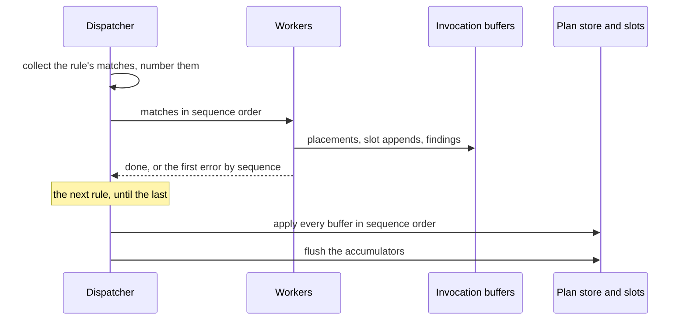

# RFC-0018: Parallel dispatch inside a bucket, and slot appends through the Emitter

## Summary

A composition can let one plugin's phase call run its matches on more than
one goroutine. Every effect an invocation has on shared state is buffered
with the invocation: declarations placed into accumulators, values appended
into slots, and findings. When the phase call's matches are done, the
buffers apply in canonical match order. The same buffering applies when the
phase call runs on one goroutine, so the output does not depend on the
number of workers. A handler appends into a slot through one write view,
`SlotView`, which the Emitter returns. The plugin suite runs every plugin
with parallel dispatch under the race detector and compares the output with
a sequential run.

## Motivation

### Accumulator and slot order under parallel dispatch

A phase call dispatches one plugin's rules in declaration order, and each
rule's matches one after another (`dispatch.go:109`). The phase call shares
these structures across its invocations and writes them without a lock:

- The accumulators. `Out.Append` appends to the accumulator's list, and the
  sequence number that breaks ties is the list's length at the append
  (`emitter.go:161`). Under parallel dispatch that number depends on which
  goroutine appended first.
- The slots. `emit.Slot.Append` appends in insertion order and documents
  that it is not safe for concurrent use (`emit/slot.go:25`). An `OnEmit`
  handler appends into another plugin's value directly. Two invocations
  appending into one host's slot race, and their order follows the
  schedule.
- The phase call's reusable matches, its handle pool, its running sequence
  and its record of the languages it already warned about
  (`dispatch.go:48`).

Sequential dispatch keeps all three deterministic, because one invocation
runs at a time. The specification makes parallelism inside a bucket a
workspace opt-in. A plugin whose handlers spend real time on projections
gains from it. The fact store is already safe for concurrent stamps, and
its arbitration ranks claims by their sequence and not by their arrival
(`meta/facts.go:17`). The accumulators and the slots have no such rule.

### Buffering in the dispatcher

A plugin cannot order its own invocations, because it sees one match at a
time and does not know the canonical order. Every plugin would need its own
locks and its own sort, and every slot owner would need to defend its slots
against every weaver. The dispatcher knows the order of every match before
it runs any of them. Buffering in the dispatcher therefore orders every
plugin's effects through one mechanism.

## Detailed design

### Components

| Component | Package | Responsibility |
|---|---|---|
| `Builder.Parallel` | `core/workspace` | The composition's opt-in: how many invocations one phase call runs at once |
| `Workers` on the phase contexts | `core/plugin` | The opt-in as the SPI reads it |
| The parallel dispatcher | `core` root package | Collects a rule's matches in canonical order, runs them on workers, buffers their effects, and applies the buffers in order |
| `Emitter.Slot`, `SlotView` | `core` root package | The one write view of a slot |
| The parallel check | `core/plugin/plugintest` | Runs every plugin with parallel dispatch and compares the output with a sequential run |

### The opt-in

```go
// Parallel lets one phase call run up to workers invocations at once.
// Zero and one dispatch sequentially, which is the default, and Build
// refuses a negative count. Plans run in parallel whatever the count.
func (b *Builder) Parallel(workers int) *Builder
```

`plugin.AnnotatorContext` and `plugin.GeneratorContext` gain one field:

```go
// Workers is how many invocations the call may run at once: one means
// sequentially. A plugin implementing the role directly may ignore it.
// A plugin that runs work on goroutines joins them before its call
// returns, whatever the count.
Workers int
```

The schedule numbers every plugin of a role apart, so a bucket is one
plugin's phase call, and parallelism inside a bucket runs that plugin's
matches at once.

### Dispatch

The dispatcher takes one rule at a time, in declaration order.

1. **Collect.** It enumerates the rule's matches through the rule's index,
   on the calling goroutine, and gives each its sequence number. The
   numbers continue across the phase call's rules, so they are the
   canonical match order: rule, then subject identity, then directive
   instance.
2. **Run.** Up to `Workers` goroutines take matches in sequence order. Each
   goroutine has its own reusable matches and its own handle pool. Each
   invocation has its own buffer.
3. **Join.** When the rule's matches are done, the first error by sequence
   number, if any, stops the phase call, wrapped with the plugin and the
   rule as it is today. The other invocations' buffers are dropped with it.

When every rule is done, the phase call applies the buffers in sequence
order, then flushes its accumulators into the plan's store as it does
today.

| Effect | Where it goes during the run | When it applies |
|---|---|---|
| `Out.Append` | The invocation's buffer, with its accumulator's key | At the end, in sequence order. Ties in the flush's order break on the sequence, then on the append's position within the invocation |
| `SlotView.Append` | The invocation's buffer | At the end, in sequence order, then in the invocation's append order |
| A finding through the match | The invocation's buffer | At the end, into the run's sink, in sequence order |
| The warning for a language without rules | The invocation's buffer | At the end, once per phase call and language, from the first invocation in sequence order |
| `Stamp` and `StampOn` | The fact store, directly | At once. The store ranks claims by authority, bucket, plugin and sequence, so the winner does not depend on arrival |
| A read through the match | The invocation's read set | At once. The read set is the invocation's own |

A handler sees the slots and the plan's store as they were when its phase
call began. It does not see another invocation's appends, its own included.
That follows the rule that handlers are order-independent within a plugin,
and it applies in sequential dispatch as well, because the buffering does
not depend on the worker count.



### The slot view

```go
// Slot returns the invocation's write view of one slot: a slot of a
// value this plugin creates, or, through OnEmit, a slot of a value an
// earlier bucket placed. Appends through the view apply when the phase
// call ends, in canonical match order. The view is valid for the
// duration of the handler call.
func (e *Emitter) Slot[T any](s *emit.Slot[T]) SlotView[T]

// SlotView is one invocation's write access to one slot. Its zero
// value appends nowhere and panics on use, because a view without an
// invocation has no buffer to append to.
type SlotView[T any] struct{ /* the invocation's buffer and the slot */ }

// Append buffers values for the slot, in order.
func (v SlotView[T]) Append(values ...T)
```

In the following weaver, `audit` builds the delegate statement that the
weaver adds to every method another plugin emitted. The call to `Slot`
infers its type parameter from the slot, a method type parameter that Go
1.27 accepts:

```go
eidos.OnEmit(symbol.KindMethod, func(m *eidos.EmitMatch, e *eidos.Emitter) error {
    method, ok := m.Value.(*emit.Method)
    if !ok {
        return nil
    }
    e.Slot(&method.Body.Prologue).Append(audit(method))
    return nil
})
```

`emit.Slot.Append` remains, because a builder assembling a value it has not
placed yet appends to a slot only its own invocation can see. Appending
directly into a value another invocation can see is a data race under
parallel dispatch, and the plugin suite detects it.

### The parallel check

The new check in `plugintest.RunPluginSuite` runs the plugin's fixture
twice, once with one worker and once with eight. It requires byte-equal
emit, equal facts and equal findings. Under the race detector, the
eight-worker run reports any shared state a handler writes outside its
effects. The suite runs with `-count=2`, so an order that depends on a map
cannot pass by chance.

### Cost

- An invocation under sequential dispatch allocates nothing in steady state,
  and the existing zero-allocation tests pin that bound. The buffers are
  slices reused per worker, so a phase call allocates per worker and not per
  invocation.
- A match entry is a subject identity, a position, a gating instance and a
  value, under 100 bytes. Collecting a rule's matches before running them
  keeps one entry per match for the rule's duration, under 20 MB for
  200,000 matches.
- A handler gains from parallel dispatch when its work outweighs one channel
  operation and one buffer append. The implementation measures the
  end-to-end bench at one and four workers before it states a gain.

## Alternatives considered

### Lock the accumulators and the slots

Each accumulator and each slot takes a mutex, and appends arrive
concurrently. It changes the least code. It lost because a lock makes the
appends safe and leaves their order to the schedule, so the output still
differs between runs. Ordering after the fact would need each append to
record its sequence anyway, which is the buffer without its benefits.

### Run the plugins of one level at once

Plugins with no capability edge between them run at once, each
sequentially. It parallelises without touching a handler's view. It lost
here because the slot and accumulator orders between plugins are then the
same problem one level up, and the schedule gives each plugin its own
bucket. It is compatible with this proposal and not proposed here.

### Let a handler see earlier appends in sequential mode

Buffering applies under parallel dispatch alone, and a sequential run keeps
today's visibility. It lost on determinism. The output would then depend on
the worker count, and the opt-in must not change the output.

### A per-plugin opt-in

A plugin declares that its handlers are safe to run at once, and the
dispatcher parallelises those plugins alone. It lost for two reasons. The
plugin contract already requires every handler to be order-independent
within its plugin. The specification also puts the opt-in on the
workspace. A plugin that keeps state across invocations breaks the contract
in sequential mode too.

## Drawbacks

- A handler no longer sees its own plugin's slot appends from earlier
  invocations of the same phase call. A plugin that read them depended on
  dispatch order, which breaks the plugin contract, and its output changes.
- The dispatcher keeps a rule's matches in memory before it runs them, up
  to about 20 MB for 200,000 matches of one rule.
- `emit.Slot.Append` remains public. A direct append into a shared value
  compiles, and the race detector in the plugin suite catches it at test
  time.
- The phase contexts gain a field each, the Emitter gains a generic method
  and a view type, and the workspace builder gains one method.
- Each plugin's suite runs its fixture twice more, at one worker and at
  eight.

## Open questions

None.

## Unresolved and future work

- Running the plugins of one priority level at once, each in its own
  bucket, is not proposed here.
- An invocation runs to its end, and the run observes cancellation between
  phase calls. Cancelling inside a phase call is not proposed here.

## References

| What | Where |
|---|---|
| The authoring surface: the Emitter, slot access and the two ordering rules | [06b-authoring.md](../architecture/06b-authoring.md) |
| The plugin concurrency contract | [06-plugins.md](../architecture/06-plugins.md) |
| Metadata arbitration under parallelism | [04-metadata.md](../architecture/04-metadata.md) |
| D46 and D52: accumulators ordered by subject identity, then instance, then insertion | [21-decisions.md](../architecture/21-decisions.md) |
| D39: bodies as slot sequences | [21-decisions.md](../architecture/21-decisions.md) |
