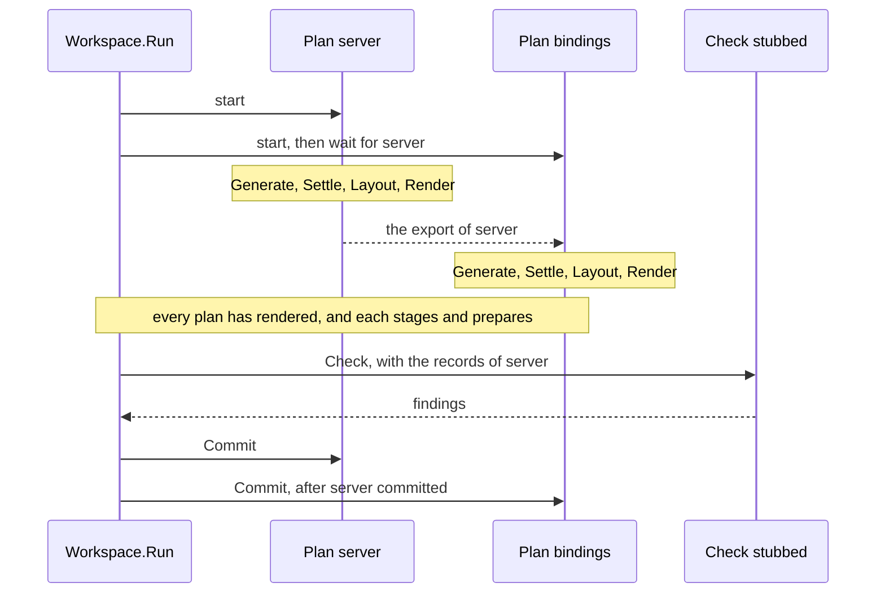

<!--
  ~ Copyright Dokimasia B.V. 2026
  ~ SPDX-License-Identifier: Apache-2.0
-->

# RFC-0019: Source scopes, plan exports and workspace checks

## Summary

A workspace runs its plans over one frozen graph, and this proposal gives the
plans what they need to share it. A plan's source scope becomes a value of
three fields: a language, directory patterns and a module. Build validates the
value, and the composition's fingerprint folds it. A plan can depend on other
plans by name. It generates after they render and reads their exports, and it
commits only where they commit. An export lists every declaration a plan
rendered, keyed the way a dependent knows the declaration before the run, and
spelled the way the plan's settle named it. Close runs a new plugin role, the
workspace check, over the records of the plans each check names. A kernel
suite checks a multi-plan composition for collisions, isolation, exports, the
sweep, the audit and the checks. The kernel does not need a new mechanism for
two workspaces in one repository, because a composition over each root has
its own tree, sink and state directory.

## Motivation

### A plan's scope is a function

`Plan.Scope` is a `store.Scope`, a Go function from a package identity to a
boolean. Because the scope is a function:

- Build cannot validate it. A scope that refers to a language no frontend
  loads, or to a directory the tree does not contain, admits nothing, and
  Build reports no fault.
- The composition's fingerprint folds each plan's name, generators and
  backend, but not the scope, because a function has no spelling to fold.
- No configuration file can state it, although the specification's YAML form
  of a plan has a `sources` key with three fields.
- A listing of the composition cannot show what a plan reads.

One test in the kernel sets a scope. No other caller sets one.

### Plans cannot use each other's output

A generator reads its own plan's sources and its own plan's emit store. A
binding generator emits FFI, cgo or JNI bindings to the declarations a sibling
plan generated, so it has to name them. All it can do is apply the sibling's
naming rules a second time. The settle then respells each name into the
target's convention, reverts colliding names to their emitted spellings and
applies the name overrides written on origins. A second application of the
naming rules misses each of those changes.

Plans run in parallel with no order between them, so a plan cannot wait for
another either.

### Close checks no claim across plans

Close detects plan collisions, sweeps the plans the composition no longer
declares and audits the completeness contracts. No role can check a claim that
spans plans, such as "every interface under the stub directive got a stub". An
annotator runs before any plan generates, and a generator reads one plan.

### Why the kernel

`Workspace.Run` binds the scopes, orders the plans, builds the records and
runs Close. A plugin cannot order plans, read another plan's records or run
after every plan has staged. So each mechanism in this proposal changes the
run.

## Detailed design

### Components

| Component | Package | Responsibility |
|---|---|---|
| `Sources` | `core/workspace` | A plan's source scope as data: a language, directory patterns and a module |
| `Plan.DependsOn` | `core/workspace` | The plans whose exports a plan reads, and the order the run follows |
| `ExportDoc`, `ExportKey`, `ExportedSymbol` | `core/plugin` | One plan's export |
| `NewExport` | `core/plugin` | Builds a plan's export from the files it rendered and the settle's record of emitted names |
| `GeneratorContext.Exports`, the matches' `Export` | `core/plugin`, `core` | How a generator reads an export |
| `WorkspaceCheck`, `CheckContext`, `PlanRecord` | `core/plugin` | The check role and what it reads |
| `Builder.Checks` | `core/workspace` | The checks Close runs |
| `FailedDependency` | `core/workspace` | The Info a plan or a check reports when a plan it reads failed |
| `RunWorkspaceSuite` and its checks | `core/workspace/workspacetest` | A multi-plan composition checked against the frame |

### Source scopes

```go
// Sources is a plan's source scope: which packages its generators see,
// written in a closed vocabulary of three fields. A package is in scope
// when every field that is set matches it, and the zero value admits
// every package. Build validates the fields, and each run binds them to
// the frozen graph and its facts before the plan's first generator
// runs.
type Sources struct {
    // Lang admits the packages of one source language. Build refuses a
    // language that no registered frontend loads and no registered
    // rules value declares. Empty admits every language.
    Lang symbol.Lang
    // Packages admits a package whose every file is in a directory one
    // of the patterns names. A pattern is a workspace-relative,
    // slash-separated directory with an optional leading "./", and a
    // trailing "/..." extends it to every directory below. Build
    // refuses an empty pattern, a ".." element, a backslash, an
    // absolute path, and "..." anywhere but at the end. Nil admits
    // every directory.
    Packages []string
    // Module admits a package whose gen.module fact is this module
    // path. Empty admits every module.
    Module string
}
```

| Pattern | Admits the Go packages in |
|---|---|
| `./...` | every directory of the workspace tree |
| `./svc` | `svc` |
| `./svc/...` | `svc` and every directory below it |
| `svc/...` | the same directories as `./svc/...` |

The trailing `/...` is the go command's wildcard in its trailing form. The go
command also accepts `...` inside a pattern, and this vocabulary does not.
Growing the vocabulary is a kernel change.

A package matches `Packages` only when every one of its files matches. A Go
package is one directory, so a pattern admits it whole or not at all. A Java
package can span two source roots, such as `src/main/java/com/acme` and
`src/test/java/com/acme`. `./src/...` admits it, and `./src/main/...` does not,
because a scope that admits a package lets the plan read every file of it.

A store's files, such as a module cache's, are in no workspace directory, so no
pattern matches a dependency package. A dependency package matches `Module`
only where its own `gen.module` fact equals the field. A plan scoped by `Lang`
alone matches the dependency packages of its language, in the way an unscoped
plan matches every package.

Each run binds a plan's sources into the `store.Scope` that the plan's index
and readers apply. The binding visits each package of the graph once. For each
package it compares the language and matches the directory of each file
against the patterns. Where `Module` is set, it also reads the package's
`gen.module` fact. A plan whose sources are the zero value binds the nil
scope. The nil scope admits everything without a lookup.

The composition's fingerprint folds the language, the sorted patterns and the
module of each plan's sources. A change of scope re-keys every unit.

`Plan` replaces its scope function with the value and gains a list of
dependencies:

```go
// Plan is one write side: a value, never a plugin. Build validates it
// whole, so a plan that Build accepts names only registered things.
type Plan struct {
    // Name keys the plan's store in the run's report and must be
    // unique across the composition.
    Name string
    // Sources scopes what the plan's generators see. The zero value
    // admits every package.
    Sources Sources
    // DependsOn names the plans whose exports the plan's generators
    // read. The plan generates after each of them has rendered, and
    // commits only where each of them commits. Build refuses a name
    // the composition does not declare, the plan's own name, a name
    // listed twice, and a cycle, naming every plan in it.
    DependsOn []string
    // Generators run in bucket order within the plan, whatever order
    // they are listed in.
    Generators []plugin.Generator
    // Backend renders the plan's settled store: exactly one per plan,
    // its target registered.
    Backend plugin.Backend
    // Layout routes the plan's declarations to files.
    Layout layout.Config
}
```

A composition admits a plugin name twice only where both entries are the same
provider. Plans that target one language render through one backend value,
which they share safely, because a backend keeps no state of a run.

### Dependencies between plans

Each plan runs on a goroutine of its own. A dependent waits until every plan it
depends on has rendered, and then generates. Plans without dependencies start
at once and run in parallel. The longest chain of dependencies sets how long
the plans' phase takes.

Build sorts the plans by their dependencies. A cycle is one fault that names
every plan in it, in name order:

```
workspace: plans "bindings" and "server" depend on each other in a cycle
```

The commits run in that order. Each plan commits after every plan it depends
on, and plans that do not depend on each other commit in composition order.
The report lists the plans in composition order, whatever order they committed
in.



A dependent never commits files that refer to declarations its producer did not
commit:

| The plan it depends on | The dependent |
|---|---|
| Fails in Generate, Settle, Layout or Render | Does not generate, and reports `FailedDependency`. Its previous files and entries remain |
| Fails at its staging, on a drifted or foreign file or a sink that refuses | Generates and stages, then discards its staging, and reports `FailedDependency` |
| Fails at its commit | Discards its staging. The run returns the producer's error |
| Is cancelled | Is cancelled |
| Commits, or prepares under Dry | Commits, or prepares under Dry |

The status of a dependent that does not commit is `PlanFailed`, and
`FailedDependency` explains it. An Error in a phase every plan shares, or at
Close, fails every plan at once, and then the run reports no
`FailedDependency`.

### Exports

A plan's export lists the declarations of the files the plan rendered. The
types are in `core/plugin`, beside the generator's context that hands them
over:

```go
// ExportDoc is one plan's export. It lists every declaration in the
// files the plan rendered, each with the name the plan's settle gave it
// and the file and package its layout routed it to. A dependent plan
// reads names and import paths from it instead of applying the
// producing target's naming rules a second time.
//
// The run builds the export of a plan that a dependent plan or a
// workspace check reads, after the plan renders, through NewExport.
// Every dependent and every check of the run reads the same value, so a
// reader does not mutate it.
type ExportDoc struct {
    // Plan is the producing plan's name.
    Plan string
    // Symbols are the exported declarations, sorted by key, then by
    // file.
    Symbols []ExportedSymbol
}

// ExportKey identifies an exported declaration the way a dependent
// knows it before the producing plan runs: the source declaration it
// derives from, the plugin that emitted it, the family it was emitted
// into, and the names the plugin gave it and its host. Both names are
// the emitted ones, before the settle respelled them, so a dependent
// builds a key from the producing plugin's conventions and reads the
// target's spelling from the export.
type ExportKey struct {
    // Origin is the source declaration the generated one derives from,
    // and the zero identity for a declaration without one.
    Origin symbol.Identity
    // Plugin is the plugin whose unit declared it.
    Plugin ID
    // Tag is the family the unit was emitted into, empty for the
    // primary family.
    Tag string
    // Host is the emitted name of the declaration a member is declared
    // in, or of the type a method's receiver names. It is empty for
    // any other declaration at file level.
    Host string
    // Name is the emitted name.
    Name string
}

// ExportedSymbol is one declaration of an export.
type ExportedSymbol struct {
    ExportKey
    // Kind is the declaration's kind.
    Kind symbol.Kind
    // Spelling is the name the producing plan's settle gave the
    // declaration: the name the plan's files declare it under.
    Spelling string
    // Package is the package the declaration's file declares, as the
    // producing target names it, with Name set to the name of its
    // package clause. It is the zero identity where the target derives
    // no package for the path.
    Package symbol.Identity
    // File is the workspace-relative, slash-separated path of the file
    // the declaration was rendered into.
    File string
}

// Find returns the exported declarations under one key, in file
// order: one for a key one file declares, more than one where the
// plugin emitted one name from one origin into one family more than
// once, and none where the export lists nothing under the key. The
// result is the export's own storage, and the caller does not mutate
// it. Find costs one binary search and allocates nothing.
func (d ExportDoc) Find(k ExportKey) []ExportedSymbol
```

The export lists:

- every declaration of every unit in every file the plan rendered
- every name the settle visits inside those declarations, except parameters,
  results and type parameters: fields, methods, enum values and variants

The declarations the settle withheld are absent, and so are the files the
render refused. In a composition without output the layout routes no file, so
each export is empty.

The key needs every part:

- Two plugins can each emit a declaration from one source declaration, so the
  origin alone does not identify one.
- A lowering can derive more than one declaration from one, so the kind does
  not either.
- One generator can emit one name into two families, such as a stub in its
  primary family and one in its test family.
- A generator that emits a stub and a mock of one interface gives both a
  method from the same origin, under the same name, on two receivers.

A Go stub generator that emits `StoreStub` for `svc.Store` into its test
family exports this:

| Field | Value |
|---|---|
| `Origin` | `golang:example.com/acme/svc.Store` |
| `Plugin` | `stubgen` |
| `Tag` | `test` |
| `Host` | empty |
| `Name` | `StoreStub` |
| `Kind` | `struct` |
| `Spelling` | `StoreStub` |
| `Package` | `golang:example.com/acme/svc`, clause name `svc` |
| `File` | `svc/store_stub_test.go` |

The run builds no export for a plan that no dependent and no check reads.

### The settle's record of emitted names

The settle respells every name in place, so the emitted name is gone when the
layout runs. The settle records the emitted name of every declaration whose
name it changed, in a map of the plan's store that no API exposes. A settle
that changes no name allocates no map.

`NewExport` builds an export from the files a plan rendered and the store its
settle ran over:

```go
// NewExport returns a plan's export: every declaration of the units of
// files, and every name the settle visits inside them except
// parameters, results and type parameters, so a type's fields and
// methods and an enum's values are listed beside the type. Each is keyed
// by its origin, its unit's plugin and tag, and the names it and its
// host were emitted under, and it is spelled as the settle left it, at
// its file's path and package. files are the files the plan rendered.
// settled is the store the plan's settle ran over, whose record supplies
// the emitted name of each declaration a respell changed. A nil store
// reads every name as emitted.
//
// A method attached to a receiver is keyed under the emitted name of
// the type its receiver names: the settle rewrote the receiver's
// spelling with the type, and the type's record maps it back. A receiver
// that names a type no file declares keeps its spelling as the host.
func NewExport(plan string, files []File, settled *Emit) ExportDoc
```

`NewExport` walks the names twice, once to count them and once to list them,
and sorts the result once. A member's host is the nearest declaration the walk
entered and has not left, which a stack of four entries on the goroutine's
stack tracks. A method's receiver maps back through one binary search over the
file-level declarations, which the call sorts once. It allocates two slices,
the result and the sorted declarations: for 2,000 declarations, 2 allocations,
664 KB and 1 ms.

### Reading an export

A generator's context hands over the exports of the plans its plan depends on:

```go
type GeneratorContext struct {
    // The fields Index to Workers are unchanged.

    // Exports are the exports of the plans this plan depends on, keyed
    // by plan name, each complete before the plan's first generator
    // runs. It is nil for a plan that depends on none. Every dependent
    // of a plan reads the same values, so a generator does not mutate
    // them.
    Exports map[string]ExportDoc
}
```

Handlers of the authoring surface's rules read the same values through
`Export`, which every match type gains from the match they share. Here it is
on `GraphMatch`:

```go
// Export returns the export of a plan the handler's plan depends on,
// and false for any other plan and in an annotator's phase call. The
// value is the run's own, and a handler does not mutate it.
func (m *GraphMatch) Export(plan string) (plugin.ExportDoc, bool)
```

A dependent that targets the producer's language refers to an exported
declaration with `&emit.TypeRef{Spelling: s.Spelling, Package:
s.Package.Package}`, and the backend's import set qualifies the reference by
its package path. The settle resolves a reference without a target against the
names of the unit's own package, and it does so for a reference that names
another package too. A dependent package that declares a name equal to an
exported spelling would then rewrite the reference to its own declaration. So
the settle leaves alone a reference whose `Package` names a package other than
the unit's.

A read of an export records no edge in a read set, because every run in this
proposal derives every plan and reads no edge of an earlier run.

### Workspace checks

The role is in `core/plugin`, so a check written against the SDK facade
implements it:

```go
// WorkspaceCheck checks a claim across plans at Close, over the run's
// records: each plan's files, each plan's export, the frozen graph and
// the facts. It reports diagnostics and writes nothing.
//
// A problem with one item is a finding on the context's sink, and the
// check continues. A returned error is fatal to Close: the run commits
// nothing and returns the error, wrapped with the check's name.
type WorkspaceCheck interface {
    Plugin
    // Reads returns the names of the plans whose records the check
    // reads, and nil for every plan of the composition. Build refuses
    // a name the composition does not declare, and a name listed
    // twice.
    Reads() []string
    // Check reports what the records break.
    Check(ctx *CheckContext) error
}

// CheckContext is what one Check call may read. The index and the
// reader see the whole graph, and the reader records into a set the
// run discards.
type CheckContext struct {
    Index  *Index
    Reader *store.Reader
    Facts  *meta.Facts
    Sink   *diag.Sink
    // Rules and Kernel have the meaning the annotator's context gives
    // the fields of the same names.
    Rules  *rules.Registry
    Kernel meta.KernelKeys
    // Plugin is the check's identity: the origin of its findings.
    Plugin ID
    // Plans are the records of the plans the check reads, in
    // composition order.
    Plans []PlanRecord
}

// PlanRecord is one plan's record as Close reads it.
type PlanRecord struct {
    // Name is the plan's name.
    Name string
    // Files are the manifest entries of the files the plan routed,
    // sorted by path, each with the digest of the bytes the plan
    // staged.
    Files []manifest.Entry
    // Export is the plan's export.
    Export ExportDoc
}
```

```go
// Checks registers the workspace checks Close runs, in registration
// order. Build refuses a nil check, a check whose name another plugin
// of the composition has, and a check that reads a plan the
// composition does not declare or names one plan twice. A check takes
// options, keys and capabilities the way any plugin of the composition
// does.
func (b *Builder) Checks(cs ...plugin.WorkspaceCheck) *Builder
```

`core/plugin` imports `core/manifest` for the record. `core/manifest` imports
`core/plugin` for `plugin.ID` alone, and that import would close a cycle. So
`core/manifest` imports `core/diag` instead and spells `Entry.Plugins` as
`[]diag.Origin`. `plugin.ID` is an alias of `diag.Origin`, so the field's type
is the same, and no caller changes.

Close runs four steps, on one goroutine:

1. Plan collisions.
2. The sweep of the plans the composition no longer declares.
3. The audit.
4. The checks, one after another in registration order. Close runs no check
   after an Error in a phase every plan shares, because the records of such a
   run are incomplete.

For a check that reads a failed plan, the run reports one `FailedDependency`
and does not call the check. The failed plan's own Error already explains the
missing records. Each other check gets the records of the plans it reads. A
check's Error blocks every commit of the run, as a plan collision does,
because a claim across plans does not identify the plan at fault.

The authoring surface declares no rules for checks. A check implements the
role directly.

### Workspaces that share a repository

Compositions over sibling roots of one repository share nothing. Each one
loads the tree under its root and writes through a sink at that root. It
records its manifest in the state directory `.<brand>/` under the same root. A
sink refuses a path with a `..` element, so no composition writes outside its
root. Build writes a composition's options into the plugins it composes, so
each composition builds plugin instances of its own.

When one root contains another, the outer root's load reads the inner root's
sources, and the outer root's plans generate files inside the inner root. The
kernel defines no file format and has no reader for a `workspaces:` list. A
reader of such a list has to refuse two roots that nest.

A conformance test runs two workspaces over `platform/` and `tools/gen/` of one
repository. It checks that each records its manifest under its own root, that
each record's sources are declarations of its own module, and that removing a
plan from one changes no file of the other.

### Failure semantics

| Code | Name | Severity | Position | Meaning |
|---|---|---|---|---|
| EID-0061 | `FailedDependency` | Info | The first Error of the failed plan | A plan or a check reads a plan that failed, and generates or checks nothing |

The run reports `FailedDependency` under Close's phase. Where a plan failed
only because a plan it depends on failed, it has no Error of its own, and the
finding takes the position of the first Error in the chain. A plan that failed
on a returned error alone has no Error at all. The run then reports no
`FailedDependency` for its dependents and its checks, and returns the error
with the plan's name.

Build reports each of these faults in its joined error:

| Fault | Example |
|---|---|
| A dependency the composition does not declare | `workspace: plan "bindings" depends on "server", which the composition does not declare` |
| A plan that depends on itself | `workspace: plan "server" depends on itself` |
| A dependency listed twice | `workspace: plan "bindings" lists "server" twice in its dependencies` |
| A cycle | `workspace: plans "bindings" and "server" depend on each other in a cycle` |
| An unknown language | `workspace: plan "server" scopes the language "kotlin", which no frontend loads and no rules value declares` |
| An invalid pattern | `workspace: plan "server" scopes the pattern "../svc", which names no directory of a workspace tree` |
| A nil check | `workspace: check 1 of 2 is nil` |
| A check that reads an undeclared plan | `workspace: check stubbed reads plan "server", which the composition does not declare` |
| A check that reads one plan twice | `workspace: check stubbed reads plan "server" twice` |

### The workspace suite

```go
// Package workspacetest checks a composition of more than one plan
// against the workspace frame, over a source tree on disk.
package workspacetest

// Fixture is a multi-plan case: a source tree, the stores its load
// reads, the composition without its plans, the plans, and every file
// the plans generate.
type Fixture struct {
    // Tree is the source tree. A check copies it into each directory it
    // runs the fixture in.
    Tree fs.FS
    // Stores are the read-only trees the load's dependency units read,
    // keyed by store name.
    Stores map[string]fs.FS
    // Compose returns a builder over root, the directory a check runs
    // the fixture in, with every part of the composition except its
    // plans: the brand, the frontends, the annotators, the rules, the
    // targets, a disk sink at root and the state directory's ledger
    // under root. A check adds plans, checks and keys before it builds.
    // The suite runs its checks in parallel, so Compose returns fresh
    // plugin instances on every call and is safe for concurrent use.
    Compose func(root string) *workspace.Builder
    // Plans returns the fixture's plans, with fresh generator and
    // backend instances on every call: at least two, each routing at
    // least one file, no two routing a file to one path, the first
    // routing a file that derives from a source declaration, and a last
    // one that no other plan depends on and whose generators register no
    // directive the tree writes, so the composition without it loads the
    // tree clean.
    Plans func() []workspace.Plan
    // Want is every file the plans generate, frame included, keyed by
    // its workspace-relative, slash-separated path.
    Want map[string][]byte
}

// RunWorkspaceSuite checks the fixture against the workspace frame,
// each check in a parallel subtest over a temporary directory of its
// own.
func RunWorkspaceSuite(t *testing.T, f Fixture)

// AssertGenerated runs the fixture's plans in root and checks that the
// files under the brand's frame are the wanted files, byte for byte,
// and that the record lists each file under the plan whose commit
// wrote it.
func AssertGenerated(tb assert.TB, f Fixture, root string)

// AssertCollision runs the fixture's plans and a copy of the first plan
// under another name, and checks that the run reports PlanCollision
// naming both plans, that no plan commits, and that the run records
// nothing.
func AssertCollision(tb assert.TB, f Fixture, root string)

// AssertIsolated runs the fixture's plans, then runs them again with a
// generator that reports an Error added to the last plan, and checks
// that the last plan commits nothing and keeps its previous files and
// entries, and that every other plan commits.
func AssertIsolated(tb assert.TB, f Fixture, root string)

// AssertExported runs the fixture's plans and a probe plan that
// depends on each of them, and checks that the probe reads each plan's
// export, that every exported declaration is in a recorded file, under
// one of the file's plugins and, at file level, from one of its
// sources, and that every recorded file exports a declaration.
func AssertExported(tb assert.TB, f Fixture, root string)

// AssertCycleRefused builds the fixture's own plans, then the fixture
// with copies of the first plan under two names that depend on each
// other, and checks that Build returns an error naming both.
func AssertCycleRefused(tb assert.TB, f Fixture, root string)

// AssertSwept runs the fixture's plans, then runs them without the last
// plan, and checks that the run removes every file of the last plan and
// changes no other file. It then runs every plan again, edits one file
// of the last plan, and runs without the last plan once more, and
// checks that the run keeps the edited file under a KeptOutput warning.
func AssertSwept(tb assert.TB, f Fixture, root string)

// AssertAudited runs the fixture's plans, then runs them again with a
// key whose completeness contract promises it at Warning severity on
// the kind of the first plan's first origin, which no annotator stamps.
// It checks that the run reports an UnmetContract Warning naming that
// origin and commits every plan.
func AssertAudited(tb assert.TB, f Fixture, root string)

// AssertChecked runs the fixture's plans with a plan seeded to fail
// and two checks: one reads the seeded plan, and one reads the first
// plan. It checks that the run does not call the first check and
// reports one FailedDependency for it at the seeded failure, and that
// the second check reads the first plan's files as its commit records
// them, and its export.
func AssertChecked(tb assert.TB, f Fixture, root string)
```

Each check composes from the fixture's builder and adds what it needs: a copy
of a plan, a seeded generator, a probe plan, a contract key or a check. So the
caller supplies a working composition, and the suite constructs every failure
it checks. A check stops at its first fatal failure through the TB's `Fatalf`,
as the pipeline suite's checks do. The kernel's tests run the suite over
fixture frontends and backends, and run each check against compositions it
must reject. The pipeline suite and the workspace suite read a run's directory
through one internal package of `core/workspace`.

The Go fixture runs in `eidos-conformance`, over a tree that declares the
interface `Store` under the stub directive in `svc/store.go` and the struct
`Registry` in `admin/admin.go`:

- The plan `stubs` is scoped to `./svc/...` and runs the stub generator.
- The plan `registry` is scoped to `./admin/...` and depends on `stubs`. Its
  generator emits a type alias into `admin` for each stub the export lists,
  with the export's spelling, qualified with its import path. The stub
  generator emits `stubStore`, a name in the neutral convention that the Go
  settle respells to `StubStore`, so a dependent that applied Go's naming
  rules itself would have to repeat the respell. The registry's generator
  takes no directive, so a composition without the plan validates every
  directive of the tree.
- Both plans render through one Go backend value.
- A test generator in `registry` looks up the origin of each declaration the
  export lists through its reader, and finds none, because `svc` is outside
  the plan's scope.
- A check named `stubbed` reads `stubs`, and reports an Error at each
  interface under the stub directive from which no exported stub derives. It
  runs in a second composition, whose tree also marks an interface in `admin`
  with the directive. That interface is outside the scope of `stubs`, so the
  check reports one Error, at the interface.

The workspace suite runs over the two plans as well.

### Cost

- Binding a plan's sources costs one pass over the graph's packages per run: a
  language comparison, a pattern match for each file, and one fact read per
  package where `Module` is set. A plan without sources costs nothing.
- An exported declaration is 280 bytes on a 64-bit platform. Its strings are
  shared with the emit store, so an export of 20,000 declarations is about
  5.6 MB, in one slice sized from a count of its names.
- The settle's record is one map entry per declaration whose name changed.
- A dependent starts generating after its producers render, so a chain of
  dependent plans runs one plan after another.
- Close runs the checks one after another. A check costs what it reads.
- The end-to-end benchmark's composition has one plan and no sources,
  dependencies or checks. Its run binds the nil scope and builds no export.
  It measures 484,383 allocations at four workers, under its ceiling of
  520,000.

### Migration

| Caller | Change |
|---|---|
| `Plan.Scope`, set by one test in `workspace/pipelinetest/suite_test.go` | `Sources{Packages: []string{"svc/api"}}`, which admits the tree's package and not the store's |
| `compiledPlan.scope` and the fingerprint | Bind `Sources` per run, and fold it |
| `manifest.Entry.Plugins` | Spelled `[]diag.Origin`. The type is unchanged |
| The `GeneratorContext` literals in `workspace/plan.go`, `plugintest/fixture.go` and 3 test files | None: `Exports` is a new field, nil where nothing depends |
| The settle | Rewrites a structural reference's spelling for each name it respells beneath it, so a pointer receiver over a respelled double names the settled type in every backend |
| `eidos-sdk` | The facade regenerates for the new exported names |

## Alternatives considered

### Keep the scope a function

A function expresses every scope, including ones the three fields cannot, such
as a scope over a fact other than the module. It lost because Build cannot
check it, the fingerprint cannot fold it, no configuration file can state it,
and no listing can show it. The one caller that sets a scope expresses it in
the fields.

### A function beside the three fields

Plans use the fields where they can and a function for the rest. It lost
because each plan that uses the function keeps every limit of a function
scope. A plan whose scope the fields cannot express is two plans, or a kernel
change to the vocabulary.

### Exempt dependency packages from Packages and Module

Under this alternative, `Lang` alone decides whether a dependency package is in
scope, and `Packages` and `Module` apply to workspace packages only. A plan
scoped to `./svc/...` then resolves references into the standard library
through its reader and projects them into shapes. It lost on the one caller
that sets a scope. That test scopes a plan to the workspace's package, so that
the plan does not generate for the package a dependency store provides. Under
this alternative the plan's rules match the store's package again.

### A read scope wider than the dispatch scope

The index's scope sets what a plan's rules match, and the readers admit the
same packages plus every dependency package of the plan's language. Rules
match no dependency declaration, and references into dependency packages
resolve. It lost on cost against need. The index gains a second scope,
`plugin.NewIndex` changes for every caller, and a reader and the index of one
plan disagree about what exists. Only a projection into a dependency package's
declarations, under a directory or module scope, needs it.

### Admit a package when any of its files matches

A Java package with files under `src/main/...` and `src/test/...` is in scope
for `./src/main/...`. It lost because the plan then reads files outside every
pattern it declares.

### Named exports that a plan publishes

A plan declares the names it publishes under, `Exports []ExportName`, and a
dependent's `DependsOn` lists export names. The indirection lets a preset name
its dependency without knowing the producer's plan name. It lost because the
consumer composes both plans and knows both names. A plan with more than one
name and no selection between them publishes one export under aliases. A plan
that publishes no name cannot be depended on, which protects nothing, because
its generated names are public in its files.

### An export per selection of generators

A plan publishes more than one export, each over some of its generators, so a
dependent depends on part of a plan. It lost because a dependent filters the
export by plugin itself, and no part of this proposal reruns a dependent when
part of an export changes.

### An export of the emit store before the layout

The run builds the export after the settle, before the layout routes anything.
It lost because the dependent needs the file and the import path, and the
layout decides both.

### A canonical signature on each exported symbol

Each exported symbol records its signature in canonical type shapes, so a
dependent in another language reads the generated declaration's types. It
lost because the kernel has no way to compute it. The kernel projects source
type references into shapes through a source language's rules. A generated
declaration's types are emit references, which no projection reads, and the
kernel has no lowering from shapes back to a target. A dependent that needs the
origin's shape reads the origin through its own reader.

### Expose the settle's record

The store gains `Emitted(d symbol.Symbol) string`, which returns the name a
declaration had before the settle respelled it, and the run builds the export
from it. It lost because `NewExport` is the record's one reader, and a method
on the store would publish a second way to read a name that only an export
needs.

### Run a dependent whose producer failed

The dependent generates against the export of a producer that failed, and
commits. It lost because the dependent's files would refer to declarations the
producer did not commit.

### Checks that skip themselves

The context lists the failed plans, and each check reports its own Info and
returns. It lost because every check would repeat the same logic, and a check
without it would report findings over missing records. Declared reads also let
Build refuse a check that names a plan the composition does not declare.

### Persist each export in the state directory

The ledger records each export beside its plan's manifest entries. It lost
because nothing reads a persisted export. Every run in this proposal derives
every plan, and builds every export it reads in the same run.

### A typed workspaces list in the kernel

The workspace package declares a list of member roots with a composition each,
and a function that runs them. It lost because the list is configuration, and
the kernel defines no file format. Compositions over sibling roots are
independent without it.

## Drawbacks

- `Plan.Scope` is deleted. A scope the three fields cannot express needs two
  plans or a kernel change to the vocabulary.
- A plan scoped by `Packages` reads no dependency package, and a plan scoped
  by `Module` reads only the dependency packages of that module. A type
  reference into the standard library or a module cache folds to an opaque
  shape in such a plan.
- A plan scoped by `Lang` alone matches dependency packages of its language,
  so its bare rules match dependency declarations, as an unscoped plan's do.
- A scope that admits no package generates nothing, and the sweep then removes
  every file the plan generated before. The run reports nothing for such a
  scope.
- A dependent waits for its producers, so a chain of N dependent plans runs
  its N plans one after another.
- One failed producer keeps every dependent from committing.
- An export has no signature, so a binding generator reads the origin's shape
  through its own reader. That reader needs the origin's package in its scope.
- The check role has two methods, and every check states the plans it reads.
- A check's Error blocks every commit of the run.
- The workspace suite's fixture differs from the pipeline suite's: it supplies
  a builder without plans and a function that returns the plans. Its last plan
  can register no directive the tree writes.
- Two plans that target one language share one backend value.
- The kernel gains the package `workspacetest`, an internal package the two
  run suites share, one code, seven types, three fields, three methods and one
  function. `Sources` is in `core/workspace`, and the six other types are in
  `core/plugin`.
- The kernel has no reader for a `workspaces:` list, so nothing refuses two
  roots that nest.

## Unresolved and future work

- A run that keeps a plan's previous output without running the plan needs the
  plan's export without its emit store. This proposal persists no export, and
  the checks read only records the run built.
- A finding about a whole plan has no position of its own. `FailedDependency`
  takes the position of the failed plan's first Error, and a scope that admits
  no package reports nothing. A position for such findings is not proposed
  here.
- A binding generator in another target language reads the origin's shape
  through its own reader. A signature of the generated declaration in the
  export is not proposed here.
- The pattern vocabulary accepts `...` only at the end of a pattern. A wildcard
  inside a pattern, which the go command accepts, is not proposed here.
- A reader of a `workspaces:` list, with its refusal of two roots that nest, is
  not proposed here.
- Check rules in the authoring surface are not proposed here.
- A run narrowed to part of the workspace is not proposed here.
- Dispatch matches the declarations of dependency packages wherever a scope
  admits their packages. Whether a bare rule should match them at all is not
  proposed here.

## References

| What | Where |
|---|---|
| Workspaces and plans: source scopes, exports, Close and several workspaces | [08-workspace-and-plans.md](../architecture/08-workspace-and-plans.md) |
| Cross-language conversion: binding generation and consistency checks | [10-cross-language.md](../architecture/10-cross-language.md) |
| Plugins: the roles and the concurrency contract | [06-plugins.md](../architecture/06-plugins.md) |
| Testing and conformance: the workspace suite | [13-testing-and-conformance.md](../architecture/13-testing-and-conformance.md) |
| The command kernels: config discovery and the state directory | [20-cli.md](../architecture/20-cli.md) |
| Diagnostics: every finding is positioned | [16-diagnostics.md](../architecture/16-diagnostics.md) |
| D8 and D19: plans as values, and exports with declared dependencies | [21-decisions.md](../architecture/21-decisions.md) |
| D18: several workspaces are declared explicitly, and nothing crosses between them | [21-decisions.md](../architecture/21-decisions.md) |
| D34: the export's key | [21-decisions.md](../architecture/21-decisions.md) |
| D61: checks read records | [21-decisions.md](../architecture/21-decisions.md) |
| D99 to D102: the decisions this proposal records, D99 superseding D34 | [21-decisions.md](../architecture/21-decisions.md) |
| The go command's package patterns, checked at go1.27.1 | `go help packages` |
