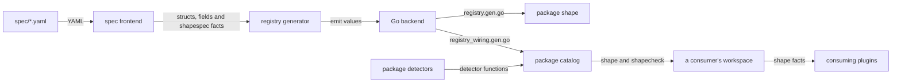
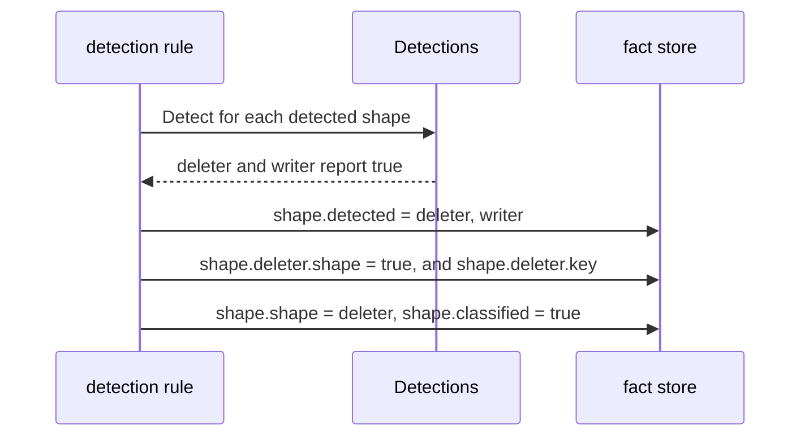

# RFC-0022: The shape catalog, its specs and its generated registries

## Summary

The module `eidos-plugin-shape` contains a statement of scope and no
code. This proposal fills it with a catalog that classifies functions
and methods. A callable has at most one shape and any number of
mixins, and a contract binds the callables of one package to the roles
of a protocol. The catalog has 23 shapes, 58 mixins and 26 contracts,
107 classifications in all. Each classification starts as a YAML spec
under `spec/`, and every spec must be valid against a published JSON
Schema.

A test in the catalog's tools module generates the registry from the
specs through an eidos workspace, and the same test without `-update`
is the mirror guard. The registry contains the name, param and role
constants of each spec, a typed params struct and a reader for each
classification, the description of every spec, and the order of the
detectors. No module of the catalog builds a binary.

The plugin `shape` declares three directives, `shape`, `mixin` and
`contract`, with one variant for each spec. A source author writes
`+acme:shape writer`, `+acme:mixin atomic` and
`+acme:contract tx role=commit`. The detection rule of the plugin runs
23 detectors over the projection of each callable, and stamps the facts
of the first shape in the order of precedence. The plugin `shapecheck`
validates each contract instance. A consuming plugin limits a rule to
writers with `shape.Is(shape.Writer)` and reads the writer's params
with `shape.WriterOf(m)`. A plugin that needs the whole vocabulary
admits every classified callable with `shape.Any()` and reads every
classification of the callable with `shape.Of(m)`, so its code does
not change when the catalog gains a spec.

The kernel gains variant schemas, override schemas and named key
handles. The stamps of a match that a directive gates get directive
authority, `rules.Callable` gets the name of the callable, and the JSON
Schema builder of `eidos-cli` moves into the kernel, where a plugin can
import it. The refusals `ExtraPositional` and `UnknownKey` state how to
fix the instance. The Go rules apply Go's visibility rule to a member
reference, and follow a transparent alias when they classify a context
or an error. The catalog's module path becomes
`go.dokimi.dev/eidos/plugin/shape`.

## Motivation

### A vocabulary written by hand drifts

A classification has a name, param keys, a directive schema, fact keys
and a detector, and all five must agree. When people write each part
by hand, only a test that compares the copies can find a drift, and it
finds the drift after the drift is in the tree. Such a test misses
each of these defects:

- A release contains a directive without the params that its check
  needs. A consumer's conformance corpus finds the gap afterwards.
- With one integer priority per detector, a narrow detector can claim
  signatures that the documentation of a broader detector lists. Each
  detector's test registers that detector alone, so no test fails.
- A rule that binds only derived samples still passes after someone
  deletes the subject's handling. A hand-written catalog has no
  section in which its author states how the rule fails.

A spec that the author writes before the code covers each defect:

- The spec states what a check observes, and declares the param
  through which the check observes it.
- The spec of a detected shape lists the shapes that rank before it. A
  test fails for two detectors that claim one callable of the corpus
  without an order.
- The schema requires a falsifiability section, in which the author
  states what turns red when someone deletes the subject's handling.

The tools generate the registry from the specs, so the registry has
no second copy that can drift.

### Shapes, mixins and contracts

Shapes, mixins and contracts differ in who classifies a callable, and
in how many classifications of the form one callable has.

- A shape is single-valued. A detector or a directive classifies a
  callable as a shape, and two detectors that claim one callable need
  an order.
- An author declares each mixin of a callable with a directive, and a
  callable has any number of mixins.
- An author declares a contract with a directive, which binds the
  callable to a role of a protocol. Each role has an arity, and a
  check of a contract needs its instance. Two transaction groups in
  one package each have one `commit`, and a check that counts `commit`
  across the package refuses both. An id separates the two instances.

If the three forms share one flat list of names, every consumer keeps
its own table of the form of each name. Arbitration by the first claim
then also applies to mixins, which accumulate instead.

### Source authors, contributors and consuming plugins

Source authors, catalog contributors and the authors of consuming
plugins each work with the catalog:

- A source author corrects a classification with one directive line.
  The spelling has to show the form, and a misspelled name has to
  report the names that exist.
- A catalog contributor adds a YAML spec and, for a detected shape,
  one function. One command generates the registry again, and a fault
  in the spec reports at its YAML position.
- The author of a consuming plugin limits a rule to the callables of
  one classification, and reads its params as typed values. The author
  does not register a key, look up a key or check the classification
  inside the handler.
- The author of a plugin that chooses its output from the whole
  vocabulary reads every classification of a callable in one call. The
  plugin's code does not refer to a spec that it does not handle, and
  does not change when the catalog gains a spec.

### Missing kernel mechanisms

- **Variant schemas.** A schema types every instance of its directive
  alike, so one directive per form cannot type the params of each
  spec.
- **Override schemas.** A directive that corrects the detectors has to
  keep them off its subject. Only a negated instance withdraws a
  subject from a plugin's bare rules.
- **Named key handles.** A gate reads its key when the rule is
  declared, and the catalog registers its keys when the workspace
  builds. A consumer cannot gate a rule on a catalog key. It reads one
  only through a lookup in its own key registration, which finds the
  key only when the consumer registers after the catalog.
- **Directive authority.** `eidos.Stamp` writes at plugin authority in
  every match, also in the match of a rule that a directive gates. In
  the metadata model, a fact from a directive has directive authority.
  The settle reads a target's name override only from a claim at
  directive authority, so no plugin's directive can write one.
- **A name on the callable projection.** `Delete(v) error` and
  `Put(v) error` have one projection. Only the name separates a
  deleter from a writer.
- **A JSON Schema builder for plugins.** The builder that derives a
  schema from Go types is in `eidos-cli/internal/config`. A plugin
  imports only the SDK facade, so the spec frontend cannot use it.
- **Advice in two refusals.** `ExtraPositional` and `UnknownKey`
  report the fault and not the fix. With variant schemas, the most
  common stray argument is a second variant on one line, such as
  `+acme:mixin atomic idempotent`.

### The catalog as a satellite

The catalog changes with each spec. In the kernel, each new spec
would need a release of the kernel, on which every satellite and
every consumer depends. The generator also runs an eidos workspace
with the Go backend, so it needs `eidos-lang-go`. The kernel may not
require a language satellite. A satellite with a tools module of its
own meets both constraints. The tools module requires
`eidos-lang-go`, and the catalog module requires only the SDK facade.

## Detailed design

### Components

| Component | Module or package | Responsibility |
|---|---|---|
| The specs | `eidos-plugin-shape/spec/` | One YAML file per classification, in a directory per form |
| The spec schema | `eidos-plugin-shape/spec.schema.json` | The published JSON Schema of a spec |
| The catalog's API | `go.dokimi.dev/eidos/plugin/shape`, package `shape` | The names, params, readers and predicates of every classification, the contract instances, and the description of every spec. Most of it is generated |
| The detectors | package `detectors` | One function per detected shape |
| The plugins | package `catalog` | `shape` and `shapecheck`, the codes of the plugins, and the generated list of detectors |
| The test kit | package `internal/shapetest` | A fixture language, fixture declarations, and a run of both plugins for the catalog's own tests |
| The tools | `go.dokimi.dev/eidos/plugin/shape/tools` | The spec frontend, the registry generator, the composition, and the test that generates and guards |
| Variant and override schemas | `go.dokimi.dev/eidos/core/directive` | `Variant`, `Schema.Variants`, `Schema.Overrides`, `Directive.Variant`, `Directive.Overrides` and `UnknownVariant` |
| Named key handles | `core/meta`, `core/plugin`, `core/workspace` and package `eidos` | `meta.Named`, `Registry.Claimant`, `plugin.KeyBinder`, the binding of each gate when the workspace builds, and the reads that resolve a name |
| Directive authority | package `eidos` | `Stamp` and `StampOn` in a match that a directive gates |
| The callable's name | `go.dokimi.dev/eidos/core/rules` | `Callable.Name` |
| The JSON Schema builder | `go.dokimi.dev/eidos/core/jsonschema` | The schema of a Go type from its tags, for the config file and for a spec |
| Member references | `go.dokimi.dev/eidos/lang/go/rules` and `lang/protobuf/rules` | Go's visibility rule for a member, a context or an error behind a transparent alias, and the messages of an rpc |
| The worked specs over Go | `go.dokimi.dev/eidos/conformance/lang/go` | `ComposeShape` and a Go tree with every form |

A detected shape is a shape spec with `detected: true`. Its detector
is a function of the projection of a callable.

### Invariants

1. **Every name comes from a spec.** A detected spec without a
   detector does not compile. An exported function of package
   `detectors` without a detected spec fails a test.
2. **A spec is valid before anything is generated from it.** The
   generator reports an invalid spec as a positioned Error and writes
   no file.
3. **A detector reads the projection.** It reads `rules.Callable` and
   the bound rules, returns a bool, and does not import a package of a
   language.
4. **A callable has at most one shape.** A shape directive keeps the
   detectors off its callable, and the detection rule stamps the facts
   of one detected shape.
5. **Only the plugin `shape` writes keys of the namespace `shape`.**
   `shapecheck` reads them and writes none.
6. **The facts of one classification form one fact group,** so one
   `meta drop` removes every fact of the classification.
7. **A contract instance is the contract, the package and the id.**
   Each role of an instance has a number of callables that its arity
   admits.
8. **A plugin stamps only its subject.** A directive writes facts on
   its own callable alone, so the members of a contract instance are
   the callables that have the directive.
9. **The catalog module requires the SDK facade and no language
   satellite.**
10. **No module of the catalog builds a binary, and the tools module
    does not import the catalog.** A generated file that does not
    compile never stops the generator.

### Examples for each author

A source author corrects or declares a classification at the
declaration. Each form has one directive, and its first argument is
the name of the spec:

```go
//+acme:shape writer reads=Get
func (s *Store) Put(v Value) error

//+acme:mixin atomic read=Get
func (s *Store) Apply(ops []Op) error

//+acme:contract tx role=begin
func (s *Store) Begin() (*Tx, error)

//+acme:contract tx role=commit closed=ErrClosed
func (t *Tx) Commit() error

//+acme:contract tx role=rollback
func (t *Tx) Rollback() error
```

`Begin`, `Commit` and `Rollback` form one instance of `tx`, because
they are declared in one package and none of them writes an id.

The author of a consuming plugin limits a rule to the callables of one
classification, and reads its params as one typed value. The plugin
does not register a key:

```go
sdk.NewPlugin("roundtrip").
    Output(plugin.Output{Per: plugin.PerSource, Word: "roundtrip"}).
    Handle(sdk.Where(shape.Is(shape.Writer),
        sdk.OnMethod(func(m *sdk.MethodMatch, e *sdk.Emitter) error {
            w, _ := shape.WriterOf(m)
            return emitRoundTrip(m, e, w.Value, w.Reads, w.Sample)
        }))).
    Build()
```

The author of a plugin that needs the whole vocabulary admits every
classified callable, and chooses its output from the names and the
params that `shape.Of` returns. `shape.InstanceOf` returns the members
of a contract instance:

```go
sdk.NewPlugin("checks").
    Output(plugin.Output{Per: plugin.PerSource, Word: "checks"}).
    Handle(sdk.Where(shape.Any(),
        sdk.OnMethod(func(m *sdk.MethodMatch, e *sdk.Emitter) error {
            c := shape.Of(m)
            if c.Shape != "" {
                emitCheck(m, e, c.Shape, c.Params[string(c.Shape)])
            }
            for _, mixin := range c.Mixins {
                emitModifier(m, e, mixin, c.Params[string(mixin)])
            }
            for _, role := range c.Contracts {
                inst, _ := shape.InstanceOf(m, m.Method, role.Contract)
                emitHarness(m, e, inst, c.Params[string(role.Contract)])
            }
            return nil
        }))).
    Build()
```

A catalog contributor adds `spec/shapes/writer.yaml` and one exported
function of package `detectors`, whose name is the name of the spec
in Pascal case:

```go
// Writer reports a callable that takes one input and returns no value
// beside its error.
func Writer(c rules.Callable, _ rules.Bound) bool {
    s := signatureOf(c)
    return s.fails && s.inputs == 1 && s.values == 0
}
```

`go generate ./...` in the catalog then writes the registry again, and
the test of the tools module fails until the generated files match the
specs.

### Modules and the flow of generation



`eidos-plugin-shape` takes the module path
`go.dokimi.dev/eidos/plugin/shape`, whose last element is the name of
its package, `shape`. The Go backend derives the package of a
generated file from that element when the run does not load a Go file
of the file's directory. The path `go.dokimi.dev/eidos/plugin-shape`
gives the package name `plugin`. The module requires
`go.dokimi.dev/eidos/sdk` and, for its tests, `go.dokimi.dev/assert`.
The SDK facade requires the kernel, as in every plugin module.

`eidos-plugin-shape/tools` is a module of its own,
`go.dokimi.dev/eidos/plugin/shape/tools`. It requires the SDK facade,
the kernel, `eidos-lang`, `eidos-lang-go`, `go.yaml.in/yaml/v3` v3.0.5,
the version that `eidos-cli` requires, and `go.dokimi.dev/assert` for
its tests. The go command leaves a directory with its own `go.mod` out
of the module of the parent directory, so the catalog module does not
depend on any of these. The spec frontend and the registry generator
are plugins and import the SDK facade. The registry generator also
imports the naming package of `eidos-lang`. Only the tools module's
root package, which composes the workspace, imports the kernel and
`eidos-lang-go`.

The depguard configuration keeps the boundary:

- The rule `plugin-modules` denies `go.dokimi.dev/eidos/core` in
  plugin modules. It gains the exclusion
  `!**/eidos-plugin-shape/tools/**`, because the tools module composes
  a workspace, which the facade does not re-export.
- A new rule, `shape-catalog`, denies `go.dokimi.dev/eidos/lang` in
  every file of `eidos-plugin-shape` outside the tools module.
  `eidos-lang` and the seven language satellites have module paths
  below that prefix, so the rule is the Tier-3 import ban for the
  whole catalog module.

### The spec format

A spec is one YAML file. Shape specs are in `spec/shapes/`, mixin
specs in `spec/mixins/` and contract specs in `spec/contracts/`. The
name of the file is the name of the spec with the extension `.yaml`.
An editor with the YAML language server reads the modeline on the
first line of each spec and loads the published schema, so it
validates the spec and completes its sections.

```yaml
# yaml-language-server: $schema=../../spec.schema.json
name: writer
form: shape
detected: true
claim: >
  The callable persists exactly one input value and returns success
  solely through its error model.
observation: >
  A check sees the persisted value through a sibling reader. The reads
  param refers to the reader where no reader shape is stamped on the
  callable's type.
params:
  - {key: reads, type: reference, resolve: callable-in-scope, doc: the reader that observes the write}
  - {key: sample, type: string, counterexample: true, doc: a value that the check writes}
bindings:
  value: {from: input, index: 0, doc: the parameter whose value the callable persists}
falsifiability: >
  Deleting the subject's write path turns the generated round-trip check
  red, because the sample written through the subject is no longer
  observable through the reader.
counterexamples:
  invalid: a value that the subject refuses
  unsafe: a value that the reader never returns unescaped
  refused: a callable that returns a value beside the error, which is an answering writer
precedence:
  yields_to: [deleter]
```

```yaml
# yaml-language-server: $schema=../../spec.schema.json
name: tx
form: contract
claim: >
  The group provides begin, commit and rollback over one resource.
  Effects between begin and commit are observable only after commit, and
  never after rollback.
observation: >
  A check watches the resource from outside the transaction, through a
  reader of the resource, and calls commit or rollback once the
  transaction is finished to see the closed sentinel.
params:
  - {key: closed, type: reference, resolve: package-var, doc: the error that commit or rollback reports once the transaction is finished}
roles:
  begin: {arity: one}
  commit: {arity: one}
  rollback: {arity: one}
falsifiability: >
  A commit without a begin fails, and work done before a rollback is not
  observable after it.
counterexamples:
  invalid: an operation sequenced outside begin and commit
  edge: an empty transaction, a begin and then a commit without work
  refused: two callables in one role of one instance
```

```yaml
# yaml-language-server: $schema=../../spec.schema.json
name: atomic
form: mixin
claim: >
  The callable either completes fully or has no observable side effect.
observation: >
  A partial state is refutable only where a check can observe it. The
  read param refers to the reader through which the check inspects the
  state after a failed call.
params:
  - {key: read, type: reference, resolve: callable-in-scope, doc: the reader that inspects the state after a failed call}
falsifiability: >
  A failure injected mid-effect turns the check red when any partial
  state is visible through the reader.
counterexamples:
  edge: a call without effect, which is atomic and passes
  unsafe: a failure between the effect and its acknowledgement
```

```yaml
# yaml-language-server: $schema=../../spec.schema.json
name: partition
form: mixin
claim: >
  The callable observes a partition boundary, such as a tenant or a shard,
  and never serves data of another partition.
observation: >
  A check varies the parameter that the axis param names while it keeps
  the other inputs, and reads each partition back through the reader that
  the read param refers to. The reader takes the same parameter, so a
  check can name one partition on both callables.
params:
  - {key: read, type: reference, resolve: callable-in-scope, doc: the reader of one partition}
  - {key: axis, type: reference, resolve: host-param, also_on: [read], doc: the parameter of the callable that selects the partition}
falsifiability: >
  A subject that ignores the axis serves a value of one partition to a
  read of another, and the check turns red.
counterexamples:
  unsafe: two partitions that store values under one key
```

The sections, per form:

| Section | shape | mixin | contract | Value |
|---|---|---|---|---|
| `name` | required | required | required | lowercase words joined by hyphens, such as `batch-writer`, equal to the file name |
| `form` | required | required | required | `shape`, `mixin` or `contract`, equal to the directory |
| `claim` | required | required | required | text in neutral vocabulary, without the spelling of any language |
| `observation` | required | required | required | text |
| `params` | optional | optional | optional | a list of params |
| `bindings` | optional | forbidden | forbidden | a map from the name of a binding to its position |
| `falsifiability` | required | required | required | text |
| `counterexamples` | required | required | required | `invalid`, `unsafe`, `edge` and `refused`, at least one |
| `detected` | optional | forbidden | forbidden | `true` where a detector classifies callables as the shape |
| `documentary` | forbidden | optional | optional | `true` where the classification documents its callables and licenses no check |
| `precedence` | optional | forbidden | forbidden | `yields_to`, a list of detected shapes |
| `roles` | forbidden | forbidden | required | a map from a role to its `arity`: `one`, `optional`, `many` or `any` |

Each param has a `key`, a `type` and a `doc`. The `type` is `string`,
`int` or `reference`. A `reference` requires `resolve`, which is one of
these spellings:

| `resolve` | Kernel resolution kind | The value refers to |
|---|---|---|
| `callable-in-scope` | `ResolveCallableInScope` | a callable in the scope of the subject. For a method, a method of its type comes before a function |
| `package-var` | `ResolvePackageVar` | a package-level variable or constant |
| `value-field` | `ResolveValueField` | a field of the subject's value |
| `host-param` | `ResolveHostParam` | a parameter of the subject |
| `member-on-handle` | `ResolveMemberOnHandle` | a field or a method of the handle that the subject returns |
| `type-in-scope` | `ResolveTypeInScope` | a type in the scope of the file of the subject |

A param can also state these constraints:

- `required` refuses an instance that does not write the param.
- `counterexample` marks a value that no derivation could invent.
- `roles` applies a param of a contract under the listed roles alone.
- `minimum` is the least value of an `int` param.
- `excludes` lists the params of the spec that an instance does not
  write beside this one.
- `also_on` lists the `callable-in-scope` params whose callables also
  declare the parameter that a `host-param` reference refers to.

A binding of a shape has `from`, `index` and `doc`. `from: input`
counts the parameters with the input role, so a context parameter has
no position. `from: result` counts the returns with the value or the
stream role, so the error and the ok flag have no position. `index`
counts from 0. The plugin `shape` stamps the identity of the parameter
or the return at the position, for a detected shape and for a declared
one.

The spec frontend reports a param or a binding with a reserved key. The
directive layer reserves `out`, `tag` and `role`. The catalog reserves
`id`, `shape` and `mixin`, which are parts of the keys of its facts.

`yields_to` lists the detected shapes ranked before this one, for a
callable that both detectors report. The generator orders the detected
shapes by these lists, and by name where the lists leave two shapes
unordered. The specs state these entries:

| Shape | Yields to |
|---|---|
| `aggregator` | `stream-reader`, `predicate`, `computation` |
| `answering-writer` | `stream-consumer` |
| `computation` | `stream-reader`, `predicate` |
| `pointer-reader` | `computation` |
| `poison-accessor` | `closer` |
| `reader` | `batch-reader`, `stream-consumer`, `answering-writer` |
| `reader-no-error` | `stream-reader`, `pointer-reader`, `computation` |
| `stream-consumer` | `batch-reader` |
| `writer` | `deleter` |

The detector of `computation` refuses a callable that takes a context
or reports a failure. A callable without either, such as a getter or a
pure function, is a `computation` before it is an `aggregator`, a
`reader-no-error` or a `pointer-reader`. A callable with a context
keeps the aggregator and the readers.

The 107 specs have 91 params, 30 bindings and 49 roles. Six params
are counterexamples, four are required, one has a minimum, two exclude
each other, and one has `also_on`. The mixins `deprecated`, `errors`
and `scope` are documentary.

### The JSON Schema of a spec

The spec frontend declares one Go type per form. Its decoder reads
each spec into the type of the spec's directory, with `KnownFields`
set on the `yaml.Decoder`. `jsonschema.Of` builds the published
schema, draft 2020-12, from the same types. The schema is a `oneOf` of
three closed objects, and the `form` property of each object allows
one constant. A section that is forbidden for a form is an unknown
field to the decoder and to the schema, and a section that is required
for a form is required by both.

```go
// Shape is the document of a shape spec, in spec/shapes. A callable has at
// most one shape.
type Shape struct {
    Name            Name             `yaml:"name"            schema:"required" doc:"The name of the shape, in lowercase words joined by hyphens."`
    Form            ShapeForm        `yaml:"form"            schema:"required" doc:"The form of the spec, shape."`
    Detected        bool             `yaml:"detected"                          doc:"When true, a detector classifies callables as the shape."`
    Claim           string           `yaml:"claim"           schema:"required" doc:"The assertion of the classification, in neutral vocabulary."`
    Observation     string           `yaml:"observation"     schema:"required" doc:"What a check observes to check the claim."`
    Params          []Param          `yaml:"params"                            doc:"The params of the shape's variant of the shape directive."`
    Bindings        map[Name]Binding `yaml:"bindings"                          doc:"The positions of the callable that fill the parts of the shape, by the name of the part."`
    Falsifiability  string           `yaml:"falsifiability"  schema:"required" doc:"What turns red when someone deletes the subject's handling."`
    Counterexamples Counterexamples  `yaml:"counterexamples" schema:"required" doc:"The inputs that a check covers."`
    Precedence      *Precedence      `yaml:"precedence"                        doc:"The detected shapes that rank before this one."`
}

// Mixin is the document of a mixin spec, in spec/mixins. A callable has
// any number of mixins.
type Mixin struct {
    Name            Name            `yaml:"name"            schema:"required" doc:"The name of the mixin, in lowercase words joined by hyphens."`
    Form            MixinForm       `yaml:"form"            schema:"required" doc:"The form of the spec, mixin."`
    Documentary     bool            `yaml:"documentary"                       doc:"When true, the mixin documents the callable and licenses no check."`
    Claim           string          `yaml:"claim"           schema:"required" doc:"The assertion of the classification, in neutral vocabulary."`
    Observation     string          `yaml:"observation"     schema:"required" doc:"What a check observes to check the claim."`
    Params          []Param         `yaml:"params"                            doc:"The params of the mixin's variant of the mixin directive."`
    Falsifiability  string          `yaml:"falsifiability"  schema:"required" doc:"What turns red when someone deletes the subject's handling."`
    Counterexamples Counterexamples `yaml:"counterexamples" schema:"required" doc:"The inputs that a check covers."`
}

// Contract is the document of a contract spec, in spec/contracts. A
// contract binds callables to the roles of a protocol.
type Contract struct {
    Name            Name               `yaml:"name"            schema:"required" doc:"The name of the contract, in lowercase words joined by hyphens."`
    Form            ContractForm       `yaml:"form"            schema:"required" doc:"The form of the spec, contract."`
    Documentary     bool               `yaml:"documentary"                       doc:"When true, the contract documents its callables and licenses no check."`
    Claim           string             `yaml:"claim"           schema:"required" doc:"The assertion of the classification, in neutral vocabulary."`
    Observation     string             `yaml:"observation"     schema:"required" doc:"What a check observes to check the claim."`
    Params          []Param            `yaml:"params"                            doc:"The params of the contract's variant of the contract directive."`
    Roles           map[Name]RoleArity `yaml:"roles"           schema:"required" doc:"The roles of the protocol, with their arity."`
    Falsifiability  string             `yaml:"falsifiability"  schema:"required" doc:"What turns red when someone deletes the subject's handling."`
    Counterexamples Counterexamples    `yaml:"counterexamples" schema:"required" doc:"The inputs that a check covers."`
}

// Param is one param of a classification's variant of its directive. The
// generator declares one constant for its key, one field of the spec's
// params struct, and one fact key.
type Param struct {
    Key            Name       `yaml:"key"            schema:"required" doc:"The key of the param in the directive, in lowercase words joined by hyphens."`
    Type           ParamType  `yaml:"type"           schema:"required" doc:"The type of the value: string, int or reference."`
    Resolve        Resolution `yaml:"resolve"                          doc:"The kind of declaration that a reference refers to. A reference requires it."`
    Required       bool       `yaml:"required"                         doc:"When true, an instance of the directive writes the param."`
    Counterexample bool       `yaml:"counterexample"                   doc:"When true, the value is an input that no derivation could invent."`
    Roles          []Name     `yaml:"roles"                            doc:"The roles of a contract under which the param applies."`
    Minimum        *int64     `yaml:"minimum"                          doc:"The least value of an int param."`
    Excludes       []Name     `yaml:"excludes"                         doc:"The params of the spec that an instance does not write beside this one."`
    AlsoOn         []Name     `yaml:"also_on"                          doc:"The callable params of the spec whose callables also declare the parameter that this host-param reference refers to."`
    Doc            string     `yaml:"doc"            schema:"required" doc:"The meaning of the param."`
}

// Binding states the position of the parameter or the return that fills
// one part of a shape, such as the parameter of the key of a reader. The
// plugin shape stamps the identity of the parameter or the return at the
// position, for a detected shape and for a declared one.
type Binding struct {
    From  Source `yaml:"from"  schema:"required" doc:"The list that the index counts in: input, the input parameters, or result, the returns that are values or streams."`
    Index int    `yaml:"index"                   doc:"The position in the list, from 0."`
    Doc   string `yaml:"doc"   schema:"required" doc:"The meaning of the binding."`
}

// Counterexamples are the inputs that a check of a classification
// covers. A spec states at least one.
type Counterexamples struct {
    Invalid string `yaml:"invalid" doc:"An input that the subject refuses."`
    Unsafe  string `yaml:"unsafe"  doc:"An input that does not pass through the subject unchanged."`
    Edge    string `yaml:"edge"    doc:"An input at a boundary of the claim."`
    Refused string `yaml:"refused" doc:"A callable or a use that the classification excludes."`
}

// Precedence lists the detected shapes ranked before a detected shape, for
// a callable that both detectors report.
type Precedence struct {
    YieldsTo []Name `yaml:"yields_to" schema:"required" doc:"The detected shapes that rank before this one."`
}

// RoleArity is one role of a contract.
type RoleArity struct {
    Arity Arity `yaml:"arity" schema:"required" doc:"The number of callables of the role in one instance: one, optional, many or any."`
}
```

`Name`, `ShapeForm`, `MixinForm`, `ContractForm`, `ParamType`,
`Resolution`, `Source` and `Arity` are string types. Each implements
`yaml.Unmarshaler`, which refuses a value outside its spelling at the
value's line, and `jsonschema.Schemer`. The schema of `Name` is a
string with the pattern `^[a-z][a-z0-9]*(-[a-z][a-z0-9]*)*$`. The
decoder also reads the keys of `bindings` and `roles` as names, so the
schema of `Name` is the schema of the property names of both maps. The
schema of each other type is an `enum` of its spellings, and a form
type has one spelling, so its schema is a constant.

### The checks of a spec

| Check | Where | Finding |
|---|---|---|
| A file that is not a mapping, an unknown section, or a section that the form forbids | The decoder | `SpecInvalid` at the line of the fault |
| A missing required section | The decoder | `SpecInvalid` at the mapping |
| A blank required text, such as an empty claim | The decoder | `SpecInvalid` at the value |
| A name that breaks the pattern, or a spelling outside its vocabulary, such as a form, a type, a resolution, a source or an arity | The decoder | `SpecInvalid` at the value |
| A directory other than the directory of a form | The spec frontend | `SpecInvalid` at the document |
| A name that is the part of a summary key, such as `classified`, or a file name other than the name | The spec frontend | `SpecInvalid` at the name |
| `counterexamples` without an entry, `precedence` on a shape that is not detected, a contract without a role, or a binding at a negative index | The spec frontend | `SpecInvalid` at the section |
| A key of two params or bindings, or a reserved key | The spec frontend | `SpecInvalid` at the param or the binding |
| A reference without `resolve`, `resolve` on another type, `roles` outside a contract or outside its roles, `minimum` on another type than `int`, an `excludes` entry that is no other param, or `also_on` that is not on a `host-param` reference or that lists no `callable-in-scope` param | The spec frontend | `SpecInvalid` at the param |
| Two specs with one name, or a Go identifier that two specs give or that one spec gives twice, such as a param `of` beside the reader `WriterOf` | The registry generator | `SpecDuplicate` at each spec |
| A `yields_to` entry that is not a detected shape | The registry generator | `SpecInvalid` at the spec |
| A cycle of `yields_to` entries | The registry generator | `PrecedenceCycle` at each spec of the cycle |

The group of a spec named `detected`, `shape`, `mixed`, `member` or
`classified` would have the spelling of a summary key of the catalog,
such as `shape.detected`, and the key registry refuses a key and a
group with one spelling.

Each finding is an Error. An Error in the load commits nothing, and a
plan with an Error commits nothing, so a run over an invalid spec does
not write a file. The tools module registers the three codes under the
prefix `SHAPESPEC`.

### The spec frontend

`specfront.New()` builds a frontend with the frontend kit. Its
language and its name are `shapespec`, and it claims
`spec/**/*.yaml`. The partition makes each directory one unit. The
parse decodes each file of the unit into the type of its form, and
reports each fault at its YAML position. It then builds these
declarations:

| Spec | Declaration |
|---|---|
| A directory | A package whose path is the directory, such as `spec/shapes` |
| A file | A file of that package |
| A spec | A struct with the spec's name, documented by the claim |
| A param | A field of the struct with the param's key, a type reference spelled as the param's type, and the param's doc |
| A binding | A field of the struct with the binding's name, a type reference spelled `reference`, and the binding's doc |

Through the unit's graph builder, the parse also stamps the values
that the declarations do not state:

- On a struct, `shapespec.form`, `shapespec.detected`,
  `shapespec.documentary`, `shapespec.yields` and `shapespec.roles`.
  An entry of `shapespec.roles` has the form `role=arity`.
- On the field of a param, `shapespec.resolve`, `shapespec.required`,
  `shapespec.counterexample`, `shapespec.applies`,
  `shapespec.minimum`, `shapespec.excludes` and `shapespec.also-on`.
- On the field of a binding, `shapespec.from` and `shapespec.index`.
  A field with `shapespec.from` is a binding, and every other field is
  a param.

`specfront.Keys` claims the namespace `shapespec` and registers these
keys, and the tools composition passes it to `Builder.Keys`. A spec
refers to nothing outside itself, so the frontend's resolution returns
no candidate. The composition declares the language's rules with
`rules.Absent(specfront.Lang)`. `specfront.Schema` returns the
published schema, which `jsonschema.Of` builds from the document
types.

### Generation without a binary

The tools composition has the spec frontend and one plan, `catalog`.
The generator `registry` reads every spec in one graph rule, because
the order of the detectors depends on every spec. It declares two
per-plan families with the word `registry`, the primary family and the
family `wiring`.

| Plan field | Value |
|---|---|
| `Name` | `catalog` |
| `Generators` | `registry` |
| `Backend` | the Go backend |
| `Layout.Dir` | `.`, the root of the catalog module |
| `Layout.ImportBase` | `go.dokimi.dev/eidos/plugin/shape` |
| `Layout.Families` | the primary family, named `registry.gen.go`, and the family `wiring`, named `registry_wiring.gen.go` in the directory `catalog` |

Each per-plan file goes into the directory of its family. The Go
backend joins the import base with that directory, and takes the
package name from the last element of the path, because the run does
not load a Go file. The suffix `.gen.go` marks a generated Go file in
this repository, and the license check excludes such files.

```go
package tools

// Brand is the brand of the generator. The Go backend writes it into the
// frame of each generated file.
const Brand output.Brand = "shapegen"

// Plan is the name of the composition's one plan.
const Plan = "catalog"

// Compose returns the composition that generates the catalog's registry
// from its specs. It composes the spec frontend and its keys, the absent
// rules of the language of the specs, and the plan [Plan] of the registry
// generator toward the Go backend. The plan writes registry.gen.go into the
// root of the catalog module and registry_wiring.gen.go into its directory
// catalog. The run loads no Go file, so the Go backend takes the path of
// each package from the import base [registry.CatalogPath].
//
// The caller sets the output and runs the composition over the catalog
// module's directory. Each call returns new plugins, because a plugin
// instance belongs to one workspace.
func Compose() *workspace.Builder
```

The tools module has no `main` package. Its test `TestCompose` runs
the composition over the catalog module into an in-memory sink,
without a ledger. It compares each generated file and the output of
`specfront.Schema` with the file in the catalog module through
`golden.MatchAt`:

- Without `-update`, the test is the mirror guard. It fails on any
  difference, so CI fails on an invalid spec, and on a spec whose
  registry was not generated again.
- With `-update`, the test writes the generated files and the schema
  into the catalog module.

A `go:generate` line in the catalog's `doc.go` runs the test with
`-update`, so `go generate ./...` generates the catalog again. The
line needs the repository's `go.work`, because the catalog module does
not require the tools module:

```go
//go:generate go -C tools test . -run TestCompose -update
```

The generator writes these declarations, and the Go backend frames
each file with the brand's provenance:

| File | Package | Declarations |
|---|---|---|
| `registry.gen.go` | `shape` | The summary keys, such as `KeyDetected`. For each spec, the constant of its name typed by its form and documented by the claim, one `directive.ParamKey` constant for each param and each binding, such as `WriterReads` and `WriterValue`, and one `Role` constant for each role, such as `TxCommit`. One params struct and one reader for each spec, such as `WriterParams` and `WriterOf`, and the unexported named handles of its keys. `Specs`, which describes every spec |
| `catalog/registry_wiring.gen.go` | `catalog` | `Detections`, which lists every detected shape and its detector in the order of precedence |

```go
// registry.gen.go, generated.

// Writer is the shape writer. The callable persists exactly one input value
// and returns success solely through its error model.
const Writer Shape = "writer"

// WriterParams are the params of the shape writer.
type WriterParams struct {
    // Value is the parameter whose value the callable persists.
    Value symbol.Identity
    // Reads is the reader that observes the write.
    Reads symbol.Identity
    // Sample is a value that the check writes.
    Sample string
}

// WriterOf returns the params of the shape writer on the subject of m, and
// false where the subject does not have the shape. It records each read in the
// invocation of m.
func WriterOf(m sdk.Matcher) (WriterParams, bool)
```

`Detections` refers to the function of package `detectors` with the
Pascal-case name of each detected shape, such as `detectors.Writer`,
so a detected spec without a detector does not compile. A test in
`catalog` parses package `detectors` and fails for an exported
function that `Detections` does not list.

### The catalog's API

```go
package shape

// Capability is the capability that the plugin shape provides. An
// annotator whose predicates or handlers read a classification requires
// it, so the workspace runs the annotator after the plugin shape.
const Capability plugin.Capability = "shape.classified"

// Shape is the name of a shape. A callable has at most one shape. The
// package declares one constant for each shape spec, such as [Writer].
type Shape string

// Mixin is the name of a mixin. A callable has any number of mixins.
// The package declares one constant for each mixin spec, such as
// [Atomic].
type Mixin string

// Contract is the name of a contract. A contract binds callables to
// the roles of a protocol. The package declares one constant for each
// contract spec, such as [Tx].
type Contract string

// Role is the name of a role of a contract. The package declares one
// constant for each role of each contract spec, such as [TxCommit].
type Role string

// Any returns the predicate that admits a callable with a shape, a mixin
// or a role in a contract instance. It tests the summary key
// [KeyClassified].
func Any() sdk.Pred

// Is returns the predicate that admits a callable with the shape n. It
// tests the family key of the shape, so a meta drop of the group of the
// shape withdraws the callable. For a name that no shape spec has, the
// predicate has no key, and the Build of the plugin panics.
func Is(n Shape) sdk.Pred

// Has returns the predicate that admits a callable with the mixin n.
func Has(n Mixin) sdk.Pred

// In returns the predicate that admits a callable with any role in an
// instance of the contract n.
func In(n Contract) sdk.Pred

// Plays returns the predicate that admits a callable in the role r of an
// instance of the contract n. It tests the family key of the contract,
// whose value is the role of the callable.
func Plays(n Contract, r Role) sdk.Pred

// Classification is every classification of one callable.
type Classification struct {
    // Shape is the shape of the callable, and empty where it has none.
    Shape Shape
    // Mixins are the mixins of the callable, in name order.
    Mixins []Mixin
    // Contracts are the roles of the callable in contract instances, in
    // the order of the names of the contracts.
    Contracts []Membership
    // Params are the values of the params and the bindings of each
    // classification that has a value, keyed by the name of the spec.
    Params map[string]Params
}

// Membership is the role of a callable in one instance of a contract.
// The contract, the package of the callable and the id identify the
// instance, and [InstanceOf] returns its members.
type Membership struct {
    Contract Contract
    Role     Role
    // ID is empty where the package has one instance of the contract.
    ID string
}

// Params are the values of the params and the bindings of one
// classification, keyed by the key of the param or the name of the
// binding. The value of a param is a string, an int64 or a
// [symbol.Identity], by the type of the param. The value of a binding is
// the identity of its parameter or return.
type Params map[directive.ParamKey]any

// Of returns every classification of the subject of m. It reads the
// summary keys of the subject first. It then reads the family key and the
// values of the shape whose name [KeyShape] contains, of every mixin where
// [KeyMixed] is true, and of every contract where [KeyMember] is true. A
// meta drop of a classification removes its family key, so Of leaves the
// classification out. Of records each read in the invocation of m, and
// returns the zero Classification for a subject without a classification.
func Of(m sdk.Matcher) Classification

// Scoped is the match of a function or a method. It reads facts as every
// matcher does, and it reads declarations through the tracked reader of
// its invocation. [sdk.FunctionMatch] and [sdk.MethodMatch] satisfy it.
type Scoped interface {
    sdk.Matcher
    Reader() *store.Reader
}

// Instance is one instance of a contract. The contract, the package of its
// callables and the id identify it.
type Instance struct {
    Contract Contract
    // Package is the package that declares the callables of the instance.
    Package symbol.Identity
    // ID is empty where the package has one instance of the contract.
    ID string
    // Members are the functions and the methods of the instance with their
    // roles, in the order of their declarations.
    Members []Member
}

// Member is one callable of a contract instance and its role.
type Member struct {
    Callable symbol.Identity
    Role     Role
}

// InstanceOf returns the instance of the contract c that a callable has a
// role in. It returns false for a callable without a role in c, and for a
// name that no contract spec has. The members of the instance are the
// functions and the methods of the package of the callable that have a
// role in c and the same id. The methods of two types of one package
// therefore join one instance, unless their ids differ. A callable whose
// package the view of m does not contain has an instance without members.
func InstanceOf(m Scoped, callable node.Declaration, c Contract) (Instance, bool)

// Form is the form of a classification. The zero Form is no form.
type Form uint8

const (
    FormShape    Form = 1
    FormMixin    Form = 2
    FormContract Form = 3
)

// Arity is the number of callables that one role of one contract instance
// has. The zero Arity is no arity.
type Arity uint8

const (
    ArityOne      Arity = 1 // exactly one callable
    ArityOptional Arity = 2 // one callable or none
    ArityMany     Arity = 3 // one callable or more
    ArityAny      Arity = 4 // any number of callables, none included
)

// Admits reports whether a role with the arity can have n callables in
// one instance. The zero Arity admits no number.
func (a Arity) Admits(n int) bool

// Source is the list of positions of a callable that a binding counts in.
type Source uint8

const (
    SourceInput  Source = 1 // the parameters with the input role
    SourceResult Source = 2 // the returns with the value or the stream role
)

// Spec is the generated description of one classification.
type Spec struct {
    Name        string
    Form        Form
    Doc         string // the claim on one line
    Detected    bool
    Documentary bool
    Group       meta.GroupName // the fact group of the classification
    Key         meta.KeyName   // the family key
    ID          meta.KeyName   // the key of the id of a contract instance
    Params      []Param
    Bindings    []Binding
    Roles       []RoleSpec
    YieldsTo    []Shape
}

// Variant returns the variant of the spec in the directive of its form.
func (s Spec) Variant() directive.Variant

// Param is one param of a spec. It embeds the directive spec of the param,
// and adds the key of the param's fact and the checks of an instance that
// the validation of the directive does not run.
type Param struct {
    directive.ParamSpec
    Fact       meta.KeyName
    Minimum    int64
    HasMinimum bool
    Excludes   []directive.ParamKey
    AlsoOn     []directive.ParamKey
}

// Binding states the position of the parameter or the return that fills
// one part of a shape. The plugin shape stamps the identity of that
// parameter or return under Fact.
type Binding struct {
    Key   directive.ParamKey
    Fact  meta.KeyName
    From  Source
    Index int
    Doc   string
}

// RoleSpec is one role of a contract and its arity.
type RoleSpec struct {
    Name  Role
    Arity Arity
}

// Specs returns the description of every spec of the catalog, in the order
// of the names of the specs. Each call returns new slices. It is generated.
func Specs() []Spec

// SpecOf returns the description of the spec of a name, and false for a
// name that no spec has. The name is a constant of a form, such as
// [Writer], or the name of a spec as a string. The description shares its
// lists with every other call, so a caller does not modify them.
func SpecOf[N ~string](name N) (Spec, bool)

// Detection is one detected shape and its detector.
type Detection struct {
    Shape Shape
    // Detect reports whether a callable has the shape. It reads only the
    // projection of the callable and the bound rules, so one detector
    // serves every language whose rules project callables.
    Detect func(c rules.Callable, b rules.Bound) bool
}
```

```go
package catalog

// ShapeID is the name of the plugin that classifies callables.
const ShapeID plugin.ID = "shape"

// CheckID is the name of the plugin that validates contract instances.
const CheckID plugin.ID = "shapecheck"

// The names of the directives of the catalog, and the param of the
// contract directive that separates two instances in one package.
const (
    ShapeDirective    directive.Name     = "shape"
    MixinDirective    directive.Name     = "mixin"
    ContractDirective directive.Name     = "contract"
    IDParam           directive.ParamKey = "id"
)

// Annotators returns the two annotators of the catalog. The first is the
// plugin shape, which declares the directives and stamps the facts of
// every classification. The second is the plugin shapecheck, which
// validates the contract instances. Each call returns new plugins, because
// a plugin instance belongs to one workspace.
func Annotators() []plugin.Annotator

// Detections returns every detected shape and its detector, in the order
// of precedence. A shape comes before every shape that yields to it. Each
// call returns a new slice. It is generated.
func Detections() []shape.Detection
```

A predicate of package `shape` tests a named handle, and `Of`,
`InstanceOf` and the readers such as `WriterOf` read through named
handles. A consuming plugin does not register a key. A composition adds
the catalog with `Annotators(catalog.Annotators()...)`. An annotator
with a predicate on a key of the catalog requires `shape.Capability`,
and the workspace's `Build` returns an error for one that does not.

### The detectors

Package `detectors` has one exported function for each of the 23
detected shapes, of the type `func(rules.Callable, rules.Bound) bool`.
A detector reads the roles that the language gave the parameters and
the returns, the error model, the name of the callable and the folded
shapes of its types. These rules apply to every detector:

- An input is a parameter with the input role, so a context parameter
  is no input.
- A value is a return with the value or the stream role. The error and
  the ok flag are no values.
- A callable fails where the rules of its language give it an error
  model, a last error return or a thrown error.
- A reference is an interface where it is an inline body with a
  method, or a named reference to a declaration of the interface kind
  that the view contains. An inline body without a method is a record.
  A type parameter, a predeclared type such as `any` or `error`, and a
  type outside the view are no interfaces.
- The declared type of a reference is the declaration that a named
  reference refers to, an optional counting as the type that it wraps.
  A type parameter is a declared type, and a builtin is not, because a
  builtin such as a string is the type of a key and of a value alike.
- `Closer` and `Deleter` compare the name of the callable with their
  verbs without regard to case.

A detector states its own signature and does not repeat the rule of a
detector that ranks before it. `Writer` reports `Delete(v) error`
together with `Deleter`, and `writer` yields to `deleter`.

### The directives

The plugin `shape` declares three schemas, `shape`, `mixin` and
`contract`. Each has one variant per spec of its form, and the first
positional argument of an instance is the name of the variant. The
canonical spellings are `shape:shape`, `shape:mixin` and
`shape:contract`. The bare spellings work while no other plugin
registers the name.

- `shape` is single-instance and an override schema. The detection
  rule does not run on a callable with a valid instance, so the
  detectors never stamp next to the author's statement.
- `mixin` is repeatable, with one instance of each variant per
  callable. A callable has as many mixins as it has instances.
- `contract` is repeatable, with one instance of each variant per
  callable. Each variant declares the contract's roles with
  `RolesRequired` set, and scopes each param to the roles that the spec
  lists. The schema adds the optional string param `id` to every
  variant, which separates two instances of one contract in one
  package.
- No catalog schema is negatable. `meta drop` removes a
  classification.

Before any handler runs, validation types every param of the variant
and binds every reference through the language's rules. It refuses an
unknown key, and the message lists the keys that the variant accepts.
A misspelled variant, such as `+acme:shape wrtier`, is an Error under
`UnknownVariant`, and its message contains the variants of `shape`. A
second variant on one line, such as `+acme:mixin atomic idempotent`,
is an Error under `ExtraPositional`, and its message advises a
directive for each variant.

### The facts

`shape` claims the namespace `shape`, and its `Keys` function
registers every key of the catalog from `Specs`. Only `shape` writes
them:

| Key | Type | Kinds | Group | Written by |
|---|---|---|---|---|
| `shape.<shape>.shape` | `bool` | function, method | `shape.<shape>` | the shape directive, or the detection rule for the shape that ranks first |
| `shape.<shape>.<binding>` | `symbol.Identity` | function, method | `shape.<shape>` | the shape directive or the detection rule: the parameter or the return at the binding's position |
| `shape.<mixin>.mixin` | `bool` | function, method | `shape.<mixin>` | the mixin directive |
| `shape.<contract>.role` | `string` | function, method | `shape.<contract>` | the contract directive |
| `shape.<contract>.id` | `string` | function, method | `shape.<contract>` | the contract directive, where it writes a non-empty `id=` |
| `shape.<spec>.<param>` | by the param's type | function, method | `shape.<spec>` | the directive of the spec |
| `shape.detected` | `[]string` | function, method | none | the detection rule: every detected shape whose detector reports true, in the order of precedence |
| `shape.shape` | `string` | function, method | none | the shape directive or the detection rule: the name of the callable's shape |
| `shape.mixed` | `bool` | function, method | none | each mixin directive |
| `shape.member` | `bool` | function, method | none | each contract directive |
| `shape.classified` | `bool` | function, method | none | each directive, and the detection rule where a detector matched |

A param's type maps to the fact vocabulary. `string` becomes `string`,
`int` becomes `int64`, and `reference` becomes `symbol.Identity`, the
declaration that validation bound.

`shape.Of` reads the summary keys `shape.shape`, `shape.mixed` and
`shape.member` to find the classifications of a callable without a
read of the family key of every spec. `shape.Any` returns a predicate
on the summary key `shape.classified`. Each mixin directive runs in an
invocation of its own, and no invocation sees every mixin of a
callable, so no invocation can write a list of them. Every invocation
that stamps a flag stamps `true`, so the claims of two mixin
directives on one callable agree.

`meta drop=shape.writer` drops the group `shape.writer`, so the
callable then has no writer facts, and `explain` shows the drop as a
deletion that somebody wrote. `shape.shape` still contains `writer`,
and `shape.Of` reads the family key `shape.writer.shape` before it
reports the shape, so the dropped shape is absent from its result.

On `Delete(v Value) error`, `explain` shows `shape.deleter.shape` from
the detection rule and `shape.detected` with `deleter` before
`writer`, so the shape that lost by precedence is visible.

### The annotator shape

`shape` declares its rules in this order:

1. A `Directive` wrapper of the schema `shape` over `OnFunction` and
   `OnMethod`. The handler stamps `shape.<variant>.shape`, the
   bindings of the shape, each param of the instance, `shape.shape`
   and `shape.classified`.
2. A `Directive` wrapper of the schema `mixin`. The handler stamps
   `shape.<variant>.mixin`, each param of the instance, `shape.mixed`
   and `shape.classified`.
3. A `Directive` wrapper of the schema `contract`. The handler stamps
   `shape.<variant>.role`, the id where the instance has a non-empty
   one, each param of the instance, `shape.member` and
   `shape.classified`.
4. The detection rule, a bare `OnFunction` and a bare `OnMethod`. The
   handler projects the callable with `m.Rules().CallableOf` and runs
   every detector of `Detections`. It stamps `shape.detected` with the
   shapes whose detectors report true. For the first of them, it stamps
   `shape.<shape>.shape`, the bindings of the shape, `shape.shape` and
   `shape.classified`. A callable of a language without rules has no
   projection, and the rule stamps nothing on it.

Before a directive handler stamps, it reports the faults of the
instance that validation does not check, each as an Error at the
directive:

- `ParamRange` for an `int` param below the minimum of its spec.
- `ExclusiveParams` for two params that exclude each other, once for
  the pair.
- `UnsharedParam` for a `host-param` reference whose parameter the
  callable of an `also_on` param does not declare. A callable that the
  view does not contain has no parameters.

The directive handlers stamp at directive authority, and the detection
rule at plugin authority. Each handler reads its own subject and its
own instance, so no handler depends on another match of the plugin.
The order of precedence is data in `Detections`, which the generator
writes from the specs.



### The annotator shapecheck

`shapecheck` requires `shape.Capability`, so the workspace runs it in
a later bucket. For each contract spec, it declares a rule behind the
gate `shape.In` of the contract. The handler validates the instance of
its callable and does not write a fact.

An instance is the contract, the package of the callables and the
value of `id`, which is empty where a member writes none. The handler
calls `shape.InstanceOf`, which reads the package of the callable
through the tracked reader of the match, and the role and the id of
each function and method of the package with `FactOf`. It counts the
callables of each role in its instance:

- For a role with more callables than its arity admits, the handler
  of each callable of the role reports one `RoleArity` Error at its
  own callable.
- For a role without a callable that its arity requires, the handler
  of the first member of the instance reports one `RoleArity` Error.
  The instance then has one finding for each missing role.

The message identifies the instance, such as "the instance a of the
contract tx in the package acme/store". The kernel records each read
of the handler. A warm run validates the instance again when a member
gains or loses the directive, when the package changes, or when the
facts of a member change.

### Kernel: variant schemas

A schema with variants takes the name of a variant as the first
positional argument of each instance. The variant adds its own params
and declares its roles:

```go
// Variant is one variant of a schema, such as writer in shape writer. The
// first positional argument of an instance selects it. Its params join the
// schema's, and its roles apply in place of the schema's.
type Variant struct {
    // Name is the spelling of the first positional argument.
    Name string
    // Params declares the keyed params of the variant, beside the
    // schema's Params, which apply to every variant.
    Params []ParamSpec
    // Roles is the closed set of values the role key accepts on an
    // instance of the variant.
    Roles []string
    // RolesRequired refuses an instance of the variant that writes no
    // role.
    RolesRequired bool
    // Doc states the variant's meaning. Registration refuses an empty one.
    Doc string
    // Deprecated marks the variant deprecated where it is not empty, and
    // states the rewrite. Validation types each instance as before, and
    // reports it under [DeprecatedDirective].
    Deprecated string
}
```

`Schema` gains `Variants []Variant`, and `Directive` gains `Variant
string`, the name of the selected variant. `Args` contains the
positional arguments after the variant. These rules apply:

- Registration refuses `Variants` beside `Roles`, two variants with one
  name, a name that the grammar cannot spell, a variant without a doc,
  and a variant param with the key of a schema param. It checks the
  params and the roles of a variant as it checks those of a schema.
- Validation reads the variant from the first positional argument,
  wherever the author writes it. It refuses an instance without a
  positional argument, or with a name that no variant has, under the
  new kernel code `UnknownVariant`, EID-0068. The message contains the
  names of the variants. A list in place of the name is a
  `TypeMismatch`.
- An instance of a deprecated variant reports a Warning under
  `DeprecatedDirective` that states the rewrite, and validates as
  before.
- A single-instance schema admits one instance per subject, whatever
  its variant. A repeatable schema with variants admits one instance
  of each variant per subject, and reports a second one under
  `DuplicateInstance`, related to the first. The meaning of
  `DuplicateInstance` covers both cases.
- `ConflictsWith` and `Requires` apply to the schema, whatever the
  variant.
- The sealed state records the variant of each validated directive, so
  a warm run restores it with the directive.

### Kernel: override schemas

`Schema` gains `Overrides bool`, and `Directive` gains `Overrides
bool`, which validation copies from the schema. A valid instance of an
override schema withdraws its subject from the bare and fact-gated
rules of the plugin that registered the schema, as a negated instance
does. Rules that a directive gates still run. `Index.Skipped` reads
`Directive.Overrides` beside `Directive.Negated`, so dispatch does not
change otherwise. Registration refuses an override kernel schema, as
it refuses a negatable one, because the kernel is no plugin. The
sealed state records the flag of each validated directive.

### Kernel: named key handles

```go
package meta

// Named returns a handle on the key with the name name, for a plugin whose
// predicates or handlers read a key that another plugin registers. The
// handle has no id. A gate on it binds when the workspace builds, and a
// read resolves the name in the registry of the store that it reads. A
// read of a name that nothing registered under T finds no fact. A write
// through the handle is refused, because a registrant writes through the
// handle that Register returned. Named allocates nothing.
func Named[T FactValue](name KeyName) Key[T]

// Claimant returns the registrant that claimed a namespace: a plugin's
// name, or the empty name for the composition. It reports false for a
// namespace that nothing claimed. Every key of a namespace registers
// through its claimant, so the claimant is the registrant of each key of
// the namespace. It allocates nothing.
func (r *Registry) Claimant(ns string) (string, bool)
```

`HasKey` and `KeyEquals` accept a named handle, and such a predicate
has no key id until the workspace binds it. The workspace binds each
gate on a named handle after it seals the key registry and before the
first phase call, through a new optional role:

```go
package plugin

// KeyBinder binds the plugin's predicates on named key handles, the
// handles with the name of a key of another registrant. The workspace
// calls BindKeys once, after it seals the key registry and before the
// first phase call. The message of the error contains the plugin and each
// key that the registry does not contain under the handle's value type,
// and the workspace collects the error as a fault of the composition.
type KeyBinder interface {
    BindKeys(r *meta.Registry) error
}
```

A plugin that `eidos.Builder.Build` returns implements `KeyBinder`. Its
`BindKeys` binds each gate on a named handle to the id of the name, and
lowers its subscriptions again with the bound ids. A plugin without a
named handle is unchanged. These rules apply:

- `Build` of the workspace returns an error for a gate on a name that
  the registry does not contain, and for a name that it contains under
  another value type. The message of the error contains the plugin and
  the key.
- `Build` of the workspace returns an error for an annotator whose
  predicate tests a key that another annotator registers, where the
  annotator does not run after that annotator. The message contains both annotators, the key, and
  the capabilities of the registrant to require, or the statement that
  the registrant provides none. It reports each annotator and key once.
  The claimant of the key's namespace is the registrant.
- `meta.Get` and `meta.Fact` resolve a named handle in the registry of
  the store that they read. `Fact`, `FactOf`, `rules.Fact` and the test
  of each predicate read through them. A name that the registry does
  not contain under the handle's value type reads absent, and
  `meta.Fact` records the read under the name.
- `meta.Stamp` refuses a named handle, so `Stamp` and `StampOn` report
  it under `RefusedStamp`, because a plugin writes only the keys that
  it registered.
- `Key.IsZero` reports false for a named handle. The zero handle still
  panics at the plugin's `Build`, so a handle that a plugin assigns
  after the declaration remains a loud error.
- `plugintest.Fixture` binds the gates of a plugin in its registry
  before each phase call, as the workspace does.

### Kernel: directive authority

`Stamp` and `StampOn` keep their signatures. In a match that a
directive gates, through `Directive` or `Gated`, the claim has
directive authority, and its position is the position of the gating
instance. Every other match stamps at plugin authority.

```go
// Stamp records v under k on the subject of the match. The claim has the
// phase call's bucket and plugin, and the invocation's place in canonical
// match order, which is the rule, the subject and the gating instance.
// The invocation's point reads so far are the claim's derivation. In a
// match that a directive gates, the claim has directive authority and the
// gating instance's position. In every other match, it has plugin
// authority. A write that the fact store refuses reports an Error at the
// subject's position under RefusedStamp, and the phase continues.
func Stamp[T meta.FactValue](st *Stamper, k meta.Key[T], v T)
```

The allocation contract of `Stamp` does not change. A `meta drop` and
a directive's stamp have equal authority. The claim of a drop has
bucket zero and no plugin, so it ranks before the claim of any plugin,
and a dropped group remains dropped under the directives of a plugin.
A warm run withdraws the claims of an invocation that runs again by
their bucket, plugin and order, whatever their authority.

### Kernel: the callable's name

```go
// Callable is the normalized view of a function or a method: what a
// shape detector reads, and the only thing it may. [Bound.CallableOf]
// returns it. Params is nil for a signature without parameters, and
// Returns for one without returns.
type Callable struct {
    Name     string       // the declared name of the function or the method
    Receiver *ParamView   // nil for a free function or a type-level member
    Params   []ParamView  // in declaration order, without nil entries
    Returns  []ReturnView // in declaration order, without nil entries
    Errors   ErrorModel   // the failure channel the language names
    Async    bool         // whether the callable is asynchronous
}
```

`Bound.CallableOf` fills `Name` from the declaration. The projection
does not gain any other part of the declaration, so a detector still
reads nothing of a language.

### Kernel: the JSON Schema builder

The schema builder moves from `cli/internal/config` into the new
kernel package `go.dokimi.dev/eidos/core/jsonschema`, and the SDK
facade re-exports it as `go.dokimi.dev/eidos/sdk/jsonschema`. A plugin
imports only the SDK facade, and the facade defines nothing of its
own, so the package is in the kernel:

```go
package jsonschema

// Schemer is a type with a JSON Schema of its own, such as an enumeration
// that a decoder reads from a fixed list of spellings.
type Schemer interface {
    JSONSchema() map[string]any
}

// Of returns the JSON Schema, draft 2020-12, of the values of t.
//
//   - A pointer has the schema of its element.
//   - A type whose zero value implements Schemer has the schema that its
//     JSONSchema method returns.
//   - A struct is a closed object with one property for each field that a
//     YAML decoder reads. The property has the field's yaml key and its doc
//     tag as the description, and a field whose schema tag is required is a
//     required property.
//   - A slice is an array, and a map is an object whose properties have the
//     schema of the map's elements. Where the zero value of the map's key
//     type implements Schemer, the names of the properties have the schema
//     that its JSONSchema method returns.
//   - A string and a bool have the JSON types string and boolean, and every
//     signed and unsigned integer has the JSON type integer.
//   - Any other type, such as an interface, allows any value.
//
// Of returns a new map on each call. It cannot fail.
func Of(t reflect.Type) map[string]any
```

`eidos-cli/internal/config` calls `Of`, and its `Bytes`, `Count`,
`Policy` and `Version` types implement `Schemer`.

### Kernel: the advice of two refusals

`ExtraPositional` and `UnknownKey` keep their codes, and each message
ends with the fix:

| Refusal | The message ends with |
|---|---|
| An extra positional on a schema without variants | `write a param as key=value` |
| An extra positional after a variant | `write a param as key=value, and a second variant in a directive of its own` |
| An unknown key | `write one of` and the keys that the instance accepts |
| An unknown key on a schema without keyed params | `it takes no keyed param` |

The keys that an instance accepts are the param keys of the schema,
then the param keys of the selected variant, then `role` where the
instance has roles. The list leaves out the reserved keys `out` and
`tag`. `+acme:shape writer observer=Get` reports
`shape:shape does not accept observer: write one of reads, sample`.

### Rules: member references and aliases

The Go rules resolve a member reference, a `value-field` or a
`member-on-handle` spelling, only where Go code of the subject's
package can use the member. An unexported field or method resolves
from the package that declares its type, and does not resolve from any
other package. A `value-field` reference from a callable searches the
type of its first value return, then the type of each input parameter
in order, and the first type that has the field decides.

`ParamRole` and `ReturnRoles` follow a transparent alias that the view
declares, up to eight aliases deep, before they classify a type. A
parameter of a type `Ctx = context.Context` is the context, and a
last return of a type `Fault = error` is the error. A defined type
such as `type Scope context.Context` is a type of its own, so it is an
input.

The protobuf rules resolve a `value-field` reference from an rpc among
the fields of its response message and then of its request message,
and a `member-on-handle` reference among the fields of its response
message.

### The worked specs over Go

The conformance package `lang/go` gains `ComposeShape`, which composes
the Go frontend, its keys and rules, and `catalog.Annotators()` under
the brand `acme`, and a tree under `testdata/shape`. Its tests run the
composition over the tree and check these behaviours:

- Each method of the tree has the detected shape ranked first.
- `Delete(v Value) error` has the shape `deleter`, `shape.detected`
  lists `writer` after `deleter`, and `explain` shows both shapes of
  the method.
- The binding `value` of a writer is the identity of its parameter.
- `//+acme:shape writer` on a method that the deleter detector claims
  gives the method the shape `writer` at directive authority, and the
  method has no `shape.detected`.
- `//+acme:meta drop=shape.writer` removes every fact of the group
  `shape.writer`.
- A shape directive, a mixin directive and a contract directive on one
  method leave all three classifications on the method.
- A `callable-in-scope` param binds to a sibling method.
- A consuming generator behind `shape.Is(shape.Writer)` runs on the
  writers alone.
- A consuming generator reads every classification of a callable
  through `shape.Of`.
- `//+acme:shape wrtier` reports `UnknownVariant` with the variants of
  `shape`.
- A second `commit` in an instance reports `RoleArity` at both commits,
  and an instance without `rollback` reports `RoleArity` once.
- A warm run after `Rollback`, in a file of its own, loses or gains its
  directive reports the same `RoleArity` Errors as a cold run over the
  edited tree.
- The methods of two types of one package form one instance, and two
  ids in one package form two instances.
- `ParamRange`, `ExclusiveParams` and `UnsharedParam` report the faults
  of their params, and a mixin without its required param reports
  `MissingParam`.

The catalog's own tests check each detector over projections without
a language, and the plugins over the fixture language of
`internal/shapetest`, on functions and on the methods of a struct, an
interface, an enum and a sum. A corpus of one method of each detected
shape fails when the shape of a method does not rank first, and when
two shapes of one method are not ordered by the `yields_to` lists.

### Codes

| Code | Name | Severity | Position | Meaning |
|---|---|---|---|---|
| EID-0068 | `UnknownVariant` | Error | The directive | A directive has no variant, or a name that no variant of its schema has |
| SHAPE-0001 | `RoleArity` | Error | A callable of the instance | A role of a contract instance has a number of callables that its arity does not admit |
| SHAPE-0002 | `ParamRange` | Error | The directive | An `int` param of a classification's directive is below the minimum of its spec |
| SHAPE-0003 | `ExclusiveParams` | Error | The directive | A classification's directive writes two params that its spec excludes from each other |
| SHAPE-0004 | `UnsharedParam` | Error | The directive | The callable of a param lacks the parameter that a `host-param` reference of the directive resolves to |
| SHAPESPEC-0001 | `SpecInvalid` | Error | The key or the value of the spec | A spec does not decode, or breaks a rule of its form |
| SHAPESPEC-0002 | `SpecDuplicate` | Error | Each spec of the duplicate | Two specs have one name, or the specs give one Go identifier twice |
| SHAPESPEC-0003 | `PrecedenceCycle` | Error | Each spec of the cycle | The `yields_to` lists of detected shapes form a cycle |

### Failure semantics

| Failure | Where it is detected | What happens |
|---|---|---|
| An invalid spec | The test of the tools module | The run reports the finding and writes no file, and the test fails |
| A spec whose registry was not generated again | The test of the tools module | `golden.MatchAt` reports the difference, and the test fails |
| A detected spec without a detector | The compiler | `catalog` does not compile |
| A detector without a spec | The test in `catalog` | The test fails |
| A generated file that does not compile | The compiler | The catalog does not build, and the tools module still generates, because it does not import the catalog |
| A misspelled variant | Validation | One Error under `UnknownVariant`, whose message contains the variants |
| Two variants on one line | Validation | One Error under `ExtraPositional`, whose message advises a directive for each variant |
| Two shape directives on one callable, or one mixin twice | Validation | One Error under `DuplicateInstance`, and neither instance stamps |
| A reference param that binds to nothing | Validation | One Error under `UnresolvedReference`, and the instance stamps nothing |
| A param outside its minimum, two exclusive params, or an unshared host parameter | The annotator `shape` | One Error at the directive, and the instance still stamps |
| A gate on a named handle of a key that nothing registers, or that has another value type | The workspace's `Build` | One error, whose message contains the plugin and the key |
| A gate of an annotator on a key of an annotator that does not run before it | The workspace's `Build` | One error for each annotator and key, whose message contains both annotators, the key and the capabilities to require |
| A contract role outside its arity | `shapecheck` | `RoleArity` Errors, and the run fails |
| A callable that no detector claims and no directive classifies | Nothing | The callable has no shape facts, which is the negative |

### Cost

Each figure is a mean over a benchmark run with Go 1.27.1 on an AMD
Ryzen 9 9950X3D with `GOMAXPROCS` at 4:

| Operation | Time | Allocations |
|---|---|---|
| One detector on one callable | 19 to 81 ns | 0 |
| The annotate phase of `shape` over 1,150 callables, 50 types with one method of each detected shape | 3.6 to 4.9 ms per run, 3.2 to 4.2 µs per callable | 24,960 per run, about 22 per callable |
| One generated reader, such as `WriterOf`, of the 107 | 110 to 923 ns | 0 |
| `SpecOf` | 52 ns | 0 |
| `Of` on a detected writer with one binding | 1.3 µs | 5 |
| `Of` on a callable with a shape, two mixins and a contract role | 13 to 15 µs | 11 |
| `InstanceOf` on an instance of three members | 2.3 µs | 3 |

- The allocations of the annotate phase are the projection of each
  callable, the bound rules of the invocation, the list of the
  detected shapes and its copy in the fact store, the boxed values,
  and the bag and the key states of the four to six keys that the
  phase stamps on a callable. `TestClassifyAllocs` checks a budget of
  26,000, about 5% above one measurement.
- `Of` on a callable with a mixin reads the family key of each of the
  58 mixin specs, and on a callable with a contract role the family
  key of each of the 26 contract specs. A read records into the read
  set of the invocation, and does not allocate once the set has grown.
- A detected shape adds the family key, the bindings of the shape and
  `shape.detected` to its callable.
- The test of the tools module runs the composition over the 107
  specs twice, and takes 0.03 s. The run does not load Go source.
- One cold run of the Go frontend with a plan that records each
  callable read the Go source of the kernel module, 7,811 callables of
  its packages, its test packages and its dependencies. The run took
  218 ms with the catalog and 153 ms without it. The catalog added
  about 23.5 allocations per callable and 19 MB of peak resident
  memory. Over a second module of 10,289 callables, the catalog took
  the run from 213 ms to 242 ms, and added about 22.8 allocations per
  callable and 48 MB of peak resident memory. Each of these figures is
  one run.

### Migration

| Caller | Change |
|---|---|
| `eidos-plugin-shape` | Takes the module path `go.dokimi.dev/eidos/plugin/shape`. Gains `spec/`, `spec.schema.json`, the package `shape`, `detectors`, `catalog` and `internal/shapetest`, and requires the SDK facade |
| `eidos-plugin-shape/tools` | New module without a `main` package |
| `core/directive` | Gains `Variant`, `Schema.Variants`, `Schema.Overrides`, `Directive.Variant`, `Directive.Overrides` and `UnknownVariant`. The meaning of `DuplicateInstance` covers a second instance of one variant. `ExtraPositional` and `UnknownKey` messages end with the fix |
| `core/meta` | Gains `Named` and `Registry.Claimant`. `Get` and `Fact` resolve a named handle, `Stamp` refuses one, and `Key.IsZero` reports false for one |
| `core/plugin` | Gains `KeyBinder`. `Index.Skipped` reads `Directive.Overrides` |
| Package `eidos` | `HasKey` and `KeyEquals` accept a named handle, a built plugin implements `KeyBinder`, and `Stamp` and `StampOn` stamp at directive authority in a match that a directive gates |
| `core/plugin/plugintest` | The fixture binds the gates of a plugin before each phase call |
| `core/workspace` | Binds each gate on a named handle after it seals the key registry, and checks the bucket of every gate of an annotator on a key of another annotator. A warm run withdraws an invocation's claims whatever their authority |
| `core/internal/state` | Records the variant and the override flag of each validated directive. A generation of an earlier executable is unusable already, so the format keeps its number |
| `core/authored` | The sample and witness annotators stamp at directive authority, and their tests check it |
| `rules.Callable` | Gains `Name`, which `Bound.CallableOf` fills |
| `core/jsonschema` | New package, moved from `eidos-cli/internal/config`, which calls it |
| `lang/go/rules` | Member references follow Go's visibility rule, and `ParamRole` and `ReturnRoles` follow transparent aliases |
| `lang/protobuf/rules` | A reference from an rpc resolves among the fields of its messages |
| `eidos-sdk` | Regenerated, with the new package `jsonschema` |
| `eidos-conformance` | `lang/go` gains the catalog's fixture, and the module requires the catalog |
| `.golangci.yml` | Gains the rule `shape-catalog`, and `plugin-modules` excludes the tools module |
| `go.work` and `.ergon.yaml` | List the tools module, and give the catalog's two modules a coverage floor of 100 |

## Alternatives considered

### Registries written by hand

The catalog declares its names, params, schemas and detector order in
Go. Tests compare the copies with each other.

**Why not:** a test that compares two hand-written copies finds a
drift only after the drift is in the tree. A generated registry has
one source, and the mirror guard fails on a stale registry before
review.

### Specs as Go values

Each spec is a Go value that a constructor returns. The compiler
checks each value, so the catalog does not need a frontend.

**Why not:** a Go value has no place for a claim, an observation or a
falsifiability section that a schema can require. The checks before
review, which the spec format exists for, then become comments that no
tool reads. The documentation of a classification would also be a
second copy of it.

### A plain Go generator

A program in the tools module reads the YAML and writes the Go files
with `text/template`, as the kernel's model generator does, without a
workspace.

**Why not:** a separate generator duplicates these parts of a
workspace run:

- The spec frontend reports each fault at its YAML position.
- The Go backend formats each file and its imports, and frames the
  file with the brand's provenance.

The kernel's model generator cannot run a workspace, because the
kernel may not require a language satellite. The tools module can
require one.

### A binary that generates the catalog

The tools module has a `main` package that composes the workspace, and
the `go:generate` line runs it.

**Why not:** the catalog is a plugin module. The generator serves the
catalog's own build and no consumer. A test already has to run the
composition as the mirror guard, and `golden.MatchAt` with `-update`
turns the same test into the generator. A binary would be a second
entry to the same run.

### One directive per spec

Each spec has a directive of its own under the plugin `shape`, such as
`+acme:shape:writer`, `+acme:shape:atomic` and `+acme:shape:tx`, and
the bare `+acme:writer`, `+acme:atomic` and `+acme:tx`.

**Why not:** the prefix `shape:` is the name of the plugin, so it reads
as the form for a shape and as nothing for a mixin or a contract. The
bare spelling does not show the form at all. A variant schema gives
every form the same spelling, and still types the params of each spec.

### Two mixins on one directive line

`+acme:mixin atomic idempotent` declares two mixins, and the params of
the line apply to the one mixin that it names.

**Why not:** a variant selects the params and the roles that apply to
an instance, so an instance has one variant. Params on a line with two
names would have no variant to type them. The refusal advises one
directive for each variant.

### One plugin per form

The catalog has three plugins, `shape`, `mixin` and `contract`, and
each declares one directive per spec, such as `+acme:mixin:atomic`.

**Why not:** a consumer composes three plugins and the catalog claims
three namespaces. The names `mixin` and `contract` also collide with
any other plugin of those names in a composition. A variant schema
keeps the catalog in one plugin and one namespace.

### Detectors as separate rules, ranked by the fact store

Each detector is a rule of its own that stamps a shared claim key, and
the fact store ranks the claims by rule order. A plugin in a later
bucket stamps the facts of the shape that ranks first.

**Why not:** the plugin of the later bucket would write into the
namespace of `shape`, and the metadata model refuses a write outside
the namespace that a plugin claimed. Each callable would also cost one
invocation per detector instead of one. The ordered list in one rule
keeps the order as data that the generator writes, and
`shape.detected` keeps the shape that lost visible in `explain`.

### Detectors that return the params of their shape

A detector has the type `func(rules.Callable, rules.Bound)
(Params, bool)`, and returns the key type, the value type and the other
parts of the shape that it derives, such as the element type of a
stream.

**Why not:** the parts of a shape are positions of the callable, and a
declared shape needs the same values as a detected one. With returned
params, each detector would compute the positions, and the directive
handler would need a second computation for a declared shape. A
binding in the spec states the position once, and the plugin stamps
the identity of the parameter or the return for both. A part that a
binding does not name, such as the element type of a list or the
variant of a stream, is a fact of the projection, which a consumer
reads from the identity.

### A detector that stamps another shape

A detector returns the name of the shape that it stamps, which can
differ from its own.

**Why not:** the name, the keys, the schema and the detector of a
classification must agree, and a detector that names another shape
breaks the agreement that the generated wiring checks. A detected
shape with a second signature is a second spec with its own detector
and its own place in the order.

### Keys looked up in the consumer's registration

A consuming plugin looks up each catalog key with `meta.Lookup` in its
`Keys` function, and reads the facts in a bare rule.

**Why not:** the lookup finds the key only when the consumer registers
after the catalog, and a consumer cannot gate a rule on the key. Each
of its rules then runs on every callable. A consumer of 90 shapes
would run 90 bare rules on every callable. A named handle binds once,
when the workspace builds, and reports a missing key or a wrong order
there.

### A reader that reads the family key of every spec

`shape.Of` reads the family key of every spec on every call, and the
catalog stamps no summary key.

**Why not:** a catalog of 107 specs makes 107 reads per callable, and
the kernel records each miss in the read set of the invocation. The
summary keys reduce a detected writer with one binding and two params
to seven reads.

### Lists of mixins and contract roles

The catalog stamps the names of a callable's mixins and contract roles
as two lists, so `shape.Of` does not read the family key of a spec
that the callable does not have.

**Why not:** each mixin directive runs in an invocation of its own, so
no invocation can write the list of every mixin of a callable. Two
invocations that stamp two lists conflict, and arbitration keeps the
list of one of them. A flag has the value `true` in every invocation.

### A read of every fact of a subject in a namespace

The kernel returns every fact of a subject in the namespace `shape` in
one read, and `shape.Of` decodes the classifications from it.

**Why not:** a warm run would have to run the reader again when any key
of the namespace changes on the subject. The sealed state records a
read of one fact per subject and key, and has no edge for a namespace.
The summary keys use the existing edges.

### The Go frontend in the tools composition

The tools composition also loads the catalog module through the Go
frontend. The Go backend then takes the package name `shape` from the
Go files beside each generated file, and the module keeps the path
`go.dokimi.dev/eidos/plugin-shape`.

**Why not:** the modules of this repository replace their sibling
modules with directories, such as `../eidos-sdk`. The Go frontend
refuses a directory replacement outside the workspace root, which is
the catalog module. Each generation would also load the catalog's Go
packages and their dependencies, which no part of the generation
reads. A module path whose last element is the package name also
follows the Go convention for import paths.

### Contract instances scoped to a type

An instance of a contract is the contract, the type that declares a
method or the package of a function, and the id.

**Why not:** a protocol often spans types. `Begin` on a store returns a
transaction, and `Commit` and `Rollback` are methods of the
transaction's type. Scoped to a type, they would form two instances,
each with roles missing. The package is the unit that one author
controls, and an id separates two instances of one contract in it.

### Partner references and stamps on partners

A directive lists the other callables of its instance, such as
`+acme:contract tx role=begin commit=Commit rollback=Rollback`, and the
plugin stamps the role on each partner that it lists.

**Why not:** a plugin stamps only its subject, and a stamp on a partner
would be a fact that no directive on the partner states. Two hosts
that name one partner would conflict at arbitration. Each member
states its own role, `InstanceOf` finds the members in the package,
and an arity reports a missing role.

### A repeatable contract variant

A contract variant admits more than one instance on a callable, with
`id=` separating them, so one callable can belong to two instances of
one protocol.

**Why not:** a fact key has one value per declaration after
arbitration, so `shape.tx.role` cannot record two roles of one
callable. A key per instance needs a key for each id that an author
writes, and the catalog registers its keys before the load reads any
source. This verdict reverses for a protocol in which one callable
serves two instances, such as one `Commit` for two resources.

### Hooks that validate a classification

A mixin or a contract declares a Go function that validates its
instances, such as a check that `attempts` is at least 2 or that a
saga's compensations are distinct.

**Why not:** a hook is a rule that the spec does not show, and a
reviewer of the spec cannot see it. The constraints of the catalog are
data in the spec: `required`, `minimum`, `excludes`, `also_on`, the
roles of a param and the arity of a role. A saga pairs a step and its
compensation as one instance with an id, so the arity `one` of each
role covers distinct compensations.

### Unvalidated stamps for an unresolved reference

A reference param whose spelling does not resolve, such as a field of
a type outside the run, stamps the spelling as written without an
error.

**Why not:** the fact of a reference is the identity of a declaration,
and a spelling that binds to nothing has no identity. A check that
reads the fact would act on a name that the compiler may refuse.
Validation reports `UnresolvedReference` with the language's reason,
and the author writes a spelling that resolves.

### A curated subset of the catalog

A composition registers part of the catalog, such as the shapes
without the mixins, or adds classifications of its own.

**Why not:** every plugin of a workspace reads the same vocabulary, so
a classification does not depend on which plugins a composition
registers. A consumer that handles part of the catalog limits its rules
with `Is`, `Has`, `In` and `Plays`. A name enters through a spec or not
at all, and the spec is reviewed with its claim and its
falsifiability.

### Bool and list param types

A param has the type `bool` or `list`, as a directive param of the
kernel can.

**Why not:** no classification of the catalog has a bool or a list
param. The type would be untested, and every consumer would have to
handle it.
Adding one is a change of the spec frontend, the generator and the
fact vocabulary, made when a spec needs it.

### Integer priorities

Each detector declares a number. The generator sorts the detectors by
their numbers.

**Why not:** with a number, the author of a detector orders it against
every other detector, including the ones that the author never
compared it with. A narrow detector at a high number then claims
signatures that a broader detector documents. With `yields_to`, the
author orders two named shapes at a time, and the corpus test requires
an order wherever two detectors claim one callable.

### A JSON Schema validator

The tools module validates each spec with a JSON Schema library
against the published file.

**Why not:** the decoder's types and the published schema come from
one declaration, so a validator would check the same rules a second
time. The decoder also reports each fault at its YAML line, and a
validator of the parsed JSON loses the position.

### Contract validation as a workspace check

A workspace check validates the instances at Close.

**Why not:** a check reads the records of plans, and a composition
that only annotates has no plan for the catalog's facts. An annotator
in a later bucket validates in every composition that adds the
catalog.

## Drawbacks

- The kernel's authoring surface grows by `Variant`, `Schema.Variants`,
  `Schema.Overrides`, `Directive.Variant`, `Directive.Overrides`,
  `meta.Named`, `Registry.Claimant` and `plugin.KeyBinder`, and a
  predicate's key no longer has to exist when the rule is declared.
- A plugin instance with a named handle keeps the ids of the workspace
  that bound it last, so two workspaces that build at once must not
  share the instance. The configure step has the same rule for the
  options of a plugin.
- This proposal adds a second module and 49 production files. Each has
  a test file, except the 8 package comments. The package `shape` has
  7, `catalog` 6, `detectors` 6, `internal/shapetest` 4, the tools
  module 23 across its root, the spec frontend and the generator,
  `core/jsonschema` 2, and the conformance fixture 1. The generator
  also has 2 templates.
- `registry.gen.go` has 6,034 lines for 107 specs, and grows by about
  56 lines per spec.
- The detection rule calls every detector on every callable, because
  `shape.detected` lists every match.
- `shape.detected` is a list, and the fact store does not rank its
  entries. `explain` shows the shape that lost as the second entry of
  the list.
- A callable belongs to at most one instance of each contract.
- An annotator that consumes the catalog requires `shape.Capability`.
  Build refuses one that does not, but the author still writes the
  requirement.
- The summary keys repeat what the family keys state. A drop of a
  summary key itself, such as `meta drop=shape.shape`, hides the shape
  from `shape.Of` and not from `shape.Is`.
- `shape.Any` admits a callable whose classifications were all
  dropped, because `shape.classified` remains. `shape.Of` returns the
  zero Classification for it.
- `shape.Of` allocates its lists and its params maps on each call, and
  reads the family key of every mixin spec for a callable with a
  mixin.
- Where another plugin registers `shape`, `mixin` or `contract`, an
  author writes the canonical spelling, such as `shape:shape writer`.
- Each change of a spec needs a run of the tools test with `-update`
  and a commit of the generated files.
- An unexported member of a type of another Go package does not
  resolve, so a reference to one is an `UnresolvedReference`.
- The sample and witness annotators of the kernel stamp at directive
  authority after this change, which reorders their claims against
  any plugin that stamps the same keys. No such plugin exists.

## Open questions

- Are the typed names of the catalog `Shape`, `Mixin` and `Contract`?
  This proposal's answer is yes. `shape.Writer` reads as a shape, and
  `shape.ShapeName` repeats the package name, which revive reports as a
  stutter. The architecture of the catalog calls the types
  `ShapeName`, `MixinName` and `ContractName`, and this verdict reverses
  if those names are the ones to keep.
- Does a detector return the params of its shape? This proposal's
  answer is no: a detector returns a bool, and the spec's bindings give
  the positions. The architecture of the catalog describes a detector
  interface that returns stamps. The verdict reverses for a part of a
  shape that no position of the callable states.
- Does the exclusion of the tools module from `plugin-modules` cover
  the whole module? This proposal's answer is yes, because the spec
  frontend and the generator are plugins that import only the facade,
  and the root package alone imports the kernel. A narrower pattern
  for the root package's files is possible, and it reverses this
  verdict if a reviewer wants the facade rule on the tools' plugins.

## Unresolved and future work

- The documentation site's rendering of the specs is not proposed
  here.
- The detectors' corpus is language-neutral. A catalog fixture in each
  other language that returns Tier-1 rules is not proposed here.
- The published config schema types each plugin's options as an
  object with any keys. A schema of the options of each plugin, which
  `jsonschema` could build, is not proposed here.
- No function lists the documentary specs or the counterexample params.
  `Specs` and `Spec.Params` contain both marks, and an enumerator is
  not proposed here.

## References

| What | Where |
|---|---|
| The shape catalog: forms, specs, generation and the division of labour | [12-shape-catalog.md](../architecture/12-shape-catalog.md) |
| The projection vocabulary: Callable, the tiers and the Tier-3 import ban | [03-projection.md](../architecture/03-projection.md) |
| Metadata: authority, arbitration, namespaces, fact groups and drops | [04-metadata.md](../architecture/04-metadata.md) |
| Directives: schemas, resolution kinds, negation and the kernel's directives | [05-directives.md](../architecture/05-directives.md) |
| The authoring surface: triggers, predicates, the Stamper and the ordering rules | [06b-authoring.md](../architecture/06b-authoring.md) |
| The Tier-3 import lint of a plugin module | [13-testing-and-conformance.md](../architecture/13-testing-and-conformance.md) |
| The module paths that a consumer requires | [14-distribution-and-cli.md](../architecture/14-distribution-and-cli.md) |
| D15, D80 and D82: the spec-first catalog, the three forms, and the key of a predicate | [21-decisions.md](../architecture/21-decisions.md) |
| JSON Schema, draft 2020-12 | https://json-schema.org/draft/2020-12 |
| go.yaml.in/yaml/v3, `Decoder.KnownFields` | https://github.com/yaml/go-yaml |
| depguard, its file patterns and their negation | https://github.com/OpenPeeDeeP/depguard |
| Effective Go, package names | https://go.dev/doc/effective_go#package-names |
| The Go specification, exported identifiers and alias declarations | https://go.dev/ref/spec |
