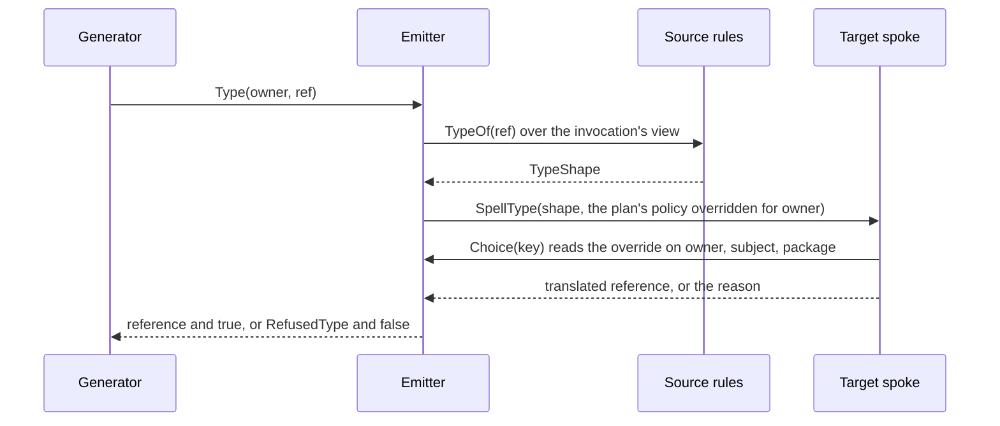

# RFC-0023: The cross-language hub and the TypeScript satellite

## Summary

A plan renders the declarations of its target's language today. This
proposal lets a plan render the declarations of another language, so a
Go workspace composes a Go plan and a TypeScript plan, and one run
writes `svc/store_stub_test.go` and `svc/store.ts`. A generator
translates a type through its Emitter: `e.Type(owner, ref)` folds the
reference into its canonical shape with the rules of the language that
declares it, and hands the shape to the spoke of the plan's backend.
The Go, TypeScript, Java and Rust backends each implement the spoke,
`plugin.TypeSpeller`. For a shape that the target cannot spell, such as
a Go channel in TypeScript or a TypeScript union in Go, the translation
reports `EID-0069 RefusedType` at the declaration with the type.

A backend declares a lowering policy for each type that its target can
spell in more than one way, where no rule picks the spelling.
TypeScript declares four: `typescript.int64`, `typescript.absent`,
`typescript.timestamp` and `typescript.bytes`. Workspace config selects
a choice for every plan or for one plan, and a target directive
overrides one declaration, as in `//+acme:typescript int64=string`.
Build resolves a total policy for each plan, so a spoke never reads a
key without a choice. Where the backend of an enabled plan respells or
declares policies, the workspace registers the target's name key, its
policy keys and the target directive. The target directive is a kernel
directive named by the target's spelling. The workspace also adds an
annotate entry, `typescript-lowering` for TypeScript. The entry stamps
`typescript.name` at plugin authority on each declaration of another
language that the sources of a TypeScript plan admit, and the target
directive's `name=` at directive authority. The settle reads an
override with one point read of the first-ranked claim, and `explain`
traces both stamps.

The TypeScript satellite gains a `rules/` package. Its frontend records
an async signature as async and lowers decorators to directives, and
its backend writes relative import specifiers and async interface
signatures. Native sugar is a kit addition, `SourceUnit.AttachSugar`,
which the TypeScript, Rust and Java frontends use for decorators,
attributes and annotations. A frontend registers its language's keys
under the language's spelling, and the key registry accepts a repeated,
equal registration from one registrant. The conformance module runs
the end-to-end fixture of two plans through the workspace suites and a
TypeScript fixture through the pipeline suite. It also generates the
support matrix, which CI uploads as an artifact.

## Motivation

### A plan writes the spellings of its sources

No code in the kernel translates a type into another language:

- A generator copies a reference into the emit model with
  `rules.EmitRef`, and `eidos.Mirror` copies a method's signature the
  same way. So a TypeScript plan over Go source writes
  `context.Context` and `int64` into a `.ts` file.
- `spellref.PackageOf` and the Go backend's package rule return no
  package for a reference whose target is a declaration of another
  language, so the backend imports nothing for it.
- `plugin.Settle` applies a `<target>.name` override that a claim at
  directive authority writes. No satellite or composition registers
  `typescript.name`, stamps it or declares a directive that writes it.
- `workspace.Config` contains plugin options and plan refinements, and
  no policy. `directive.ParamSpec` has no closed set of spellings, so no
  schema can state that `int64` takes `bigint`, `string` or `number`.

A generator that writes TypeScript output from Go source must contain
its own table of spellings today. Each such generator repeats the
table, and two of them disagree the first time someone corrects one.

### The TypeScript satellite is half a satellite

The satellite has `frontend/`, `spell/`, `backend/` and `testing/`,
and lacks the rest of its anatomy:

- It has no `rules/`. The corpus entry has the verdict `Loads` for all
  eleven inventory features, because nothing projects TypeScript. A detector
  or a translation reads every TypeScript builtin as Opaque.
- The frontend records a decorator as an annotation and lowers none to
  a directive, so `@acme.stub` attaches nothing.
- The frontend records `get(): Promise<T>` as a synchronous method
  that returns `Promise<T>`, and `put(): void` as a method with one
  return of type `void`. It marks `async get(): Promise<T>` async and
  keeps the return `Promise<T>`, so the canonical callable returns a
  promise asynchronously. The canonical callable of all three is
  wrong.
- The backend imports a declaration by the module path of its
  identity, so a generated file imports `Store` from `'svc/store'`
  where TypeScript resolves `'./store'`.
- The backend refuses an async method in an interface, because
  `SigMods` reads `Async` as a modifier. A client interface over a Go
  service cannot render.

### Keys depend on the composition remembering them

A composition registers a frontend's classification keys through
`Builder.Keys`. `ComposeShape` registers the Go keys, and
`ComposeStubs`, `ComposeWorkspace` and `ComposeAcceptance` do not. Their
trees contain no `_test.go` file. In a tree that contains one, the Go
frontend stamps `golang.testFile` under a key that nothing registered,
and the fact store refuses the stamp under `EID-0020 RefusedStamp`. The
target names and the policies of this proposal are keys of the
target's namespace too, so the gap grows with every targeted language.

### Why the kernel

A cross-language generator needs the spelling of a type in its plan's
target. The spelling is the same for every generator, and the target's
backend contains it. The kernel defines the hub, which is the canonical
shape, and the call through which a generator obtains a spelling from
a backend. A name and a policy override are facts about a
declaration that every plan of the target reads. Plans run in parallel
over a frozen graph, so these facts stamp at Annotate.

## Detailed design

### Components

| Component | Package | Change |
|---|---|---|
| Type spoke | core/plugin, core/backend, lang/spoke, each satellite's `spell` | `TypeSpeller`, `Builder.Types`, four spokes and their shared helpers |
| Translation | core, core/plugin, core/plugin/plugintest | `Emitter.Type`, three fields of `GeneratorContext` and of the test kit's `Fixture`, `RefusedType` |
| Translated references | core/layout, core/plugin, lang/spellref, the Go backend | qualification by origin, `Input.Target`, `Emit.Translates`, `UntranslatedReference` |
| Lowering policies | core/plugin, core/backend, core/workspace, eidos-cli | `PolicySpec`, `Policy`, `Builder.Policies`, a Build step, two config maps, the policies of a plan's description |
| Target facts | core/directive, core/workspace | each target's keys and directive, and one lowering entry per target |
| Override reads | core/meta, core/plugin | `meta.GetAtLeast`, and a point read in the settle |
| Closed choices | core/directive | `ParamSpec.Choices`, `ParamKey.Valid`, `Name.Valid` |
| Language keys | core/meta, core/frontend, core/workspace | one registrant per language, `Keys` on the frontend kit |
| Native sugar | core/plugin, three frontends | `Sugar`, `SourceUnit.AttachSugar`, `SourceUnit.Brand` |
| Builtin arguments | core/rules | a builtin's structural shape folds its type arguments |
| Render kit | core/backend/render, core/backend | a blank line between declarations, the builtin `memberbody` and the language's `MemberIndent`, `ImportSet.Reserved` |
| TypeScript satellite | eidos-lang-typescript | `rules/`, frontend, backend, policies and literal readers |
| Conformance | eidos-conformance, CI | fixtures, corpus levels, the support matrix |

### Invariants

1. A type that a generator translates through `Type` arrives in the
   target's spelling or as a refusal. A translated reference and a
   copied one have the same form, so a generator that copies a
   reference of another language writes that language's spelling.
2. The translation of a shape without a spelling in the target reports
   `RefusedType` at the declaration with the type, and the spoke does
   not return a substitute spelling.
3. A reference in the target's own language translates as written.
4. A spoke reads a total policy: every key that its backend declares
   has a choice.
5. A target name and a policy override are facts on the source
   declaration, stamped at Annotate. Plans write only their own emit
   stores.
6. A directive override ranks above the target's naming rule and above
   every policy selection.
7. A language's keys register under the language's spelling, whichever
   of its parts the composition contains.
8. A settle reads the overrides of the declarations that it renders,
   so its cost does not grow with the name stamps.

Each mechanism runs in one phase of a run:

```mermaid
flowchart LR
    B[Build] -->|keys per language, a directive per target, a policy per plan| L[Load]
    L -->|carriers and markers as directives| E[Annotate: lowering entries]
    E -->|target names and overrides| A[Annotate: the composition's annotators]
    A -->|frozen facts| G[Generate: Emitter.Type]
    G -->|translated references| S[Settle]
    S -->|settled names| Y[Layout]
    Y -->|packages of translated references| R[Render]
```



### The type spoke

```go
package plugin

// TypeSpeller is the role of a backend that spells the canonical shape
// of a type of another language in its target. It is the spoke of the
// cross-language hub. The workspace passes it to each generator of a
// plan that renders through the backend.
//
// # Concurrency
//
// The plans of a run call one TypeSpeller concurrently, so an
// implementation is safe for concurrent use.
type TypeSpeller interface {
    // SpellType returns the target's reference for s under the policy p.
    // For a shape without a spelling in the target, it returns an error
    // with the reason. The error has no position, because the caller
    // positions the refusal at the declaration with the type.
    SpellType(s rules.TypeShape, p Policy) (*emit.TypeRef, error)
}
```

The reference that `SpellType` returns follows the emit model's
contract for a type reference:

- `Spelling` is the target's whole spelling, such as `Session[]` or
  `Record<string, bigint>`.
- A form that the target writes with syntax returns that form, with
  one child in `Elems` for each child of the shape. Each child is the
  reference that the spoke returns for the child's shape. Go's `[]T`,
  `map[K]V` and `*T` and TypeScript's `T[]` and tuples are such forms.
- A form that the target writes with a library type returns a named
  reference, with the type arguments in `Args` and the type's import in
  `Package`. Java's `List<T>` and Rust's `HashMap<K, V>` are such types.
- A `Reference` or `Sum` shape returns a translated reference: a named
  reference whose `Spelling` is the referent's declared name and whose
  `Target` is the shape's `Ref`, with each type argument translated.
- A well-known type returns the target's type and its import, such as
  `time.Time` with the package `time`.

The backend kit declares the spoke, and each of the four satellites
with a backend implements it in its `spell` package as `spell.Type`:

```go
package backend

// Types declares the target's spoke, which the built backend serves as
// [plugin.TypeSpeller].
func (b *Builder) Types(spell func(s rules.TypeShape, p plugin.Policy) (*emit.TypeRef, error)) *Builder
```

The built backend implements `TypeSpeller` also where the kit declares
no spoke. `SpellType` then refuses every shape with the error that the
target does not spell the types of other languages. The kit then does
not need a backend type for each combination of its roles.

Each refusal of a spoke opens with the target's spelling, as in
`typescript: …`, and the refusal of a child opens with the child's
source spelling. The four spokes share the helpers of the package
`lang/spoke` for it. `Child` and `Children` spell the children of a
shape through a spoke, and `Describe` returns the noun phrase of a form
in a refusal.

### The spellings of the four spokes

Each row is one canonical form. A cell contains the spelling or the
policy that decides it. Where a cell contains refused, the spoke refuses
the form with an error that gives the reason in the target's terms.

| Form | Go | TypeScript | Java | Rust |
|---|---|---|---|---|
| Scalar int, 8 to 32 bits | `int8` to `int32` | `number` | `byte`, `short`, `int` | `i8` to `i32` |
| Scalar int, 64 bits | `int64` | `typescript.int64` | `long` | `i64` |
| Scalar int, platform width | `int` | `typescript.int64` | `long` | `isize` |
| Scalar uint, 8 to 32 bits | `uint8` to `uint32` | `number` | the signed type of the width | `u8` to `u32` |
| Scalar uint, 64 bits | `uint64` | `typescript.int64` | `long` | `u64` |
| Scalar uint, platform width | `uint` | `typescript.int64` | `long` | `usize` |
| Scalar float | `float32`, `float64` | `number` | `float`, `double` | `f32`, `f64` |
| Bool | `bool` | `boolean` | `boolean` | `bool` |
| Text | `string` | `string` | `String` | `String` |
| Bytes | `[]byte` | `typescript.bytes` | `byte[]` | `Vec<u8>` |
| Optional | `*T` | `typescript.absent` | the boxed `T` | `Option<T>` |
| List | `[]T` | `T[]` | `List<T>` | `Vec<T>` |
| Array of length n | `[n]T` | a tuple of n `T` | `T[]` | `[T; n]` |
| Array of an unstated length | refused | refused | `T[]` | refused |
| Map | `map[K]V` | a record or `Map<K, V>`, by the key | `Map<K, V>` | `HashMap<K, V>` |
| Func | `func(A) (R, S)` | `(p0: A) => R` | a functional interface | `Box<dyn Fn(A) -> R>` |
| Tuple | refused | `[A, B]` | refused | `(A, B)` |
| Union | refused | `A \| B` | refused | refused |
| Intersection | refused | `A & B` | refused | refused |
| Stream, synchronous | `chan T` | refused | refused | refused |
| Stream, asynchronous | refused | `AsyncIterable<T>` | refused | refused |
| Borrow | refused | `T` | `T` | refused |
| Wildcard, upper bound | the bound | the bound | `? extends B` | the bound |
| Wildcard, lower bound | refused | refused | `? super B` | refused |
| Wildcard, unbounded | `any` | `unknown` | `?` | refused |
| Inline | refused | refused | refused | refused |
| Reference, Sum | translated, `Name[A]` | translated, `Name<A>` | translated, `Name<A>` | translated, `Name<A>` |
| Timestamp | `time.Time` | `typescript.timestamp` | `java.time.Instant` | `std::time::SystemTime` |
| Duration | `time.Duration` | refused | `java.time.Duration` | `std::time::Duration` |
| Opaque | refused | refused | refused | refused |

These rules apply beside the table:

- Go refuses a map key whose form is List, Map, Func or Bytes, because
  Go never compares values of those forms. The Go compiler checks every
  other translated key.
- TypeScript writes `Record<K, V>` where it spells the key as `string`
  or as `number`. It writes `Partial<Record<K, V>>` for an enum key.
  `Record` over an enum requires an entry for every member. Any other
  key takes `Map<K, V>`.
- TypeScript spells ten global types without an import: `Array`,
  `AsyncIterable`, `Date`, `Map`, `Partial`, `Promise`, `ReadonlyArray`,
  `Record`, `Set` and `Uint8Array`. A module that declares the same name
  hides the global. The render kit's import set reports such a
  declaration through `ImportSet.Reserved`, and the TypeScript speller
  refuses the global's spelling in that module. It also refuses an async
  callable there when the module hides `Promise`. An author renames the
  declaration with the target directive's `name=`.
- The parameters of a TypeScript function type are `p0`, `p1` and so
  on. A function type without a result returns `void`. One with two or
  more results returns a tuple.
- Inside a list, an optional, a union or an intersection, TypeScript
  writes a union, an intersection or a function type in parentheses, as
  in `(A | B)[]`.
- A spoke returns each reference in its target's form. Go returns
  `[]byte` as a List of `byte`. TypeScript returns an optional as a
  Union with `undefined` or `null`, and an array of length n as a Tuple.
  Java returns an optional as the boxed class, and an array as an Array
  without a length.
- Java writes a function type as `Runnable` or as one of the
  interfaces `Supplier`, `Consumer`, `Function`, `BiConsumer` and
  `BiFunction`. The numbers of parameters and results pick the
  interface. A function type of more than two parameters or more than
  one result is refused.
- Java writes a primitive inside a type argument as its boxed class,
  so a `List` of a 32-bit int is `List<Integer>`.
- Java represents an unsigned integer by the signed type of its width,
  as protobuf's Java runtime does. A `uint32` is an `int`, and a
  `uint64` is a `long`.
- Rust writes two or more results of a function type as a tuple. A
  function type without a result is `Box<dyn Fn(A)>`. Rust spells a
  scalar of 128 bits as `i128` or `u128`, and a tuple of one member as
  `(A,)`.
- Go, TypeScript and Rust state an array's length in the type, and the
  spoke keeps it. Java has no array type with a length, so `T[]` is the
  spelling of every Java array.
- A spoke refuses a form whose child it refuses, and the error contains
  the child's source spelling.

Only Java produces a wildcard among the languages in scope, and the
rows still contain a spelling for every target. TypeScript and Java
spell a borrow as its child, because their objects are references. Go refuses a
borrow, because a Go `*T` aliases and a Go `T` copies. Rust refuses a
borrow from another language, because its spelling needs a lifetime
that the shape does not state.

### Translating a type in a generator

The generator context gains the plan's target, its spoke and its
policy:

```go
package plugin

type GeneratorContext struct {
    // The existing fields are unchanged.

    // Target is the target of the plan's backend. Types is the
    // backend's spoke, and nil for a backend that does not implement
    // TypeSpeller. Policy is the plan's resolved lowering policy, which
    // Build fixes.
    Target Target
    Types  TypeSpeller
    Policy Policy
}
```

The authoring kit translates through the Emitter:

```go
package eidos

// Type returns the reference of the plan's target for ref. owner is the
// declaration with ref, such as the field whose type the generator
// mirrors. Type reports false for a type without a spelling in the
// target, after it reports the refusal. A nil ref returns nil and true.
//
// A reference in the language of the plan's target translates as
// written, through [rules.EmitRef]. A reference to a type parameter
// translates to a reference that has the parameter's name and no target.
// Every other reference folds into its shape under the rules of owner's
// language, over the invocation's view, so each declaration that the
// fold reads records on the invocation. The plan's spoke spells the
// shape under the plan's policy. When the spoke reads the choice of a
// policy key, the policy first reads the key's value at directive
// authority on owner, then on the match's subject, and then on owner's
// package. The first value that it finds is the choice. Each of these
// reads records on the invocation, so the invocation records the
// overrides of the keys that the type depends on and no others.
//
// A refusal reports an Error under [RefusedType] at owner's position.
// The message contains the target, the source spelling and the spoke's
// reason. A plan whose backend does not implement a spoke refuses every
// reference of another language.
//
// # Allocation contract
//
// Type allocates what [rules.EmitRef] allocates for a reference in the
// target's language, and one reference for a type parameter. For any
// other reference it allocates what the fold allocates and the reference
// that the spoke returns. A refusal allocates its message. An override
// read allocates only where the invocation's read set grows.
func (e *Emitter) Type(owner symbol.Identity, ref *node.TypeRef) (*emit.TypeRef, bool)

// RefusedType reports a type of another language without a spelling in
// the plan's target. The finding is at the declaration with the type.
// [Emitter.Type] reports it as an Error, so the plan fails.
var RefusedType = diag.MustRegister(diag.KernelPrefix, diag.CodeSpec{
    Number: 69, Meaning: "the plan's target cannot spell a type of another language",
})
```

`Type` withholds nothing itself. The fixture generator of this proposal
withholds the declaration whose member refused, and the Error fails the
plan. A value of an override that is not one of its key's choices does
not reach a spoke, because validation at Load refuses it under
`BadSpelling`.

The plugin test kit's `Fixture` gains the same three fields, `Target`,
`Types` and `Policy`. A generator's test then translates through a
spoke, and a fixture without a spoke refuses every type of another
language.

The comparison of languages reads a target as the language of the same
spelling, so the `golang` target renders the `golang` language as
written. Targets and languages share one namespace for this reason.



### Translated references and imports

A translated reference is a reference whose target is a declaration of
another language than the plan's target. It identifies its referent by
the source identity. The settle already follows a resolved reference to
the settled name of the plan's declaration whose origin the reference
names and whose emitted name is the reference's spelling. So `Session`
follows the TypeScript interface that the plan emits from Go's
`Session` under the name `Session`. A generator that emits the referent
under another name rewrites its references to that name. The layout and
the package rules complete the reference:

- The layout qualifies a translated reference as it qualifies a bare
  one. Where the plan routes a declaration whose origin is the
  reference's target, and whose settled name is the reference's
  spelling, into a file of another package, the layout sets `Package`
  to that file's package.
- Where the plan routes no such declaration, and no file that a warm
  run keeps declares one, the layout refuses the referencing
  declaration under `UntranslatedReference`, at the source position of
  the declaration's origin.
- `spellref.PackageOf` and the Go backend's package rule return the
  package that the reference records for a target of another language.
  The layout sets that package.

The layout's input gains the plan's target, and the settle records
whether a store has a translated reference:

```go
package layout

type Input struct {
    // The existing fields are unchanged.

    // Target is the plan's target, the target of the backend that settled
    // Emit. A type reference whose target is a declaration of another
    // language is a translated reference, which takes the package of the
    // file that declares its referent. Route treats a reference as a
    // translated one only where Target is set.
    Target plugin.Target
}

// UntranslatedReference reports a reference to a declaration of another
// language that the plan does not emit. The finding is at the origin of
// the referencing declaration, and the referencing declaration is
// refused.
var UntranslatedReference = diag.MustRegister(diag.KernelPrefix, diag.CodeSpec{
    Number: 70, Meaning: "a translated reference refers to a declaration that the plan does not emit",
})
```

```go
package plugin

// Translates reports whether a declaration of the settled store has a
// translated reference: a type reference whose target is a declaration of
// another language than the target of the backend that settled the store.
// The layout qualifies such a reference by the file that declares its
// referent. An unsettled store, and a store that a settle without a
// backend settled, report false. It allocates nothing.
func (e *Emit) Translates() bool
```

The TypeScript backend writes the import specifier of a reference by
these rules. The import set's home is the module path of the file under
render, and a relative specifier opens with `./` or `../`.

- A reference to a TypeScript declaration imports the declaration's
  module path relative to the home, as `'./store'` or `'../api/user'`.
  Where its source wrote a bare specifier for it, such as `'react'` for
  an ambient module, the reference imports that specifier as written.
- A translated reference imports the module path that the layout
  recorded, relative to the home.
- A reference without a target imports the specifier that its source
  wrote, which is right for a file that the layout writes beside its
  source.

### Lowering policies

```go
package plugin

// PolicyKey is the key of one lowering policy of a target. It is the
// target's spelling, a dot and the policy's name, as in
// typescript.int64. The param of the target's directive with the
// policy's name overrides the policy for one declaration, as in
// typescript int64=string. The override is a fact under the metadata key
// with the same spelling as the PolicyKey.
type PolicyKey string

// Param returns the param of the target's directive that overrides the
// policy. The param is the policy's name, as int64 is for
// typescript.int64. A key without a dot has the empty param.
func (k PolicyKey) Param() directive.ParamKey

// Choice is one value that a policy takes, such as bigint.
type Choice string

// PolicySpec declares one lowering policy. Default is the choice that
// applies where nothing selects one.
type PolicySpec struct {
    Key     PolicyKey
    Choices []Choice
    Default Choice
    // Doc is a sentence about what the policy decides. It is the
    // documentation of the policy's metadata key and of the directive
    // param that overrides the policy.
    Doc string
}

// PolicyProvider is the role a backend implements when its spoke reads
// lowering policies.
type PolicyProvider interface {
    Policies() []PolicySpec
}

// Policy is a resolved lowering policy: one choice for every key that a
// target declares. The zero Policy has no keys.
type Policy struct {
    specs    []PolicySpec // sorted by key
    chosen   []Choice     // the choice of each spec, in the same order
    override func(PolicyKey) (Choice, bool)
}

// NewPolicy returns the resolved policy of the target t. A key takes the
// choice that chosen selects for it, and the default of its spec where
// chosen selects none. NewPolicy checks each spec as the backend kit's
// Build checks it.
//
// Error modes, one error for each fault, joined:
//   - a spec with an empty key, a key outside t's namespace, or a key
//     that another spec declares;
//   - a policy name that is not a valid param key of a directive, and the
//     policy name name, which the target's directive keeps for a
//     declaration's name;
//   - a spec without choices, a spec with an empty or a repeated choice,
//     and a spec whose default is not one of its choices;
//   - a spec without documentation;
//   - a key of chosen that no spec declares, with an error that contains
//     the declared keys where t declares any;
//   - a choice outside its key's choices, with an error that contains
//     them.
func NewPolicy(t Target, specs []PolicySpec, chosen map[PolicyKey]Choice) (Policy, error)

// Choice returns the choice of a key: the override's choice where the
// policy has an override that reports one, and the resolved choice
// otherwise. It panics for a key that the policy does not declare,
// because a spoke reads only the keys of its own backend.
func (p Policy) Choice(k PolicyKey) Choice

// Overridden returns a copy of the policy whose Choice asks override
// first. The authoring kit passes the reader of one translation, which
// reads the key's value at directive authority on the declaration. The
// copy shares the specs and the choices, so Overridden allocates
// nothing.
func (p Policy) Overridden(override func(PolicyKey) (Choice, bool)) Policy
```

The backend kit declares the specs. `Build` panics on a defective spec:

- An empty key, a repeated key, or a key outside the target's
  namespace.
- A policy name that is not a param key of the directive grammar, which
  `directive.ParamKey.Valid` decides.
- The policy name `name`, because the target directive keeps the param
  `plugin.NameParam` for the declaration's name.
- No choices, an empty or a repeated choice, or a default outside the
  choices.
- An empty doc.

The built backend serves the specs as `plugin.PolicyProvider`. It
serves an empty list where the kit does not declare a policy.

```go
package backend

// Policies declares the target's lowering policies, which the built
// backend serves as [plugin.PolicyProvider].
func (b *Builder) Policies(specs ...plugin.PolicySpec) *Builder
```

Config selects a choice for every plan or for one plan:

```go
package workspace

type Config struct {
    Options map[string]map[string]any
    Plans   map[string]PlanConfig
    // Policies selects a choice for a policy key, for every plan whose
    // backend declares the key.
    Policies map[plugin.PolicyKey]plugin.Choice
}

type PlanConfig struct {
    // The existing fields are unchanged.

    // Policies selects a choice for a policy key of the plan's backend,
    // and replaces the selection of Config.Policies for the plan.
    Policies map[plugin.PolicyKey]plugin.Choice
}
```

The command line's config document gains the same two maps:

```yaml
version: 1
policies:
  typescript.int64: string
plans:
  ts-client:
    policies:
      typescript.absent: "null"
```

YAML reads a bare `null` as no value, so a document quotes the choice
`null`. The JSON Schema's description of the key contains that rule.
The plan's description contains the resolved choices:

```go
package workspace

type PlanDescription struct {
    // The existing fields are unchanged.

    // Policies contains the choice of each lowering policy that the
    // backend declares, as the plan's resolved policy selects it. It is nil
    // for a backend that does not declare a policy.
    Policies map[plugin.PolicyKey]plugin.Choice
}
```

`eidos plan` prints the choices of each plan in a line of their own,
such as `policies: typescript.absent null, typescript.bytes Uint8Array, …`,
and in the field `policies` of the plan's JSON event. An author confirms
a selection there without a run.

A Build step resolves one policy for each plan after the plans
compile. It reports these faults:

| Fault | The error lists |
|---|---|
| A key of `Config.Policies` that no plan's backend declares | every key that the plans' backends declare |
| A key of a plan's `Policies` that its backend does not declare | the plan and its backend's keys |
| A choice outside its key's choices | the key and its choices |
| A defective spec of a backend that the kit did not build | the backend and the defect, as the kit reports it |

Build folds each plan's resolved policy into the composition's
fingerprint, so a run after a changed selection runs cold. When a spoke
reads a key for one translation, the first of these values applies:

1. A value at directive authority of the key on the declaration with
   the type.
2. The same on the match's subject, and then on the declaration's
   package.
3. The plan's selection in `PlanConfig.Policies`.
4. The selection in `Config.Policies`.
5. The spec's default.

TypeScript declares four policies:

| Key | Choices | Default | Applies to |
|---|---|---|---|
| `typescript.int64` | `bigint`, `string`, `number` | `bigint` | an integer of 64 bits or of the platform's width |
| `typescript.absent` | `undefined`, `null` | `undefined` | an optional, spelled `T \| undefined` or `T \| null` |
| `typescript.timestamp` | `Date`, `string` | `Date` | the well-known timestamp |
| `typescript.bytes` | `Uint8Array`, `string` | `Uint8Array` | bytes |

Each key chooses between TypeScript's own type and the type that a
JSON payload delivers: a decimal string for a 64-bit integer, `null`
for an absent value, an ISO 8601 string for an instant and base64 for
bytes. The policy chooses the type alone, because eidos maps interfaces
and leaves the encoding to the project. Go, Java and Rust declare no
policy, because each spells every form of the table with the one type
that the language has for it.

A policy key shares its namespace with the language's own keys. The
TypeScript frontend registers `typescript.optional` for a method
declared with `?`, so the policy of an optional is `typescript.absent`.

### The target directive and target names

A target's names and policies are facts about the target, so one
backend declares them. Build refuses two backends of one target among
the enabled plans where either of them respells or declares policies.
The error lists the target and both backends. Where an enabled plan
declares a target's backend, and the backend respells or declares
policies, the workspace registers the target's keys and the target
directive. It also adds the target's lowering entry.

The workspace derives the directive from the backend. The directive
has the param `name`, `plugin.NameParam`, where the backend respells,
and one param for each policy under the policy's name, which
`PolicyKey.Param` returns. The workspace registers the schema without a
plugin, so the canonical spelling of the directive is the target's
spelling:

```go
directive.Schema{
    Name: "typescript",
    Params: []directive.ParamSpec{
        {Key: "name", Type: directive.TypeString,
            Doc: "the declaration's name in typescript"},
        {Key: "int64", Type: directive.TypeString,
            Choices: []string{"bigint", "string", "number"},
            Doc:     "the spelling of an integer of 64 bits or of the platform's width"},
        // absent, timestamp and bytes in the same form
    },
    Doc: "overrides how the typescript target spells the declaration",
}
```

An author writes `//+acme:typescript name=fetchSession` on a Go method,
or `//+acme:typescript int64=string` on a field, a type or a package.
Validation types an instance at Load as it types any directive. The
lowering entry reads the instances and the backend reads none, so the
directive belongs to the kernel:

```go
package directive

// RegisterTarget records the directive of one rendering target. The
// schema has no plugin, and its name is the target's spelling, such as
// typescript. The kernel's lowering entry reads its instances. From the
// registration on, the registry treats the name as a kernel name, so it
// refuses a plugin's schema of the name and an ignore of it. The
// workspace registers each target's directive after the kernel's
// schemas and before any plugin's.
//
// Error modes: a registration after the seal, a schema with a plugin, a
// target registered twice, one of the kernel's six names, a name that a
// registered schema claims, and every refusal of the schema's own
// declaration that [Registry.Register] makes.
func (r *Registry) RegisterTarget(s Schema) error
```

`ParamSpec` gains a closed set of spellings:

```go
package directive

type ParamSpec struct {
    // The existing fields are unchanged.

    // Choices closes a string param to the spellings it lists.
    // Validation refuses another value under BadSpelling, and the
    // message lists the choices. Registration refuses choices on a
    // param of another type, an empty choice and a repeated choice.
    Choices []string
}

// Valid reports whether the key is one whole identifier of the grammar.
// An identifier is a letter followed by letters, digits, hyphens and
// underscores. Registration refuses a schema with a key that is not
// valid. Valid does not allocate.
func (k ParamKey) Valid() bool

// Valid reports whether the name is one identifier of the grammar, or
// the identifier of a plugin, a colon and an identifier. An identifier
// is a letter followed by letters, digits, hyphens and underscores.
// Valid does not allocate.
func (n Name) Valid() bool
```

The policy check calls `ParamKey.Valid`, and native sugar calls
`Name.Valid` for the name in a marker's path.

The lowering entry's name is the target's spelling followed by
`-lowering`, such as `typescript-lowering`. The name joins the roster's
names, so a plugin of that name fails Build as any duplicate does. The
entries run in name order before every annotator of the composition, so
each annotator's predicate reads every target name. An entry stamps two
kinds of fact:

| Fact | Subjects | Claim |
|---|---|---|
| `<target>.name`, the backend's respell of the declared name, where the backend respells | each file-level declaration, field, method, enum variant and sum variant of a workspace package that the sources of a plan of the target admit, where the package's language is not the target's | plugin authority, rule 0, the package as the subject of its order, and the declaration as its derivation |
| `<target>.name` and each policy key, from the target directive | each subject of an instance of the directive | directive authority, the instance's position, rule 1 and the instance |

The name stamp is the respell at the declaration's own kind and
visibility. A plan renders that name for a declaration of the same
kind. These declarations have no name stamp:

- A declaration of a dependency store. No plan renders it.
- A declaration whose name the respell hook refuses. The settle
  withholds it where a plan renders it.
- A declaration that `skip` excludes. A bare rule skips it too.
- A nested type. Its fields and methods have stamps.

Where two declarations of a package share an identity, the first in the
package's order sets the stamp.

The entry journals one invocation for each package that the sources of
a plan of the target admit. The invocation records a read of the whole
package. The entry also journals one invocation for each directive
instance. An edit of a declaration makes its package's read dirty, so a
warm run stamps that package's names again and no others. A warm run
lists the package match of each package whose members or files changed.
The entry honours the selection of a warm run as the authoring kit
does: it runs each listed match that its gates still admit, and every
match of each candidate. The claims of one package share one array of
reads with one element for each claim. A stamp then does not allocate a
list of its own.

The settle applies an override as it does today. A value of
`<target>.name` at directive authority on the origin of a declaration
replaces the respell of that declaration. Today the settle collects the
subjects on which the name key is present, and reads the claims of each
origin in that list. The collection assumes that only an override
writes the key. The lowering entry stamps the key on every admitted
declaration, so the settle reads each origin that it renders with one
point read in place of the collection:

```go
package meta

// GetAtLeast returns what [Get] returns where the claim that ranks first
// has authority floor or above, and false otherwise. A drop that ranks
// first reads absent, as it does for Get. A reader of an override uses
// it, because a stamp at a lower authority on the same key is not an
// override.
//
// # Allocation contract
//
// GetAtLeast allocates what Get allocates: nothing for a scalar value
// and two allocations for a list.
func GetAtLeast[T FactValue](f *Facts, id symbol.Identity, k Key[T], floor Authority) (T, bool)
```

The stamp at plugin authority makes the target's name a fact that every
plan, check and explanation reads, such as a Go generator that writes a
field's JSON tag from the field's `typescript.name`.

An explanation of `typescript.name@svc/store.go:16` lists the claims of
the fact on the declaration at that position, the first-ranked claim
first. A directive claim has its carrier's position, and the lowering
entry's claim at plugin authority derives from the declaration. The
explanation also lists the records of the invocations that read the
fact. `explain` reads the key as it reads any other key.

### One registrant per language

The keys of a language belong to the language. The frontend kit takes
the language's key registrations, and the built frontend runs them under
the language's spelling:

```go
package frontend

// Keys declares the language's key registrations, which the built
// frontend runs as [plugin.KeyProvider] under its language's spelling.
func (b *Builder) Keys(register ...func(r *meta.Registry) error) *Builder
```

The built frontend implements `plugin.KeyProvider` also where the kit
does not declare keys, as the built backend implements `TypeSpeller`
and `PolicyProvider`. A satellite's package then does not re-export its
language's keys for a composition, because the role registers them.

The workspace registers each target's keys under the target's
spelling. They are `<target>.name` where the target's backend respells,
and each policy key that the backend declares. A backend does not
declare keys. The register step runs the kernel's keys, then each
frontend's keys in load order, then each target's keys, then each
plugin's keys in roster order, and then the builder's.

The language and its target register under one spelling, so they are
one registrant. The registry accepts a repeated registration of one
registrant:

- A namespace that a registrant claims again remains its claim, and the
  claim returns nil.
- A key that a registrant registers again, under the same value type
  and an equal spec, returns the handle of the first registration.
- Every other repetition fails as it does today, and the error lists
  both registrants or both specs.

Today a second claim of a namespace fails even when its claimant
repeats it. With the change, the parts of one language register their
keys independently. The Go frontend and the Go annotator both register
the Go keys under `golang`. A composition can contain either of them or
both.

So a composition with the Go frontend and the Go backend does not need
a `Builder.Keys` call. It registers every Go key once under `golang`. A
composition that registers the keys of a composed language itself fails
Build. The error lists the composition and the language as the two
claimants. The suites `frontendtest` and `rulestest` load a frontend
outside a workspace. They register the frontend's keys through the same
role. A fixture registers only the keys that the frontend does not
register. `frontendtest.AssertClassified` applies the recorded stamps
under both, as a workspace run applies them. It fails a stamp under a
key that neither registers, and a fixture that declares keys over a
load that stamps nothing.

The Go annotator of `lang/go/annotate` registers the Go keys through
its own role, and its registration is unchanged. The annotator and the
Go backend share the name `golang`, so a composition cannot contain
both. This proposal leaves that rule as it is.

### Native sugar

```go
package plugin

// Sugar is one marker that a language writes on a declaration with its
// own syntax for metadata, as a frontend reads it: a TypeScript
// decorator, a Rust attribute or a Java annotation.
type Sugar struct {
    // Path is the marker's name, split at the language's separators.
    // The decorator @acme.stub has the path acme, stub.
    Path []string
    // Args are the marker's literal arguments in source order. An
    // argument is keyed where the language gives it a name, and
    // positional otherwise.
    Args []directive.RawArg
    // Refusal is the reason that the frontend could not lift an argument
    // of the marker, such as an argument that is not a literal. It is
    // empty when the frontend lifted every argument.
    Refusal string
    // Pos is the position of the marker.
    Pos position.Pos
}

// AttachSugar attaches the directive of a marker to subject, and reports
// whether the marker is a directive. A marker whose path does not start
// with the unit's brand is ordinary metadata, and AttachSugar reports
// false for it, whatever its arguments are.
//
// The path of a directive is the brand followed by a name, or by a
// plugin and a name. The first form gives the bare directive name, and
// the second form gives the name with the plugin's prefix. AttachSugar
// reports a marker of the brand under refused, at the marker's
// position, in these cases:
//
//   - the path has another form;
//   - the name is not a valid directive name;
//   - the frontend could not lift an argument, so the marker's Refusal
//     is set.
//
// Such a marker attaches nothing, and AttachSugar reports true for it.
// An attached directive has the marker's arguments and position. It is
// set, because a marker has no negated form. A nil subject with a marker
// of the brand is a frontend defect, and AttachSugar panics, as
// [GraphBuilder.Attach] does.
func (u *SourceUnit) AttachSugar(subject symbol.Symbol, s Sugar, refused diag.Code) bool

// Brand returns the composition's brand, which opens every carrier and
// every marker of a directive. A frontend compares the first name of a
// marker's path with it before it lifts the marker's arguments, so a
// marker outside the brand allocates nothing. Brand allocates nothing.
func (u *SourceUnit) Brand() string
```

The frontend parses the language's literals and lifts the arguments
from its syntax tree. The kit applies the brand rule for every
language. The marker also remains an annotation of the declaration,
because the author wrote it. Each frontend reports a marker that does
not lift under a code of its own, `BadMarker`:

| Language | Markers | Arguments that lift | Code |
|---|---|---|---|
| TypeScript | `@acme.stub`, `@acme.stub({ tag: "test" })`, `@acme.shape("writer")` | strings, template literals without a substitution, numbers with at most one minus sign, `true`, `false` and arrays of them as positional arguments, and one object literal of them as the last argument, whose members are keyed arguments | `TYPESCRIPT-0005` |
| Rust | `#[acme::stub(tag = "test")]`, `#[acme::shape(writer)]` | `key = value` as a keyed argument and a value as a positional one, where a value is a string literal, an integer or a float literal with at most one minus sign, `true`, `false` or a name | `RUST-0008` |
| Java | `@acme.stub(tag = "test")`, `@acme.shape("writer")` | element-value pairs as keyed arguments, and the single element as a positional one, where a value is a string literal, a number literal with at most one minus sign, `true`, `false` or an array of them | `JAVA-0007` |

A number lifts as decimal text: the shortest decimal text that parses
back to its double or float, and the exact digits of an integer. A
Java hexadecimal, octal or binary literal lifts as the bit pattern of
its type, as Java reads it, so `0xFFFFFFFF` is `-1`. A marker on a
subject that the model cannot address reports the language's
`UnaddressedCarrier`, such as a decorator on a TypeScript parameter or
an attribute on a Rust `use` declaration.

Go and protobuf have no sugar. Go's syntax for metadata is the
tool-directive comment, and `//acme:stub` is a carrier already. A
custom option of protobuf refers to an extension that the consumer
declares in a `.proto` file. The compiler resolves the option against
that declaration, so a schema of the consumer decides its spelling.

The languages set these constraints on a marker:

- A marker has no negated form. An author negates a directive through
  a comment carrier.
- No identifier of the three languages contains a hyphen, so a brand
  with a hyphen has no marker.
- The consumer provides what the language requires of a marker.
  TypeScript calls a decorator when it defines the class. rustc
  resolves an attribute path outside its five tools to an attribute
  macro. Java requires an annotation interface of the marker's name.
- TypeScript decorates classes and their methods, accessors and
  fields. A TypeScript interface takes a comment carrier.

### The render kit

The render kit separates the declarations of a file with a blank line,
and each language's formatter keeps the line or replaces it with the
language's own spacing. The client's two interfaces then render apart.

A host's template places a member's content through the builtin
`memberbody`, which writes the content that `body` writes with every
line that is not blank behind the language's member indent. The
TypeScript, Java and Rust backends declare the indent once, and their
templates call `{{memberbody .}}`, so the statements of a method are one
level deeper than the method. The builtin takes a method, so
text/template passes its argument without an interface conversion, and
the body writes the indent as it writes each line. A member's body then
costs the allocations of a body without the indent.

```go
package render

const (
    // BuiltinMemberBody places a member's content as [BuiltinBody]
    // does, with every line that is not blank behind the language's
    // [Language.MemberIndent]. A host's template calls it with the
    // member under render, so the member's statements are one level
    // deeper than the member.
    BuiltinMemberBody = "memberbody"
)

type Language struct {
    // The existing fields are unchanged.

    // MemberIndent is the indentation of a member's statements in the
    // body of its type, relative to the statements that Scaffold
    // writes. The memberbody builtin writes it before every line of a
    // member's content that is not blank. A language whose templates
    // call only the body builtin, such as Go, leaves it empty.
    MemberIndent string
}

// Reserved reports whether a declaration of the file took name through
// [ImportSet.Reserve]. A language with global names checks it before it
// writes a global name without an import, because a declaration of the
// file with that name hides the global. Reserved allocates nothing.
func (s *ImportSet) Reserved(name string) bool
```

```go
package backend

// MemberIndent sets the indentation of a member's statements in the
// body of its type, which the memberbody builtin writes before each
// line of a member's content. A language that leaves it unset places
// members through the body builtin alone.
func (b *Builder) MemberIndent(indent string) *Builder
```

The body builtin takes the declaration alone. A string argument of a
template call costs text/template a reflective conversion on every call,
and a member indent in the language does not.

### The TypeScript satellite

| Path | Contents today | Change |
|---|---|---|
| `lang.go`, `keys.go`, `literal.go` | identity, comment forms, classification keys | the policy specs, their keys and choices as declared constants, and the literal readers `Unquote`, `ParseNumber` and `ParseBigInt` that the rules read |
| `frontend/` | load | signature normalization, decorators through `AttachSugar`, `Keys` through the kit |
| `rules/` | absent | `SourceRules` and five optional capabilities |
| `spell/` | filenames, names, packages | `Type`, the spoke |
| `backend/` | render | `Types`, `Policies` and `MemberIndent` through the kit, relative specifiers, async interface signatures |
| `testing/` | the tsc and node adapter | none |
| `sdk/` | absent | none: no satellite has a Tier-3 package, and no plugin needs a projection of TypeScript alone. A plugin reads the `typescript.*` facts through their keys |
| `testdata/features/` | absent | none: no satellite has a feature tree, because the conformance corpus is the completeness check of every language. The TypeScript tree is `eidos-conformance/lang/typescript/testdata/corpus` |

The frontend records an asynchronous signature in the form of the
canonical callable:

| Source | Recorded today | Recorded |
|---|---|---|
| `get(): Promise<T>` | synchronous, one return `Promise<T>` | async, one return `T` |
| `async get(): Promise<T>` | async, one return `Promise<T>` | async, one return `T` |
| `put(): Promise<void>` | synchronous, one return `Promise<void>` | async, no return |
| `put(): void` | one return `void` | no return |
| a callable without a return type, other than a constructor or a setter | no return | one return without a type, at the callable's name |

The model's `Async` marks a result that arrives asynchronously in the
language's own form, and a promise is TypeScript's form. The backend
writes each form back as the source spelled it. An async callable
returns `Promise<T>`, and a callable without a return returns `void`.
The backend writes a return without a type as `unknown`, its spelling
of a missing type, because the source left the type open. The backend writes
the keywords of an async member by these rules:

- The interface template writes an async signature through the
  `returns` helper, so `get(key: string): Promise<Session>;` renders.
- `SigMods` accepts `Async` on a method signature. It refuses `Async` on
  an index or a construct signature, because neither returns a promise.
- `MemberMods` writes `async` only on a method with a body that is not
  an accessor. An async abstract method and an async accessor keep their
  asynchrony in the promise of their annotation.

The backend writes a composite value of a tuple, an `Array` or a
`ReadonlyArray` as an array literal.

The rules package implements the language's decisions:

| Method | TypeScript's decision |
|---|---|
| `Lang` | `typescript` |
| `Members` | Extends, then Implements, merged as overloads, at the default depth |
| `ParamRole` | `AbortSignal` is a context, and every other parameter an input |
| `ReturnRoles` | an asynchronous stream is a stream and every other return a value, under the raised error model |
| `Builtin` | the table that follows |
| `Resolve` | each resolution kind of a language, through the namespaces, the module, its imports and then the global package. The graph does not record a tsconfig, so resolution does not read a paths pattern or a baseUrl |
| `SamplesOf` | a fixed pair for each builtin, an array of one element for a list, one value per member for a tuple, an object of one entry for a record and an index signature, the first two distinct values of a union, a literal type's one value, the first two members of an enum with distinct values, and an object literal that sets the first required property of a class or an interface. The rules assert an object literal and an enum member to the type with `as`. A `Map` does not take a sample, because the value model has no constructor call |
| `ZeroValue` | `0`, `""`, `false`, `0n`, `[]`, and for an optional `null` where its union lists `null` and not `undefined`, and `undefined` otherwise; none for another type |
| `LiteralFor` | TypeScript's number, string, boolean and bigint literals, and an enum member |
| `TypeName` | the base, then the word in Pascal case |
| `EnumOf` | the values of a numeric enum, computed from its constant enum expressions, and the texts of a string enum |
| `Derive`, `Substitute`, `Reified` | a parameter's one bound or `unknown`, substitution, and erasure |
| `Properties` | each getter, paired with the setter of its name |
| `Constructors` | the constructor signatures of a class. A class without one has the constructors of the class that it extends, with the type arguments substituted, and a class that does not extend a class has the implicit constructor without parameters |
| `Comparable` | every type, without a problem, because `===` and `Map` compare any two values |

TypeScript does not satisfy the error-value, tag, throws, ownership or
promotion rules, because the language has none of the five.

| Spelling without a target | Shape |
|---|---|
| `string` | Text |
| `number` | Scalar, float, 64 bits |
| `boolean` | Bool |
| `Date` | the well-known timestamp |
| `Uint8Array` | Bytes |
| `Array<T>`, `ReadonlyArray<T>` | List of `T` |
| `Record<K, V>`, `Map<K, V>`, `ReadonlyMap<K, V>` | Map of `K` and `V` |
| `AsyncIterable<T>`, `AsyncIterableIterator<T>`, `AsyncGenerator<T>` | asynchronous Stream of `T` |
| `bigint`, `any`, `unknown`, `never`, `object`, `symbol`, `null`, `undefined`, `void`, `Promise<T>`, `Set<T>`, `Iterable<T>` and every other spelling | Opaque |

`bigint` is Opaque, because a canonical scalar has a width and `bigint`
has none. Where `Builtin` returns a structural shape without children
for a reference with type arguments, the kernel's fold makes the folded
type arguments the shape's children. `Array<Session>` then folds to a
List of a Reference. A tuple, a union and an intersection take every
type argument as a member. An optional, a list, an array, a stream and
a borrow take one type argument, and a map takes two. A reference with
another number of type arguments, such as `Record<K>`, folds to Opaque,
and so does a function, a wildcard or an inline form with type
arguments.

The satellite declares the policy keys and their choices as constants
by hand, such as `typescript.Int64` and `typescript.BigInt`, because a
generator over four rows of static data would only restate them.

### Conformance

**The end-to-end fixture** composes the Go frontend and rules and two
plans over a tree of its own. Its `svc/store.go` declares the
walkthrough's `Store`, whose methods take a `context.Context`, and a
`Session` with the fields `ID string` and `Expires int64`:

| Plan | Generators | Backend | Writes |
|---|---|---|---|
| `go-stubs` | `stubgen`, `acme-audit` | Go | `svc/store_stub_test.go` |
| `ts-client` | `tsclient` | TypeScript | `svc/store.ts` |

The sources of `ts-client` admit the package `svc` alone, so the plan
does not translate the declarations of `context`. A layout refinement
of the family of `tsclient` writes its output into `store.ts` beside
the source.

`tsclient` writes a TypeScript interface for each struct and interface
of its scope, with the exported members alone, and it translates every
type through `e.Type`. It drops each parameter whose role is a context
and each return whose role is an error. It marks each method async,
because a client calls the store across the network. Each interface,
field and method that it emits records its Go declaration as its
origin, so a name override on the Go declaration applies. The settle
respells the names, and `svc/store.ts` declares:

```ts
/**
 * Session is one signed-in user's state.
 */
export interface Session {
  id: string;
  expires: bigint;
}

/**
 * Store is the persistence seam for sessions.
 */
export interface Store {
  get(key: string): Promise<Session>;
  put(s: Session): Promise<void>;
}
```

The fixture runs through `workspacetest.RunWorkspaceSuite` and
`workspacetest.RunWarmColdSuite`. Its edit renames the parameter of
`Get`, which changes both files and leaves the export of `go-stubs`
unchanged. The TypeScript adapter type-checks `svc/store.ts` with tsc.

**The TypeScript pipeline fixture** composes the TypeScript frontend,
rules and backend with a stub generator over a TypeScript tree, and
runs through `pipelinetest.RunPipelineSuite`. The stub of the interface
in `svc/store.ts` is `svc/store.stub.test.ts`, which imports `Store`
from `'./store'`. The adapter type-checks the output with tsc.

**The refusal fixtures** each run one plan and check one finding with
its code and its position:

- A Go struct with the field `Events chan int` in the scope of
  `ts-client` reports `RefusedType` at the field.
- A TypeScript interface with the field `id: string | number`, in the
  scope of a Go plan whose fixture generator mirrors TypeScript
  interfaces as Go structs, reports `RefusedType` at the field. The
  same plan mirrors an interface of a `string` and a `number` field as
  a Go struct of a `string` and a `float64`.
- `StoreClient`, a variant of `tsclient` that emits `Store` alone,
  keeps its reference to `Session`, which the plan does not emit. The
  layout refuses `Store`, the referencing declaration, and reports
  `UntranslatedReference` at the position of its origin.

**The policy fixtures** run the end-to-end composition three ways.
Without a selection, `Session` declares `expires: bigint`. With
`typescript.int64: string` in config, it declares `expires: string`.
With `//+acme:typescript int64=number` on the field, it declares
`expires: number`, and every other declaration keeps its spelling. A
warm run after an edit of that override writes the bytes that a cold
run over the edited tree writes. A choice outside the key's choices
fails Build where config selects it. In a directive, the same choice
reports `BadSpelling` at the carrier.

**The explain fixture** writes `//+acme:typescript name=save` on `Put`
and runs the composition. `svc/store.ts` then declares
`save(s: Session): Promise<void>;`. The fixture explains
`typescript.name` at the position of `Put`. The directive claim ranks
first and has the carrier's position. The claim of
`typescript-lowering` at plugin authority follows it, with the value
`put`.

**The corpus** entry of TypeScript has projection levels as its
verdicts, because the entry gains the TypeScript rules, and the rules suite runs
over its tree. The inventory gains the feature `directive_sugar`: a
declaration that a marker under the brand marks has the directive of
the marker. TypeScript, Rust and Java spell the feature, and Go
and protobuf refuse it.

**The support matrix** is a Markdown document of four tables:

| Table | Rows | Columns | Source |
|---|---|---|---|
| Read side | inventory features | languages | each corpus entry's verdicts |
| Render side | facts and kinds | targets | each backend's coverage and refused kinds |
| Hub | canonical forms and policy choices | targets | each spoke's `SpellType` over one probe shape per row |
| Sugar | languages | the verdict and the marker | each corpus entry's verdict on `directive_sugar` |

A cell of the render side contains the backend's base verdict on a fact.
Where the verdict differs for some kinds, the cell lists those kinds
after it, as in `renders; refuses on Param, Field`. A kind's cell is
`refuses` for a kind that the backend refuses, and `renders` otherwise.
The hub has one probe shape for each form, and one for each variant of
a form, such as each width of a scalar, each bound of a wildcard and a
reference with a type argument. A row of a policy's choice contains the
spelling of the policy's probe under that choice in the column of its
target. A cell that a target does not have contains `none`, and a pipe
inside a cell is escaped, as GitHub Flavored Markdown requires.

The package `eidos-conformance/matrix` assembles the entry of each
satellite and renders the document:

```go
package matrix

// Entry is one language of the support matrix.
type Entry struct {
    // Corpus is the language's conformance entry. Its coverage contains
    // the verdicts of the read side and of the sugar.
    Corpus conformance.Corpus
    // Backend is the language's rendering backend, and nil for a
    // language without one.
    Backend plugin.Backend
    // ArgsOpen and ArgsClose are the brackets in which the target writes
    // the type arguments of a reference, such as < and >.
    ArgsOpen, ArgsClose string
    // Marker is the spelling of a marker of the brand acme, such as
    // @acme.stub, and empty for a language without markers.
    Marker string
}

// Entries returns the entry of each satellite, in the order Go,
// TypeScript, Java, Rust and protobuf.
func Entries() []Entry

// Markdown renders the support matrix of entries as a Markdown document
// of four tables.
//
// Error modes: the error of a backend whose policies do not resolve, and
// an error for a policy without a probe of its shape.
func Markdown(entries []Entry) ([]byte, error)
```

A policy without a probe fails the matrix, so a backend that declares a
new policy also adds its probe. The test `TestMarkdown` writes the
document of the satellites into `t.ArtifactDir()`. The gate runs the
test, and Go removes the directory afterwards. CI runs the test again
with `-artifacts` and uploads the directory:

```yaml
      - name: Generate the support matrix
        run: >-
          go test -C eidos-conformance -count=1 -run '^TestMarkdown$'
          -artifacts -outputdir="$RUNNER_TEMP" ./matrix
      - uses: actions/upload-artifact@v7
        with:
          name: support-matrix
          path: ${{ runner.temp }}/_artifacts
```

With `-artifacts`, Go 1.27 writes the artifacts of a test into a new
directory under `<outputdir>/_artifacts/<package>/<test>/`. The output
directory must exist, and the runner's temporary directory does.

### Cost

| Work | Cost |
|---|---|
| A translation | one fold per reference and invocation, which the binding memoises, and at most three point reads per policy key |
| A reference in the target's language | what `rules.EmitRef` costs today |
| A name stamp on a subject without another fact | 4.4 allocations and about 1,020 bytes of the fact store |
| A name stamp on a subject with one fact | 4.0 allocations and about 940 bytes |
| A respelled name that differs from the declared name | one allocation |
| The settle's read of an override | one point read of each origin that the plan renders, without an allocation |
| A plan whose sources admit no package of another language | one pass over the packages per lowering entry, without a stamp |
| The journal of a lowering entry | one record per admitted package and per directive instance |
| A warm run | the names of each edited package, and each changed directive instance |
| A changed policy selection | one cold run, through the fingerprint |

A probe ran the fact store and the TypeScript respell on one goroutine
with Go 1.27.2. The canonical workspace has 1,000 packages of 10 files
of 20 structs. The probe stamped `typescript.name` at plugin authority
on its 200,000 structs. The stamps took 877,400 allocations, 204 MB and
110 to 190 ms in six runs. The respell added 200,000 allocations,
because it changes every struct name of that workspace. It writes
`Decl0_1` as `Decl01`. A TypeScript plan whose sources admit the whole
workspace adds about 1,080,000 allocations and 205 MB to a run. A field
or a method costs what a struct costs, so the cost grows with the
members of the admitted declarations. A list of reads for each claim
would add one allocation to each stamp, and the shared array of each
package removes it.

A point read through `meta.Get`, which `GetAtLeast` extends, did not
allocate over the same 200,000 stamped declarations, and it took 29 to
45 ms. Each stamp is a claim that a run records into its state, and a
warm run restores the bag of a stamped subject on its first read.

### Migration

| Code | Change |
|---|---|
| The Go, TypeScript, Java, Rust and protobuf frontends, and `specfront` | declare `Keys` through the frontend kit, and their packages drop the re-export of the language's keys |
| The Go, TypeScript, Java and Rust backends | declare `Types`, and TypeScript declares `Policies` |
| `plugin.Settle` | reads an override with `meta.GetAtLeast`, in place of the list of the name key's subjects |
| `Workspace.Describe` | lists each lowering entry among the annotators, so the description of a composition with a backend that respells changes. Each plan's description contains its policies |
| `ComposeShape` and the composition of the shape tools | drop `Builder.Keys` for their frontend's keys. The Go plan of the shape tools renders declarations of the spec language, so its run stamps `golang.name` on them |
| `frontendtest`, `rulestest` and the corpus entries | register a frontend's keys through its role, and the entries drop the language's `Keys`. `AssertClassified` applies the stamps under the keys of the role and of the fixture |
| The SDK facade | regenerates, so a plugin imports the new kernel declarations through `eidos-sdk` |
| The TypeScript, Rust and Java frontends' versions | increase, because the normalization and the markers change the graph of existing source |
| The TypeScript frontend's tests | three tests that pin the recording of today change: a promise return as one result, a promise return as no async mark, and no return type as no result |
| The four backends' versions | increase, because a translated reference imports and a blank line separates the declarations of a file |
| The TypeScript, Java and Rust backends | declare their member indent, and their templates write a member's body through `memberbody` |
| The TypeScript corpus entry | has projection levels as its verdicts, with the TypeScript rules |
| The command line's config document | gains `policies` at the top level and in each plan, and `eidos plan` prints them |
| The CI workflow | runs the matrix test with `-artifacts` and uploads the support matrix |

A generator that copies references with `rules.EmitRef` or
`eidos.Mirror` keeps its output in a plan of its source's language. In
a plan of another language its output was never correct.

## Alternatives considered

### A converter per pair of languages

A Go-to-TypeScript converter walks the Go declarations and writes
TypeScript directly. It is the shortest path to the end-to-end fixture.

**Why not:** every converter implements the projection of one language
and the spelling of another again. With n source languages and m
targets, the design needs n times m converters, and two converters
that share a target diverge the first time someone corrects one. The
hub needs one fold per source language and one spoke per target, and a
new pair of languages reuses both.

### Translating in the target's settle

The generator copies references as written, and the target's settle
translates each reference of another language in the plan's store. A
generator does not refer to a target.

**Why not:** the settle reads the emit store and the backend's hooks.
It has no rules of the source language and no tracked view, so it
cannot classify a reference as a Reference or a Sum, and its reads
would not record on the invocation whose output depends on them. Its
findings are positioned at a unit's routing key, while a refusal
belongs at the declaration with the type.

### A spelling table in each generator

A generator that writes TypeScript contains its own table from Go types
to TypeScript types.

**Why not:** each such generator repeats the table. The policies become
options of each generator, and two generators then write one Go type
two ways in one workspace.

### A spoke of six methods

Each target implements six methods: `SpellType`, `SpellOptional`,
`SpellZero`, `ErrorModel`, `JoinName` and `SpellInstantiation`.

**Why not:** `SpellOptional` and `SpellInstantiation` are `SpellType`
of an Optional shape and of a Reference with arguments. `JoinName` is
the Emitter's `JoinName` followed by the backend's respell. No caller of
this proposal reads a target's zero value or its error model. A kernel
helper that mirrors a callable would read the error model, and this
proposal lists that helper as unresolved.

### Spokes and sugar for TypeScript and Go alone

The proposal builds the spoke in the Go and TypeScript backends and
native sugar in the TypeScript frontend. The Java and Rust satellites
keep their behaviour.

**Why not:** the spoke's contract and the shape vocabulary are then
checked against two targets that agree on most forms. Java's boxing and
wildcards and Rust's refusal of a borrow are the rows where the
contract can be wrong. The `Sugar` type and the brand rule would be
checked against one syntax. In a Rust attribute and a Java annotation,
an argument's name precedes its value with `=`, and a decorator takes
an object literal. The Java and Rust spokes cost 60 rows and their
tests, and the Java and Rust frontends cost one marker reader each.

### A process-wide policy registry

`RegisterPolicy(target, key, choices, default)` records each policy in
a registry of the process, and the workspace reads it.

**Why not:** every other registry of the kernel belongs to one
composition and seals at Build. A registry of the process needs a lock,
and two compositions in one test binary would see each other's keys.
The backend declares its specs as data, as it declares its kinds.

### Policy as an interface

`Policy` is an interface with one method, `Choice(k PolicyKey) Choice`.

**Why not:** a caller could then pass a policy that lacks a key, and
the spoke would need a fallback for it. Only the kernel builds a
`Policy` struct, so every policy is total by construction.

### Overrides read for every key

`Emitter.Type` reads the override of every policy key before it calls
the spoke.

**Why not:** TypeScript declares four keys, and an override can be on
three declarations, so each translation would record twelve reads. A
changed override of any key would then run every translation again.
The policy reads an override when the spoke reads its key.

### A naming plugin per target

Each satellite builds a naming annotator with the authoring kit, such
as `typescript-names`. The workspace composes it beside the backend.

**Why not:** a plugin of the kit registers and writes keys under its
own name. The backend has the language's name, so a naming plugin needs
another name, and it could not register the target's keys. Every
satellite would also repeat the same stamping code. The kernel derives
the lowering entry and the target's keys from the backend's respell
hook and policies instead.

### A target directive under the backend's name

The backend serves the target directive as its own schema through
`plugin.DirectiveProvider`.

**Why not:** the backend never reads an instance of the directive. The
lowering entry reads the instances, so the directive belongs to the
kernel. A schema of the backend has the canonical spelling
`typescript:typescript`. Every finding and every explanation would show
that spelling.

### Name stamps on every declaration

The lowering entry stamps a name on every declaration of another
language in the workspace, whatever the plans' sources admit.

**Why not:** in a workspace of Go and TypeScript in which each plan
renders its own language, every declaration would receive the other
language's name, and no plan would render it. The sources of a plan
decide what the plan can render.

### Names derived on read

The fact store computes a target name from the declaration and the
backend's respell when a reader asks for it. It stores the overrides
alone.

**Why not:** a name is then a fact without a claim, and the kernel
would treat it apart from every other fact:

- `ByKey` would enumerate the graph for the key.
- A read would record the declaration besides the fact.
- A warm run would have no transition that marks a reader of a changed
  name.

A stamped name is a fact like any other. `explain` lists its claims,
`meta drop` removes it, and the journal marks its readers. The stamps
cost about 1,080,000 allocations and 205 MB where a plan admits the
whole canonical workspace, and the sources of the plan bound them.

### Stamps for changed names only

The annotate entry stamps a target name only where the respell differs
from the declared name. TypeScript spells a Go type name without an
underscore as Go does, so the stamp of such a name repeats the
declared name.

**Why not:** a missing stamp would then mean either that the target
keeps the declared name or that no annotate entry stamped the
declaration. Every reader would need a fallback for the first meaning,
and the fallback would become the actual rule.

### The settle keeps its list of the key's subjects

Each settle collects the subjects on which the name key is present, and
reads the claims of each origin in the list.

**Why not:** the list then contains every admitted declaration. The
probe measured it over 200,000 stamped declarations. The collection
allocated 86.5 MB in each settle, and the index's first enumeration
after the stamps sorted another 86.5 MB. The claim reads took 400,000
allocations and 86.4 MB, because a claim read copies its list of reads.
The point read does not allocate.

### Compositions register language keys

A composition keeps a `Builder.Keys` call for each language. Build
refuses a plan whose target's name key is missing.

**Why not:** the rule for a composition then depends on its parts. It
registers a language's keys where it composes the frontend alone, and
it must not where the backend registers them. A composition that
forgets the call reports `RefusedStamp` on the first test file at run
time.

### One part registers a language's keys

In each composition, one part of a language claims the language's
namespace. Where the composition loads the language's frontend, the
frontend claims it. Every other part looks its handles up, and the
registry keeps the rule that a namespace is claimed once.

**Why not:** the registration of a part then depends on the other parts
of the composition. The Go annotator would register the Go keys where it
runs alone and look them up beside the Go frontend. This proposal
removes the same dependence from compositions.

### Policies as backend options

The backend's options struct gains a field `int64`. Config sets it
under `options: typescript:`.

**Why not:** an option belongs to one plugin instance, which renders
every plan of its target, so the plans of one target could not choose
differently. An option also has no override for one declaration, and
`explain` traces no claim of it.

### The rules project a promise as async

The frontend records `Promise<T>` as written. The TypeScript rules give
a promise return a role of its own, and the kernel's callable view reads
that role as async with the result `T`.

**Why not:** the model's `Async` already marks the language's own form
of an asynchronous result, and the frontend sets it for the keyword
`async`. `async get(): Promise<T>` would remain async with a promise
for its result. The callable view would need a new return role and a
rule for `Promise<void>`, and every reader of the graph that does not
ask the rules would still read a promise.

### Sugar as a hook after the parse

The frontend kit gains a hook beside `Classify` that lowers the
recorded annotations of a parsed unit.

**Why not:** an annotation does not record a position, and it keeps its
arguments as source text. The hook would parse each language's literals
a second time and position every finding at the declaration. The
frontend has the syntax node and its position when it lowers the
marker.

### A prefix argument of the body builtin

A host's template passes the indentation of a member's statements to
the body builtin, as in `{{body . "  "}}`.

**Why not:** text/template calls a builtin through reflection, so a
string argument to a variadic parameter costs about thirteen
allocations on every call. The render of the scaled corpus through the
TypeScript backend took 10,976,330 allocations with the argument and
takes 10,651,259 with `memberbody`. Each template would also repeat an
indentation that the language has once.

### A committed support matrix

The matrix is a document under `docs/reference/`, and a mirror guard
regenerates it.

**Why not:** every change to a corpus entry, a coverage table or a
spoke would also change the document in the same commit. The
architecture defines the matrix as a CI artifact.

## Drawbacks

- The kernel gains seven exported types: `TypeSpeller`, `PolicyKey`,
  `Choice`, `PolicySpec`, `PolicyProvider`, `Policy` and `Sugar`. It
  gains seventeen exported functions and methods: `NewPolicy`,
  `Policy.Choice`, `Policy.Overridden`, `PolicyKey.Param`,
  `SourceUnit.AttachSugar`, `SourceUnit.Brand`, `Emitter.Type`,
  `Emit.Translates`, `meta.GetAtLeast`,
  `directive.Registry.RegisterTarget`, `directive.ParamKey.Valid`,
  `directive.Name.Valid`, `render.ImportSet.Reserved`, the backend
  kit's `Types`, `Policies` and `MemberIndent`, and the frontend kit's
  `Keys`. It gains twelve fields: three of `GeneratorContext`, three of
  the test kit's `Fixture`, two of the workspace's config,
  `PlanDescription.Policies`, `layout.Input.Target`,
  `render.Language.MemberIndent` and `ParamSpec.Choices`. It gains the
  constants `plugin.NameParam` and `render.BuiltinMemberBody`, and two
  codes, `EID-0069` and `EID-0070`.
- The registry accepts a repeated claim and an equal repeated
  registration from one registrant. A namespace is no longer claimed
  exactly once. The change replaces an accepted rule of the metadata
  registry.
- A name stamp costs 4.0 to 4.4 allocations and 940 to 1,020 bytes of
  the fact store. A plan of another language whose sources admit the
  canonical workspace adds about 1,080,000 allocations and 205 MB to a
  run.
- Each of the four spokes has 30 rows, and each row needs a test.
  The TypeScript rules package implements 17 methods of six interfaces.
- A composition that targets a language reserves the language's
  spelling as a kernel directive name. No plugin can declare a
  directive of that name, and no workspace can ignore it.
- A composition cannot render one target through two backends where
  either of them respells or declares policies.
- The TypeScript frontend's normalization changes the graph of existing
  TypeScript source, so its version increases and every TypeScript
  unit parses again once. Three of its tests change.
- A translated reference follows the declaration that the plan emits
  under the referent's declared name. A generator that renames the
  referent rewrites its references to the new name.
- A TypeScript module that declares a type named after a global, such
  as `Map` or `Record`, cannot use the global's spelling. So a Go type
  named `Record` needs a name override in a TypeScript plan that writes
  a record type in the same module.
- The consumer of a marker provides a decorator, an attribute macro or
  an annotation interface.
- Each composition that registers the keys of a language whose frontend
  it composes drops the call.
- Three codes, `TYPESCRIPT-0005`, `RUST-0008` and `JAVA-0007`, report
  one fault in three languages.
- The blank line between declarations changes the output of every
  backend, so every generated file of an existing workspace changes
  once.
- A backend that declares a new lowering policy fails the support
  matrix until the matrix has a probe of the policy's shape.

## Open questions

None.

## Unresolved and future work

- A form for the top type. Go's `any`, TypeScript's `unknown` and
  Java's `Object` fold to Opaque, and every other target refuses them.
- A form for an integer without a width, such as TypeScript's `bigint`.
- A TypeScript spelling of a duration. The canonical shape of a
  duration does not have a unit.
- A form for a synchronous iterator, such as TypeScript's `Iterable<T>`
  and Go's `iter.Seq`.
- An override table for one pair of languages, such as protobuf's
  scalars in TypeScript. This proposal has none, because the canonical
  path has a spelling for every pair it covers.
- A translated reference into a declaration of another plan, through
  that plan's export.
- A kernel helper that mirrors a callable into another language. One
  generator mirrors callables here.
- A smaller representation of a claim in the fact store.
- Native sugar for protobuf's custom options.
- A Tier-3 `sdk/` package for TypeScript.
- A rule that lets a language's annotator and its backend share one
  name in one composition, such as the Go annotator beside the Go
  backend.
- A translation of a structural form whose child is a type parameter,
  such as `[]T`. The fold turns the child into Opaque, so the spoke
  refuses the form, while a reference to the parameter itself
  translates.
- Resolution through the paths patterns and the baseUrl of a tsconfig
  in the TypeScript rules.
- The relative import specifier of a member of a TypeScript namespace.
- A marker argument that is a Java text block or a Rust character
  literal.

## References

| What | Where |
|---|---|
| Cross-language conversion: the hub, the policy layer, refusal and target names | [10-cross-language.md](../architecture/10-cross-language.md) |
| The satellite anatomy, the kits and completeness | [11-languages.md](../architecture/11-languages.md) |
| The projection vocabulary: TypeShape, the tiers and the degradation scale | [03-projection.md](../architecture/03-projection.md) |
| Metadata: namespaces, claims and authority | [04-metadata.md](../architecture/04-metadata.md) |
| Directives: carriers, native sugar and schemas | [05-directives.md](../architecture/05-directives.md) |
| The eight checks, pipelinetest and workspacetest | [13-testing-and-conformance.md](../architecture/13-testing-and-conformance.md) |
| One declaration end to end | [00-one-declaration-end-to-end.md](../architecture/00-one-declaration-end-to-end.md) |
| D11, D14 and D41: hub and spoke, native sugar, and target annotators | [21-decisions.md](../architecture/21-decisions.md) |
| The metadata registry and its rule for namespace claims | [RFC-0004](0004-metadata-facts.md) |
| Protocol Buffers, scalar value types and Java's unsigned integers | https://protobuf.dev/programming-guides/proto3/#scalar |
| The Rust Reference, tool attributes | https://doc.rust-lang.org/reference/attributes.html#tool-attributes |
| The Java Language Specification, annotations | https://docs.oracle.com/javase/specs/jls/se25/html/jls-9.html#jls-9.7 |
| TypeScript 5.0, decorators | https://www.typescriptlang.org/docs/handbook/release-notes/typescript-5-0.html#decorators |
| Go's `testing.T.ArtifactDir` | https://pkg.go.dev/testing#T.ArtifactDir |
| GitHub Flavored Markdown, tables | https://github.github.com/gfm/#tables-extension- |
| `actions/upload-artifact` | https://github.com/actions/upload-artifact |
