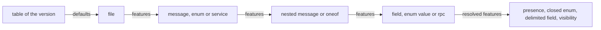

<!--
  ~ Copyright Dokimasia B.V. 2026
  ~ SPDX-License-Identifier: Apache-2.0
-->

# RFC-0024: Protobuf editions and a service in Go and TypeScript

## Summary

The protobuf frontend reads every released protobuf language version into
one model: proto2, proto3 and the editions 2023, 2024 and 2026. It parses
through protocompile's experimental parser, because the latest release of
protocompile does not parse an edition after 2023. That parser does not
know Edition 2026, which has the grammar of Edition 2024, so the frontend
parses a 2026 file as Edition 2024. The frontend resolves protobuf's nine
global features through one table of edition defaults, so a field, an
enum and a message load the same way in every version. For an edition
outside the table, such as `2025`, the frontend reports
`PROTO-0006 UnknownEdition` and does not load any declaration of the file.
A proto2 group loads as a nested message and a field.

One workspace turns a proto service into Go server scaffolding and
TypeScript client types. These changes complete that run:

- The Go backend lowers a sum to an interface with an unexported marker
  method and one struct for each variant. protobuf-go generates the same
  shape for a oneof.
- TypeScript declares the policy `typescript.duration`, with the choices
  `string` and `number`.
- A proto stream is asynchronous. The Go spoke spells an asynchronous
  stream as `iter.Seq2[T, error]`, and TypeScript spells it as
  `AsyncIterable<T>`.
- The canonical vocabulary gains a form for the top type, `Dynamic`, and
  the well-known type `empty`. protobuf's `Value`, `Struct`, `ListValue`,
  `Any` and `Empty` project onto them.
- A field translates with its presence. A translated reference to a
  nested declaration uses the declaration's flat name, such as
  `SessionState`.

The conformance module runs a service fixture over one schema in each of
the five versions, and every version writes the same Go file and the same
TypeScript file.

## Motivation

### One schema loads differently in each version

The frontend resolves one of protobuf's nine global features,
`field_presence`, and keeps the other eight as written text:

- A singular field of a message type loads without presence in proto3,
  and loads as an optional in an edition file. protobuf gives every
  singular message field presence in every version.
- `EnumOf` derives a number outside the declared values for every enum.
  A field of a closed enum, which every proto2 enum is, keeps such a
  number as an unknown field and not as a value.
- The frontend refuses a proto2 group under `PROTO-0005 RefusedGroup`. In
  an edition file, the same field is a message field with delimited
  encoding, and that field loads.
- The parser accepts any edition string, and the frontend resolves the
  presence of every edition with the default of Edition 2023. A file with
  `edition = "2025"`, an edition that protobuf never released, loads
  without a finding.

### The parser stops at Edition 2023

protoc supports Edition 2024 since release 32.0 of 2025-08-14, and
Edition 2026 since release 36.0 of 2026-08-20. protobuf-go supports
Edition 2024 since v1.36.9. The protobuf frontend pins protocompile
v0.14.1 of 2024-08-21, which is protocompile's latest release:

- Its grammar does not contain `export`, `local` or `import option`, so a
  file that uses the syntax of Edition 2024 does not parse.
- Its parser and its linker support the editions up to 2023.
- protocompile implemented Edition 2024 in the experimental compiler on
  the main branch. A contributor closed issue 764 with the statement that
  the original compiler does not gain any edition after 2023.
- The experimental compiler at the head of the main branch, a commit of
  2026-09-17, does not know Edition 2026.

### A service does not translate to Go or TypeScript

These refusals stop the declarations of a proto service from translating
into a Go server and a TypeScript client:

- A oneof projects as a sum, and the Go backend refuses every sum with
  the reason "Go has no sum type, and an interface leaves its
  implementations open".
- A proto stream projects as a synchronous stream, and the TypeScript
  spoke refuses a synchronous stream.
- The TypeScript spoke refuses the well-known duration.
- `Value` and `Any` fold to Opaque, and `ListValue` and `Struct` fold to
  a list and a map of Opaque. `Empty` folds to an inline type. Every spoke
  refuses Opaque and Inline.
- A translated reference to a nested message has the message's own name,
  so the nested `State` of two messages translates to one name. The
  lowering entry does not stamp a nested declaration either.

### The layer of each change

- The language versions and their features are protobuf's. The frontend
  and the rules of the protobuf satellite resolve them.
- The presence of a message field depends on the declaration that the
  field's type resolves to. The link step resolves the type before the
  projection runs, so the projection decides presence through a rule that
  the language provides.
- The top type, the empty record and the asynchronous stream are shapes
  that two or more languages write. They belong to the kernel's canonical
  vocabulary.
- A flat name is the contract between a spoke and a generator, so the
  kernel defines it once.
- The Go lowering of a sum and the TypeScript duration are spellings of
  one target each, so they are changes to the Go and TypeScript
  satellites.

## Detailed design

### Components

| Component | Package | Change |
|---|---|---|
| Parser | eidos-lang-protobuf/frontend | protocompile's experimental parser at a pinned commit |
| Language versions | eidos-lang-protobuf, its `frontend` and `rules` | the table of versions and feature defaults, `UnknownEdition`, groups, the visibility and the option imports of Edition 2024, three marker keys |
| Field presence | core/rules, core, eidos-lang-protobuf/rules | `PresenceRules`, `Bound.FieldTypeOf`, and the presence of a field in `Emitter.Type` |
| Canonical vocabulary | core/symbol, core/rules, the symbol schema | `FormDynamic`, `WellKnownEmpty`, `TypeRef.Async`, `Identity.FlatName` |
| Spokes | the `spell` package of each satellite | the top type, the empty record, flat names, and Go's asynchronous stream and optional |
| Source folds | eidos-lang-go/rules, eidos-lang-typescript/rules | Go's `any`, and TypeScript's `unknown` and `any`, fold to Dynamic |
| Go sum lowering | eidos-lang-go/backend | an interface with a marker method and one struct for each variant |
| TypeScript duration | eidos-lang-typescript | the policy `typescript.duration` |
| Target names | core/workspace | the lowering entry stamps nested types |
| Conformance | eidos-conformance | the service fixture in five versions, and the probes of the support matrix |

### Invariants

1. Two files that protoc resolves to equal descriptors load the same
   declarations, the same canonical shapes and the same marker stamps,
   whatever version each declares. Only the stamps of the version, the
   options and the features as written differ.
2. The frontend refuses an edition that its table does not contain. It
   does not resolve a file with the defaults of another edition.
3. A field with presence translates as an optional, from every source
   language into every target.
4. A translated reference to a nested declaration and the declaration
   that a generator mirrors from it have one name, the referent's flat
   name.
5. A shape that a target cannot spell reports `RefusedType`, as before.

The features of a declaration resolve in this order:



### The parser

The frontend parses each file with `Parse` of protocompile's package
`experimental/parser`:

```go
// Parse lexes and parses the Protobuf file tracked by ctx.
//
// Diagnostics generated by this process are written to errs. Returns whether
// parsing succeeded without errors.
func Parse(path string, source *source.File, r *report.Report) (file *ast.File, ok bool)
```

The satellite pins `github.com/bufbuild/protocompile
v0.14.2-0.20260917202354-386f9fcfc7b9`, the main branch on 2026-09-17,
and `google.golang.org/protobuf v1.36.12`, which that commit requires.
The lowering into the node model reads the experimental syntax tree in
place of the tree of v0.14.1. The rules of the lowering remain as they
are. The frontend's grammar tests pin them for every version.

- One unit is one file. The parser reads the unit's file and no other.
- The frontend reports each diagnostic of the level Error under
  `UnparsedFile` at its position. It loads what the parser recovered.
- The frontend does not report the parser's warnings, because each of
  them is about the style of a schema.
- The frontend reads the version from the syntax or edition statement
  itself. It drops every diagnostic of the parser at that statement and
  reports its own verdict instead: none for a version of its table, and
  `UnknownEdition` for any other.

The parser of the pinned commit implements the editions up to 2024 and
does not know Edition 2026. It reports `edition = "2026"` as an
unrecognized edition, and then checks the rest of the file as proto2, so
it reports an error at every field without a label. Edition 2026 adds no
grammar to Edition 2024. The frontend parses a 2026 file twice:

1. The first parse returns the edition statement and its position.
2. Where the edition is 2026, the frontend copies the file's bytes,
   replaces the value `2026` with `2024`, and parses the copy. Both
   values have four bytes, so every position in the copy is the position
   in the file.
3. The frontend lowers the second tree, and resolves the features with
   the defaults of Edition 2026.

A grammar test of a 2026 file pins its tree, so a move of the pin to a
parser that knows Edition 2026 can drop the second parse without a change
of output.

The pin is a commit without a release, and protocompile marks the
packages experimental. A move of the pin is a change of the satellite
with its fixtures. Each grammar test runs one file of each version
through the lowering, so an API change of the parser fails a test before
it changes a projection.

### Language versions

| Version | The file's statement | Edition value |
|---|---|---|
| proto2 | `syntax = "proto2";`, or no statement | 998 |
| proto3 | `syntax = "proto3";` | 999 |
| Edition 2023 | `edition = "2023";` | 1000 |
| Edition 2024 | `edition = "2024";` | 1001 |
| Edition 2026 | `edition = "2026";` | 1002 |

protobuf did not release an Edition 2025. protoc reserves
`EDITION_UNSTABLE`, 9999, for features in development. The frontend
reports `UnknownEdition` for either of them, and for any other statement
outside the table:

```go
// UnknownEdition reports a syntax or an edition that the frontend's
// table of versions does not contain, such as the edition 2025, which
// protobuf never released, or UNSTABLE, which protoc reserves for
// features in development. The finding is at the statement. The file
// does not load any declaration, because the defaults that decide
// presence and the openness of enums are unknown.
var UnknownEdition = diag.MustRegister(protobuf.CodePrefix, diag.CodeSpec{
    Number:  6,
    Meaning: "a proto file has a syntax or an edition that the frontend does not know",
})
```

#### Feature defaults

The frontend's table contains the defaults that `descriptor.proto` of
protobuf v36.0 declares. Each version takes the last default at or before
its edition value. The first six features have the same default in every
edition:

| Feature | Values | proto2 | proto3 | 2023, 2024, 2026 |
|---|---|---|---|---|
| `field_presence` | `EXPLICIT`, `IMPLICIT`, `LEGACY_REQUIRED` | `EXPLICIT` | `IMPLICIT` | `EXPLICIT` |
| `enum_type` | `OPEN`, `CLOSED` | `CLOSED` | `OPEN` | `OPEN` |
| `repeated_field_encoding` | `PACKED`, `EXPANDED` | `EXPANDED` | `PACKED` | `PACKED` |
| `utf8_validation` | `VERIFY`, `NONE` | `NONE` | `VERIFY` | `VERIFY` |
| `message_encoding` | `LENGTH_PREFIXED`, `DELIMITED` | `LENGTH_PREFIXED` | `LENGTH_PREFIXED` | `LENGTH_PREFIXED` |
| `json_format` | `ALLOW`, `LEGACY_BEST_EFFORT` | `LEGACY_BEST_EFFORT` | `ALLOW` | `ALLOW` |

These features begin in an edition after 2023, and a file cannot set one
before its first edition:

| Feature | First edition | proto2, proto3, 2023 | 2024 | 2026 |
|---|---|---|---|---|
| `enforce_naming_style` | 2024 | `STYLE_LEGACY` | `STYLE2024` | `STYLE2026` |
| `default_symbol_visibility` | 2024 | `EXPORT_ALL` | `EXPORT_TOP_LEVEL` | `STRICT` |
| `enforce_proto_limits` | 2026 | `LEGACY_NO_EXPLICIT_LIMITS` | `LEGACY_NO_EXPLICIT_LIMITS` | `PROTO_LIMITS2026` |

A test compares the columns proto2 to 2024 with the `edition_defaults`
options of the feature fields in protobuf-go's `descriptorpb`. The column
2026 follows `descriptor.proto` of protobuf v36.0 alone, because
`descriptorpb` at v1.36.12 predates it:

- It does not declare `enforce_proto_limits`.
- Its last default of `default_symbol_visibility` is `EXPORT_TOP_LEVEL`
  of 2024.
- It gives `STYLE2026` as the default of `EDITION_UNSTABLE`.

#### Resolution

A declaration's features resolve from the version's defaults through its
enclosing declarations:

- The file's `option features.…` statements override the defaults.
- A message, an enum and a service override the file. A nested message
  inherits from the message around it.
- A oneof overrides its message, and a field overrides its oneof or its
  message. An enum value inherits from its enum, and an rpc from its
  service.
- In proto2 and proto3, the syntax decides some features, as protoc
  infers them. `required` is `LEGACY_REQUIRED`, a group is `DELIMITED`,
  `[packed = true]` is `PACKED`, proto3's `[packed = false]` is
  `EXPANDED`, and proto3's `optional` is `EXPLICIT`.
- Presence follows protobuf's rules. A repeated field does not have
  presence. A message field and a member of a oneof always have presence.
  Every other field has presence unless its `field_presence` is
  `IMPLICIT`.

The frontend uses the resolved features this way:

| Feature | What the frontend does |
|---|---|
| `field_presence` | wraps a singular field with explicit presence in the optional form, and stamps `protobuf.label` on a required field |
| `enum_type` | marks a closed enum with `protobuf.closed` |
| `message_encoding` | marks a field whose message is delimited with `protobuf.delimited` |
| `default_symbol_visibility`, `export`, `local` | marks a message or an enum that another file cannot reference with `protobuf.local` |
| `repeated_field_encoding`, `utf8_validation`, `json_format`, `enforce_naming_style`, `enforce_proto_limits` | nothing beyond `protobuf.features` as written |

The features of the last row apply to the wire format, the JSON mapping
and the checks of protoc. A declaration in another language does not
depend on them.

The syntax tree does not show whether a type name refers to a message or
to an enum, and the link step resolves the name after the parse. The frontend wraps
a singular field in the optional form where the resolved `field_presence`
is `EXPLICIT`, which is correct for a scalar, an enum and a message. Where
`field_presence` is `IMPLICIT`, a message field still has presence, and
the rules report it through `PresenceRules`.

`EnumOf` returns no value outside the declared set for an enum marked
`protobuf.closed`, because a field of a closed enum keeps an undeclared
number as an unknown field.

The markers are keys of the satellite, each with a text value:

```go
const (
    // ClosedKey marks an enum whose resolved enum_type is CLOSED, as
    // every proto2 enum is. A field of the enum keeps a number that the
    // enum does not declare as an unknown field. The value is CLOSED.
    ClosedKey meta.KeyName = "protobuf.closed"
    // DelimitedKey marks a field whose message is encoded delimited, as
    // a proto2 group and a field with message_encoding DELIMITED are.
    // The value is DELIMITED.
    DelimitedKey meta.KeyName = "protobuf.delimited"
    // LocalKey marks a message or an enum that another file cannot
    // reference, through the keyword local or the default visibility of
    // the edition. The value is local.
    LocalKey meta.KeyName = "protobuf.local"
)
```

#### Groups

A proto2 group declares a message and a field in one statement:

```proto
message Search {
  repeated group Result = 1 {
    optional string url = 2;
  }
}
```

The frontend loads the nested message `Result` with the field `url`, and
the field `result` of the type `Result` in `Search`. The field has the
group's label and number, and the marker `protobuf.delimited`. Its name is
the group's name in lower case, as protoc names it. Both declarations have
the group's position. `RefusedGroup` is deleted, and its number 5 is not
assigned again.

#### The syntax of Edition 2024

The keywords `export` and `local` set which messages and enums another
file can reference. A declaration without a keyword takes the default of
`default_symbol_visibility`:

| `default_symbol_visibility` | A top-level message or enum | A nested message or enum |
|---|---|---|
| `EXPORT_ALL`, the default up to 2023 | exported | exported |
| `EXPORT_TOP_LEVEL`, the default of 2024 | exported | local |
| `LOCAL_ALL` | local | local |
| `STRICT`, the default of 2026 | local | local, and `export` is an error |

The frontend marks a local declaration with `protobuf.local`. The model's
visibility of the declaration remains public, because protobuf states
that its symbol visibility "has no impact on language-specific generated
code".

The statement `import option "acme/options.proto"` imports the custom
options of a file and none of its types. The frontend writes
`option acme/options.proto` into the import stamp. Because the resolution
step does not search an option import for types, a field cannot reference
a message of the imported file.

The parser reports syntax that the file's version does not admit, such as
`optional` in an edition file, `weak` in Edition 2024 or `import option`
before it. The frontend reports each such error under `UnparsedFile`.

### Field presence

A field has presence when a reader can tell a field that is not set from
a field that is set to the zero value of its type. The canonical shape of
a field's type contains presence as the optional form. Presence has
sources outside the type:

- A TypeScript property with a question mark has presence through
  `node.Field.Optional`, and its type is the type alone.
- A proto3 message field has presence through protobuf's rules, which
  depend on what the field's type resolves to.

The kernel's projection gains an optional rule and a fold of a field:

```go
package rules

// PresenceRules is the optional rule of a language whose fields can have
// presence that their types do not contain. A field has presence when a
// reader can tell a field that is not set from a field that is set to the
// zero value of its type.
type PresenceRules interface {
    // Presence reports whether f has presence that its type does not
    // contain. It reads the declaration that the type of f resolves to
    // through v, so the caller's read set records the dependency.
    Presence(f *node.Field, v View) bool
}

// FieldTypeOf returns the shape of the type of f with the presence of f:
// the shape that TypeOf returns for f.Type, inside an optional where f has
// presence. f has presence where f.Optional is set, or where the
// language's PresenceRules reports it. FieldTypeOf returns the shape
// unchanged where it is an optional or Dynamic, because both contain the
// absent value.
//
// FieldTypeOf allocates what TypeOf allocates, and the list of one child
// where it adds the optional.
func (b Bound) FieldTypeOf(f *node.Field) TypeShape
```

`Emitter.Type(owner, ref)` folds through `FieldTypeOf` where `owner` is a
field of the graph and `ref` is that field's type, so a generator that
mirrors a field translates its presence without a second call. A
reference in the target's own language translates as written, as before.

The protobuf rules implement `PresenceRules`. `Presence` reports true for
a field with these properties:

- The field is singular. Its type is a named reference, and not an
  optional, a list or a map.
- The field is not a member of a oneof, whose sum contains its presence.
- The field does not have the stamp `protobuf.label`, which marks a
  required field.
- The field's type resolves to a message of the graph, or is a
  well-known message other than a wrapper. A wrapper is an optional
  already.

### Canonical vocabulary

#### The top type

`symbol.TypeForm` gains one leaf form, appended after `FormOpaque` so that
the stored values of the other forms remain:

```go
// FormDynamic is a value whose type is decided at run time: Go's any,
// TypeScript's unknown, Java's Object and protobuf's Value. It has no
// children, and the fold returns it for a language's builtin.
FormDynamic
```

The folds of three languages return it:

- Go's `any` folds to Dynamic. `interface{}` is an inline interface and
  folds to Inline, as before.
- TypeScript's `unknown` and `any` fold to Dynamic.
- protobuf's `Value` and `Any` fold to Dynamic, `Struct` folds to a map
  from text to Dynamic, and `ListValue` folds to a list of Dynamic.
  `NullValue` remains Opaque.

#### The empty record

The registry of well-known types gains a third identity:

```go
// WellKnownEmpty is a value that contains no data.
WellKnownEmpty = wellKnown("empty")
```

`IsWellKnown` reports it, and protobuf's `Empty` folds to a reference to
it.

#### Asynchronous streams

The symbol schema gives the type reference of both models a field:

```go
// Async marks a stream whose elements arrive asynchronously, such as a
// protobuf stream. A frontend sets it on a reference of the stream form.
Async bool `json:"async,omitzero"`
```

The fold copies `Async` into `TypeShape.Async` for a stream. The protobuf
frontend sets it on each streaming side of an rpc, because the elements
of a proto stream arrive over a connection. A TypeScript `AsyncIterable`
folds to an asynchronous stream through the TypeScript builtin, as
before.

#### Flat names

```go
// FlatName returns the name of a type in a language without nested
// types: the parts of its owner chain and its name, joined with the first
// letter of each part after the first in upper case. The nested message
// State of the message Session has the flat name SessionState. A type
// without an owner returns its name.
//
// FlatName allocates the joined name of a nested type, and nothing for a
// type without an owner.
func (id Identity) FlatName() string
```

These parts of a run use the flat name:

- Each spoke spells a translated reference with the flat name of its
  referent.
- A generator that mirrors a nested declaration emits it at the file
  level, under its flat name and with the nested declaration as its
  origin. The settle then matches the translated reference to it by
  origin.
- The lowering entry stamps a nested type, as the section on target names
  describes.

### The spellings of the spokes

These rows change in the table of the four spokes:

| Form | Go | TypeScript | Java | Rust |
|---|---|---|---|---|
| Dynamic | `any` | `unknown` | `Object` | refused |
| Empty | `struct{}` | `Record<string, never>` | refused | `()` |
| Duration | `time.Duration` | `typescript.duration` | `java.time.Duration` | `std::time::Duration` |
| Stream, asynchronous | `iter.Seq2[T, error]` | `AsyncIterable<T>` | refused | refused |
| Optional of a list, a map, a function type, a stream, Dynamic or a sum | the type itself | `typescript.absent` | the boxed `T` | `Option<T>` |
| Reference to a nested declaration | the flat name | the flat name | the flat name | the flat name |

These rules apply beside the table:

- Go writes an optional as a pointer, except where the type's nil value is
  the absent value: a slice, a map, a function, a channel, an iterator,
  `any` and the interface of a sum.
- Go writes an asynchronous stream as an iterator over pairs of an element
  and an error, with the import of `iter`. A consumer ranges over it, and
  the stream ends with the first pair whose error is not nil.
- Rust refuses Dynamic, because Rust does not have a type of every value.
  Java refuses the empty record, because Java does not have a type of a
  value without data outside a declaration.

### The Go lowering of a sum

A oneof of the service fixture:

```proto
message Session {
  oneof credential {
    string token = 9;
    bytes key = 10;
  }
}
```

The fixture's Go generator emits a sum under the oneof's flat name,
`SessionCredential`, with one variant for each member. The Go backend
lowers it to this Go:

```go
type SessionCredential interface {
    isSessionCredential()
}

type SessionCredentialToken struct {
    Token string
}

func (*SessionCredentialToken) isSessionCredential() {}

type SessionCredentialKey struct {
    Key []byte
}

func (*SessionCredentialKey) isSessionCredential() {}
```

The lowering follows these rules:

- The interface is the principal output and keeps the sum's name, its
  documentation and its type parameters. Its one method is the marker:
  an unexported method named `is` followed by the sum's name, without
  parameters or results. A type of another package cannot declare that
  method, so the variant structs implement the interface, and so does a
  type that embeds one of them.
- Each variant becomes a struct whose name joins the sum's name and the
  variant's name in the neutral camel form. The struct has the variant's
  fields and documentation. It implements the marker method with a
  pointer receiver and an empty body.
- A variant without fields becomes an empty struct.
- A generic sum gives each struct its type parameters, and the receiver
  of each marker method restates them as arguments.
- Every output has the sum's origin, so a reference to the sum follows
  the settle. A second settle does not change the output.
- The lowering refuses a sum with methods, because no variant struct has
  a body for them. It refuses a variant field without a name, because a
  Go struct field has a name.

The backend's refused kinds no longer contain the sum.

### The TypeScript duration

```go
// Duration chooses the spelling of the well-known duration: a string,
// as ProtoJSON writes a duration such as "1.5s", or a number of
// milliseconds, the unit of JavaScript's timers.
Duration plugin.PolicyKey = "typescript.duration"
```

`Policies` returns five specs. The spec of `Duration` has the choices
`String` and `Number`, and the doc "the spelling of a span of time". Its
default is `String`, because TypeScript does not declare a duration type
of its own and a JSON payload delivers a string.

A config selects `typescript.duration: number` for a plan. The directive
`//+acme:typescript duration=number` overrides the choice for one
declaration.

### Streams and asynchronous rpcs

The protobuf frontend marks an rpc async where its response is not a
stream, because the caller awaits one response. A streaming side is an
asynchronous stream. The fixture's generators write each kind of rpc
this way:

| rpc | Canonical callable | TypeScript client method | Go server method |
|---|---|---|---|
| unary | async, takes `R`, returns `S` | `get(request: R): Promise<S>` | `Get(ctx context.Context, request R) (S, error)` |
| server streaming | takes `R`, returns a stream of `S` | `watch(request: R): AsyncIterable<S>` | `Watch(ctx context.Context, request R) (iter.Seq2[S, error], error)` |
| client streaming | async, takes a stream of `R`, returns `S` | `upload(request: AsyncIterable<R>): Promise<S>` | `Upload(ctx context.Context, request iter.Seq2[R, error]) (S, error)` |
| bidirectional | takes a stream of `R`, returns a stream of `S` | `chat(request: AsyncIterable<R>): AsyncIterable<S>` | `Chat(ctx context.Context, request iter.Seq2[R, error]) (iter.Seq2[S, error], error)` |

The TypeScript methods have the shapes of Connect-ES's client, without
its call options. The Go generator adds the context and declares a
failure, which the Go backend lowers into the error result.

### Target names of nested declarations

The lowering entry's rule 0 stamps a nested type as well. The value is the
respell of the type's flat name, at the kind and the visibility of a
declaration of the file, because a target without nested types declares
the type in the file. A directive on the nested declaration, such as
`//+acme:typescript name=SessionPhase`, overrides that name, and
`explain` traces both claims. The members of a nested type keep their
stamps, as before.

### The service fixture

The conformance module's package `lang/protobuf` gains the fixture:

| File | Contents |
|---|---|
| `service.go` | `ComposeService`, `ServicePlans`, and the generators `servergen` and `clientgen` |
| `service_test.go` | `TestService` |
| `testdata/service/<version>/svc/store.proto` | the schema in proto2, proto3, Edition 2023, Edition 2024 and Edition 2026 |
| `testdata/service/want/svc/store_server.go` | the Go file that every version writes |
| `testdata/service/want/svc/store.ts` | the TypeScript file that every version writes |

`ComposeService` composes the protobuf frontend and rules, and the Go and
TypeScript targets, under the brand `acme`. `ServicePlans` returns two
plans:

- `go-server` runs `servergen` toward the Go backend and writes
  `svc/store_server.go`. For each message, the generator writes a struct,
  a sum for each oneof and the enums that the message nests, all under
  their flat names. For each service, it writes the interface
  `<Service>Server`.
- `ts-client` runs `clientgen` toward the TypeScript backend and writes
  `svc/store.ts`. It writes an interface for each message, a property for
  each field with a question mark where the field has presence, and the
  interface `<Service>Client` for each service.

The schema in proto3:

```proto
syntax = "proto3";

package acme.svc;

import "google/protobuf/duration.proto";
import "google/protobuf/empty.proto";
import "google/protobuf/struct.proto";
import "google/protobuf/timestamp.proto";

// Session is one signed-in user's state.
message Session {
  // State is the lifecycle of a session.
  enum State {
    UNSPECIFIED = 0;
    ACTIVE = 1;
    REVOKED = 2;
  }

  string owner = 1;
  int64 expires = 2;
  State state = 3;
  google.protobuf.Timestamp created = 4;
  google.protobuf.Duration lifetime = 5;
  google.protobuf.Struct attributes = 6;
  map<string, string> labels = 7;
  optional string note = 8;
  oneof credential {
    string token = 9;
    bytes key = 10;
  }
}

message GetRequest {
  string key = 1;
}

message Event {
  Session session = 1;
}

message Chunk {
  bytes data = 1;
}

message Summary {
  int64 size = 1;
}

// Store serves sessions.
service Store {
  rpc Get(GetRequest) returns (Session);
  rpc Watch(GetRequest) returns (stream Event);
  rpc Upload(stream Chunk) returns (Summary);
  rpc Chat(stream Event) returns (stream Event);
  rpc Ping(google.protobuf.Empty) returns (google.protobuf.Empty);
}
```

The files of the other versions contain the same schema:

- The proto2 file has `required` where the proto3 file does not have a
  label, and `optional` where the proto3 file has `optional`.
- The editions set `option features.field_presence = IMPLICIT` in the
  file and `[features.field_presence = EXPLICIT]` on `note`.
- The editions 2024 and 2026 also mark `Chunk` with `local`.

The struct of `Session` in the Go file:

```go
// Session is one signed-in user's state.
type Session struct {
    Owner      string
    Expires    int64
    State      SessionState
    Created    *time.Time
    Lifetime   *time.Duration
    Attributes map[string]any
    Labels     map[string]string
    Note       *string
    Credential SessionCredential
}
```

The server interface in the Go file:

```go
// Store serves sessions.
type StoreServer interface {
    Get(ctx context.Context, request GetRequest) (Session, error)
    Watch(ctx context.Context, request GetRequest) (iter.Seq2[Event, error], error)
    Upload(ctx context.Context, request iter.Seq2[Chunk, error]) (Summary, error)
    Chat(ctx context.Context, request iter.Seq2[Event, error]) (iter.Seq2[Event, error], error)
    Ping(ctx context.Context, request struct{}) (struct{}, error)
}
```

The interface of `Session` and the client in the TypeScript file:

```ts
/** Session is one signed-in user's state. */
export interface Session {
  owner: string;
  expires: bigint;
  state: SessionState;
  created?: Date | undefined;
  lifetime?: string | undefined;
  attributes?: Record<string, unknown> | undefined;
  labels: Record<string, string>;
  note?: string | undefined;
  credential?: SessionCredential;
}

/** Store serves sessions. */
export interface StoreClient {
  get(request: GetRequest): Promise<Session>;
  watch(request: GetRequest): AsyncIterable<Event>;
  upload(request: AsyncIterable<Chunk>): Promise<Summary>;
  chat(request: AsyncIterable<Event>): AsyncIterable<Event>;
  ping(request: Record<string, never>): Promise<Record<string, never>>;
}
```

`TestService` contains these cases:

- `ComposeService` passes the workspace suite and the warm suite in each
  version. The warm suite edits the schema by adding a field.
- Each version writes the files of `want`, byte for byte.
- tsc type-checks the client, and the Go toolchain type-checks the server.
- With `typescript.duration: number` in the config, the client declares
  `lifetime?: number | undefined`.
- A field of the type `google.protobuf.NullValue` reports `RefusedType` at
  the field in each plan.
- `explain` of `typescript.name` on `Session.State` lists the claim of
  `typescript-lowering` with the value `SessionState`.
- A file with `edition = "2025"` reports `UnknownEdition`, and the plans
  do not write any declaration of it.

The support matrix gains the probes of Dynamic, of the well-known
`empty`, of the asynchronous stream and of `typescript.duration`. The
matrix test fails for a policy without a probe. The duration's probe
belongs to the policy's change.

### Cost

- This proposal does not include a measurement of the experimental parser.
  The frontend's `BenchmarkParse` and `BenchmarkFrontend` measure the
  lowering before and after the move. A comparison through benchstat sets
  the frontend's budgets.
- A file of Edition 2026 costs a second parse and a copy of its bytes.
- `Emitter.Type` reads the owner from the invocation's view once for each
  translation, and once more for the referent where the language
  implements `PresenceRules`.
- `FlatName` allocates once for each translation of a reference to a
  nested type, and once for each stamp of a nested type.
- Each closed enum, each local message or enum, and each delimited field
  costs one stamp.
- The new field of the type reference changes the model fingerprint, so
  every sealed state runs cold once.

### Migration

| Change | Affects | Step |
|---|---|---|
| The experimental parser | eidos-lang-protobuf | a new pin of protocompile and protobuf-go, the lowering over the experimental tree, and the satellite's version 0.4.0 |
| `RefusedGroup` deleted | a consumer that matches `PROTO-0005` | none, because the frontend loads every group |
| The presence of proto3 message fields | a generator over proto3 sources | none, because the shape becomes an optional |
| `FormDynamic` | each spoke, the Go and TypeScript rules, the support matrix | the new row of each spoke |
| `TypeRef.Async` | the symbol schema and both models | a regeneration, and one cold run of each workspace |
| The Go lowering of a sum | the Go backend | the lowering, and the backend's version 0.8.0 |
| Go's optional rule | Go output of an optional over a slice, a map, a function, a channel, an iterator, `any` or a sum | the type alone in place of a pointer to it |
| `typescript.duration` | the TypeScript backend | the spoke spells a duration as `string` in place of a refusal, and the backend's version 0.7.0 |
| Flat names | each spoke, the lowering entry, and a generator that mirrors a nested declaration | the flat name as the emitted name, and the versions 0.7.0 of Java and 0.8.0 of Rust |
| The specification | the architecture documents on projection, cross-language conversion and languages | the sentences on Empty, on Any and Value, on the parser and on the versions |

## Alternatives considered

### Keep protocompile v0.14.1 and refuse the editions after 2023

The frontend keeps its parser and reports a file of Edition 2024 or 2026
under `UnknownEdition` until a release of protocompile parses it.

**Why not:** a protocompile contributor stated that the original compiler
does not gain editions after 2023, so the refusal does not end with a
release. protoc has supported Edition 2024 since 2025-08-14.

### Another Go parser of protobuf

`github.com/emicklei/proto` and `github.com/yoheimuta/go-protoparser`
read editions. They closed their issues on editions in December 2024 and
January 2025.

**Why not:** both closed their work on editions before protoc released
Edition 2024, and go-protoparser's latest release, v4.14.2, is of May 2025.
Each parser has its own syntax tree, so the lowering changes as much as
with protocompile's experimental parser. protocompile is the compiler of
Buf, and its issue 743 records that the experimental compiler completes
Edition 2024.

### Refuse Edition 2026 until the parser knows it

The frontend reports a 2026 file under `UnknownEdition` until a commit of
protocompile knows the edition.

**Why not:** protoc released Edition 2026 on 2026-08-20, and the edition
has the grammar of Edition 2024. The second parse reads every 2026 file
that protoc accepts.

### Drop the parser's diagnostics of a 2026 file

The frontend parses a 2026 file once and does not report any diagnostic
of the parser for it.

**Why not:** the parser checks the file as proto2, so the file's real
syntax errors are mixed with errors that the edition does not have. The
frontend could not report a real error in a 2026 file.

### Compile each file with its imports

The frontend compiles a file with protocompile's linker, or with the
experimental compiler's semantic model, and reads presence, closed enums
and visibility from the resolved descriptors.

**Why not:** a compile reads every file that the unit's file imports, so
a unit's key would depend on files outside the unit. The kernel's link
step resolves the same references across the units of the load. The
original linker also stops at Edition 2023.

### Resolve the features from protobuf-go's defaults

The frontend reads the edition defaults from `descriptorpb` at run time
instead of from a table.

**Why not:** `descriptorpb` at v1.36.12 predates Edition 2026. A
resolution through it gives a file of 2026 the defaults of 2024, and it
does not declare `enforce_proto_limits`. The table contains 45
values from `descriptor.proto` of protobuf v36.0, and a test compares
the columns that `descriptorpb` contains.

### Decide presence in the frontend

The frontend makes a singular field optional where its type is a message
that the file declares.

**Why not:** a field whose type an imported file declares would load with
a guessed presence. The frontend reads its unit's file alone.

### A hook after the link step

The kernel calls a frontend after the link step, and the frontend
rewrites the forms of its references from the resolved targets.

**Why not:** the hook changes the frontend's interface and the warm run's
invalidation, because a unit's graph would then depend on other units.
The projection already reads the linked graph and records its reads.

### Asynchronous streams as a rule of the language

An optional rule reports whether a language's streams are asynchronous,
and the fold reads it for every stream.

**Why not:** a frontend reads the asynchrony of a stream from syntax, as
it reads the other structural facts of a reference. A field of the
reference puts the fact where every consumer of the reference finds it.

### A receive channel for Go's asynchronous stream

The Go spoke spells an asynchronous stream as `<-chan T`, the spelling of
a synchronous stream.

**Why not:** a channel does not deliver the error that ends a stream, so
a server that fails a stream needs a second channel or a wrapper type.
`iter.Seq2[T, error]` delivers the error as the last pair.

### A Go struct with one pointer field for each variant

The Go lowering writes a sum as a struct with one optional field for each
variant.

**Why not:** the type admits two set variants and no set variant, so a
consumer checks the exclusivity at run time. The interface with a marker
method admits exactly one variant.

### Generators that write the Go shape themselves

The Go backend keeps refusing a sum, and a generator emits the interface
and the structs itself.

**Why not:** every generator that writes a sum for Go would repeat the
same idiom. protobuf-go and go/ast both use the marker method, so the
idiom is not a convention of eidos.

### A number as the default duration of TypeScript

`typescript.duration` defaults to `number`.

**Why not:** TypeScript does not declare a duration type. A JSON payload
delivers a string. A number does not state its unit.

### An unbounded wildcard as the top type

The protobuf rules fold `Value` to an unbounded wildcard, which Go spells
as `any` and TypeScript as `unknown`.

**Why not:** Java's `?` is not a type outside a type argument, so a Java
field of `Value` would not compile.

### The underscore join of nested names

The flat name joins the parts with underscores, as in `Session_State`.
protoc-gen-go and ts-proto write that form.

**Why not:** the respell of Go and TypeScript removes the underscore, so
both joins produce the same names in those targets. The camel join is the
neutral form that the emit contract recommends.

### Visibility in the model

The frontend sets the model's visibility of a local message to package
scope.

**Why not:** Go's respell would then unexport the type, and protobuf
states that its visibility has no impact on generated code.

## Drawbacks

- The protobuf satellite depends on an unreleased commit of protocompile,
  in packages that protocompile marks experimental.
- The frontend parses a file of Edition 2026 as Edition 2024, which is
  correct only while the two editions have one grammar.
- The lowering of the frontend is rewritten: `parse.go`, `options.go` and
  `lower.go`, 1,086 lines.
- The kernel gains one form, one well-known identity, one field in the
  type reference of both models, one optional rule, one method of
  `Bound` and one method of `Identity`.
- `Emitter.Type` changes its result for a field with presence. A Go
  generator over TypeScript sources writes a pointer for a property with
  a question mark.
- Go writes the type alone for an optional over seven kinds of type, so
  existing Go output changes where such an optional appears.
- Go's `any` and TypeScript's `unknown` and `any` fold to Dynamic, so a
  detector that tested for Opaque on them changes its result.
- The lowering entry stamps every nested type, so a schema with many
  nested messages costs one stamp for each of them.
- The satellite registers one code, deletes one code and registers three
  keys.
- Every sealed state runs cold once after the model changes.

## Open questions

None.

## Unresolved and future work

- An extension of a message that another file declares remains refused.
- A stamp of the resolved wire features: the packed encoding, the
  validation of UTF-8 and the JSON format.
- A choice of `Temporal.Duration` for `typescript.duration`.
- A TypeScript property name from a field's `json_name`. An author
  overrides the name with the target directive.
- A refusal of a reference to a local symbol of another file, which protoc
  refuses and the resolution step resolves.
- Go's `interface{}` and `struct{}` fold to Inline and not to Dynamic and
  `empty`.
- A release of protocompile with the experimental compiler, and Edition
  2026 in its parser.
- A workspace check that each rpc of a service has a Go method and a
  TypeScript method.

## References

| What | Where |
|---|---|
| Editions: overview, features and the implementation guide | https://protobuf.dev/editions/overview/, https://protobuf.dev/editions/features/, https://protobuf.dev/editions/implementation/ |
| The language guide of editions | https://protobuf.dev/programming-guides/editions/ |
| Symbol visibility | https://protobuf.dev/programming-guides/symbol_visibility/ |
| The specification of Edition 2024 | https://protobuf.dev/reference/protobuf/edition-2024-spec/ |
| ProtoJSON | https://protobuf.dev/programming-guides/json/ |
| `descriptor.proto` and the parser of protobuf v36.0 | https://github.com/protocolbuffers/protobuf/blob/v36.0/src/google/protobuf/descriptor.proto |
| protoc releases 27.0, 32.0 and 36.0 | https://github.com/protocolbuffers/protobuf/releases |
| protocompile issues 743 and 764 | https://github.com/bufbuild/protocompile/issues/764 |
| protobuf-go releases v1.34.0 and v1.36.9 | https://github.com/protocolbuffers/protobuf-go/releases |
| The oneof of `structpb.Value` | `types/known/structpb/struct.pb.go` of google.golang.org/protobuf v1.36.12 |
| The marker method of `ast.Expr` | `src/go/ast/ast.go` of Go 1.27 |
| Connect-ES's client | https://github.com/connectrpc/connect-es/blob/v2.2.0/packages/connect/src/promise-client.ts |
| protobuf-es: field types and well-known types | https://github.com/bufbuild/protobuf-es/tree/main/docs/src/content/docs/reference |
| The projection vocabulary | [03-projection.md](../architecture/03-projection.md) |
| Cross-language conversion | [10-cross-language.md](../architecture/10-cross-language.md) |
| The satellites and the protobuf anatomy | [11-languages.md](../architecture/11-languages.md) |
