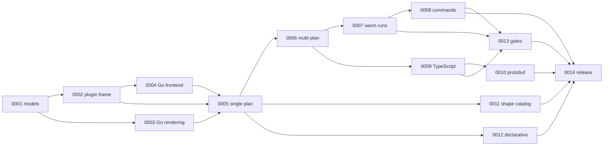

# Roadmap

What we are building, in what order, and what has to be true first.
Milestone numbers are permanent. The order is the order of this table,
and it changes.

The [architecture documents](../architecture/README.md) are the
specification these milestones implement. This plan sequences the
whole build, from the generated models to the first tagged release.

| Order | Milestone | Status | Depends on | Ships in |
|---|---|---|---|---|
| 1 | [0001](0001-one-schema-two-models.md) One schema generates both models | Done | none | unscheduled |
| 2 | [0002](0002-plugin-over-fixture-graph.md) A typed plugin runs over a hand-built graph | Done | 0001 | unscheduled |
| 3 | [0003](0003-emit-renders-go.md) Emit renders to deterministic Go | Planned | 0001 | unscheduled |
| 4 | [0004](0004-go-loads-into-graph.md) Go source loads into the symbol graph | Planned | 0001, 0002 | unscheduled |
| 5 | [0005](0005-single-plan-end-to-end.md) A single plan runs end to end | Planned | 0002, 0003, 0004 | unscheduled |
| 6 | [0006](0006-multi-plan-workspace.md) Several plans run in one workspace | Planned | 0005 | unscheduled |
| 7 | [0007](0007-warm-equals-cold.md) A warm run redoes only what changed | Planned | 0006 | unscheduled |
| 8 | [0008](0008-command-kernels.md) A consumer binary gets the full command surface | Planned | 0007 | unscheduled |
| 9 | [0009](0009-typescript-from-go.md) TypeScript comes out of a Go workspace | Planned | 0006 | unscheduled |
| 10 | [0010](0010-protobuf-read-only.md) protobuf schemas drive generation | Planned | 0009 | unscheduled |
| 11 | [0011](0011-shape-catalog.md) The shape catalog classifies callables | Planned | 0005 | unscheduled |
| 12 | [0012](0012-declarative-plugins.md) A plugin runs from files alone | Planned | 0005 | unscheduled |
| 13 | [0013](0013-regressions-block-tag.md) Regressions block the tag | Planned | 0007, 0008, 0009 | unscheduled |
| 14 | [0014](0014-first-tagged-release.md) Consumers can depend on tagged modules | Planned | 0008, 0010, 0011, 0012, 0013 | v0.1.0 |

Three notes on the order.

The order of 0002 and 0003 is arbitrary: both need only 0001, and
they can run in parallel. The graph above is the truth; the table
picks one line through it.

Positions 9 to 12 do not wait for 0007 and 0008. 0009 needs 0006, and
0011 and 0012 need 0005, so all three can run in parallel with the
engine work if there are hands to do it. They sit after the kernel
milestones because one team builds the kernel first, not because
anything blocks them.

The Java, Kotlin, PHP and Rust satellites exist as stub modules and
are not scheduled. Each becomes a milestone when someone commits to
it. dokimi, the reference consumer, reads Go, TypeScript, Rust,
Java, Kotlin and Python, so the unscheduled satellites are demand
rather than speculation, and eidos-lang-python still needs its stub
module before it can become one. Their sequencing notes live in
[11-languages.md](../architecture/11-languages.md): Kotlin waits on
its grammar closing a measured gap, and PHP forces no new model
element, so it can come early and cheap.
